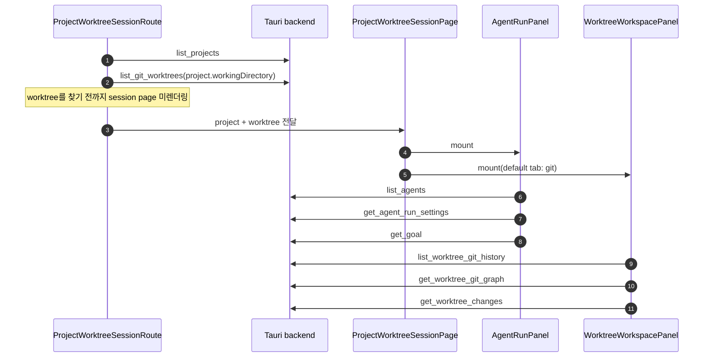
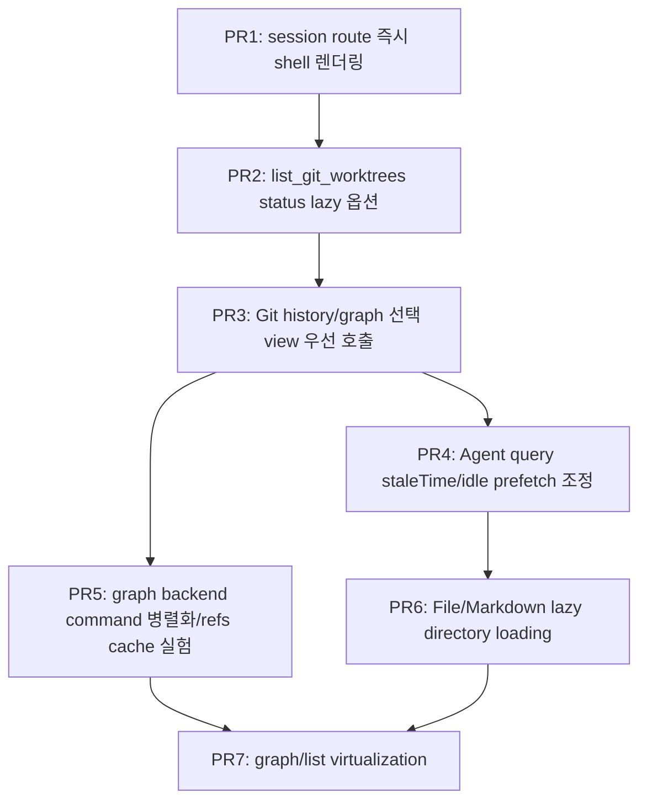

# Worktree Session 페이지 로딩 성능 점검

## 목적

`apps/agentic-workbench`의 worktree session 페이지는 진입 시 프로젝트, worktree, agent, Git 상태, Git history/graph 데이터를 짧은 시간 안에 함께 요청한다. 이 문서는 현재 코드 기준으로 초기 로딩을 늦출 수 있는 지점과 비동기 호출·지연 호출·캐시 전략으로 개선할 수 있는 후보를 식별한다.

범위는 다음 화면 흐름이다.

- `App.tsx`의 `ProjectWorktreeSessionRoute`
- `ProjectWorktreeSessionPage`
- `AgentRunPanel`
- `WorktreeWorkspacePanel`의 Git/File/Markdown 탭
- 관련 Tauri command와 Rust provider

## 현재 로딩 흐름

현재 구조의 핵심 특징은 다음과 같다.

- session route는 `list_git_worktrees` 결과에서 URL의 `worktreePath`와 같은 항목을 찾아야 페이지를 렌더링한다.
- 페이지가 렌더링되면 왼쪽 agent 패널과 오른쪽 workspace Git 탭이 동시에 mount된다.
- Git 탭은 기본 화면이며 `history`, `graph`, `status` query를 모두 시작한다.
- File/Markdown 탭은 선택 전에는 mount되지 않아 초기 진입 호출에는 포함되지 않는다.

## 병목 후보

| 우선순위 | 병목 후보 | 근거 | 영향 | 개선 방향 |
|---|---|---|---|---|
| P0 | session route가 `list_git_worktrees` 완료 전까지 페이지를 렌더링하지 않음 | `ProjectWorktreeSessionRoute`가 `worktreesQuery.data?.find(...)` 결과가 있어야 `ProjectWorktreeSessionPage`를 반환한다. | worktree 수가 많거나 각 worktree status가 느리면 전체 화면 진입이 막힌다. | URL의 `worktreePath`를 우선 신뢰해 즉시 shell 렌더링 후 worktree 메타데이터를 비동기로 보강한다. |
| P0 | `list_git_worktrees`가 각 worktree마다 `git status --porcelain` 실행 | Rust `GitCliWorktreeProvider::to_worktree`가 모든 record에 `has_changes(&record.path)`를 호출한다. | worktree N개일 때 `git worktree list` 1회 + `git status` N회가 route blocking path에 놓인다. | route용 lightweight command를 추가하거나 status 계산을 optional/lazy로 분리한다. |
| P1 | Git 탭에서 history와 graph를 동시에 가져옴 | `GitWorkspaceTab`이 `listWorktreeGitHistory(maxCount: 100)`와 `getWorktreeGitGraph(maxCount: 300)`를 동시에 시작한다. | 기본 view가 graph여도 list history까지 즉시 호출되어 Git 프로세스와 rev-list count가 중복된다. | 현재 선택된 view만 우선 호출하고 다른 view는 idle prefetch 또는 탭 전환 시 호출한다. |
| P1 | graph 조회가 여러 Git command를 직렬 실행 | `get_commit_graph`는 count, head hash, log, refs 조회를 순차 수행한다. | 큰 repo에서 graph 초기 응답이 느려질 수 있다. | count 지연, refs 캐시, head/log/refs 병렬 실행 또는 응답 분리. |
| P1 | agent 패널 초기 query가 Git query와 동시에 몰림 | `AgentRunPanel`이 mount 시 `list_agents`, `get_agent_run_settings`, `get_goal`을 호출한다. | session page 진입 직후 Tauri invoke가 몰려 초기 체감 성능이 흔들릴 수 있다. | Agent 필수 데이터와 부가 데이터 분리, goal/settings staleTime 부여, workspace와 우선순위 조절. |
| P2 | File/Markdown 탭 진입 시 전체 파일 트리 스캔 | `listWorktreeFiles`는 `WalkDir`로 worktree 전체를 순회한다. | 큰 repo에서 탭 전환 시 긴 대기와 메모리 사용 증가가 가능하다. | 디렉터리 단위 lazy loading, markdown 전용 목록 command, 파일 수 제한/검색 기반 로딩. |
| P2 | Git graph 렌더링이 모든 로드 commit row를 한 번에 그림 | graph/list view가 `commits.map`으로 전체 row를 렌더링한다. | 300개 이상 로드 후 DOM/SVG 노드가 증가한다. | row virtualization 도입 또는 초기 graph page 크기 축소. |
| P2 | 3초 interval worktree refresh가 background에서도 계속 실행 | `gitStateRefreshQueryOptions`는 `refetchIntervalInBackground: true`이다. | session route의 worktree query가 background에서도 반복되어 Git status 비용을 계속 발생시킬 수 있다. | session page에서는 더 긴 interval, focus 기반 refresh, status lazy 옵션 사용. |

## 상세 분석

### 1. Route blocking worktree 조회

`ProjectWorktreeSessionRoute`는 `projectId`와 query string의 `worktreePath`를 읽은 뒤 `listGitWorktrees(project.workingDirectory)`를 호출한다. 이후 응답 배열에서 같은 path를 찾은 경우에만 `ProjectWorktreeSessionPage`를 렌더링한다.

문제는 URL에 이미 worktree path가 있는데도, 전체 worktree 목록과 각 worktree 상태 계산이 끝나기 전까지 session 화면 shell이 뜨지 않는다는 점이다. 특히 standalone window로 열 때 사용자는 특정 worktree를 이미 선택한 상태이므로, 전체 목록 조회를 blocking gate로 두는 비용이 크다.

개선안:

- `ProjectWorktreeSessionRoute`에서 `decodedWorktreePath`가 있으면 minimal worktree 객체를 만들어 즉시 `ProjectWorktreeSessionPage`를 렌더링한다.
- `list_git_worktrees`는 background query로 유지하고, 응답이 도착하면 branch/status/canDelete 같은 메타데이터를 보강한다.
- 잘못된 path 검증은 별도 lightweight command로 처리한다. 예: `get_worktree_summary(working_directory, worktree_path)` 또는 `validate_worktree_path`.

예상 효과:

- 첫 화면 렌더링이 `git worktree list`와 N회 `git status`에서 분리된다.
- worktree가 많은 프로젝트에서 route 진입 대기 시간이 크게 줄어든다.

주의:

- 잘못된 URL path일 때 즉시 shell이 뜰 수 있으므로, 검증 실패 상태를 페이지 내부에서 표시해야 한다.
- `worktree.status`가 늦게 들어올 수 있으므로 badge는 `unknown/loading` 상태를 허용해야 한다.

### 2. Worktree 목록과 status 계산 분리

Rust `GitCliWorktreeProvider::list_worktrees`는 `git worktree list --porcelain`을 파싱한 뒤 각 worktree마다 `has_changes(path)`를 호출한다. `has_changes`는 `git -C path status --porcelain`을 실행한다.

이 방식은 프로젝트 상세 페이지에서는 유용하지만, session route에서는 특정 worktree 하나를 찾기 위해 모든 worktree의 dirty 여부까지 계산한다.

개선안:

- `list_git_worktrees`에 `includeStatus?: boolean` 옵션을 추가한다.
- route에서는 `includeStatus: false`로 호출하고, project detail card처럼 status badge가 필요한 화면에서만 true를 쓴다.
- 더 나은 구조는 command를 분리하는 것이다.
  - `list_git_worktree_refs`: path/head/branch/prune 정도만 반환
  - `get_git_worktree_status`: 특정 path의 clean/dirty만 반환
  - `list_git_worktrees_with_status`: 기존 호환 command

예상 효과:

- session route의 blocking Git command 수가 `1 + worktree 수`에서 `1` 또는 `특정 path 1회`로 줄어든다.

### 3. Git history와 graph 중복 초기 호출

`GitWorkspaceTab`은 기본 view가 `graph`인데도 `historyQuery`와 `graphQuery`를 모두 생성한다. TanStack Query는 둘 다 enabled 상태이므로 초기 mount 때 동시에 실행된다.

또한 두 backend provider는 각각 commit count를 계산한다.

- history: `git rev-list --count HEAD` 후 `git log ... HEAD`
- graph: `git rev-list --count --all` 후 `git rev-parse HEAD`, `git log --all`, `git for-each-ref`

개선안:

- `historyQuery`에 `enabled: historyView === "list"`를 둔다.
- `graphQuery`에 `enabled: historyView === "graph"`를 둔다.
- 사용자가 graph를 보고 있을 때 list는 `requestIdleCallback` 또는 queryClient prefetch로 낮은 우선순위에서 가져온다.
- history/list가 단순 commit 목록이면 graph 응답에서 list view에 필요한 필드를 재사용할 수 있는지 검토한다.

예상 효과:

- 초기 Git 탭 진입 시 Git history command 세트 하나를 제거한다.
- 큰 repo에서 CPU/IO 경쟁이 줄고 graph 표시가 빨라진다.

권장 적용 순서:

1. 선택 view만 enabled 처리한다.
2. view 전환 직전 또는 idle prefetch를 추가한다.
3. graph/history 응답 통합은 API 계약 영향이 크므로 후순위로 둔다.

### 4. Graph backend command 직렬화

`get_commit_graph`는 다음 작업을 순차 실행한다.

1. commit count
2. `HEAD` hash
3. graph log
4. refs

각 단계가 독립적인 부분이 있다. 특히 `head_hash`, `log`, `refs`는 같은 repository path를 읽지만 서로의 결과를 기다릴 필요가 거의 없다.

개선안:

- Rust provider 내부에서 `std::thread::scope` 또는 async command 실행으로 독립 Git command를 병렬화한다.
- `totalCount`가 UI에서 보조 정보일 뿐이라면 count를 첫 응답에서 생략하거나 별도 query로 지연한다.
- refs는 짧은 TTL 캐시를 둘 수 있다. branch/tag가 자주 바뀌지 않는 동안 graph page 요청마다 refs 전체를 다시 읽을 필요가 없다.

예상 효과:

- graph query 자체의 wall-clock 시간이 줄어든다.
- 단, Git command 병렬 실행이 디스크 경쟁을 만들 수 있으므로 repo 크기별 측정이 필요하다.

### 5. Agent 패널 초기 query 우선순위 조절

`AgentRunPanel`은 mount 즉시 다음 데이터를 조회한다.

- agent 목록
- worktree별 agent run settings
- worktree별 goal
- reuse mode와 selected agent가 있을 때 provider sessions

현재 sessions query는 조건부라 초기 기본값에서는 실행되지 않지만, agents/settings/goal은 Git 탭 query와 동시에 실행된다. 이 중 settings는 입력 폼 초기값에 필요하지만, goal은 goal UI를 열거나 goal 상태 badge를 표시할 때만 즉시 필요할 수 있다.

개선안:

- `list_agents`는 앱 전역에서 staleTime을 길게 준다. agent 목록은 session마다 즉시 새로고침할 필요가 낮다.
- `get_agent_run_settings`도 worktree path 기준 캐시에 staleTime을 둔다.
- `get_goal`은 화면에서 반드시 즉시 보여야 하는지 판단해 idle prefetch 또는 goal UI open 시점 호출로 늦춘다.
- Agent 패널과 Git workspace 중 사용자가 먼저 보는 영역을 기준으로 query 우선순위를 정한다. 기본 focus가 prompt 입력이면 settings 우선, Git graph는 idle prefetch로 늦출 수 있다.

### 6. File/Markdown 탭 파일 스캔

File/Markdown 탭은 선택 전에는 mount되지 않는다. 따라서 초기 session 진입의 직접 병목은 아니다. 하지만 탭 진입 시 `listWorktreeFiles`가 전체 worktree를 `WalkDir`로 순회한다.

현재 제외 디렉터리는 `.git`, `.next`, `.turbo`, `build`, `coverage`, `dist`, `node_modules`, `target`이다. 큰 monorepo에서는 이 목록만으로 부족할 수 있고, Markdown 탭도 전체 파일 목록을 받은 뒤 frontend에서 markdown만 필터링한다.

개선안:

- `list_worktree_files`에 `kind: "all" | "markdown"` 옵션을 추가해 Markdown 탭은 backend에서 확장자 필터링한다.
- 디렉터리 단위 lazy loading command를 추가한다. 예: `list_worktree_directory(workingDirectory, relativePath)`.
- 파일 수 상한과 "더 보기" 전략을 둔다.
- `.venv`, `.pnpm-store`, `.cache`, `vendor`, `out` 등 repo별 대형 디렉터리 제외 정책을 확장한다.

### 7. 렌더링 비용

Git graph/list는 로드된 commit을 모두 `map`으로 렌더링한다. 초기 page는 graph 300개, history 100개다. 현재는 무한 스크롤로 추가 로딩되며, 많이 로드한 뒤에는 DOM row와 SVG path 수가 누적된다.

개선안:

- `@tanstack/react-virtual` 같은 virtualization을 graph/list에 도입한다.
- graph 초기 page size를 300에서 100~150으로 낮추고, viewport 근처에서 추가 로딩한다.
- `computeGitGraphRows` 비용이 커지면 Web Worker 또는 incremental layout을 검토한다.

## 권장 실행 계획

### PR1. Session route shell 우선 렌더링

- `decodedWorktreePath`가 있으면 minimal `GitWorktree`를 구성해 페이지를 먼저 표시한다.
- branch/status는 `list_git_worktrees` 응답이 도착하면 보강한다.
- worktree 검증 실패 UI를 `ProjectWorktreeSessionPage` 내부 상태로 처리한다.

검증:

- worktree 목록 조회가 느려도 session shell과 agent/workspace layout이 먼저 렌더링된다.
- 잘못된 worktree path에서는 명확한 오류 상태가 표시된다.

### PR2. Worktree status lazy option

- backend command에 status 포함 여부를 추가한다.
- route는 status 없는 목록 또는 단일 summary command를 사용한다.
- project detail의 기존 status UI는 유지한다.

검증:

- session route 진입 시 `git status`가 모든 worktree마다 실행되지 않는다.
- project detail의 clean/dirty/prunable 표시가 기존과 동일하다.

### PR3. Git 탭 query 우선순위 조정

- `historyQuery.enabled = historyView === "list"`
- `graphQuery.enabled = historyView === "graph"`
- 반대 view는 idle prefetch로 전환한다.

검증:

- 기본 graph view 진입 시 `list_worktree_git_history`가 즉시 호출되지 않는다.
- list 전환 시 history가 정상 로드된다.

### PR4. Agent query 캐시 정책

- `list_agents`, `get_agent_run_settings`에 적절한 staleTime을 둔다.
- `get_goal` 즉시 호출 필요성을 UI 기준으로 재검토한다.

검증:

- 같은 session 재진입 시 agent/settings query가 불필요하게 반복되지 않는다.
- agent 실행 시작 UX가 느려지지 않는다.

### PR5. Graph backend 최적화 실험

- graph query 내부 Git command별 시간을 계측한다.
- count/head/log/refs 병렬화 또는 count 지연의 효과를 비교한다.
- refs TTL cache를 실험한다.

검증:

- 큰 repo fixture에서 graph query wall-clock 시간이 감소한다.
- branch/tag 변경 후 refs가 stale하게 오래 남지 않는다.

### PR6. File/Markdown lazy loading

- Markdown 탭 전용 backend 필터를 추가한다.
- 디렉터리 단위 파일 로딩을 검토한다.

검증:

- 큰 repo에서 Markdown 탭 진입 시 전체 파일 트리를 전부 순회하지 않는다.
- 기존 file preview와 markdown annotation 흐름이 유지된다.

### PR7. Graph/list virtualization

- commit row virtualization을 도입한다.
- SVG graph cell이 virtualization과 함께 올바르게 표시되는지 확인한다.

검증:

- 1,000개 이상 commit을 로드해도 스크롤과 선택 반응성이 유지된다.

## 계측 제안

실제 병목을 확정하려면 다음 계측을 먼저 추가한다.

| 위치 | 계측 항목 | 방법 |
|---|---|---|
| frontend route | session shell first render 시간 | `performance.mark` |
| TanStack Query | query별 시작/완료/에러 시간 | query wrapper 또는 dev logger |
| Tauri command | command별 실행 시간 | command boundary에서 `Instant::now()` 로그 |
| Git provider | Git subcommand별 실행 시간 | provider 내부 helper로 `git status`, `rev-list`, `log`, `for-each-ref` 계측 |
| file provider | WalkDir 방문 entry 수와 소요 시간 | `list_files` 내부 카운터 |

권장 메트릭:

- route 진입부터 shell 렌더링까지 시간
- route 진입부터 Git graph 첫 row 표시까지 시간
- `list_git_worktrees` 총 시간과 내부 `git status` 실행 횟수
- `get_worktree_git_graph` 총 시간과 command별 시간
- File/Markdown 탭 첫 목록 표시 시간

## 우선 결론

가장 먼저 손볼 부분은 session route의 blocking worktree 목록 조회다. URL에 이미 worktree path가 있는데도 전체 worktree 목록과 모든 worktree status를 기다리는 구조라서, worktree 수와 repository 상태에 따라 페이지 진입 자체가 느려질 수 있다.

두 번째는 Git 탭의 history/graph 동시 호출이다. 기본 view가 graph라면 history는 첫 화면에 필요하지 않다. 선택된 view만 먼저 호출하고 반대 view를 idle prefetch로 늦추면 초기 Git command 수를 줄일 수 있다.

세 번째는 backend Git command 계측이다. 특히 graph 조회는 여러 Git command를 순차 실행하므로, 실제 repo에서 count/log/refs 중 어느 단계가 느린지 확인한 뒤 병렬화 또는 응답 분리를 결정하는 것이 안전하다.
