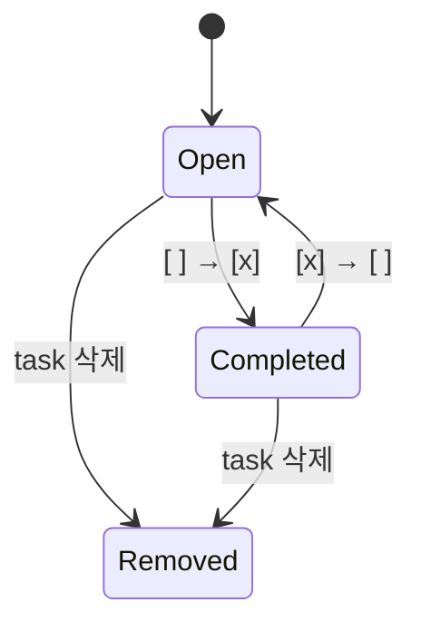

# Data Model: Markdown 작업 보드

설계 근거는 [[speckit-plan]], 요구사항은 [[speckit-spec]]을 참고한다.

## DocumentTaskSummary

Markdown 문서 하나의 task 진행 상태를 나타낸다.

| Field | Type | Description |
|---|---|---|
| `documentPath` | `string` | 프로젝트 기준 상대 경로 |
| `completed` | `number` | 완료 task 수 |
| `open` | `number` | 미완료 task 수 |
| `chapters` | `ChapterTaskSummary[]` | H1별 상세 집계 |

## ChapterTaskSummary

| Field | Type | Validation |
|---|---|---|
| `headingBlockId` | `string \| null` | 서문이면 `null` |
| `title` | `string` | 빈 제목 금지 |
| `completed` | `number` | 0 이상의 정수 |
| `open` | `number` | 0 이상의 정수 |

## TaskItem

각 task의 원문 위치와 상태를 보존한다.

```ts
type TaskItem = {
  blockId: string
  chapterBlockId?: string
  checked: boolean
  text: string
  startLine: number
}
```

## State Transitions



