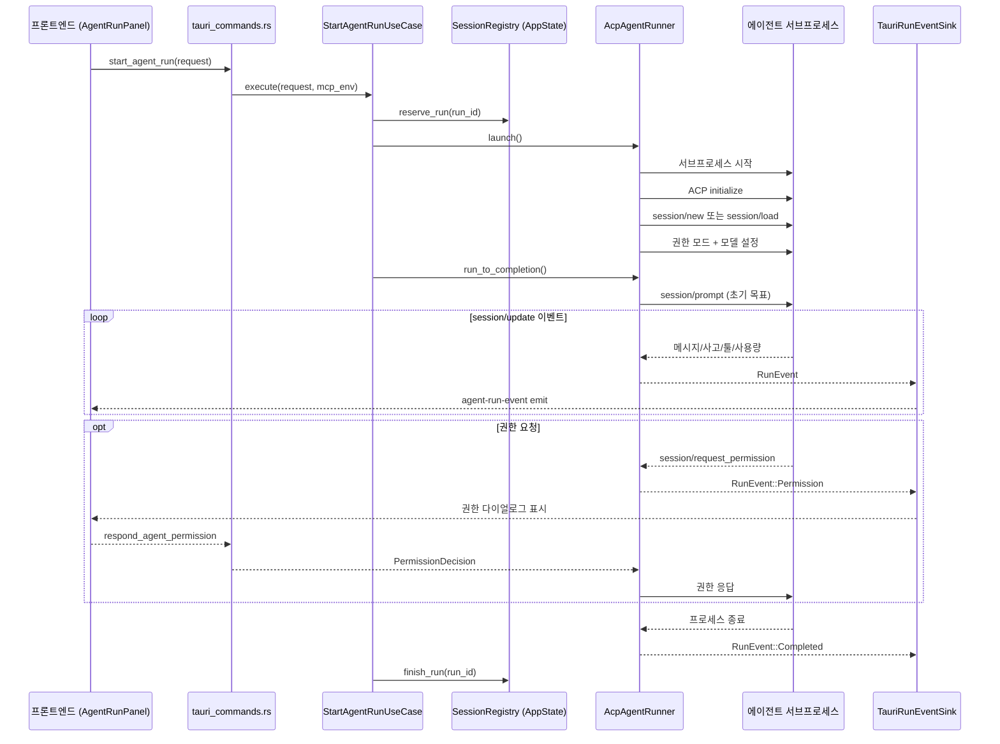

# 에이전트 실행 흐름

ACP 에이전트 실행의 전체 라이프사이클 — 시작부터 종료까지. 이 문서는 `apps/agentic-workbench/src-tauri/src/`의 ACP 엔진, 권한 처리, MCP 통합을 중심으로 설명합니다.

## 실행 흐름 개요



## 시작 (Start)

### 프론트엔드 → Tauri 명령

`start_agent_run` Tauri 명령 (`inbound/tauri_commands.rs`)이 진입점입니다:
1. 요청 정규화 (worktree 경로, 권한 모드, 모델 등)
2. MCP 실행 환경 변수 주입 (`AW_MCP_URL`, `AW_MCP_TOKEN`, `AW_MCP_RUN_ID`)
3. 명령어 오버라이드 해결 (프로필 env 병합)
4. `AcpAgentRunner` 생성
5. `StartAgentRunUseCase` 실행

### StartAgentRunUseCase

`application/start_agent_run.rs`:
1. `SessionRegistry::reserve_run(run_id)` — 중복 실행 방지 + 동시 실행 제한 (`ACP_WORKBENCH_MAX_RUNS`)
2. tokio 태스크 스폰:
   - `launcher.launch()` → `LaunchedSession { session, commander }`
   - `registry.attach_session(run_id, session)`
   - `commander.run_to_completion()` — 메인 실행 루프
   - `registry.finish_run(run_id)`

## ACP 엔진 상세

### AcpAgentRunner (`infrastructure/acp/runner.rs`)

`SessionLauncher` 트레이트를 구현하는 핵심 컴포넌트. `launch()` 단계:

1. **명령어 해결**: 카탈로그에서 에이전트 ID → 명령어 조회, 설정 오버라이드 적용
2. **환경 구성**: PATH 보강 (login shell PATH 병합), 프로필 환경변수 병합 (globalEnv ⊕ profile.env), MCP env 주입
3. **서브프로세스 시작**: `tokio::process::Command`로 에이전트 실행
4. **RPC 피어 생성**: `RpcPeer`로 stdin/stdout JSON-RPC 채널 구성
5. **ACP 초기화**: `initialize` 요청 전송
6. **세션 생성/복원**: `session/new` (새 세션) 또는 `session/load` (resume)
7. **설정 적용**: 권한 모드, 모델 구성 전송
8. **세션 기록**: `AcpSessionStore`에 세션 메타데이터 저장 (resume용)

### AcpRunCommander — 실행 루프

`commander.run_to_completion()` (`infrastructure/acp/runner.rs`):
1. 초기 목표 프롬프트 전송 (`session/prompt`)
2. Ralph Loop가 활성화된 경우: 목표 달성 시까지 후속 프롬프트 반복 전송 (최대 100회, 설정 가능 지연, 오류 시 중단)
3. 프로세스 종료 대기
4. `RunEvent::Completed` emit

### 이벤트 매핑

`session_update_mapper.rs`가 ACP `session/update` 페이로드를 `RunEvent`로 변환:
- `agent_message_chunk` → 메시지 누적
- `thought_chunk` → 사고 표시
- `plan` → 계획 렌더링
- `tool_call` → 툴 호출 표시
- `usage_update` → 토큰 사용량 업데이트

## 권한 처리

### 권한 모드 (`domain/run.rs`의 `PermissionMode`)

| 모드 | 동작 |
|------|------|
| `Default` | 모든 권한 요청에 사용자 응답 대기 |
| `Auto` | 자동 승인 |
| `ReadOnly` | 읽기 전용 |
| `Plan` | 계획 모드 |
| `AcceptEdits` | 편집 자동 승인 |
| `DangerouslySkipAllPermissions` | 모든 권한 스킵 (확인 다이얼로그 거쳐야 선택 가능) |

### 권한 요청 흐름 (`infrastructure/acp/permission_flow.rs`)

1. 에이전트가 `session/request_permission` 전송
2. 자동 허용 설정이 있으면 즉시 승인
3. 그렇지 않으면 `PermissionBroker::create_waiter(run_id, permission_id)`로 대기 채널 생성
4. `RunEvent::Permission` emit → 프론트엔드에 `PermissionRequestDialog` 표시
5. 사용자 응답 → `respond_agent_permission` Tauri 명령 → `PermissionBroker::respond_for_run`
6. 응답이 run_id와 permission_id로 검증됨 (잘못된 run/창의 대기자 해제 방지)
7. 에이전트에게 권한 응답 전송

### 권한 브로커 (`infrastructure/permission_broker.rs`)

`PermissionDecisionPort` 구현. `HashMap<permission_id, {run_id, oneshot::Sender}>`로 대기자를 관리합니다. `clear_run(run_id)`으로 세션 종료 시 만료된 대기자를 정리합니다.

## MCP 통합

### 로컬 MCP 서버 (`infrastructure/mcp/mod.rs`)

`McpServerState`가 localhost에서 Axum HTTP 서버를 시작합니다 (랜덤 포트). 에이전트 실행 시 MCP 서버 설정이 run-scoped MCP 서버로 전달됩니다.

**제공 툴**:
- `set_window_title` (`title_tool.rs`) — 에이전트가 세션 창 제목을 변경할 수 있음. 검증: 최대 80자, 제어문자 없음. 오리진 허용 목록 (tauri://localhost, 127.0.0.1, localhost)

**에이전트에게 주입되는 컨텍스트**: MCP env와 함께 에이전트 지시문이 프롬프트에 주입되어, 에이전트가 worktree 요약, 목표, 세션 정보를 자연어로 쿼리할 수 있습니다.

### MCP 제목 변경 → 창 제목 동기화

```text
에이전트 → MCP tools/call(set_window_title)
  → McpServerState 처리
  → workspace://mcp-window-title 이벤트 emit
  → App.tsx에서 수신 → Tauri window.set_title()
```

## 세션 관리

### SessionRegistry (`infrastructure/agent_session_registry.rs`의 `AppState`)

`SessionRegistry` 트레이트 구현. 핵심 역할:
- `reserve_run(run_id)` — 중복 및 동시 실행 제한 검사
- `attach_run_handle` / `attach_session` — 런타임 핸들 부착
- `finish_run` / `cancel_run` — 실행 정리
- **창 소유권 추적**: 각 run_id를 세션 창 label과 연결. 창이 닫히면(`WindowEvent::Destroyed`) 소유한 모든 run 취소
- `TitleControlRegistry` + `AgentToolCandidateRegistry`도 함께 구현

### 세션 Resume

`AcpSessionStore`가 세션 메타데이터를 JSON 파일에 저장합니다. `ResumePolicy` (Fresh/ResumeIfAvailable/ResumeRequired)에 따라 기존 세션을 재개할 수 있습니다.

### 멀티 창 격리

각 worktree 세션은 별도 창(`session-{uuid}`)에서 열립니다. run 이벤트는 소유 창 label로 `emit_to(label, "agent-run-event", ...)` 전송되어 창 간 이벤트 섞임을 방지합니다.

## 프롬프트 자동완성

`application/agent_tool_candidate_service.rs` + `entities/agent-run/model/prompt-autocomplete.ts`가 세션/앱/확장 소스에서 삽입 가능한 툴 후보를 해결합니다. 프론트엔드의 `PromptCommandAutocomplete` 컴포넌트가 `/` 명령어 자동완성을 제공합니다.

## 관련 소스

| 영역 | 경로 |
|------|------|
| 실행 유스케이스 | `src-tauri/src/application/start_agent_run.rs` |
| ACP 러너 | `src-tauri/src/infrastructure/acp/runner.rs` |
| 권한 흐름 | `src-tauri/src/infrastructure/acp/permission_flow.rs` |
| 권한 브로커 | `src-tauri/src/infrastructure/permission_broker.rs` |
| 세션 레지스트리 | `src-tauri/src/infrastructure/agent_session_registry.rs` |
| MCP 서버 | `src-tauri/src/infrastructure/mcp/mod.rs` |
| 이벤트 싱크 | `src-tauri/src/infrastructure/tauri_run_event_sink.rs` |
| 도메인 이벤트 | `src-tauri/src/domain/events.rs` |
| 프론트엔드 패널 | `src/features/agent-run/ui/agent-run-panel.tsx` |
| 프론트엔드 상태 | `src/features/agent-run/model/run-panel-state.ts` |
