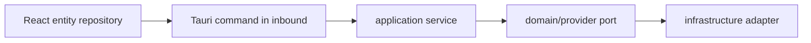

# Contract: Worktree Auto Refresh

## Scope

이 계약은 `apps/agentic-workbench`, `apps/git-explorer`, `apps/markdown-annotator`가 active worktree/repository/markdown document의 파일/Git 변경을 자동 반영하는 shared refresh policy와 app-local adapter 동작을 정의한다. 외부 public API가 아니라 workspace package와 각 앱 내부 adapter 계약이다.

## Shared Package Contract

`packages/workspace-auto-refresh`는 다음 pure helper만 제공한다.

- 30초 fallback refresh interval과 focus refresh 옵션
- watcher event name/type
- active scope key 생성/비교 helper
- selected file/commit/document stale 판정 helper
- last-successful-data 유지에 필요한 상태 타입

공유 package는 Tauri, app route, app-local UI component에 의존하지 않는다.

## Query Key Contract

모든 자동 갱신 query key 또는 reload key는 active worktree path, repository id/path, 또는 markdown file path를 포함해야 한다.

| Data | Query key |
|------|-----------|
| file tree | `worktreeFileQueryKeys.list(workingDirectory)` |
| file preview | `worktreeFileQueryKeys.textFile(workingDirectory, relativePath)` |
| Git status | `projectQueryKeys.worktreeChanges(workingDirectory)` |
| commit history | `worktreeGitQueryKeys.history(workingDirectory)` |
| commit graph | `worktreeGitQueryKeys.graph(workingDirectory)` |
| commit detail | `worktreeGitQueryKeys.commitDetail(workingDirectory, commitHash)` |
| file diff | `worktreeGitQueryKeys.fileDiff(workingDirectory, commitHash, path)` |
| git-explorer repository | `repositoryKeys.*(repositoryId, options)` |
| markdown-annotator document | `absolutePath` based reload scope |

## Refresh Timing Contract

- File tree, markdown file tree, active markdown document, and Git status/history/graph MUST refresh while the corresponding workspace/app view is mounted.
- Visible changes SHOULD be reflected within 3 seconds through Tauri watcher events when the app is running.
- Fallback polling SHOULD run no more frequently than every 30 seconds and SHOULD refresh on window focus.
- Refresh MUST keep last successful data visible while fetching.
- Manual refresh buttons MUST keep working and use the same scoped query keys.
- Refresh MUST NOT invalidate query keys or reload state for unrelated worktree paths, repository ids, or markdown file paths.

## File Pane Contract

1. When `listWorktreeFiles(workingDirectory)` returns new entries, the file tree and markdown tree recompute rows from the new entry list.
2. If `selectedFilePath` still exists as a non-directory entry, selection remains unchanged.
3. If `selectedFilePath` no longer exists, the pane marks the selection stale and avoids showing it as current data.
4. If selected file content changes and remains readable, `readWorktreeTextFile(workingDirectory, selectedFilePath)` refreshes and preview displays the latest content.
5. If preview refresh fails, previous list data remains visible and preview area shows a recoverable error.

## Git Pane Contract

1. `getWorktreeChanges(workingDirectory)` refreshes dirty status counts independently of commit list.
2. `listWorktreeGitHistory(workingDirectory, { maxCount, offset })` and `getWorktreeGitGraph(workingDirectory, { maxCount, offset })` refresh the latest loaded data for the active worktree.
3. New commits or branch/ref changes must be visible in the commit list/graph within the refresh goal.
4. If `selectedCommitHash` is still present in loaded refreshed data, commit detail remains selected.
5. If selected commit is no longer available after refresh or detail query fails because it is missing, the detail pane marks the commit selection stale and invites a new selection.
6. Infinite scroll can continue loading older pages after an automatic refresh. If branch/ref continuity changes, loaded pages should reset before loading older pages to avoid mixed histories.

The same contract applies to `agentic-workbench` worktree Git pane and `git-explorer` repository changes panel. `git-explorer` may keep its existing repository watcher invalidation, but shared refresh policy must still act as a fallback.

## Markdown Annotator Contract

1. When the active markdown file changes on disk and remains readable, `markdown-annotator` reloads the document content within the shared refresh target.
2. Existing annotations and selection context remain when block/anchor mapping can still be resolved.
3. If the markdown file is deleted, moved, or unreadable, the app keeps the last successful document content visible where possible and marks the document stale.
4. Manual open/reload behavior remains available.

## UI State Contract

- Initial loading can use existing loading states.
- Background refresh must use compact non-blocking indication such as a small spinner, "refreshing" badge, or disabled refresh icon state.
- Error state must distinguish initial load failure from background refresh failure when possible.
- Stale selection state must clearly indicate that the selected file/commit is no longer current.

## Backend Boundary Contract

Existing commands remain the contract unless implementation proves a new command is required:

- `list_worktree_files`
- `read_worktree_text_file`
- `get_worktree_changes`
- `list_worktree_git_history`
- `get_worktree_git_graph`
- `get_worktree_commit_detail`
- `get_worktree_commit_file_diff`
- `git-explorer` repository/history/detail/diff commands
- `markdown-annotator` `read_markdown_file`

If a new backend command is added, it must follow:

Tauri commands must not contain Git/filesystem business logic directly.
