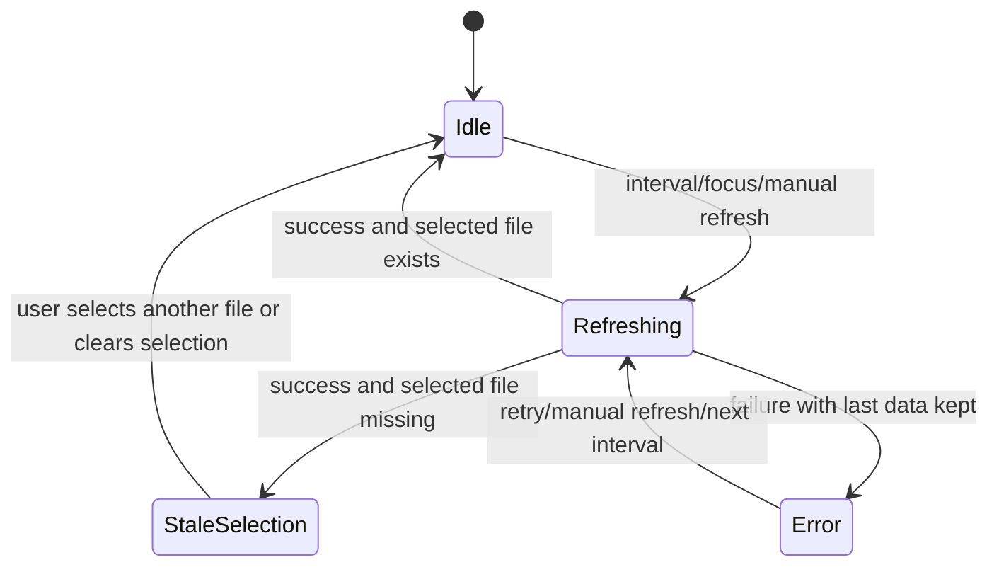
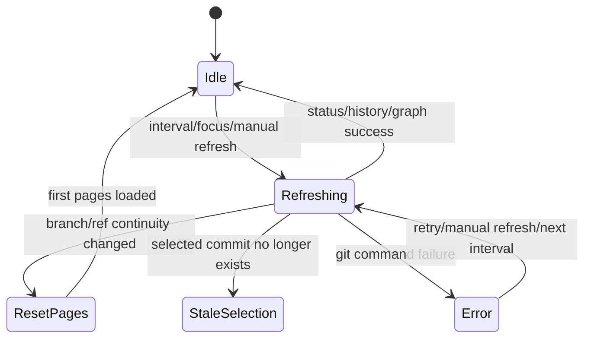

# Data Model: Worktree Auto Refresh

## WorktreeRefreshScope

Active worktree session에 귀속되는 갱신 범위다.

| Field | Type | Description | Validation |
|-------|------|-------------|------------|
| `workingDirectory` | `string` | active worktree absolute path | blank 금지, 기존 command/service의 path 검증 통과 |
| `sessionId` | `string | undefined` | UI session/window 식별자 후보 | 없으면 `workingDirectory`로 scope |
| `activeTab` | `"git" | "files" | "markdown"` | 현재 표시 중인 workspace tab | workspace tab id 중 하나 |

## ApplicationRefreshConsumer

공유 refresh policy를 소비하는 앱별 adapter 범위다.

| Field | Type | Description | Validation |
|-------|------|-------------|------------|
| `appId` | `"agentic-workbench" | "git-explorer" | "markdown-annotator"` | refresh consumer 앱 | enum |
| `scopeKey` | `string` | worktree path, repository id/path, markdown file path | blank 금지 |
| `dataKinds` | `Array<"file" | "git" | "markdown-document">` | 갱신 대상 데이터 종류 | 앱 기능에 맞는 값 |
| `supportsReactQuery` | `boolean` | React Query adapter 사용 여부 | markdown-annotator는 false 가능 |

Relationships:

- `FileTreeRefreshState`, `GitExplorerRefreshState`는 같은 `WorktreeRefreshScope`에 속한다.
- Query key 또는 reload key는 반드시 `workingDirectory`, repository id/path, markdown file path 중 active scope를 포함한다.

## FileTreeRefreshState

File tree와 markdown tree의 자동 갱신 상태다.

| Field | Type | Description | Validation |
|-------|------|-------------|------------|
| `entries` | `WorktreeFileEntry[]` | 마지막 성공 file listing | directory/file entry는 기존 model 사용 |
| `selectedFilePath` | `string | null` | 선택된 file relative path | file 선택 시 `entries` 내 non-dir이어야 함 |
| `previewPath` | `string | null` | preview query 대상 | `selectedFilePath`와 같거나 null |
| `lastSuccessfulRefreshAt` | `number | null` | 마지막 성공 갱신 epoch ms | 성공 응답 시 갱신 |
| `isRefreshing` | `boolean` | background refresh 진행 여부 | `isLoading`과 구분 |
| `error` | `string | null` | 마지막 refresh 실패 메시지 | 실패 시 기존 `entries` 유지 |
| `staleSelection` | `StaleSelection | null` | 선택 파일이 사라진 상태 | 선택 대상이 refreshed entries에 없을 때 설정 |

State transitions:

## GitExplorerRefreshState

Git status, commit list, graph, commit detail의 자동 갱신 상태다.

| Field | Type | Description | Validation |
|-------|------|-------------|------------|
| `statusSummary` | `GitWorktreeChanges | null` | staged/unstaged/untracked/conflicted summary | 기존 `get_worktree_changes` 응답 |
| `historyPages` | `GitCommitHistory[]` | loaded commit list pages | page offset/count consistency |
| `graphPages` | `GitCommitGraph[]` | loaded graph pages | page offset/count consistency |
| `selectedCommitHash` | `string | null` | 선택 commit hash | 존재하면 detail query 대상 |
| `selectedDiffPath` | `string | null` | commit detail 내 선택 file path | selected commit이 있어야 유효 |
| `lastSuccessfulRefreshAt` | `number | null` | 마지막 성공 갱신 epoch ms | 성공 응답 시 갱신 |
| `isRefreshing` | `boolean` | background refresh 진행 여부 | UI를 가리지 않는 indicator로 표시 |
| `error` | `string | null` | 마지막 refresh 실패 메시지 | 실패 시 마지막 성공 데이터 유지 |
| `staleSelection` | `StaleSelection | null` | 선택 commit/detail이 현재 history에 없는 상태 | rebase/reset/branch 변경에서 설정 |

State transitions:

## RefreshTrigger

자동 또는 수동 갱신을 발생시킨 원인이다.

| Field | Type | Description | Validation |
|-------|------|-------------|------------|
| `kind` | `"interval" | "focus" | "manual" | "tab-activated"` | refresh 원인 | enum |
| `target` | `"file-tree" | "file-preview" | "git-status" | "git-history" | "git-graph" | "commit-detail"` | 갱신 대상 | target에 맞는 query key 필요 |
| `workingDirectory` | `string` | 갱신 대상 worktree | active worktree와 일치해야 함 |
| `createdAt` | `number` | trigger 생성 시각 | epoch ms |

## StaleSelection

선택된 파일 또는 commit이 refresh 후 더 이상 유효하지 않은 상태다.

| Field | Type | Description | Validation |
|-------|------|-------------|------------|
| `kind` | `"file" | "commit" | "diff-file"` | stale 대상 종류 | enum |
| `id` | `string` | relative path 또는 commit hash | blank 금지 |
| `reason` | `"deleted" | "renamed" | "branch-changed" | "history-rewritten" | "unreadable" | "unknown"` | stale 추정 원인 | UI copy는 추정임을 과하게 단정하지 않음 |
| `detectedAt` | `number` | 감지 시각 | epoch ms |

## MarkdownDocumentRefreshState

`markdown-annotator`의 active markdown file 자동 reload 상태다.

| Field | Type | Description | Validation |
|-------|------|-------------|------------|
| `absolutePath` | `string` | 열려 있는 markdown file path | 기존 markdown file 검증 통과 |
| `markdownText` | `string` | 마지막 성공 reload content | UTF-8 readable |
| `lastSuccessfulRefreshAt` | `number | null` | 마지막 성공 갱신 epoch ms | 성공 응답 시 갱신 |
| `isRefreshing` | `boolean` | background reload 여부 | UI를 가리지 않는 indicator로 표시 |
| `error` | `string | null` | 마지막 reload 실패 메시지 | 실패 시 기존 text 유지 |
| `staleSelection` | `StaleSelection | null` | 파일이 삭제/이동/읽기 불가인 상태 | unreadable/deleted/renamed 추정 |
