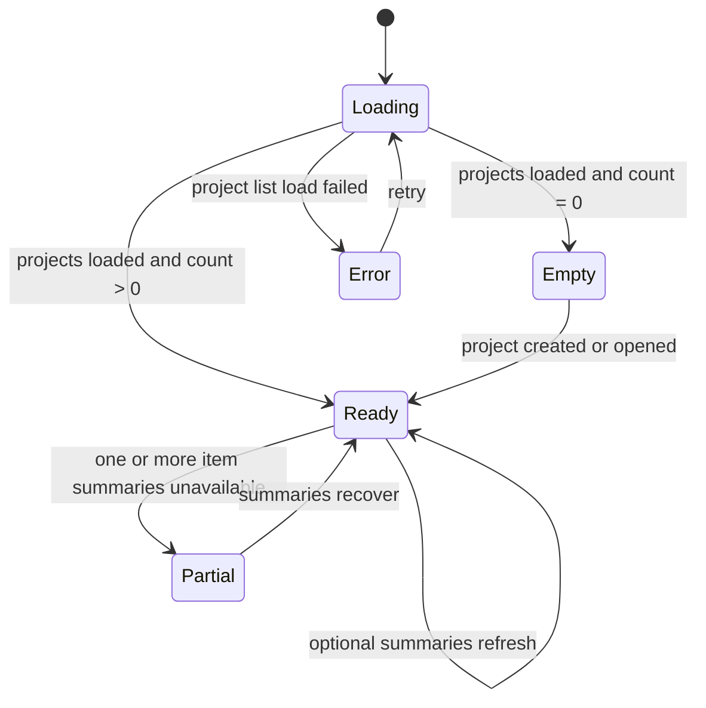

# Data Model: 프로젝트 대시보드 시작화면

## ProjectDashboard

대시보드 화면 전체 상태를 나타낸다.

**Fields**:

- `projects`: `ProjectDashboardItem[]`
- `quickActions`: `DashboardAction[]`
- `status`: `loading | ready | empty | error`
- `errorMessage`: optional user-facing summary when project list loading fails

**Validation Rules**:

- `empty` status는 project list loading이 끝났고 `projects.length === 0`일 때만 사용한다.
- `error` status는 프로젝트 목록 자체를 불러오지 못한 경우에만 화면 수준으로 사용한다.
- 일부 프로젝트의 worktree/session/change 요약 실패는 화면 수준 `error`가 아니라 item-level `summaryStatus`로 표시한다.

## ProjectDashboardItem

최근 프로젝트 한 행 또는 compact panel에 표시되는 요약이다.

**Fields**:

- `projectId`: existing project id
- `name`: project display name
- `workingDirectory`: project path or location label
- `description`: optional project description
- `lastActivityLabel`: human-readable recent activity label when known
- `primaryAction`: `DashboardAction`
- `secondaryActions`: `DashboardAction[]`
- `worktreeSummary`: optional `WorktreeSummary`
- `sessionSummary`: optional `SessionSummary`
- `changeSummary`: optional `ChangeSummary`
- `summaryStatus`: `complete | partial | unavailable`
- `unavailableReason`: optional short reason for inaccessible or unverified state

**Relationships**:

- Belongs to one `Project`.
- May reference zero or more `WorktreeSummary` and at most one primary `SessionSummary`.

**Validation Rules**:

- `projectId`, `name`, and `workingDirectory` are required.
- `primaryAction` must always be available and must not require optional summary data.
- `summaryStatus = unavailable` must include `unavailableReason`.
- Long names and paths must be display-safe and preserve the full value through tooltip/popover or equivalent reveal pattern.

## SessionSummary

최근 재개 가능한 작업 맥락을 나타낸다.

**Fields**:

- `sessionId`: provider/session identifier when known
- `projectId`: owning project id
- `label`: short display label
- `lastActivityLabel`: optional recent activity label
- `resumable`: boolean
- `routeTarget`: route or action target for resume

**Validation Rules**:

- A session can be offered as "resume" only when `resumable` is true and a route/action target is available.
- Sessions must stay scoped to their owning project.

## WorktreeSummary

프로젝트의 worktree 상태 요약이다.

**Fields**:

- `projectId`: owning project id
- `count`: total known worktree count
- `activeCount`: count of worktrees that are available for direct entry
- `primaryWorktreePath`: optional worktree path for direct resume
- `status`: `ready | loading | unavailable`

**Validation Rules**:

- `count` and `activeCount` cannot be negative.
- `primaryWorktreePath` must be associated with the project working directory or known worktree list.
- `unavailable` status must not block opening the base project route.

## ChangeSummary

프로젝트 또는 primary worktree의 changed-file summary이다.

**Fields**:

- `changedFileCount`: number when known
- `hasChanges`: boolean when known
- `status`: `ready | loading | unavailable`

**Validation Rules**:

- `changedFileCount` cannot be negative.
- `hasChanges` must agree with `changedFileCount > 0` when count is known.
- Unknown change state must be shown as unknown/unavailable, not as clean.

## DashboardAction

시작화면에서 직접 실행 가능한 사용자 action이다.

**Fields**:

- `id`: stable action id
- `label`: visible action label
- `kind`: `createProject | openProject | openExistingProject | resumeSession | openWorktree | retry`
- `enabled`: boolean
- `target`: optional route, dialog intent, or command intent

**Validation Rules**:

- Disabled actions must provide an accessible reason or be hidden if they are not currently relevant.
- `createProject`, `openExistingProject`, and `retry` actions must be available without optional project summaries.

## State Transitions

