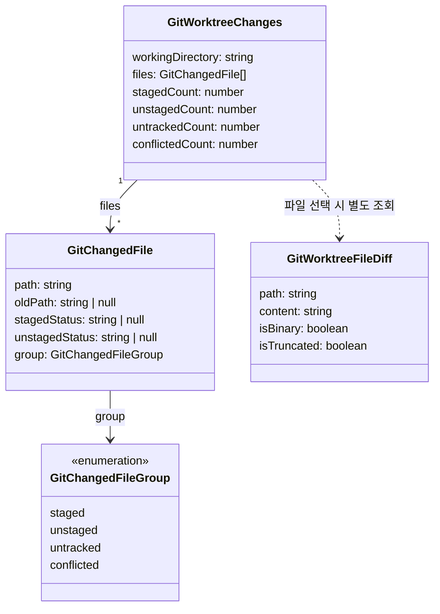

# Data Model: 워킹 트리(미커밋) 변경사항 조회

**Feature**: 006-shared-worktree-changes | **Date**: 2026-07-02

정본은 `crates/git-core/src/domain.rs`의 Rust 타입이며, serde `rename_all = "camelCase"`로 직렬화된다. `packages/git-graph/src/types.ts`가 camelCase 필드명으로 1:1 미러링한다.

## 엔티티 관계

## GitWorktreeChanges — 미커밋 변경 집합

| 필드 (TS/camelCase) | Rust | 설명 |
|---|---|---|
| `workingDirectory` | `working_directory: String` | 조회 대상 작업 디렉터리 경로 |
| `files` | `Vec<GitChangedFile>` | 변경 파일 목록 (`git status --porcelain=v1 -uall` 파싱 결과) |
| `stagedCount` / `unstagedCount` / `untrackedCount` / `conflictedCount` | `usize` ×4 | 그룹별 파일 수. UI 배지에 사용하며 `files`의 그룹 분포와 항상 일치해야 함 |

**불변식**: `files.length == stagedCount + unstagedCount + untrackedCount + conflictedCount`이고, 각 카운트는 해당 그룹 파일 수와 일치한다.

## GitChangedFile — 변경 파일

| 필드 | 설명 |
|---|---|
| `path` | 현재 경로. rename 시 새 경로 |
| `oldPath` | rename(`R`)/copy 시 이전 경로. 그 외 null. UI는 `oldPath → path` 화살표 표기 |
| `stagedStatus` | porcelain XY 코드의 X(인덱스 측 상태, 예: `M`,`A`,`D`,`R`). 해당 없으면 null |
| `unstagedStatus` | XY 코드의 Y(작업 트리 측 상태). 해당 없으면 null |
| `group` | 소속 그룹 (아래 판정 규칙) |

**그룹 판정 규칙** (우선순위 순):
1. `conflicted` — XY가 충돌 조합(`U` 포함, `DD`, `AA`)
2. `untracked` — XY == `??`
3. `staged` — X가 유효 상태(공백 아님)
4. `unstaged` — Y만 유효 상태

같은 파일이 staged+unstaged 변경을 동시에 가질 수 있으며(XY 둘 다 유효), 이때 그룹은 staged로 분류하되 두 상태 코드를 모두 보존한다.

## GitChangedFileGroup — 변경 그룹 (enum)

`"staged" | "unstaged" | "untracked" | "conflicted"`

**UI 표시 순서** (git-ui `GROUP_ORDER` 상수): `conflicted → staged → unstaged → untracked`. 충돌은 사용자가 가장 먼저 처리해야 하므로 최상단.

## GitWorktreeFileDiff — 미커밋 파일 diff

| 필드 | 설명 |
|---|---|
| `path` | diff 대상 파일 경로 |
| `content` | unified diff 텍스트. 바이너리면 빈 문자열 |
| `isBinary` | 바이너리 파일 여부. true면 UI는 diff 대신 안내 표시 |
| `isTruncated` | `MAX_WORKTREE_DIFF_BYTES`(120,000) 초과로 잘렸는지 여부 |

**설계 제약**: 커밋 `GitFileDiff`와 필드 규약을 정렬하되 `commitHash`는 갖지 않는다. 공유 `DiffViewer`는 두 타입을 동일하게 소비한다.

**diff 조회 규칙**: `git diff -- <path>`가 비면 `git diff --cached -- <path>` 폴백. 두 조회 모두 비면(untracked 파일 등) "No textual git diff is available…" 안내 문구를 content로 반환한다(untracked 내용 diff는 생성하지 않음 — 구 AW 동작과 동일).

## 상태 전이

영속 상태 없음(조회 전용 스냅샷). 데이터는 요청 시점의 git 상태를 반영하며, 갱신은 앱별 페칭 정책(react-query 재조회 등)을 따른다.

## 검증 규칙 (spec FR 매핑)

| 규칙 | 근거 FR |
|---|---|
| 4개 그룹 분류·카운트 정합 | FR-001, FR-002 |
| rename 시 oldPath 보존 | FR-004 |
| 2글자 상태 코드 보존(stagedStatus/unstagedStatus) | FR-005 |
| isBinary/isTruncated 플래그 전달 | FR-006, FR-007 |
| 빈 working_directory/path는 앱 서비스 경계에서 거부 | FR-013 |
