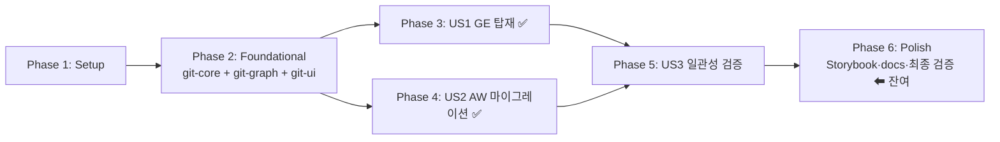

# Tasks: 워킹 트리(미커밋) 변경사항 조회 기능의 공유 패키지화 및 양 앱 통합

**Input**: Design documents from `/specs/006-shared-worktree-changes/`

**Prerequisites**: plan.md, spec.md, research.md, data-model.md, contracts/tauri-commands.md, quickstart.md

**Tests**: 헌법 요구 테스트(순수 파싱 로직·공유 crate)는 필수 — porcelain 파싱/그룹핑/diff 폴백은 git-core 단위 테스트로 검증한다.

**Organization**: 사용자 스토리별 그룹핑. 본 기능은 회고적 spec으로, 커밋 `474d923`(git-core) → `c54faa0`(공유 패키지) → `34b0d65`(GE) → `183f9c0`(AW)에서 이미 구현된 태스크는 `[x]`로 표기하고 커밋을 참조한다. **잔여 태스크는 Phase 6에 있다.**

## Format: `[ID] [P?] [Story] Description`

## Path Conventions

- 공유 Rust: `crates/git-core/src`
- 공유 TS: `packages/git-graph/src`, `packages/git-ui/src`
- GE: `apps/git-explorer/src`, `apps/git-explorer/src-tauri/src`
- AW: `apps/agentic-workbench/src`, `apps/agentic-workbench/src-tauri/src`
- 문서: `docs/[english-file-name].md`

---

## Phase 1: Setup (Shared Infrastructure)

**Purpose**: 기존 모노레포(pnpm/Turbo + Cargo workspace)를 그대로 사용 — 신규 초기화 없음

- [x] T001 git-core가 Cargo workspace 멤버이고 양 앱 src-tauri가 이를 의존하는지 확인 (기존 구조 재사용, 변경 없음)

---

## Phase 2: Foundational (Blocking Prerequisites)

**Purpose**: 두 앱이 공통으로 소비하는 공유 코어·타입·뷰. 모든 사용자 스토리를 블로킹한다.

**⚠️ CRITICAL**: 이 phase 완료 전에는 어떤 스토리도 시작 불가

- [x] T002 [P] 도메인 타입 `GitWorktreeChanges`/`GitChangedFile`/`GitChangedFileGroup`/`GitWorktreeFileDiff` 추가 (camelCase serde) in `crates/git-core/src/domain.rs` — 커밋 474d923
- [x] T003 [P] 포트 `GitWorktreeStatusReader { status, diff }`를 `GitHistoryReader`와 분리 정의 in `crates/git-core/src/ports.rs` — 커밋 474d923
- [x] T004 CLI 어댑터 `GitCliWorktreeStatusReader` 구현: `git status --porcelain=v1 -uall` 파싱 + 그룹 판정(conflicted > untracked > staged > unstaged) + `git diff`/`--cached` 폴백 + `MAX_WORKTREE_DIFF_BYTES=120_000` 상한 in `crates/git-core/src/git_cli.rs` — 커밋 474d923 (depends on T002, T003)
- [x] T005 헌법 필수 단위 테스트 7종(파싱·그룹핑·rename·바이너리·잘림·폴백) in `crates/git-core/src/git_cli.rs` tests — 커밋 474d923
- [x] T006 공개 re-export 갱신 in `crates/git-core/src/lib.rs` — 커밋 474d923
- [x] T007 [P] TS 타입 미러 4종 추가 in `packages/git-graph/src/types.ts` + `packages/git-graph/src/index.ts` export — 커밋 c54faa0
- [x] T008 표현 전용 공유 뷰 `WorktreeChangesView` 구현(그룹 순서 상수, 카운트 배지, 2글자 상태 배지, rename 화살표, `DiffViewer` 소비, 로딩/오류/바이너리/잘림 상태) in `packages/git-ui/src/ui/worktree-changes-view.tsx` + `packages/git-ui/src/index.ts` export — 커밋 c54faa0 (depends on T007)

**Checkpoint**: 공유 계층 완성 — US1/US2 병렬 진행 가능

---

## Phase 3: User Story 1 - git-explorer에서 미커밋 변경사항 확인 (Priority: P1) 🎯 MVP

**Goal**: GE 사용자가 상세 패널의 Working tree 모드에서 그룹별 미커밋 변경 목록과 파일 diff를 본다.

**Independent Test**: 미커밋 변경이 있는 저장소를 GE로 열어 Working tree 모드 전환 → 그룹별 목록·카운트·diff 표시 확인 (quickstart.md §3)

### Implementation for User Story 1

- [x] T009 [US1] facade `WorktreeStatusService`(repositoryId→path 변환 후 reader 위임) 구현 in `apps/git-explorer/src-tauri/src/application/worktree_status_service.rs` + `application/mod.rs` 등록 — 커밋 34b0d65
- [x] T010 [US1] Tauri 커맨드 `get_worktree_status`/`get_worktree_file_diff` 추가 in `apps/git-explorer/src-tauri/src/adapters/inbound/tauri_commands.rs` + `lib.rs` 핸들러 등록 — 커밋 34b0d65 (depends on T009)
- [x] T011 [US1] 서비스·파싱 관련 Rust 테스트(총 32개 통과 확인) in `apps/git-explorer/src-tauri/src` — 커밋 34b0d65
- [x] T012 [P] [US1] invoke 래퍼 `getWorktreeStatus`/`getWorktreeFileDiff` + `repositoryKeys` queryKeys 추가 in `apps/git-explorer/src/entities/repository/api.ts` + `index.ts` re-export — 커밋 34b0d65
- [x] T013 [US1] `ChangesPanel`에 Commit/Working tree 토글 + Working tree 모드에서 `WorktreeChangesView` 렌더 + 커밋 선택 시 Commit 모드 자동 복귀 in `apps/git-explorer/src/widgets/changes-panel/ui/ChangesPanel.tsx` — 커밋 34b0d65 (depends on T010, T012)

**Checkpoint**: US1 독립 검증 가능 (quickstart.md §3 시나리오 1~7)

---

## Phase 4: User Story 2 - agentic-workbench 기능 동등성 유지 (Priority: P2)

**Goal**: AW의 자체 구현을 삭제하고 공유 구현으로 교체하되 사용자 관점 무회귀.

**Independent Test**: 마이그레이션 전후 동일 저장소 상태에서 리뷰 패널·Git 탭 표시 동등성 + Rust 테스트 104개·check-types 통과 (quickstart.md §4)

### Implementation for User Story 2

- [x] T014 [US2] AW 자체 구현 삭제: `apps/agentic-workbench/src-tauri/src/domain/git_worktree_changes_provider.rs`, `infrastructure/git_cli_worktree_changes_provider.rs` — 커밋 183f9c0
- [x] T015 [US2] 서비스가 `git_core::GitWorktreeStatusReader`를 직접 주입받도록 재작성(`normalize_required` 입력 검증 포함) + FakeReader 테스트 in `apps/agentic-workbench/src-tauri/src/application/git_worktree_changes_service.rs` — 커밋 183f9c0 (depends on T014)
- [x] T016 [US2] Tauri 커맨드 `get_worktree_changes`/`get_worktree_file_diff`가 `git_core::GitCliWorktreeStatusReader`를 사용하도록 전환 in `apps/agentic-workbench/src-tauri/src/inbound/tauri_commands.rs` + `lib.rs` — 커밋 183f9c0 (depends on T015)
- [x] T017 [P] [US2] 프론트 모델을 `@yoophi/git-graph` re-export로 전환(자체 `{diff,truncated,binary}` 형태 제거) in `apps/agentic-workbench/src/entities/project/model/git-worktree-changes.ts` + `api/git-worktree-repository.ts` — 커밋 183f9c0
- [x] T018 [US2] 리뷰 패널이 공유 `WorktreeChangesView` 렌더하도록 교체 in `apps/agentic-workbench/src/.../ui/worktree-changes-panel.tsx` — 커밋 183f9c0 (depends on T017)
- [x] T019 [US2] Git 워크스페이스 탭에 Commit/Working tree 토글 + 공유 뷰 렌더 in `apps/agentic-workbench/src/.../ui/worktree-workspace-panel.tsx` — 커밋 183f9c0 (depends on T017)
- [x] T020 [US2] 무회귀 검증: AW Rust 테스트 104개 + check-types 통과 — 커밋 183f9c0

**Checkpoint**: US1·US2 모두 독립 동작

---

## Phase 5: User Story 3 - 두 앱 일관 표시 + 단일 정본 (Priority: P3)

**Goal**: 표시 규칙(그룹 순서·배지·rename)이 두 앱에서 동일하고, 파싱 구현이 git-core 한 곳에만 존재.

**Independent Test**: 동일 fixture를 두 앱에서 비교 + `grep -rn "porcelain" apps/ crates/ packages/ --include='*.rs'`가 git-core만 매치 (quickstart.md §5)

### Implementation for User Story 3

- [x] T021 [US3] 표시 규칙을 공유 뷰 상수(`GROUP_ORDER`, `GROUP_LABELS`)로 단일화 — T008에 포함되어 구조적으로 보장, 커밋 c54faa0
- [x] T022 [US3] 앱별 중복 파서 부재 확인(AW 구 구현 삭제로 달성) — 커밋 183f9c0
- [X] T023 [US3] 단일 정본·일관성 검증 실행: quickstart.md §5의 grep 2종 수행 — 미커밋 변경 status/diff 파싱은 `crates/git-core/src/git_cli.rs`만 매치(그 외 porcelain 매치는 worktree 목록 파싱·dirty boolean 체크로 별개 기능), AW 구 provider 2종 삭제 확인. 두 앱 육안 비교는 T027 수동 시나리오에 포함

**Checkpoint**: 전체 스토리 기능 완료

---

## Phase 6: Polish & Cross-Cutting Concerns (잔여 작업)

**Purpose**: 헌법 의무 사항 보완 및 최종 검증. **현재 실질 잔여 작업은 이 phase다.**

- [X] T024 [P] `WorktreeChangesView` Storybook 스토리 등록 — 프로젝트 관례(스토리는 앱 Storybook에서 관리)에 따라 `apps/git-explorer/src/stories/organisms.stories.tsx`에 등록: WorktreeInspection(4그룹+rename+diff), CleanWorktreeInspection(빈), LoadingDiff, DiffError, BinaryDiff, TruncatedDiff 6종. `build-storybook` 성공 확인
- [X] T025 [P] 공유 Git 계층 구조 문서 신규 작성 in `docs/git-worktree-changes-architecture.md` (계층 Mermaid + 조회 sequenceDiagram, 범위/비범위/결정/완료 기준 포함, 한국어 본문)
- [X] T026 [P] 교차 검증 재실행 완료: git-core 7 · git-explorer 32 · agentic-workbench 118 테스트 통과, `pnpm -r check-types` 전 패키지·앱 통과
- [ ] T027 quickstart.md §2~§4 수동 GUI 검증 시나리오 수행(엣지 케이스 fixture로 두 앱 실행·육안 비교) — 자동화 불가, 사용자 수동 수행 필요
- [X] T028 앱 간 직접 import 미발생 확인 — grep 결과 코드 import 0건(매치 2건은 "git-explorer 정본" 주석 텍스트뿐)

---

## Dependencies & Execution Order

### Phase Dependencies



### User Story Dependencies

- **US1 (P1)**: Foundational 이후 독립 진행 — 완료
- **US2 (P2)**: Foundational 이후 독립 진행(US1과 병렬 가능) — 완료
- **US3 (P3)**: 구조적 보장은 Foundational에서 달성, 검증 태스크(T023)는 US1·US2 완료 후

### Within Each Story

- 헌법 필수 테스트(T005)는 공유 코어 구현과 동일 커밋에서 작성됨
- 도메인/포트(T002-T003) → 어댑터(T004) → 앱 서비스(T009/T015) → Tauri 커맨드(T010/T016) → UI(T013/T018-T019)
- Shared core(Phase 2 Rust) → Shared UI(T008) 순서 준수됨

### Parallel Opportunities (잔여 태스크 기준)

- T024(Storybook), T025(docs), T026(자동 검증)은 서로 다른 파일·무의존이므로 병렬 가능
- T023, T027, T028은 검증 실행 태스크로 T026 통과 후 순차 권장

## Parallel Example: Phase 6

```bash
# 병렬 착수 가능:
Task: "T024 WorktreeChangesView 스토리 작성 in packages/git-ui/src/ui/worktree-changes-view.stories.tsx"
Task: "T025 docs/git-worktree-changes-architecture.md 작성"
Task: "T026 cargo test 3종 + pnpm -r check-types 실행"
```

## Implementation Strategy

구현(Phase 1~5의 코드 태스크)은 완료 상태다. 남은 전략은 다음 순서를 권장한다:

1. **T026** 자동 검증 재실행으로 현재 브랜치 상태 확정
2. **T024 + T025** 병렬 수행 (헌법 의무 보완)
3. **T023 / T027 / T028** 최종 검증 후 PR 준비

## Notes

- 완료 표기 `[x]`는 커밋 474d923 / c54faa0 / 34b0d65 / 183f9c0 기준
- 쓰기 동작(stage/unstage/discard)·실시간 감시는 spec 비목표 — 태스크 없음
- T024 완료 전까지 헌법 "Documentation and Storybook" 게이트는 부분 미충족 상태(plan.md Constitution Check 참조)

---

## Phase 7: Convergence

- [X] T029 untracked 파일 diff 동작 서술 정정: 실제 구현(`crates/git-core/src/git_cli.rs`의 `diff`)은 `/dev/null` 대비 diff를 생성하지 않고 "No textual git diff is available…" 안내 문구를 content로 반환한다(구 AW 동작과 동일, 회귀 아님). `specs/006-shared-worktree-changes/research.md`(R5), `specs/006-shared-worktree-changes/data-model.md`(diff 조회 규칙), `specs/006-shared-worktree-changes/contracts/tauri-commands.md`(§1 기본 구현), `docs/git-worktree-changes-architecture.md`(핵심 설계 결정 표)의 "untracked는 /dev/null 대비" 서술을 실제 동작으로 수정 per plan: R5 diff 조회 결정 (contradicts)
