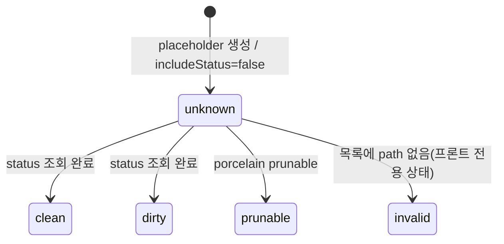

# Data Model: Worktree Session 페이지 성능 개선

신규 영속 데이터는 없다. 기존 in-memory/전송 모델의 확장만 있다.

## GitWorktree (확장)

worktree 목록/세션 화면에서 사용하는 worktree 메타데이터.

| 필드 | 타입 | 변경 | 설명 |
|---|---|---|---|
| path | string | 유지 | worktree 절대 경로. placeholder 생성 시 URL 값에서 유래 |
| head | string? | 유지 | HEAD hash |
| branch | string? | 유지 | 브랜치명 |
| pruneReason | string? | 유지 | prunable 사유 |
| status | `"clean" \| "dirty" \| "prunable" \| "unknown"` | **`unknown` 추가** | `unknown`은 status 계산을 건너뛴 경우(`includeStatus: false`) 또는 프론트 placeholder |
| canDelete | boolean | 유지 | `unknown` status에서는 항상 `false`(삭제는 상태 확정 후에만 허용) |

**검증 규칙**
- 백엔드: `include_status=false`면 `has_changes` 호출 없이 `status=Unknown`, `can_delete=false`(prunable 판정은 porcelain 출력만으로 가능하므로 유지).
- 프론트 placeholder: `status="unknown"`, `branch=null`, `canDelete=false`. 목록 응답 도착 시 path 일치 항목으로 교체, 불일치 시 검증 실패 상태로 전환.

**상태 전이**

## WorktreeChangedEvent (동작 변경, 구조 유지)

파일 watcher가 발행하는 변경 이벤트. 전송 구조는 유지하고 발행 규칙만 바뀐다.

| 필드 | 타입 | 설명 |
|---|---|---|
| workingDirectory | string | 감시 대상 worktree |
| changedPath | string | 대표 변경 경로 |
| kind | `"file" \| "git"` | `git`은 `.git`의 `HEAD`/`refs/`/`MERGE_HEAD`/`packed-refs` 변화로 한정 |

**발행 규칙(변경)**
- 제외 디렉터리(파일 목록의 `EXCLUDED_DIRS`와 동일 상수) 하위 변화만 있는 이벤트는 발행하지 않는다.
- `.git/index`, `*.lock`, `FETCH_HEAD` 단독 변화는 발행하지 않는다.
- trailing debounce: 마지막 원시 이벤트 후 500ms 뒤 1회 발행(창 내 마지막 변경 유실 금지).

## GitCommitPage / GitGraphPage (확장)

commit 이력/그래프의 페이지 정보.

| 필드 | 타입 | 변경 | 설명 |
|---|---|---|---|
| offset | number | 유지 | 폴백(offset 방식) 시 사용 |
| limit | number | 유지 | 요청 페이지 크기 |
| totalCount | number? | **옵션화** | 첫 페이지(offset 0, cursor 없음)에서만 채움. 이후 페이지는 생략, 프론트가 첫 페이지 값을 유지 |
| loadedCount | number | 유지 | 이번 페이지 commit 수 |
| hasMore | boolean | 유지 | 다음 페이지 존재 여부 |
| cursorInvalidated | boolean? | **추가** | 요청 cursor가 더 이상 유효하지 않아 offset 방식으로 폴백했음을 표시. 프론트는 누적 목록을 초기화하고 처음부터 다시 로드 |

**요청 파라미터(확장)**: `cursor?: string`(마지막으로 받은 commit hash). cursor가 있으면 `--skip` 대신 cursor 이후부터 조회.

**GitCommitGraph.refs**: 첫 페이지에서만 채움(이후 페이지는 빈 배열/생략). 프론트 `combineGitCommitGraphPages`는 첫 페이지 refs를 유지한다.

## WorktreeFileListScope (신규 요청 모델)

`list_worktree_files`의 조회 범위.

| 필드 | 타입 | 기본값 | 설명 |
|---|---|---|---|
| kind | `"all" \| "markdown"` | `"all"` | `markdown`은 `.md/.markdown/.mdx` 파일과 그 조상 디렉터리만 반환 |
| dir | string? | 루트 | 조회 시작 상대 경로. 기존 경로 탈출 방지 검증 적용 |
| depth | number? | 무제한 | `1`이면 해당 디렉터리 직계만(폴더 펼침용) |

파라미터 없는 호출은 현행(전체 트리)과 동일 — 하위 호환.

## PerfLogRecord (계측, 로그 전용)

영속화하지 않는 stderr 로그 라인. `AW_PERF_LOG=1`일 때만 발행.

| 필드 | 예시 | 설명 |
|---|---|---|
| kind | `command` / `git` / `watcher` | 측정 대상 종류 |
| name | `get_worktree_git_graph` / `rev-list-count` / `emit` | 대상 이름 |
| wait_ms | `12` | invoke 도착→실행 시작(command만) |
| run_ms | `340` | 실행 시간 |
| extra | `kind=git` | watcher 이벤트 kind 등 |

프론트는 `performance.mark`/`measure` 이름 규약 `session:shell-rendered`, `session:graph-first-row`를 사용한다.
