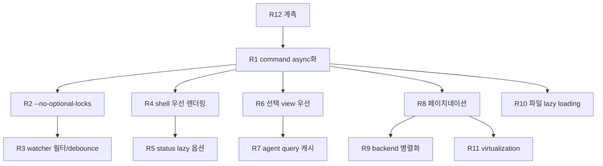

# Research: Worktree Session 페이지 성능 개선

조사 문서 `docs/worktree-session-loading-performance-review.md`가 병목 분석을 이미 제공하므로, 본 문서는 구현 방식 선택지를 결정으로 확정한다. Technical Context에 NEEDS CLARIFICATION은 없다.

## R1. Tauri command 비차단화 방식

- **Decision**: Git/파일 계열 command를 `async fn`으로 전환하고, 내부 blocking 작업(git 프로세스, WalkDir)은 `tauri::async_runtime::spawn_blocking`으로 감싼다. provider/service 계층 시그니처는 동기 그대로 유지한다.
- **Rationale**: Tauri 2에서 동기 command는 main thread에서 실행되어 모든 IPC를 직렬화한다. `async fn` command는 async runtime에서 실행되고, blocking 코드를 spawn_blocking으로 넘기면 runtime worker도 막지 않는다. provider를 동기로 유지하면 domain/application 계약과 기존 테스트가 그대로 살아남는다.
- **Alternatives considered**:
  - `#[tauri::command(async)]` 속성만 추가: 별도 thread에서 실행되지만 blocking 작업이 async runtime thread를 점유하는 형태라 명시적 spawn_blocking보다 제어가 약하다.
  - provider 전체를 async trait으로 전환: 계약 변경 범위가 커지고 `async_trait` 의존이 생긴다. 성능 이득 없음.
  - rayon 등 별도 thread pool: Tauri가 이미 제공하는 runtime으로 충분하다.

## R2. `git status` 되먹임 차단

- **Decision**: status 계열 git 호출(`git_cli_worktree_provider::has_changes`, git-core `GitCliWorktreeStatusReader::status`)에 `--no-optional-locks` 전역 옵션을 추가한다(`git --no-optional-locks -C <path> status ...`).
- **Rationale**: `git status`는 기본적으로 index refresh 결과를 `.git/index`에 다시 쓸 수 있어(optional locks) 파일 watcher의 `.git` 감시와 되먹임 루프를 만들 수 있다. `--no-optional-locks`는 이 쓰기를 금지하는 공식 옵션이며 부작용이 없다. 조사 문서의 되먹임 가설이 실측에서 거짓이어도 비용이 0에 가까운 예방 조치다.
- **Alternatives considered**:
  - 환경 변수 `GIT_OPTIONAL_LOCKS=0`: 동일 효과지만 command 인자가 호출 지점에서 더 명시적이다.
  - watcher에서 `.git/index`만 무시(R3): 함께 적용한다. 한쪽만으로는 다른 도구(외부 git 실행)가 유발하는 잡음을 못 거른다.

## R3. Watcher 이벤트 필터와 debounce

- **Decision**:
  1. 무시 디렉터리 목록을 `fs_worktree_file_provider::EXCLUDED_DIRS`와 단일 상수로 공유하고 watcher의 `should_ignore_event`가 이를 사용한다.
  2. `.git` 내부 이벤트는 `HEAD`, `refs/`, `MERGE_HEAD`, `packed-refs` 변화만 `kind=Git`으로 발행하고 `index`, `*.lock`, `FETCH_HEAD` 단독 변화는 무시한다.
  3. 현재 leading-edge rate-limit(500ms 창 내 이벤트 폐기)을 trailing debounce(마지막 이벤트 후 500ms 뒤 1회 발행)로 교체한다. 구현은 std thread + channel 타이머로 직접 작성한다.
- **Rationale**: 빌드 산출물 잡음 제거(파일 목록 화면과 동일 기준), git 메타데이터 잡음 제거, 마지막 변경 유실 방지(현재 구조의 정확성 결함)와 이벤트 수 감소를 동시에 얻는다.
- **Alternatives considered**:
  - `notify-debouncer-mini`/`notify-debouncer-full` crate 도입: 검증된 구현이지만 단순 trailing debounce 하나에 의존성을 추가할 가치가 낮다. 직접 구현이 20~30줄 수준이며 fixture 테스트로 고정한다.
  - frontend에서 debounce: 이벤트가 이미 IPC를 건넌 뒤라 백엔드 발행 억제보다 비용이 크다.

## R4. Session route shell 우선 렌더링

- **Decision**: `ProjectWorktreeSessionRoute`에서 `decodedWorktreePath`가 있으면 `status: "unknown"`을 갖는 placeholder `GitWorktree`를 구성해 즉시 `ProjectWorktreeSessionPage`를 렌더링한다. `list_git_worktrees` 응답 도착 시 실제 메타데이터로 교체하고, 응답에 해당 path가 없으면 페이지 내부에 검증 실패 상태를 표시한다. 프론트 `GitWorktree` 타입의 status에 `"unknown"` 값을 추가한다(백엔드 타입은 불변 — placeholder는 프론트에서만 생성).
- **Rationale**: URL이 이미 대상 worktree를 특정하므로 목록 조회는 검증·보강 용도로 강등할 수 있다. 별도 검증 command 없이 기존 목록 응답으로 검증까지 처리해 백엔드 표면적을 늘리지 않는다.
- **Alternatives considered**:
  - `validate_worktree_path`/`get_worktree_summary` 신규 command: 단일 worktree 검증이 더 빠르지만 R5(status lazy) 적용 후 목록 조회가 충분히 가벼워져 필요성이 낮다. 계측 후 필요하면 후속 단계에서 추가한다.
  - 페이지를 로딩 스피너로 유지(현행): 개선 대상 그 자체.

## R5. worktree status lazy 옵션

- **Decision**: `GitWorktreeProvider::list_worktrees`에 `include_status: bool` 파라미터를 추가하고, Tauri command `list_git_worktrees`는 `includeStatus?: boolean`(기본 `true`) 옵션을 받는다. `false`면 `has_changes` 호출을 건너뛰고 status는 `unknown`(prunable 판정은 porcelain 출력만으로 가능하므로 유지). session route는 `false`, 프로젝트 상세는 기본값을 사용한다.
- **Rationale**: 기본값 `true`로 기존 호출처(프로젝트 상세 카드, dashboard)의 동작을 바꾸지 않으면서 session route의 blocking git status N회를 제거한다. command 분리(refs/status/with_status 3종)보다 변경 표면이 작다.
- **Alternatives considered**:
  - command 3종 분리(조사 문서의 "더 나은 구조"): 장기적으로 깔끔하지만 소비처 마이그레이션이 필요하다. 옵션 파라미터로 시작하고 필요 시 후속 리팩터링.
  - status를 항상 병렬 계산: N개 git 프로세스 동시 실행은 디스크 경쟁을 만들고 근본 원인(불필요한 계산)을 남긴다.

## R6. Git 탭 선택 view 우선 조회

- **Decision**: `GitWorkspaceTab`에서 `historyQuery.enabled = historyView === "list"`, `graphQuery.enabled = historyView === "graph"`로 전환한다. 반대 view는 view 전환 시점에 로드한다(idle prefetch는 계측 후 필요하면 추가). refetch 버튼과 watcher invalidation은 enabled 상태의 query에만 영향을 주므로 그대로 동작한다.
- **Rationale**: 기본 view가 graph일 때 history command 세트(rev-list count + log)가 초기 경로에서 제거된다. TanStack Query의 enabled 전환만으로 구현되어 위험이 낮다.
- **Alternatives considered**:
  - `requestIdleCallback` prefetch 즉시 도입: 초기 진입 직후는 이미 command가 몰리는 구간이라 prefetch가 오히려 경쟁을 만들 수 있다. 계측 후 결정.
  - graph 응답에서 list 데이터 재사용: API 계약 변경 영향이 커 조사 문서에서도 후순위로 분류.

## R7. Agent 패널 query 캐시 정책

- **Decision**: `list_agents` staleTime 5분(환경 변수 기반 카탈로그라 세션 중 불변), `get_agent_run_settings` 2종 staleTime 30초, `get_goal`은 mount 시 조회를 유지하되 staleTime 10초를 부여한다. 지연 조회(goal UI open 시점)는 goal badge가 헤더에 항상 표시되는 현 UI에서는 적용하지 않는다.
- **Rationale**: R1(async화) 이후 이 query들은 더 이상 무거운 Git command 뒤에 줄 서지 않으므로, 남는 문제는 재진입 시 불필요한 refetch뿐이다. staleTime으로 해결된다. goal badge가 즉시 필요하므로 지연 조회는 UX 회귀가 된다.
- **Alternatives considered**:
  - goal idle prefetch/지연 조회(조사 문서 제안): goal 상태 badge가 초기 화면에 표시되는 현 UI 기준으로는 부적합. UI가 바뀌면 재검토.

## R8. Graph/history 페이지네이션과 count/refs 반복 계산

- **Decision**: git-core `GitHistoryReader`에 두 가지를 적용한다.
  1. `offset > 0`인 페이지에서는 `rev-list --count`와 `for-each-ref`를 생략하고 응답의 `total_count`/`refs`를 옵션(첫 페이지에서만 채움)으로 변경한다. 프론트 `combineGitCommitGraphPages`는 첫 페이지 값을 유지한다.
  2. cursor 파라미터: 요청에 `cursor: Option<String>`(마지막으로 받은 commit hash)을 추가한다. **[구현 시 확정]** cursor로 `--skip`을 대체하는 이어받기는 채택하지 않았다 — `--topo-order --all`(graph)과 merge frontier가 있는 history 모두 단일 hash에서 walk를 재개하면 원래 순서와 누락/중복이 생길 수 있다. 대신 cursor는 **이력 재작성 감지** 용도로 사용한다: `rev-parse --verify`로 존재를 확인하고, 무효면 `cursor_invalidated=true`를 반환해 프론트가 누적 목록을 초기화한다. 페이지 조회는 `--skip`을 유지하되, count/refs 생략(위 1)과 limit+1 기반 `has_more` 판정으로 페이지당 비용을 줄인다.
- **Rationale**: 페이지마다 반복되던 O(전체) count·refs 계산을 제거하고(뒤 페이지 비용의 지배 요인), rebase 후 페이지 혼합이라는 정합성 문제를 cursor 검증으로 해결한다. `--skip`의 O(offset) 순회 비용은 남지만 count 제거 대비 부차적이며, 순서 정합성을 깨지 않는다.
- **Alternatives considered**:
  - count를 `--count=<limit+1>` 방식의 hasMore 판정으로 대체: totalCount 표시("N / total commits loaded")를 잃는다. 첫 페이지 1회 계산이 UI 요구와 비용의 균형점.
  - libgit2(git2 crate) 전환: git-core가 의도적으로 CLI 기반(git2 미사용)을 유지하고 있어 범위 밖.

## R9. Graph backend command 병렬화

- **Decision**: `get_commit_graph` 내부에서 첫 페이지의 `head_hash`/`log`/`refs` 조회를 `std::thread::scope`로 병렬 실행한다. count는 R8에 따라 첫 페이지에서만 계산하며 병렬 그룹에 포함한다.
- **Rationale**: 서로 독립인 read-only git command 3~4개의 wall-clock을 최장 1개 수준으로 줄인다. read-only 조회라 index lock 경쟁이 없고, R2의 `--no-optional-locks`가 status 계열의 잠재 경쟁도 제거한다.
- **Alternatives considered**:
  - async command 수준 병렬화(프론트에서 분리 호출): IPC 왕복과 계약 변경이 늘어난다. provider 내부 병렬화가 계약 불변으로 같은 효과.

## R10. 파일 목록 lazy loading

- **Decision**: `list_worktree_files`에 `scope` 옵션을 추가한다 — `{ kind: "all" | "markdown", depth?: number, dir?: string }`.
  1. Markdown 탭은 `kind: "markdown"`으로 백엔드 확장자 필터링(전체 순회는 유지하되 응답 크기 축소, WalkDir 자체는 markdown용 얕은 비용).
  2. Files 탭은 `dir` 기반 디렉터리 단위 조회(`depth: 1`)로 전환하고 폴더 펼침 시 하위를 조회한다.
  기존 파라미터 없는 호출은 현행과 동일하게 동작한다(하위 호환).
- **Rationale**: 화면이 실제로 보여주는 범위만 읽는다. Markdown 탭은 트리 구조 유지를 위해 파일 경로 전체가 필요하므로 필터 방식, Files 탭은 접힌 트리 UI라 디렉터리 단위가 자연스럽다. 경로 탈출 방지는 기존 `resolve_worktree_path` 검증을 재사용한다.
- **Alternatives considered**:
  - 파일 수 상한 + "더 보기": 어떤 파일이 잘렸는지 예측 불가능해 UX가 나쁘다.
  - 검색 기반 로딩: 별도 기능 범위. 본 개선과 독립적으로 추가 가능.

## R11. Graph/list row virtualization

- **Decision**: `packages/git-ui`의 `HistoryGraphView`/`CommitListView`에 자체 virtualization을 구현한다. `agent-run-panel.tsx`의 `VirtualizedRunTimeline` 패턴(스크롤 컨테이너 기준 절대 배치 + overscan)을 참고하되 git-ui 내부 hook으로 작성해 앱 의존을 만들지 않는다. graph SVG 열은 row 단위로 분할 렌더링되고 있어 virtualization과 호환된다.
- **Rationale**: 새 외부 의존성 없이 검증된 자체 패턴을 재사용한다. git-ui는 공유 패키지이므로 git-explorer도 동일 혜택을 받는다.
- **Alternatives considered**:
  - `@tanstack/react-virtual` 도입: 성숙한 라이브러리지만 공유 패키지에 신규 의존성이 생기고, 필요한 기능(고정 높이 row + overscan)은 자체 구현으로 충분하다.
  - 초기 page size 축소만 적용: 무한 스크롤 누적 문제를 해결하지 못한다. page size 조정(300→150)은 virtualization과 병행 가능한 보조 수단으로 둔다.

## R12. 계측 방식

- **Decision**:
  1. Rust: command 진입/종료와 git subcommand 실행 시간을 `AW_PERF_LOG=1` 환경 변수 조건부 `eprintln!` 로그로 남긴다(구조: `perf command=<name> wait_ms=<t> run_ms=<t>`).
  2. Frontend: route 진입→shell 표시, 진입→graph 첫 row를 `performance.mark`/`measure`로 기록하고 dev 콘솔에 출력한다.
  3. Watcher: 발행 이벤트 kind별 카운트를 동일 로그 채널로 남긴다.
- **Rationale**: SC-001~SC-006 검증과 되먹임 가설(idle 10분 0회) 확인에 필요한 최소 수단. 로그 기반이라 영속 계층·UI 추가 없이 quickstart 검증 절차에서 수집 가능하다.
- **Alternatives considered**:
  - tracing crate + 구조화 로깅: 장기적으로 유효하나 본 기능에는 과함. 로그 포맷을 단순 key=value로 통일해 이후 tracing 전환 여지를 남긴다.
  - devtools 성능 패널 수동 측정만 사용: 재현 가능한 수치 비교가 어렵다.

## 적용 순서와 의존성

계측(R12)을 가장 먼저 넣어 각 단계의 전후 수치를 남긴다. R1이 나머지 전부의 효과를 배가시키는 선행 작업이다.
