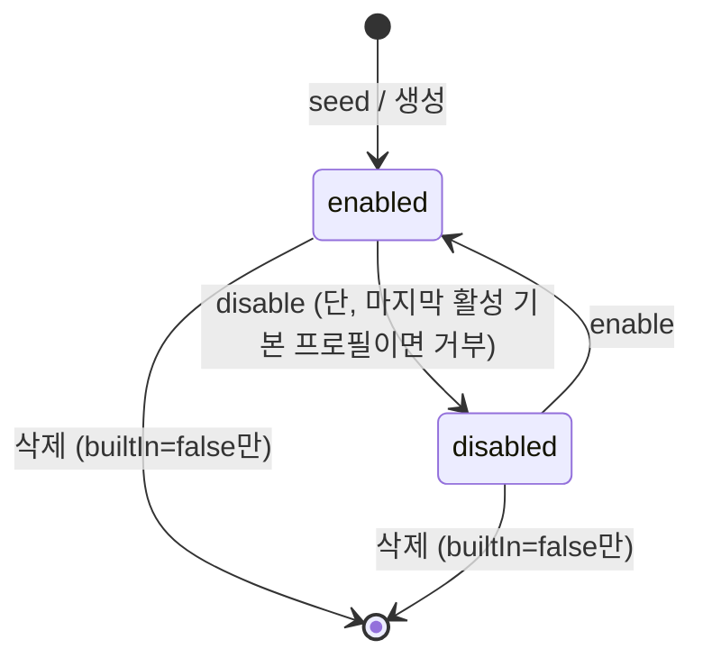

# Data Model: Agent 프로필과 환경변수 주입

기존 agent-run settings 저장소(가상 키 `__app_agent_command_overrides__` 항목)의 `commandOverrides` 필드를 하위 호환으로 확장한다. TS(camelCase)와 Rust(serde camelCase)가 동일 직렬화 shape를 공유한다.

## AgentProfile (신규)

| 필드 | 타입 | 규칙 |
|---|---|---|
| id | string | 고유 식별자. 기본 프로필은 catalog agent id와 동일(예: `codex`), 커스텀은 UUID |
| name | string | 표시 이름. trim 후 빈 값이면 type 기반 기본 이름으로 대체. 중복 허용(식별은 id) |
| agentType | `"codex" \| "claude_code" \| "opencode" \| "pi"` | catalog agent id와 동일한 문자열 집합 |
| command | string? | trim 후 빈 값이면 미지정(null) 취급 → 해석 시 global command → catalog 기본 순 폴백 |
| env | Record<string, string> | key는 trim + 비공백 필수(위반 항목은 저장 시 제거), value는 빈 문자열 허용 |
| enabled | boolean | disable 시 세션 시작 목록에서 제외 |
| builtIn | boolean | true면 삭제 불가. seed로만 생성 |

**불변식**
- `builtIn=true` 프로필은 4종(agentType별 1개)이며 항상 존재한다(로드/저장 시 seed로 보장).
- `builtIn=true ∧ enabled=true`인 프로필이 최소 1개 존재한다. 위반 저장 시도는 오류로 거부한다.
- 커스텀 프로필(builtIn=false)은 자유 삭제 가능.

## AgentCommandOverrides (확장)

| 필드 | 타입 | 변경 | 규칙 |
|---|---|---|---|
| globalCommand | string? | 유지(legacy 겸 공통 계층) | 모든 프로필의 command 미지정 시 폴백 |
| agentCommands | Record<string, string> | 유지(legacy 읽기 전용) | 신규 UI에서는 편집하지 않음. 기본 프로필 seed 시 command 초기값으로 매핑 |
| globalEnv | Record<string, string> | **신규** | 모든 프로필 실행에 병합되는 공통 env |
| profiles | AgentProfile[] | **신규** | 프로필 목록. 빈 배열이면 로드 시 seed |

**Legacy 매핑 (읽기 시, 파일 재작성 없음)**
- `profiles`에 없는 기본 프로필을 seed할 때: `command = agentCommands[agentType] ?? null`, `enabled = true`.
- `globalCommand`/`agentCommands` 필드는 저장 파일에 유지(구버전 롤백 호환).

## 해석 규칙 (command/env resolution)

프로필 `p`로 실행할 때:

```text
command = p.command ?? globalCommand ?? catalog[p.agentType].command
env     = globalEnv ⊕ p.env          # 동일 key는 p.env 우선
```

- `source` 표시: `profileCommand | globalOverride | defaultCommand` (기존 `agentOverride`는 legacy 호환 표기로 유지 가능).
- PATH key가 env에 있으면 runner에서 `env.PATH + ":" + enriched_path()`로 결합 주입. 없으면 현행대로 enriched PATH만 주입.

## AgentRunRequest (확장)

| 필드 | 타입 | 변경 |
|---|---|---|
| agentCommand | string? | 유지 — 해석된 command |
| agentEnv | Record<string, string>? | **신규** — 해석·병합 완료된 env. runner는 정책 없이 주입만 |

## 상태 전이 (프로필 enable/disable)



## worktree별 AgentRunSettings.agentId 의미 확장

- 기존: catalog agent id 저장 → 기본 프로필 id와 동일하므로 하위 호환.
- 신규: 선택된 profile id 저장. 로드 시 해당 id의 enabled 프로필이 없으면 첫 enabled 프로필로 폴백.
