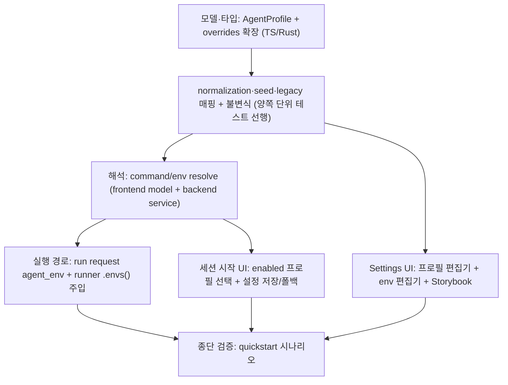

# Research: Agent 프로필과 환경변수 주입

Technical Context에 NEEDS CLARIFICATION은 없다. 기존 코드(command override 모델·settings service·ACP runner) 조사를 바탕으로 설계 선택지를 결정으로 확정한다.

## R1. 저장 모델 — 기존 overrides 구조체 확장 vs 신규 저장소

- **Decision**: 기존 `AgentCommandOverrides`를 확장한다: `profiles: Vec<AgentProfile>`(기본 `[]`)와 `global_env: BTreeMap<String, String>`(기본 `{}`) 필드를 추가하고, `global_command`/`agent_commands`는 legacy 필드로 유지한다. 저장 위치는 현행 가상 settings 키(`__app_agent_command_overrides__`) 그대로.
- **Rationale**: serde `#[serde(default)]`로 기존 저장 파일이 그대로 역직렬화되어 FR-012(migration 없는 하위 호환)를 구조적으로 만족한다. 신규 저장소/키를 만들면 두 저장소의 정합성 관리가 새 문제로 생긴다.
- **Alternatives considered**:
  - 별도 profiles 저장 파일: 하위 호환을 위해 어차피 기존 키를 읽어야 하고, 저장 이원화만 늘어난다.
  - 이슈 1부의 `agentEnvs: Record<string, Record<string,string>>` 방식: 확장 요청(프로필)이 이를 대체한다. 프로필 모델로 직행한다.

## R2. Legacy 데이터 매핑 — 읽기 시 변환, 쓰기 시 프로필로 통합

- **Decision**: 로드 후 "유효 프로필 목록" 계산 시점에 legacy를 반영한다:
  1. 저장된 `profiles`에 기본 프로필 4종이 없으면 seed로 채운다(FR-008).
  2. seed된 기본 프로필의 command가 비어 있고 legacy `agent_commands[type]`이 있으면 그 값을 기본 프로필 command 초기값으로 사용한다.
  3. `global_command`/`global_env`는 프로필과 별개 계층으로 계속 동작한다(FR-007 우선순위).
  legacy 필드는 삭제하지 않고 저장 파일에 그대로 남긴다(이전 버전과의 왕복 호환).
- **Rationale**: "읽는 순간 변환"은 migration 절차 없이 동작을 보존하고, legacy 필드를 지우지 않으므로 앱 버전을 되돌려도 데이터가 유실되지 않는다.
- **Alternatives considered**: 최초 로드 시 저장 파일을 프로필 형식으로 재작성(one-shot migration) — 구버전으로 롤백 시 설정 유실 위험. 기각.

## R3. 기본 프로필 식별과 seed

- **Decision**: 기본 프로필의 `id`는 agent catalog의 agent id(= agentType 문자열)를 그대로 사용하고 `builtIn: true`로 표시한다. 커스텀 프로필 id는 UUID. seed는 로드 경로(유효 프로필 계산)와 저장 경로(normalization) 양쪽에서 멱등하게 수행한다.
- **Rationale**: 기본 프로필 id를 catalog agent id와 일치시키면 (a) 세션 재사용 목록·ACP 세션 저장 등 agent id 기반 기존 흐름이 기본 프로필에 대해 무변경으로 동작하고, (b) 기존 `agentCommands[agentId]` legacy 매핑이 자연스럽다.
- **Alternatives considered**: `builtin:` prefix가 붙은 별도 id — 기존 agent id 소비처(설정의 agent_id, 세션 스토어)와의 매핑 테이블이 추가로 필요해진다. 기각.

## R4. env 병합 우선순위와 spawn 주입

- **Decision**: 병합 규칙은 `프로필 env > global env`(동일 key는 프로필 값). 병합 결과를 run request의 `agent_env: BTreeMap<String, String>`로 전달하고, runner는 spawn 시 `.envs(merged)`를 적용한다. PATH는 특별 취급: 사용자가 PATH를 지정하면 `사용자 PATH + ":" + enriched_path()`로 결합해 주입하고, 지정하지 않으면 현행대로 `enriched_path()`만 주입한다. 프로그램 경로 resolve는 현행(enriched PATH 기반)을 유지한다.
- **Rationale**: 이슈 수용 기준("agent별 값 우선")을 따르고, PATH 결합은 사용자 의도(우선 탐색 경로 추가)와 spawn 안정성(npx/node 탐색 가능)을 모두 지킨다. 병합을 프론트가 아닌 request 단계에서 완성된 map으로 넘기면 runner는 정책을 모른 채 주입만 한다.
- **Alternatives considered**:
  - runner에서 global/profile을 각각 받아 병합: 정책이 infrastructure로 새어 나간다. 기각.
  - 사용자 PATH를 무시: "기본 환경 불파괴"는 지키지만 사용자가 커스텀 바이너리 경로를 넣는 정당한 용례를 막는다. 기각.

## R5. command/env 해석 위치 — 프론트 해석 유지

- **Decision**: 현행 구조(프론트 `resolveRequestAgentCommand`가 override를 해석해 `agentCommand`를 request에 담음)를 확장한다: 선택된 프로필에서 `command`(프로필 command → global command → catalog 기본)와 `env`(global env ⊕ 프로필 env)를 해석해 `agentCommand`/`agentEnv`로 전달한다. 백엔드 `resolve_agent_command`도 동일 규칙으로 확장해 이중 안전망(request에 command가 없을 때의 fallback 경로)을 유지한다.
- **Rationale**: 기존 해석 흐름과 테스트가 프론트에 있고, 세션 시작 UI가 프로필을 이미 알고 있다. 해석 규칙은 양쪽 model/service의 순수 함수로 두고 각각 단위 테스트한다(기존 command 해석과 같은 패턴).
- **Alternatives considered**: 백엔드 단독 해석(프론트는 profile id만 전달) — request 계약이 크게 바뀌고(agent_id 의미 변화), 기존 agentCommand 경로와 이원화된다. 기각.

## R6. 세션 시작 선택과 세션 재사용

- **Decision**: agent-run 패널의 agent 선택 목록을 "enabled 프로필 목록"으로 교체한다(표시: 프로필 이름 + type). 선택 상태는 profile id로 저장하되, ACP 실행·세션 재사용·provider 세션 조회에는 프로필의 `agentType`(= catalog agent id)을 사용한다. worktree별 설정(`agent_id`)에는 profile id를 저장하고, 로드 시 해당 프로필이 없거나 disabled면 첫 enabled 프로필로 폴백한다.
- **Rationale**: 세션 저장·재사용은 provider(type) 단위 개념이므로 유지(spec Assumption). 프로필 id를 설정에 저장해야 재진입 시 같은 프로필이 선택된다. 기본 프로필 id = agent id(R3)라 기존 저장값(agent_id)이 그대로 유효하다 — 추가 하위 호환 확보.
- **Alternatives considered**: 프로필별 세션 분리 — 범위 밖(spec Assumption 명시).

## R7. 최소 1개 활성 기본 프로필 불변식의 강제 지점

- **Decision**: 3중 방어로 구현한다:
  1. UI: 마지막 활성 기본 프로필의 disable 토글을 차단하고 이유를 안내(FR-010의 "차단 및 안내").
  2. frontend model: 폼 상태 → 저장 payload 변환 시 불변식 검사 헬퍼(`profile-invariants`)로 검증.
  3. backend normalization: 저장 시 불변식 위반이면 오류 반환(방어), seed가 항상 기본 프로필 존재를 보장.
- **Rationale**: UI 차단만으로는 동시 편집·수동 파일 편집을 못 막고, 백엔드 silent 교정은 사용자가 의도를 알 수 없다. 명시적 오류 + UI 사전 차단 조합이 spec의 "차단되고 이유가 안내" 요구와 일치한다.
- **Alternatives considered**: backend에서 자동 재활성화(silent correction) — 사용자 관점에서 설정이 "저절로 되돌아가는" 혼란. 기각.

## R8. env 편집기 UI와 secret 취급

- **Decision**: key/value 행 목록 편집기(`env-var-editor.tsx`)를 신규 작성한다. value 입력은 마스킹하지 않는 일반 텍스트(로컬 데스크톱 설정 파일과 동일 신뢰 수준)로 하되, 오류·로그 메시지에는 key만 포함하고 value는 절대 포함하지 않는다(테스트로 고정). 저장 normalization: key trim, 빈/공백 key 행 제거, value는 빈 문자열 허용(spec edge case — "빈 값 설정"과 "미설정" 구분).
- **Rationale**: spec의 저장 규칙(FR-004)과 secret 완화 방침(Assumption: 평문 저장 + 로그 비노출)을 그대로 구현한다. 마스킹 UI는 편집 편의를 해치고 로컬 파일에 평문인 이상 보안 이득이 없다.
- **Alternatives considered**: OS keychain 저장 — 범위 밖(spec Assumption 명시), 이후 확장 여지만 남긴다.

## 적용 순서

