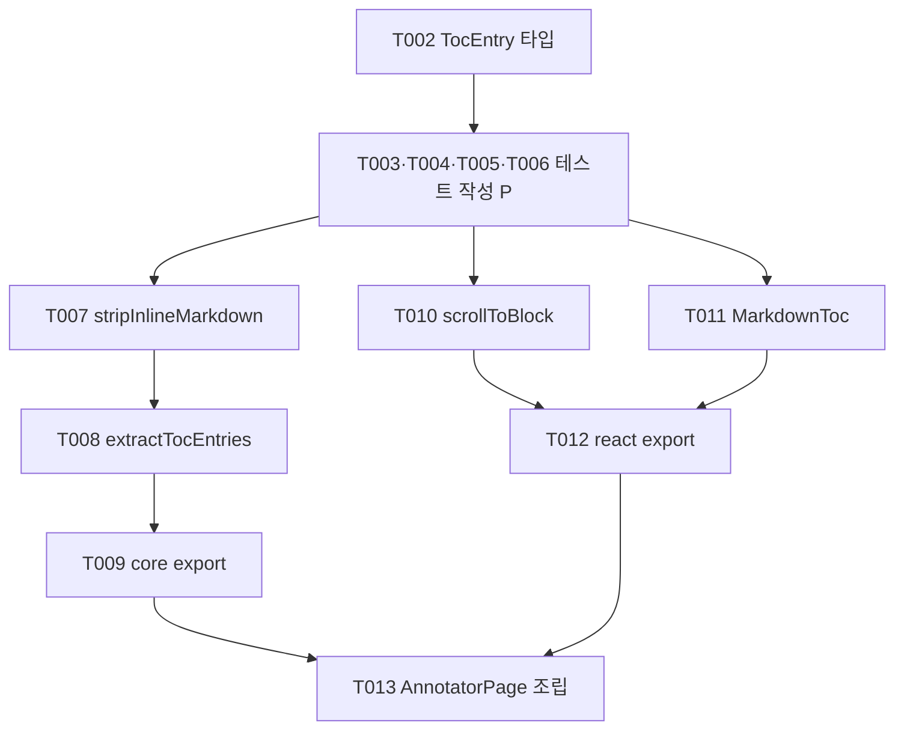

# Tasks: MA markdown viewer heading 기반 Table of Contents

**Input**: Design documents from `/specs/009-ma-heading-toc/`

**Prerequisites**: plan.md, spec.md, research.md, data-model.md, contracts/toc-api.md, quickstart.md

**Tests**: constitution 필수 — 순수 로직(추출/서식 제거)과 공유 패키지 변경은 unit/fixture 테스트가 필수이며, 구현 전에 작성해 실패를 확인한다. 계약 번호(C1~C15)는 [contracts/toc-api.md](./contracts/toc-api.md) 기준.

**Organization**: user story별로 독립 구현·검증 가능하도록 그룹화. US2/US3는 US1이 만든 파일을 소폭 수정하므로 순차 진행을 권장한다.

## Format: `[ID] [P?] [Story] Description`

- **[P]**: 병렬 실행 가능 (다른 파일, 미완료 작업에 대한 의존 없음)
- **[Story]**: US1(TOC 이동), US2(계층 들여쓰기), US3(빈 상태 미표시)

## Path Conventions

- Core(순수 로직): `packages/markdown-annotation-core/src`
- 공유 React UI: `packages/markdown-annotation-react/src`
- 앱: `apps/markdown-annotator/src/{pages,stories}`
- plan.md의 Source Code 구조를 그대로 따른다. 파서(`parse/parse-markdown-to-blocks.ts`)와 `MarkdownViewer.tsx` 본문 렌더링은 수정 금지 (FR-007).

---

## Phase 1: Setup (Shared Infrastructure)

**Purpose**: 기존 모노레포에 신규 프로젝트 초기화는 불필요. 회귀 판정 기준선만 확보한다.

- [X] T001 기준선 확보: `pnpm --filter @yoophi/markdown-annotation-core test && pnpm --filter @yoophi/markdown-annotation-core check-types && pnpm --filter @yoophi/markdown-annotation-react test && pnpm --filter @yoophi/markdown-annotation-react check-types && pnpm --filter markdown-annotator check-types && pnpm --filter markdown-annotator test` 실행이 모두 green임을 확인 (SC-005 회귀 판정 기준)

---

## Phase 2: Foundational (Blocking Prerequisites)

**Purpose**: 모든 user story가 공유하는 `TocEntry` 타입 정의 (data-model.md 참조)

**⚠️ CRITICAL**: 이 phase 완료 전에 user story 작업을 시작할 수 없다

- [X] T002 `TocLevel`(`1 | 2 | 3`)·`TocEntry`(`blockId`, `level`, `text`, `startLine`) 타입을 `packages/markdown-annotation-core/src/types/toc.ts`에 신규 정의하고 `packages/markdown-annotation-core/src/types/index.ts`와 `packages/markdown-annotation-core/src/index.ts`에서 export

**Checkpoint**: 타입 준비 완료 — user story 구현 시작 가능

---

## Phase 3: User Story 1 - TOC로 문서 내 빠른 이동 (Priority: P1) 🎯 MVP

**Goal**: h1~h3 heading이 TOC로 표시되고, 항목 클릭 시 viewer가 해당 heading 블록(블록 id 기반)으로 스크롤 이동한다.

**Independent Test**: h1~h3가 여러 개(동일 텍스트 중복 포함)인 문서를 열어 TOC 표시·순서를 확인하고, 항목 클릭 시 정확한 heading으로 스크롤되는지 확인 (quickstart S1, S2, S4, S8).

### Tests for User Story 1 (constitution 필수 — 먼저 작성, 실패 확인) ⚠️

- [X] T003 [P] [US1] `stripInlineMarkdown` fixture 테스트를 `packages/markdown-annotation-core/src/toc/strip-inline-markdown.test.ts`에 작성 — bold/italic/inline code/strikethrough/링크/이미지/혼합 서식 제거, 서식 없는 텍스트 통과, trim (계약 C5·FR-008)
- [X] T004 [P] [US1] `extractTocEntries` fixture 테스트를 `packages/markdown-annotation-core/src/toc/extract-toc-entries.test.ts`에 작성 — `parseMarkdownToBlocks` 실출력 사용: h1~h3 순서·필드 보존(C1), h4~h6 제외(C2), 동일 텍스트 heading 별도 entry(C4), 빈 입력(C6), 입력 불변(C7), frontmatter 문서의 startLine 보존
- [X] T005 [P] [US1] `MarkdownToc` 마크업 테스트를 `packages/markdown-annotation-react/src/MarkdownToc.test.tsx`에 작성 — 기존 관례대로 `renderToStaticMarkup` 사용: `<nav>` 내부 entry 순서대로 button 렌더(C9), 각 항목 `data-toc-block-id` 노출(C12)
- [X] T006 [P] [US1] `scrollToBlock` 테스트를 `packages/markdown-annotation-react/src/scroll-to-block.test.ts`에 작성 — fake ParentNode(querySelector/scrollIntoView 스텁) 주입: `[data-block-id="<id>"]` 셀렉터와 `block: "start"` 호출·`true` 반환(C13), container null/대상 미존재 시 throw 없이 `false`(C14), behavior 옵션 전달(C15)

### Implementation for User Story 1

- [X] T007 [P] [US1] `stripInlineMarkdown` 순수 함수를 `packages/markdown-annotation-core/src/toc/strip-inline-markdown.ts`에 구현 (research R3: 정규식 기반, 이미지→alt, 링크→text, `**`/`__`/`*`/`_`/`` ` ``/`~~` 제거 후 trim) — T003 통과 확인
- [X] T008 [US1] `extractTocEntries` 순수 함수를 `packages/markdown-annotation-core/src/toc/extract-toc-entries.ts`에 구현 (data-model 파생 규칙: `type === "heading"` && level 1~3 필터, 문서 순서 유지, `text = stripInlineMarkdown(content)`, 입력 불변) — T004 통과 확인 (T007에 의존)
- [X] T009 [US1] `packages/markdown-annotation-core/src/index.ts`에 `extractTocEntries`, `stripInlineMarkdown` export 추가 및 `pnpm --filter @yoophi/markdown-annotation-core test check-types` green 확인
- [X] T010 [P] [US1] `scrollToBlock(container, blockId, options?)` helper를 `packages/markdown-annotation-react/src/scroll-to-block.ts`에 구현 (research R2: `data-block-id` 셀렉터 + `scrollIntoView({ block: "start" })`, behavior 미지정 시 `prefers-reduced-motion: reduce` → `"auto"`, 아니면 `"smooth"`, `matchMedia` 부재 환경 안전 처리) — T006 통과 확인
- [X] T011 [US1] `MarkdownToc` presentational 컴포넌트를 `packages/markdown-annotation-react/src/MarkdownToc.tsx`에 구현 — props `{ entries, onEntrySelect?, className? }`, `<nav>` 안에 entry 순서대로 button 목록 렌더, 클릭 시 `onEntrySelect(entry)`만 호출(스크롤/URL 변경 금지, C11), `data-toc-block-id` 노출, Tailwind 유틸 + `cn`만 사용(앱 shell/Tauri/주입 컴포넌트 비의존) — T005 통과 확인
- [X] T012 [US1] `packages/markdown-annotation-react/src/index.ts`에 `MarkdownToc`, `MarkdownTocProps`, `scrollToBlock`, `ScrollToBlockOptions` export 추가 및 `pnpm --filter @yoophi/markdown-annotation-react test check-types` green 확인
- [X] T013 [US1] `apps/markdown-annotator/src/pages/annotator/AnnotatorPage.tsx`에 TOC 패널 조립 (research R1) — `const tocEntries = useMemo(() => extractTocEntries(blocks), [blocks])`, section grid를 `grid-cols-[auto_minmax(0,1fr)_420px]`로 확장해 문서 pane 좌측에 TOC 열 추가, `isTocOpen` useState 토글 버튼(접이식), TOC 패널 자체 스크롤(`overflow-y-auto`, 본문 ScrollArea와 독립), `onEntrySelect` → `scrollToBlock(documentPaneRef.current, entry.blockId)` 연결, `pnpm --filter markdown-annotator check-types` green 확인

**Checkpoint**: `pnpm --filter markdown-annotator dev`로 quickstart S1(표시·순서), S2(클릭 스크롤), S4(동일 텍스트 중복), S8(서식 제거), S6(접기 토글) 검증 — US1 단독으로 MVP 완결

---

## Phase 4: User Story 2 - 계층 구조 시각화 (Priority: P2)

**Goal**: TOC 항목이 heading level에 따라 들여쓰기된 계층 구조로 표시된다 (h1 < h2 < h3 깊이).

**Independent Test**: h1/h2/h3 혼재 문서와 h3부터 시작하는 문서를 열어 level별 들여쓰기 깊이 차이를 확인 (quickstart S1 들여쓰기 항목).

### Tests for User Story 2 (constitution 필수 — 먼저 작성, 실패 확인) ⚠️

- [X] T014 [US2] `packages/markdown-annotation-react/src/MarkdownToc.test.tsx`에 들여쓰기 마크업 검증 추가 — level 1/2/3 항목이 `(level - 1)` 비례 들여쓰기 속성(클래스 또는 style)으로 구분되는지(C10), h1 없이 h3만 있는 entries도 level 절대값 기준 들여쓰기 유지(research R6)

### Implementation for User Story 2

- [X] T015 [US2] `packages/markdown-annotation-react/src/MarkdownToc.tsx`에 level 기반 들여쓰기 스타일 구현 — `(level - 1) × 단위` 고정 들여쓰기(정규화 없음, R6), 기존 `list-item` 들여쓰기 방식(`marginLeft` 인라인 style, `MarkdownViewer.tsx:361`)과 일관된 기법 사용 — T014 통과 및 `pnpm --filter @yoophi/markdown-annotation-react test check-types` green 확인

**Checkpoint**: US1 + US2 동작 — 들여쓰기로 문서 구조가 시각적으로 구분됨

---

## Phase 5: User Story 3 - heading 없는 문서에서 TOC 미표시 (Priority: P3)

**Goal**: TOC 대상(h1~h3)이 없는 문서에서 TOC 영역(패널·토글 포함)이 전혀 렌더되지 않는다.

**Independent Test**: heading 없는 문서와 h4~h6만 있는 문서를 열어 TOC 열이 렌더되지 않고 본문이 전체 폭을 사용하는지 확인 (quickstart S5).

### Tests for User Story 3 (constitution 필수 — 먼저 작성, 실패 확인) ⚠️

- [X] T016 [P] [US3] `packages/markdown-annotation-core/src/toc/extract-toc-entries.test.ts`에 빈 결과 케이스 추가 — heading이 전혀 없는 문서와 h4~h6만 있는 문서의 `parseMarkdownToBlocks` 출력 → `[]` 반환(C3)
- [X] T017 [US3] `packages/markdown-annotation-react/src/MarkdownToc.test.tsx`에 빈 entries 케이스 추가 — `entries: []`일 때 `renderToStaticMarkup` 결과가 빈 문자열(`null` 반환, C8)인지 검증, 이후 `MarkdownToc.tsx`에 빈 entries → `return null` 구현 반영

### Implementation for User Story 3

- [X] T018 [US3] `apps/markdown-annotator/src/pages/annotator/AnnotatorPage.tsx`에서 `tocEntries.length === 0`이면 TOC 열·토글 버튼을 렌더하지 않고 grid를 기존 2열로 유지 (FR-006) — `pnpm --filter markdown-annotator check-types` green 및 quickstart S5 확인

**Checkpoint**: 모든 user story 독립 동작 — 빈 문서에서 화면 공간 낭비 없음

---

## Phase 6: Polish & Cross-Cutting Concerns

**Purpose**: Storybook 등록(constitution 필수), 전체 회귀 검증, 경계 확인

- [X] T019 [P] `apps/markdown-annotator/src/stories/molecules/MarkdownToc.stories.tsx` 신규 작성 — 기존 `MarkdownViewer.stories.tsx` 관례(`@storybook/react-vite`, `parseMarkdownToBlocks` + `extractTocEntries` 사용) 준수, 상태: 기본(h1~h3 혼재), 긴 목록(자체 스크롤), h3 시작 문서, inline 서식 포함 heading, 빈 entries(미렌더 확인용)
- [X] T020 [P] Atomic Cross-App Verification 실행 — quickstart 1번 명령 세트 전체(`@yoophi/markdown-annotation-core`·`@yoophi/markdown-annotation-react`·`markdown-annotator` 각각 `test` + `check-types`)가 green이고, 특히 기존 `MarkdownViewer`·파서·anchor 테스트가 변경 없이 통과함을 확인 (SC-005)
- [X] T021 quickstart.md 수동 시나리오 S1~S10 전체 검증 (`pnpm --filter markdown-annotator dev` + `pnpm --filter markdown-annotator storybook`) — 특히 S7(TOC 이동 후 annotation 생성 시 line/offset 산출 불변, FR-007)과 S9(heading 100개 이상 성능, SC-001)
- [X] T022 경계 준수 최종 확인 — 앱 간 직접 import 없음, `markdown-annotation-react` 신규 코드가 앱 shell/Tauri/route/persistence에 비의존, `parse-markdown-to-blocks.ts`와 `MarkdownViewer.tsx` 본문 렌더 경로 무변경(diff 확인), `agentic-workbench`/`git-explorer`의 markdown-annotation 패키지 미소비 재확인

---

## Dependencies & Execution Order

### Phase Dependencies

- **Phase 1 (Setup)**: 의존 없음 — 즉시 시작
- **Phase 2 (Foundational)**: T001 이후 — 모든 user story를 블로킹
- **Phase 3 (US1)**: T002 이후
- **Phase 4 (US2)**: T011(MarkdownToc 존재) 이후 — 같은 파일을 수정하므로 US1 완료 후 진행
- **Phase 5 (US3)**: T008(core)·T011(컴포넌트)·T013(앱 레이아웃) 이후 — US1 완료 후 진행
- **Phase 6 (Polish)**: 모든 user story 완료 후

### 스토리 내부 순서 (US1)



### Parallel Opportunities

- **T003, T004, T005, T006**: 서로 다른 4개 테스트 파일 — 동시 작성 가능
- **T007 ↔ T010/T011**: core와 react 구현은 패키지가 달라 병렬 가능 (단 T008은 T007 이후, T011의 테스트 기준은 T005)
- **T016 ↔ T017**: 패키지가 다른 테스트 추가 — 병렬 가능
- **T019 ↔ T020**: 스토리 작성과 자동 검증 — 병렬 가능

## Parallel Example: User Story 1

```bash
# 테스트 4건 동시 작성 (서로 다른 파일):
Task: "T003 strip-inline-markdown.test.ts 작성"
Task: "T004 extract-toc-entries.test.ts 작성"
Task: "T005 MarkdownToc.test.tsx 작성"
Task: "T006 scroll-to-block.test.ts 작성"

# 구현 병렬 (core vs react):
Task: "T007 stripInlineMarkdown 구현"   # 이후 T008 → T009
Task: "T010 scrollToBlock 구현"          # T011과 함께 T012로 수렴
```

---

## Implementation Strategy

### MVP First (User Story 1 Only)

1. Phase 1 (T001) → Phase 2 (T002)
2. Phase 3 (T003~T013) 완료 후 **중단·검증**: quickstart S1/S2/S4/S6/S8
3. 이 시점에 TOC 이동 기능이 완결된 MVP — 데모 가능

### Incremental Delivery

1. US1 → 독립 검증 → MVP
2. US2 (T014~T015) → 들여쓰기 검증 → 증분 배포
3. US3 (T016~T018) → 빈 상태 검증 → 증분 배포
4. Polish (T019~T022) → Storybook 등록 + 전체 회귀 + 경계 확인

### Notes

- 각 task 또는 논리적 그룹 완료 시 commit
- 테스트(T003~T006, T014, T016~T017)는 구현 전 실패를 먼저 확인 (constitution: 순수 로직·공유 패키지 테스트 필수)
- 같은 파일(`MarkdownToc.tsx`, `AnnotatorPage.tsx`)을 여러 스토리가 수정하므로 US2·US3는 US1 완료 후 순차 진행
