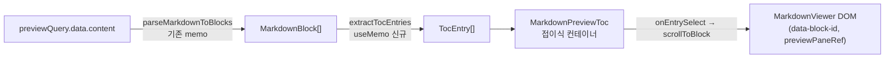

# Data Model: AW workspace markdown preview TOC

**Feature**: 010-aw-preview-toc | **Date**: 2026-07-02

## 개요

신규 데이터 모델 없음. specs/009에서 정의된 `TocEntry`(공유 core)를 그대로 소비하며, AW에는 UI 상태만 추가된다.

## TocEntry (기존 — specs/009, 무변경)

`@yoophi/markdown-annotation-core`의 `TocEntry { blockId, level(1~3), text, startLine }`. 파생 규칙·불변 조건은 [specs/009-ma-heading-toc/data-model.md](../009-ma-heading-toc/data-model.md) 참조.

## 상태 (AW 앱 전용, 비영속)

| 상태 | 위치 | 설명 |
|------|------|------|
| `tocEntries` | `worktree-workspace-panel.tsx` `useMemo` | `extractTocEntries(blocks)` 결과. 기존 `blocks` memo에 연동되어 파일 전환·내용 갱신 시 자동 재계산 (FR-006) |
| `open` (펼침 여부) | `MarkdownPreviewToc` 내부 `useState(defaultOpen ?? false)` | 기본 접힘 (FR-004). 부모가 `key={selectedFilePath}`를 부여해 파일 전환 시 재마운트로 기본 접힘 리셋. 저장하지 않음 |

## 상태 전이

| 현재 | 이벤트 | 다음 |
|------|--------|------|
| 접힘(기본) | 토글 클릭 | 펼침 |
| 펼침 | 토글 클릭 | 접힘 |
| 임의 | 파일 전환 (`selectedFilePath` 변경 → key 재마운트) | 접힘(기본) |
| 펼침 | 문서 내용 자동 새로고침 (`selectedFilePath` 불변) | 펼침 유지, entries만 갱신 |
| 임의 | 새 문서에 h1~h3 없음 (`entries.length === 0`) | 컴포넌트 미렌더 (토글 행 포함) |
