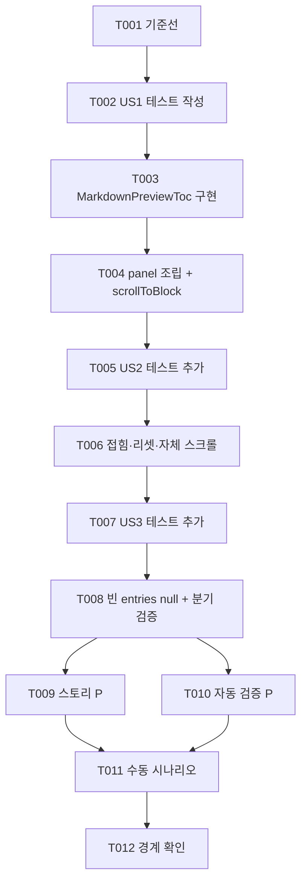

# Tasks: AW workspace markdown preview heading 기반 Table of Contents

**Input**: Design documents from `/specs/010-aw-preview-toc/`

**Prerequisites**: plan.md, spec.md, research.md, data-model.md, contracts/aw-preview-toc-ui.md, quickstart.md

**Tests**: constitution 필수 — 재사용 UI 컴포넌트의 마크업 unit 테스트를 구현 전에 작성해 실패를 확인한다. 조립 계약 번호(A1~A11)는 [contracts/aw-preview-toc-ui.md](./contracts/aw-preview-toc-ui.md) 기준. 공유 패키지 계약(C1~C15)은 specs/009에서 이미 검증되어 재테스트하지 않는다.

**Organization**: user story별 그룹화. US2/US3는 US1이 만든 파일(`markdown-preview-toc.tsx`, panel)을 수정하므로 순차 진행한다.

## Format: `[ID] [P?] [Story] Description`

- **[P]**: 병렬 실행 가능 (다른 파일, 미완료 작업 의존 없음)
- **[Story]**: US1(TOC 이동), US2(밀도 공존·접이식), US3(빈 상태 미표시)

## Path Conventions

- 앱 조립: `apps/agentic-workbench/src/features/worktree-workspace/ui/`
- Storybook: `apps/agentic-workbench/src/stories/molecules.stories.tsx`
- **공유 패키지(`packages/markdown-annotation-*`)와 `MarkdownViewer` 본문 렌더링은 수정 금지** (plan Constraints, A11)

---

## Phase 1: Setup (Shared Infrastructure)

**Purpose**: 신규 인프라 불필요(기존 모노레포). 회귀 판정 기준선만 확보한다.

- [X] T001 기준선 확보: `pnpm install && pnpm --filter agentic-workbench check-types && pnpm --filter agentic-workbench test` 실행이 green임을 확인하고, `git diff --stat main -- packages/`가 비어 있음을 확인 (SC-006 회귀 판정 및 공유 패키지 무변경 기준)

---

## Phase 2: Foundational (Blocking Prerequisites)

**Purpose**: 해당 없음 — 필요한 타입(`TocEntry`)·공유 컴포넌트·helper는 specs/009에서 이미 제공되며(main 머지 완료), 신규 데이터 모델이 없다. 별도 foundational task 없이 Phase 3으로 진행한다.

**Checkpoint**: specs/009 산출물(main 반영)이 곧 기반 — user story 구현 시작 가능

---

## Phase 3: User Story 1 - TOC로 preview 문서 내 빠른 이동 (Priority: P1) 🎯 MVP

**Goal**: workspace preview 상단의 TOC를 펼쳐 항목을 클릭하면 preview가 해당 heading 블록(블록 id 기반)으로 스크롤 이동한다.

**Independent Test**: h1~h3가 여러 개(동일 텍스트 중복 포함)인 markdown 파일을 preview로 열어 TOC를 펼치고, 항목 클릭 시 정확한 heading으로 스크롤되는지 확인 (quickstart S2, S3, S4).

### Tests for User Story 1 (constitution 필수 — 먼저 작성, 실패 확인) ⚠️

- [X] T002 [US1] `MarkdownPreviewToc` 마크업 테스트를 `apps/agentic-workbench/src/features/worktree-workspace/ui/markdown-preview-toc.test.tsx`에 작성 — AW 관례(`renderToStaticMarkup`, jsdom 미사용) 준수: `defaultOpen`일 때 토글 행(`aria-expanded="true"`)과 `<nav>` 내 entry 순서대로 `data-toc-block-id` 렌더(A3), 동일 텍스트 entry가 서로 다른 `data-toc-block-id`로 구분(계약 C4 승계)

### Implementation for User Story 1

- [X] T003 [US1] `MarkdownPreviewToc` 컴포넌트를 `apps/agentic-workbench/src/features/worktree-workspace/ui/markdown-preview-toc.tsx`에 구현 — props `{ entries, onEntrySelect?, defaultOpen?, className? }`(contracts A1~A6 시그니처), 내부 `useState(defaultOpen ?? false)`, 토글 행("Contents" 라벨 + chevron 아이콘 + `aria-expanded`), 펼침 시 공유 `MarkdownToc`에 entries·onEntrySelect 위임, in-flow 렌더(overlay/sticky 금지), shadcn `components/ui`와 `@yoophi/markdown-annotation-react`만 사용(Tauri/query 비의존) — T002 통과 확인
- [X] T004 [US1] `apps/agentic-workbench/src/features/worktree-workspace/ui/worktree-workspace-panel.tsx`에 조립 — `const tocEntries = useMemo(() => extractTocEntries(blocks), [blocks])`(A7), preview 데이터 분기(`previewQuery.data` 존재) 내부의 본문 grid 앞에 `<MarkdownPreviewToc entries={tocEntries} onEntrySelect={(entry) => scrollToBlock(previewPaneRef.current, entry.blockId)} />` 배치(A8, A10), import 추가(`extractTocEntries` from core, `scrollToBlock` from react) — `pnpm --filter agentic-workbench check-types` green 확인

**Checkpoint**: dev 앱에서 quickstart S2(펼침 목록·순서·들여쓰기), S3(클릭 스크롤), S4(동일 텍스트 중복), S12(서식 제거 — 공유 로직) 검증 — US1 단독으로 MVP 완결

---

## Phase 4: User Story 2 - 밀도 높은 workspace 화면과의 공존 (Priority: P2)

**Goal**: TOC는 기본 접힘으로 본문 영역을 침해하지 않고, 파일 전환 시 접힘으로 리셋되며, 긴 목록은 자체 스크롤되고 좁은 폭에서도 겹침/잘림이 없다.

**Independent Test**: 파일을 연 직후 접힘 상태(목록 미렌더) 확인, 펼침↔접힘 토글, 다른 파일 전환 시 접힘 리셋, preview 폭 최소화 후 펼쳐 겹침 없음 확인 (quickstart S1, S7, S9).

### Tests for User Story 2 (constitution 필수 — 먼저 작성, 실패 확인) ⚠️

- [X] T005 [US2] `apps/agentic-workbench/src/features/worktree-workspace/ui/markdown-preview-toc.test.tsx`에 접힘·스크롤 검증 추가 — `defaultOpen` 미지정 시 토글 행만 렌더되고(`aria-expanded="false"`) `<nav>`(TOC 목록)가 렌더되지 않음(A2), 펼침 상태 목록 컨테이너에 max-height·자체 세로 스크롤 속성(클래스) 존재(A3, FR-009)

### Implementation for User Story 2

- [X] T006 [US2] 접힘 동작 완성 — `apps/agentic-workbench/src/features/worktree-workspace/ui/markdown-preview-toc.tsx`에서 기본 접힘(`defaultOpen ?? false`)과 목록 컨테이너 `max-height` + `overflow-y-auto` 적용(T005 통과), `apps/agentic-workbench/src/features/worktree-workspace/ui/worktree-workspace-panel.tsx`에서 `key={selectedFilePath}`로 파일 전환 시 기본 접힘 재마운트(A9, research R3) — `pnpm --filter agentic-workbench check-types test` green 확인

**Checkpoint**: US1 + US2 — 접힘 기본·리셋·자체 스크롤 동작, 본문 영역 침해 없음 (S1, S7, S9)

---

## Phase 5: User Story 3 - heading 없는 문서에서 TOC 미표시 (Priority: P3)

**Goal**: h1~h3가 없는 문서와 로딩/오류/미선택 상태에서 TOC UI(토글 행 포함)가 전혀 렌더되지 않는다.

**Independent Test**: heading 없는 문서·h4~h6만 있는 문서를 열어 토글 행이 나타나지 않는지, 파일 미선택/로딩/오류 상태에서 TOC UI가 없는지 확인 (quickstart S6, S8).

### Tests for User Story 3 (constitution 필수 — 먼저 작성, 실패 확인) ⚠️

- [X] T007 [US3] `apps/agentic-workbench/src/features/worktree-workspace/ui/markdown-preview-toc.test.tsx`에 빈 entries 케이스 추가 — `entries: []`일 때 `renderToStaticMarkup` 결과가 빈 문자열(`null` 반환, 토글 행 포함 미렌더, A1)

### Implementation for User Story 3

- [X] T008 [US3] `apps/agentic-workbench/src/features/worktree-workspace/ui/markdown-preview-toc.tsx`에 `entries.length === 0 → return null` 반영(T007 통과), `worktree-workspace-panel.tsx`에서 TOC가 `previewQuery.data` 분기 내부에만 렌더되어 로딩/오류/미선택 상태에 나타나지 않음을 코드 검증(A8) — `pnpm --filter agentic-workbench test` green 확인

**Checkpoint**: 모든 user story 독립 동작 — 빈 문서·비데이터 상태에서 TOC UI 0건

---

## Phase 6: Polish & Cross-Cutting Concerns

**Purpose**: Storybook 등록(constitution 필수), 전체 검증, 경계 확인

- [X] T009 [P] `apps/agentic-workbench/src/stories/molecules.stories.tsx`에 `MarkdownPreviewToc` 스토리 추가 — AW 관례(atomic 카테고리 단일 파일) 준수, entries는 `parseMarkdownToBlocks` + `extractTocEntries` 실출력 사용, 상태 4종: 접힘(기본)/펼침(`defaultOpen`)/긴 목록(자체 스크롤)/빈 entries(미렌더 확인용)
- [X] T010 [P] 자동 검증 — `pnpm --filter agentic-workbench check-types && pnpm --filter agentic-workbench test` green, `git diff --stat main -- packages/` 출력 없음(공유 패키지 무변경, A11), 기존 annotation·선택 하이라이트 테스트 무변경 통과 (SC-006)
- [X] T011 quickstart.md 수동 시나리오 S1~S12 검증 (`pnpm --filter agentic-workbench dev` + storybook) — 특히 S10(TOC 이동 후 annotation line/offset 산출 불변), S9(최소 폭 360px 부근에서 겹침/잘림 없음), S11(자동 새로고침 시 목차 갱신·펼침 유지)
- [X] T012 경계 준수 최종 확인 — 앱 간 직접 import 없음, `markdown-preview-toc.tsx`가 Tauri API/route/persistence/query에 비의존(presentational), preview header·본문 grid·`MarkdownViewer` props 무변경(diff 확인, A11)

---

## Dependencies & Execution Order

### Phase Dependencies

- **Phase 1 (Setup)**: 의존 없음 — 즉시 시작
- **Phase 2 (Foundational)**: task 없음 (specs/009 main 머지가 기반)
- **Phase 3 (US1)**: T001 이후
- **Phase 4 (US2)**: US1 완료 후 (같은 컴포넌트·panel 파일 수정)
- **Phase 5 (US3)**: US1 완료 후 (같은 파일 수정, US2와도 순차 권장)
- **Phase 6 (Polish)**: 모든 user story 완료 후

### 스토리 내부 순서



### Parallel Opportunities

- 이 기능은 단일 컴포넌트 + 단일 panel 파일 중심이라 스토리 간 병렬 여지가 작다 (US2/US3가 US1 파일을 수정).
- **T009 ↔ T010**: 스토리 작성(stories 파일)과 자동 검증은 파일이 달라 병렬 가능.

## Parallel Example: Polish

```bash
# Polish 단계 병렬 실행:
Task: "T009 molecules.stories.tsx에 MarkdownPreviewToc 스토리 4종 추가"
Task: "T010 AW check-types/test + packages diff 무변경 확인"
```

---

## Implementation Strategy

### MVP First (User Story 1 Only)

1. Phase 1 (T001) → Phase 3 (T002~T004)
2. **중단·검증**: dev 앱에서 S2/S3/S4 — TOC 펼침·클릭 이동이 동작하는 MVP
3. 이 시점 데모 가능 (기본 접힘·빈 상태 처리는 이후 증분)

### Incremental Delivery

1. US1 → 독립 검증 → MVP
2. US2 (T005~T006) → 접힘 기본·리셋·자체 스크롤 검증
3. US3 (T007~T008) → 빈 상태 검증
4. Polish (T009~T012) → Storybook + 전체 검증 + 경계 확인

### Notes

- 각 task 또는 논리적 그룹 완료 시 commit
- 테스트(T002, T005, T007)는 구현 전 실패를 먼저 확인
- 공유 패키지는 절대 수정하지 않는다 — 조립 중 공유 컴포넌트 변경 필요가 발견되면 중단하고 MA 호환 검토 후 별도 결정 (plan Constraints)
