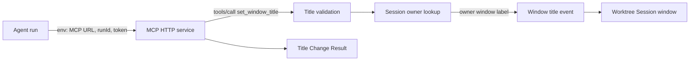

# Data Model: MCP Session Title Control

**Feature**: 011-mcp-session-ui-control | **Date**: 2026-07-06

## 개요

영속 데이터 모델은 추가하지 않는다. 이 기능은 agent run 생명주기 동안만 유효한 runtime control state와 title-change request/result로 구성된다.

## Agent Control Session

하나의 active agent run이 하나의 Worktree Session window를 제어할 수 있음을 나타내는 runtime 관계.

| Field | Type | Description | Validation |
|-------|------|-------------|------------|
| `runId` | string | agent run identity | active registry에 존재해야 함 |
| `ownerWindowLabel` | string | run을 시작한 Worktree Session window label | MCP caller가 직접 제공하지 않음; registry에서만 조회 |
| `mcpTokenScope` | string | MCP request를 허용하는 runtime secret scope | token이 일치해야 request 처리 |
| `status` | `active` \| `finished` \| `cancelled` | run 제어 가능 상태 | `active`일 때만 title 변경 허용 |

### State Transitions

| Current | Event | Next | Notes |
|---------|-------|------|-------|
| none | agent run reserved with owner window | active | `start_agent_run`에서 run id와 owner window 확정 |
| active | valid title-change request | active | window title만 갱신 |
| active | agent run completed | finished | 이후 MCP title request는 실패 |
| active | user closes owner window or cancels run | cancelled | 이후 MCP title request는 실패 |
| finished/cancelled | any MCP title request | unchanged | 실패 result 반환 |

## Title Change Request

agent가 MCP tool call로 제출하는 title 변경 요청.

| Field | Type | Required | Description | Validation |
|-------|------|----------|-------------|------------|
| `runId` | string | yes | title을 변경할 active agent run | active control session과 매칭되어야 함 |
| `title` | string | yes | 표시할 window title | trim 후 non-empty, readable, max length 이하 |

### Title Validation Rules

- leading/trailing whitespace는 제거한다.
- 빈 문자열 또는 whitespace-only title은 invalid.
- 사용자에게 보이지 않는 control character만 포함한 title은 invalid.
- 최대 표시 길이는 80자로 계획한다. 구현에서 truncate를 선택하는 경우 result에 실제 적용 title을 포함해야 한다.
- title은 runtime UI state이며 저장하지 않는다.

## Title Change Result

MCP tool call에 대한 agent-readable 결과.

| Field | Type | Description |
|-------|------|-------------|
| `ok` | boolean | title 변경 적용 여부 |
| `appliedTitle` | string, optional | 실제 표시된 title. 성공일 때 포함 |
| `reason` | string, optional | 실패 또는 정리된 적용의 이유 |
| `code` | string, optional | `unauthorized`, `unknownRun`, `inactiveRun`, `invalidTitle`, `windowUnavailable`, `internalError` 등 |

## MCP Server Runtime State

앱 실행 동안 유지되는 local service state.

| Field | Type | Description | Validation |
|-------|------|-------------|------------|
| `baseUrl` | string | agent에 전달할 local MCP endpoint | localhost address only |
| `serverToken` | string | MCP requests 인증 secret | process runtime에서 생성, logs에 원문 출력 금지 |
| `capabilities` | list | exposed MCP tools | initial implementation은 `set_window_title`만 포함 |

## 불변 조건

- MCP title request는 registry에 없는 run을 생성하지 않는다.
- MCP caller는 window label을 직접 지정할 수 없다.
- `set_window_title` 외 tool은 tools/list에 나타나지 않고 tools/call에서도 성공하지 않는다.
- title 변경은 agent conversation, permission state, workspace selected tab/file state를 변경하지 않는다.
