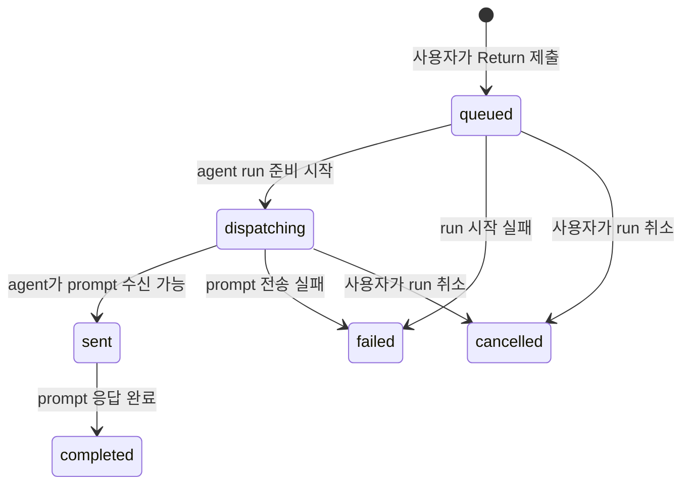

# Data Model: Queue Prompt Order

## First Submitted Prompt

첫 agent 세션이 준비되기 전에 사용자가 Return으로 제출한 프롬프트.

### Fields

- `id`: UI queue에서 항목을 구분하는 고유 값
- `text`: 사용자가 입력한 trimmed prompt 본문
- `runId`: 이 prompt가 연결될 agent run ID
- `state`: `queued` | `dispatching` | `sent` | `completed` | `failed` | `cancelled`
- `createdAt`: UI 정렬과 디버깅을 위한 생성 시각

### Validation Rules

- `text`는 빈 문자열이 아니어야 한다.
- `runId`는 현재 활성화하려는 run과 일치해야 한다.
- 같은 `id`의 prompt는 queue와 실행 timeline에 동시에 중복 user message로 표시되지 않아야 한다.

### State Transitions

## Queued Prompt

agent가 아직 처리하지 않은 대기 prompt. 최초 실행 prompt와 실행 중 추가 prompt가 같은 사용자 인식 규칙을 따른다.

### Fields

- `id`: queue 항목 ID
- `text`: prompt 본문
- `position`: queue 내 순서
- `source`: `first-run` | `manual-queue` | `saved-prompt` | `external-request`

### Relationships

- 하나의 Agent Run Timeline은 0개 이상의 Queued Prompt를 표시할 수 있다.
- First Submitted Prompt는 처음에는 Queued Prompt로 표현된다.

### Validation Rules

- queue 내 순서는 제출 순서를 기본으로 한다.
- 사용자가 이동/삭제/편집한 queue 항목은 현재 run에만 적용된다.
- 빈 prompt는 queue에 추가하지 않는다.

## Agent Run Timeline

agent 실행 메시지, queue 표시, prompt 실행 상태, prompt 출력이 보이는 순서형 화면 모델.

### Fields

- `runId`: timeline이 속한 agent run
- `items`: agent lifecycle, user-visible prompt execution, agent output, error 등 표시 항목
- `queuedPrompts`: 아직 timeline 실행 항목으로 확정되지 않은 prompt 목록
- `activePromptId`: 현재 실행 중인 prompt ID 또는 없음

### Ordering Rules

1. 첫 prompt 제출 직후에는 `queuedPrompts`에 먼저 표시한다.
2. agent 실행/준비 lifecycle 항목은 첫 prompt가 실행 완료된 것처럼 보이기 전에 표시될 수 있다.
3. agent가 prompt를 처리할 준비가 되면 해당 queue 항목을 실행 상태로 전환한다.
4. prompt output은 해당 prompt 실행 상태 이후에만 표시한다.
5. 같은 prompt text가 queue와 executed user message로 중복 표시되지 않도록 한다.

## Prompt Output

agent가 prompt 처리 후 생성한 출력.

### Fields

- `runId`: 출력이 속한 run
- `promptId`: 연결 가능한 경우 응답 대상 prompt
- `text`: 출력 본문
- `status`: streaming | completed | failed

### Validation Rules

- output은 연결된 prompt가 `sent` 또는 이후 상태일 때만 사용자에게 prompt 결과로 인식되어야 한다.
- run 실패나 취소 시 output 없이 queue 상태가 성공처럼 표시되면 안 된다.
