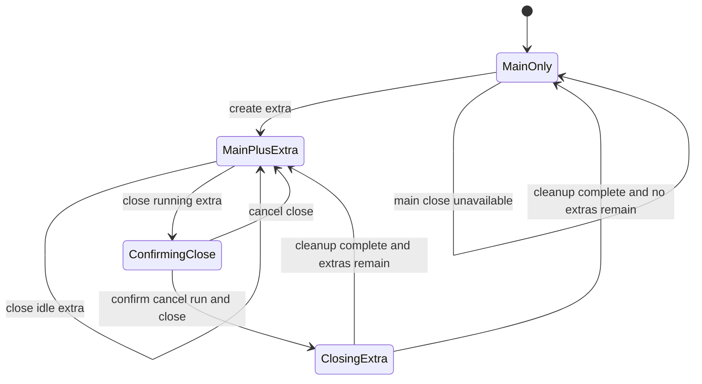

# Data Model: Main and Extra Agent Run Panels

## AgentRunPanelKind

Represents whether a panel is the required main panel or a user-created extra panel.

**Values**

- `main`: Required panel. Cannot be closed. Owns goal continuation and persisted settings.
- `extra`: Optional panel. Can be closed. Uses panel-local settings and manual prompt execution.

## AgentRunPanelSlot

Represents one visible agent panel tab in a Worktree Session.

**Fields**

- `id`: Stable panel id within the current Worktree Session. `main-agent-run` for main; generated unique ids for extra panels.
- `kind`: `AgentRunPanelKind`.
- `title`: User-visible tab title such as `Main`, `Extra 1`, `Extra 2`.
- `externalPromptRequest`: Latest workspace or annotation prompt request routed to this panel, or null.
- `isRunning`: Whether this panel currently owns an active run.
- `activeRunId`: The active run id reported by the panel, or null.
- `closeState`: `open`, `confirmingClose`, or `closing`.

**Validation rules**

- Exactly one slot must have `kind = main`.
- The main slot must always exist and must not enter `confirmingClose` or `closing`.
- Extra slot ids must be unique within the session.
- `isRunning = false` requires `activeRunId = null`.
- `closing` extra slots must not accept new routed prompt requests.

## WorktreeAgentRunAreaState

Represents the tabbed agent area for one Worktree Session.

**Fields**

- `slots`: Ordered list of panel slots. Main is always first.
- `activePanelId`: Slot id for the visible panel.
- `nextExtraSequence`: Monotonic counter for default extra titles.
- `lastPromptTarget`: Optional target-panel feedback after routing an annotation prompt.
- `concurrentRunWarningVisible`: Whether multiple running panels should warn about same-worktree conflict risk.

**Validation rules**

- `activePanelId` must reference an existing slot.
- Removing an active extra slot must select the next extra slot if available, otherwise the main slot.
- Creating an extra slot increments `nextExtraSequence` and activates the new slot.
- Annotation prompt routing targets `activePanelId` unless the active slot is closing; closing slots must be skipped with user-visible feedback.

## AgentPanelRunState

Panel-to-parent report of execution state.

**Fields**

- `panelId`: Reporting panel id.
- `isRunning`: Current running state.
- `activeRunId`: Current active run id, or null.

**Validation rules**

- Reports for unknown panel ids are ignored.
- A report with `isRunning = false` clears `activeRunId`.
- Late reports for removed extra panels are ignored.

## AgentPromptRequest

Represents a prompt routed to a specific panel.

**Fields**

- `id`: Unique request id.
- `text`: Trimmed prompt text.
- `source`: `workspace-annotation`, `manual`, or existing source value when available.
- `targetPanelId`: Panel id selected by the routing layer.

**Validation rules**

- Empty prompt text must not create a request.
- Request ids must change for repeated identical prompt text so the target panel can process each send.
- Requests must not be routed to missing or closing panels.

## ExtraPanelCloseRequest

Represents a user's attempt to close an extra panel.

**Fields**

- `panelId`: Extra panel id.
- `activeRunId`: Active run id at the time close is confirmed, or null.
- `requestedAt`: UI timestamp for race handling and diagnostics.
- `decision`: `cancelClose` or `cancelRunAndClose`.

**Validation rules**

- Main panel cannot create an `ExtraPanelCloseRequest`.
- `cancelClose` leaves the slot and run state unchanged.
- `cancelRunAndClose` must cancel active run before final removal when `activeRunId` exists.
- Cleanup must be idempotent if run completion and close confirmation happen in either order.

## State Transitions

## Backend Run Cleanup Relationship

- `activeRunId` maps to the existing backend run identity.
- Closing an active extra panel calls the existing cancel run capability for that run id.
- Backend registry cleanup must remove run ownership and permission state for the run.
- Frontend unmount cleanup must remove panel-local queue, prompt input, pending permission dialog, and event listener callback.
