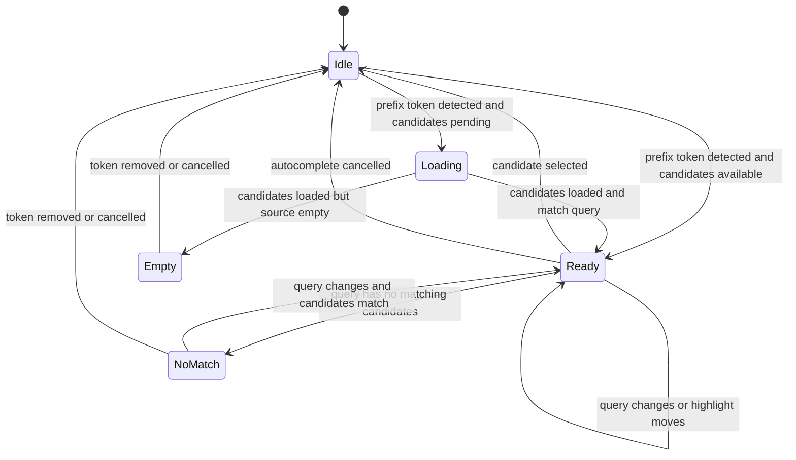

# Data Model: ACP Tool List 기반 Prompt Command 자동완성

## Prompt Draft

사용자가 현재 작성 중인 prompt 텍스트와 커서 위치를 나타낸다.

**Fields**:

- `text`: 전체 prompt draft 문자열
- `cursorStart`: 선택 영역 시작 위치
- `cursorEnd`: 선택 영역 끝 위치
- `inputMode`: `prompt` 또는 다른 입력 모드

**Validation rules**:

- 자동완성은 `inputMode`가 일반 prompt 작성 모드일 때만 후보 삽입을 수행한다.
- `cursorStart`와 `cursorEnd`는 `text` 범위 안에 있어야 한다.

## Autocomplete Trigger Token

현재 커서 주변에서 자동완성 후보 표시를 유발하는 token이다.

**Fields**:

- `prefix`: `$` 또는 `/`
- `query`: prefix 뒤에 입력된 검색 문자열
- `start`: prompt draft 안에서 token이 시작되는 위치
- `end`: prompt draft 안에서 token이 끝나는 위치

**Validation rules**:

- `prefix`는 `$` 또는 `/`만 허용한다.
- token은 현재 커서가 포함된 연속 문자열 기준으로 계산한다.
- 공백 또는 줄 경계를 만나면 token 범위가 끝난다.
- query가 비어 있어도 후보 목록을 열 수 있다.

## Tool/Command Candidate

prompt에 삽입 가능한 agent tool 또는 command 후보이다.

**Fields**:

- `id`: 후보를 안정적으로 구분하는 값
- `name`: 사용자에게 표시되는 tool/command 이름
- `description`: 사용자에게 표시되는 짧은 설명
- `insertText`: 선택 시 prompt에 삽입되는 token 문자열
- `source`: 후보 출처. 예: current session tool, app command, future extension
- `scope`: 후보가 유효한 session/run/worktree 범위

**Validation rules**:

- `name`은 비어 있으면 안 된다.
- `insertText`는 비어 있으면 안 되며 선택 시 실행성 동작을 포함하면 안 된다.
- 같은 `name`이 여러 개 있으면 `source` 또는 scope 표시로 구분 가능해야 한다.
- 설명이 비어 있는 후보도 표시 가능해야 한다.

## Autocomplete Selection State

현재 자동완성 UI의 열림/닫힘, 후보 목록, 선택 항목을 나타낸다.

**Fields**:

- `open`: 후보 목록 표시 여부
- `trigger`: 현재 trigger token 또는 없음
- `candidates`: 현재 표시 후보 목록
- `highlightedIndex`: 키보드로 강조된 후보 위치
- `status`: `idle`, `loading`, `ready`, `empty`, `noMatch`, `error`

**Validation rules**:

- `open`이 `false`이면 선택 확정은 아무 동작도 하지 않는다.
- `highlightedIndex`는 candidates 범위 안에 있어야 한다.
- `loading`, `empty`, `noMatch`, `error` 상태에서도 prompt draft 입력은 계속 가능해야 한다.

## State Transitions

## Relationships

- `Prompt Draft` owns the text that `Autocomplete Trigger Token` is derived from.
- `Autocomplete Trigger Token` filters `Tool/Command Candidate` records into visible candidates.
- `Autocomplete Selection State` references the current trigger and visible candidate list.
- Candidate `scope` must match the current prompt composer session/run context before display.
