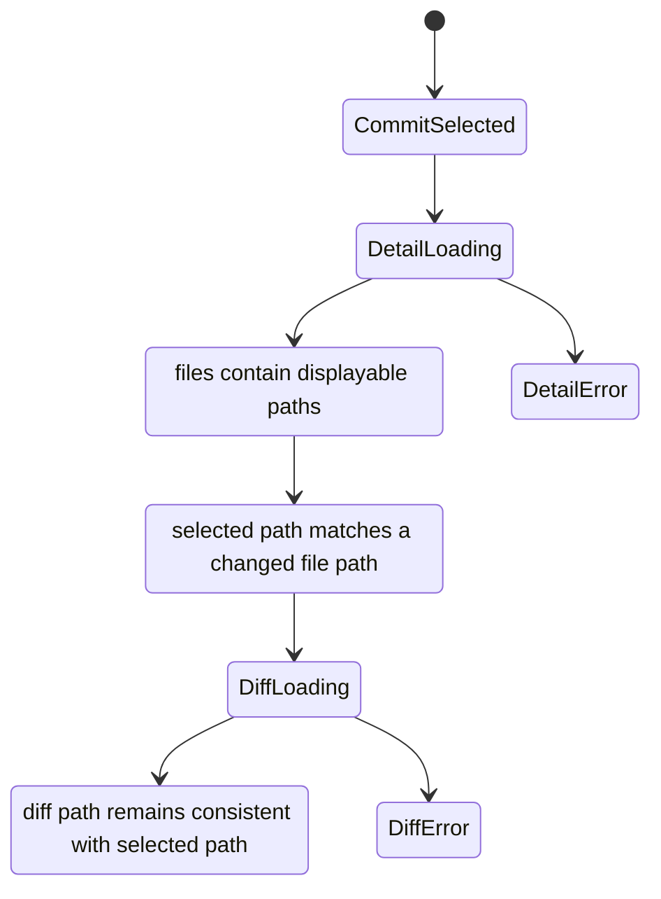

# Data Model: AW Git Commit 상세 한글 파일명 표시 수정

## Commit Detail

**Purpose**: 사용자가 선택한 Git commit의 메타데이터와 변경 파일 목록을 나타낸다.

**Fields**:

- `hash`: commit 식별자.
- `message`: commit 메시지.
- `author`: commit 작성자.
- `date`: commit 날짜.
- `files`: `Changed File Entry` 목록.

**Relationships**:

- 하나의 `Commit Detail`은 0개 이상의 `Changed File Entry`를 가진다.
- AW의 선택 상태는 `files[*].path` 중 하나를 선택된 diff 요청 경로로 사용한다.

**Validation Rules**:

- `files[*].path`는 사용자가 읽을 수 있는 표시 가능한 파일 경로여야 한다.
- `files[*].path`는 `\\355\\202\\244` 같은 백슬래시+8진수 바이트 표기를 포함하면 안 된다.

## Changed File Entry

**Purpose**: commit에서 변경된 하나의 파일을 나타낸다.

**Fields**:

- `path`: 사용자에게 표시되고 diff 요청에도 사용되는 파일 경로.
- `status`: Git 변경 상태. 예: added, modified, deleted, renamed를 구분할 수 있는 상태 코드 또는 상태 문자열.
- `oldPath`: rename/delete-create 표현이 확장되는 경우의 이전 경로. 현재 공개 타입에는 없을 수 있으므로 구현 단계에서 기존 타입의 표현 한계를 확인한다.

**Relationships**:

- `Commit Detail.files`에 포함된다.
- `Commit Detail View`의 tree/list row로 표시된다.
- 선택되면 `Git File Diff` 요청의 `path` 입력으로 전달된다.

**Validation Rules**:

- `path`는 정상 한글, ASCII, 공백, 괄호, 점, 하이픈, 밑줄, 숫자를 손상 없이 보존해야 한다.
- `path`가 이미 정상 UTF-8 한글이면 중복 변환으로 깨지면 안 된다.
- rename 입력에 이전/새 경로가 모두 존재하면 노출되는 경로는 최소한 새 경로를 읽을 수 있어야 하며, 도메인이 이전 경로를 표현하는 경우 이전 경로도 같은 규칙을 만족해야 한다.

## Display File Path

**Purpose**: 사용자 UI와 테스트에서 검증하는 사람이 읽을 수 있는 파일 경로 문자열이다.

**Fields**:

- `value`: 표시 가능한 경로 문자열.
- `sourceForm`: 테스트/분석용 구분. 예: normal UTF-8, quoted octal, mixed ASCII/Korean.

**Relationships**:

- `Changed File Entry.path`의 표시 계약이다.
- `CommitDetailView`의 folder row, file row, list row, title, selected file path와 연결된다.

**Validation Rules**:

- 표시 값에는 백슬래시+3자리 8진수 바이트 시퀀스가 남아 있으면 안 된다.
- 한글이 아닌 기존 경로는 값이 의미상 동일하게 유지되어야 한다.
- 긴 경로는 UI 레이아웃 정책에 따라 truncate 또는 wrap될 수 있으나, 다른 UI 요소와 겹치면 안 된다.

## Git File Diff

**Purpose**: 선택된 파일의 diff 내용을 나타낸다.

**Fields**:

- `commitHash`: diff가 속한 commit.
- `path`: diff 요청과 표시가 연결되는 파일 경로.
- `content`: diff 본문.
- `isBinary`: binary diff 여부.
- `isTruncated`: 표시 한도 초과 여부.

**Validation Rules**:

- `path`는 선택된 `Changed File Entry.path`와 같은 파일을 가리켜야 한다.
- diff header에 파일 경로가 표시되는 경우 한글 경로가 octal byte 표기로 노출되지 않아야 한다.

## State Transitions

