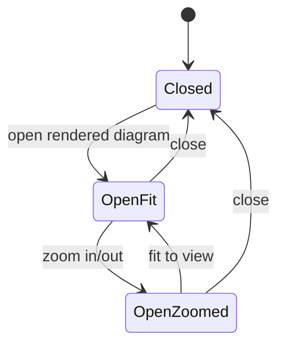

# Data Model: Mermaid Chart Expanded Modal for Markdown Preview

## MermaidDiagramView

Represents one rendered Mermaid diagram in a Markdown display surface.

**Fields**:

- `blockId`: Stable diagram block identity within the current rendered document or message.
- `source`: Mermaid source text used to render the diagram.
- `status`: One of `loading`, `rendered`, or `failed`.
- `failure`: Optional render failure category and readable reason when `status` is `failed`.
- `fit`: Whether the diagram should fill a constrained expanded viewport.

**Validation Rules**:

- `source.trim()` must be non-empty before a diagram can become expandable.
- Expand controls are valid only when `status` is `rendered`.
- `blockId` plus source hash must produce a unique render target for concurrent diagrams.

**Relationships**:

- Belongs to one `MarkdownPreviewContext` or AW agent-run Markdown message.
- Can open one `MermaidExpandedViewState` while selected.

## MermaidExpandedViewState

Represents the transient modal state for one selected rendered Mermaid diagram.

**Fields**:

- `open`: Whether the expanded modal is visible.
- `blockId`: Selected diagram block identity.
- `source`: Selected diagram source at the time of opening or latest debounced render payload.
- `zoom`: Current zoom ratio, defaulting to fit.
- `zoomPercent`: Display and sizing value derived from `zoom`.

**Validation Rules**:

- `open` may be true only for a rendered `MermaidDiagramView`.
- `zoom` must stay within the allowed min/max bounds.
- Opening the modal resets zoom to the fit value.
- Closing the modal must not mutate document content, preview selection, file choice, or panel state.

**State Transitions**:

## MarkdownPreviewContext

Represents the host surface that renders Markdown and owns document interaction state.

**Fields**:

- `surface`: `ma-preview`, `aw-worktree-preview`, or `aw-agent-run`.
- `blocks`: Current parsed Markdown blocks or streamed Markdown content.
- `scrollPosition`: Existing view position that should remain stable when modal opens/closes.
- `selectionState`: Existing text selection or annotation state for MA/AW preview surfaces.
- `reloadVersion`: Current document reload or file-switch version when applicable.

**Validation Rules**:

- Opening or closing the expanded modal must not clear selection state unless the browser naturally clears active text selection on dialog focus.
- File switch or reload must update future expanded views to use the latest `blocks` and `source`.
- Agent-run and markdown preview surfaces must keep independent modal and scroll state.

## MermaidExpandedViewComponents

Represents app-provided UI primitives injected into the shared expanded-view contract.

**Fields**:

- `Button`: App button primitive.
- `Tooltip`: App tooltip adapter.
- `DialogRoot`: App dialog state/root adapter or equivalent shell.
- `DialogTrigger`: App dialog trigger adapter.
- `DialogContent`: App large content shell adapter.
- `DialogHeader`, `DialogTitle`, `DialogDescription`: App accessible dialog labeling primitives.

**Validation Rules**:

- Components must satisfy the shared package contract without importing another app.
- Dialog content must support viewport-sized layout and local overflow.
- Trigger must expose an accessible label and tooltip text.

## RenderFallbackState

Represents an empty or failed Mermaid block shown inline instead of a diagram.

**Fields**:

- `category`: `empty-source`, `syntax-or-parse-error`, or `renderer-runtime-error`.
- `reason`: Human-readable failure reason.
- `source`: Original Mermaid source for inspection.

**Validation Rules**:

- Fallback state must remain block-local.
- Fallback state must not expose expanded diagram controls.
- Ordinary non-Mermaid code blocks must never become `RenderFallbackState`; they remain ordinary code blocks.
