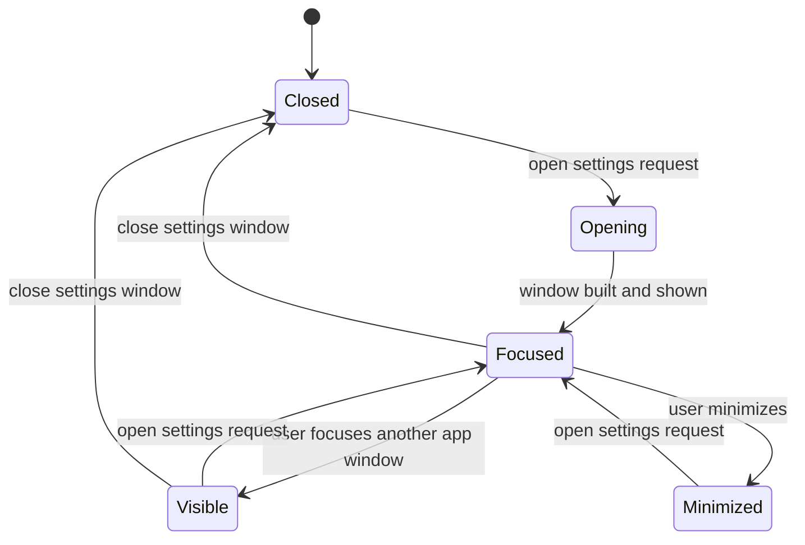

# Data Model: 설정 별도 창과 단축어 실행

## SettingsWindow

앱 설정을 표시하고 편집하는 전용 Tauri 창을 나타낸다.

**Fields**:

- `label`: 창 식별자. 고정값 `settings`.
- `route`: 설정 창이 로드하는 앱 route. 예: `/settings-window`.
- `title`: 사용자에게 표시되는 창 제목. 예: `Settings`.
- `state`: `closed`, `opening`, `visible`, `focused`, `minimized` 중 하나.
- `size`: 설정 창 기본/최소 크기.

**Validation Rules**:

- `label`은 앱 전체에서 하나만 존재해야 한다.
- 설정 열기 요청 시 같은 `label`의 창이 있으면 새 창을 만들지 않고 기존 창을 표시/포커스해야 한다.
- `label`은 `session-` prefix를 사용하면 안 된다.
- route는 설정 화면만 렌더링해야 하며 메인 작업 route로 navigation side effect를 만들면 안 된다.

**State Transitions**:

## SettingsEntryPoint

사용자가 설정 창을 여는 진입점을 나타낸다.

**Fields**:

- `kind`: `native-menu`, `keyboard-shortcut`, `toolbar-button`, `error-action`.
- `label`: 사용자가 보는 이름 또는 접근성 이름.
- `accelerator`: 단축어가 있는 경우 `Cmd+,`.
- `sourceWindow`: 요청이 발생한 창. 메인 창 또는 세션 창일 수 있다.
- `result`: `opened`, `focused-existing`, `failed`.

**Validation Rules**:

- 모든 진입점은 동일한 settings-window open 동작으로 수렴해야 한다.
- `keyboard-shortcut`은 텍스트 입력 중에도 설정 열기 동작을 우선해야 한다.
- 기존 설정 진입점은 route 이동이 아니라 별도 창 열기 결과를 제공해야 한다.
- 실패 시 사용자에게 오류를 표시하거나 command error를 호출자에게 반환해야 한다.

## SettingsPageContext

설정 페이지가 어떤 창 맥락에서 렌더링되는지 나타낸다.

**Fields**:

- `mode`: `window` 또는 `embedded-legacy`.
- `showBackAction`: 뒤로 가기 버튼 표시 여부.
- `showCloseAction`: 설정 창 닫기 버튼 표시 여부.
- `queryKey`: 설정 조회/저장에 사용하는 기존 key.
- `loadState`: `loading`, `ready`, `error`.
- `saveState`: `idle`, `saving`, `saved`, `error`.

**Validation Rules**:

- 별도 창 모드에서는 메인 route로 돌아가는 `returnTo` navigation에 의존하지 않는다.
- 설정 저장은 기존 `queryKey`와 저장 의미를 유지해야 한다.
- 저장 실패는 페이지 안에서 복구 가능한 오류로 표시되어야 한다.
- 설정 항목은 기존 embedded 화면과 동일한 의미, 기본값, validation을 유지해야 한다.

## AppWindowState

설정 창을 열 때 보존되어야 하는 메인/세션 창의 사용자 작업 상태를 나타낸다.

**Fields**:

- `windowLabel`: 메인 창 또는 세션 창 label.
- `route`: 현재 route와 query string.
- `selectedPanel`: 현재 선택된 작업 패널.
- `draftInput`: 입력 중인 prompt 또는 폼 값.
- `activeRunId`: 진행 중인 agent run이 있는 경우 해당 id.

**Validation Rules**:

- 설정 창 열기/포커스/닫기 동작은 `route`, `selectedPanel`, `draftInput`, `activeRunId`를 초기화하지 않아야 한다.
- 설정 창 닫기는 agent run cancel, watcher stop, permission response 상태 변경을 유발하면 안 된다.
- 설정 저장 후 필요한 query invalidation은 설정을 소비하는 화면에서 기존 방식으로 반영되어야 한다.
