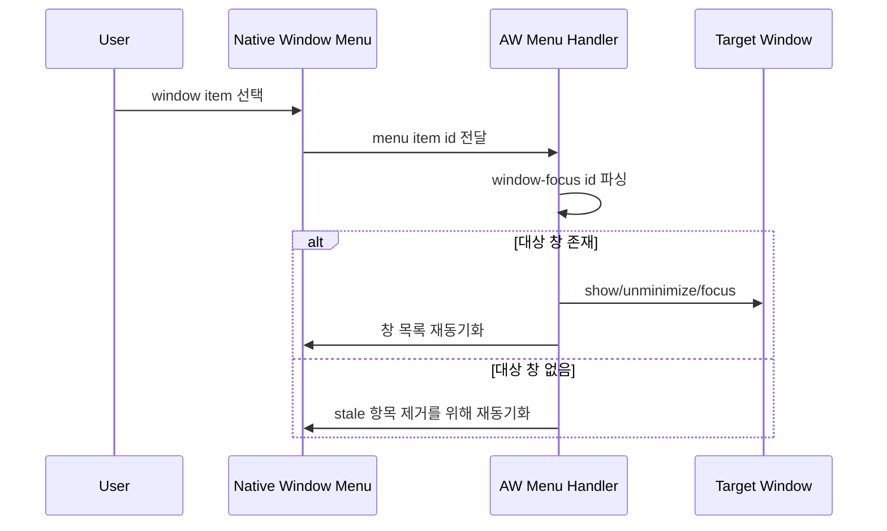

# Contract: Native Window Menu

## Purpose

AW native `Window` 메뉴가 열린 창 목록을 표시하고 선택한 창으로 전환하는 사용자-visible contract를 정의한다.

## Menu Structure

```text
Window
├── Minimize
├── Maximize
├── Close Window
├── ─────────────
├── <AW window title 1>
├── <AW window title 2>
└── <AW window title N>
```

플랫폼의 표준 메뉴 항목 순서가 다를 수 있으나, AW 창 목록은 표준 항목과 구분되고 선택 가능한 항목으로 표시되어야 한다.

## Menu Item ID Contract

```text
window-focus:<target-window-label>
```

Rules:

- `window-focus:` prefix는 AW 창 전환 항목에만 사용한다.
- `<target-window-label>`은 현재 앱 인스턴스의 Tauri window label이다.
- 알 수 없는 prefix는 이 feature의 창 전환 handler가 처리하지 않는다.
- label이 비어 있거나 대상 window가 없으면 선택 동작은 앱 오류로 이어지지 않고 메뉴 상태 sync로 종료한다.

## Selection Behavior



## Acceptance Contract

- 창이 1개 이상 열려 있으면 각 열린 AW 창은 메뉴 항목으로 표시된다.
- 메뉴 항목 label은 최신 window title과 일치해야 한다.
- 같은 label의 메뉴 항목이 여러 개 있어도 선택한 항목은 대응하는 target window로 전환되어야 한다.
- 닫힌 창 target 선택은 사용자-visible crash, panic, blocking dialog 없이 처리되어야 한다.
- macOS 표준 `Window` 메뉴 항목과 keyboard/system behavior를 제거하거나 대체하지 않아야 한다.
