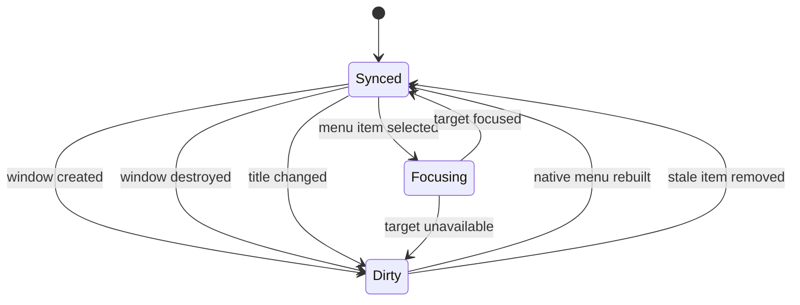

# Data Model: AW Window Menu List

## Entity: AW Window

**Description**: 현재 실행 중인 AW 앱 인스턴스가 소유한 native window다.

**Fields**:

- `label`: Tauri window label. 메뉴 항목 대상 식별자로 사용한다.
- `title`: 현재 window title. 메뉴 표시 이름의 1차 source다.
- `kind`: `main`, `settings`, `session`, `other` 중 하나. label prefix 또는 고정 label로 분류한다.
- `is_available`: window handle이 현재 유효한지 나타낸다.
- `is_minimized`: 전환 전 unminimize가 필요한지 나타낸다.

**Validation Rules**:

- `label`은 비어 있으면 안 된다.
- `title`은 표시 전 trim하고, 비어 있으면 fallback title을 사용한다.
- control character가 포함된 title은 표시용 fallback으로 대체한다.
- session 창 label은 `session-` prefix를 가진다.

## Entity: Window Menu Item

**Description**: native `Window` 메뉴에서 하나의 AW window를 나타내는 선택 항목이다.

**Fields**:

- `id`: `window-focus:<label>` 형식의 stable menu item id.
- `label`: 사용자에게 보이는 창 제목.
- `target_window_label`: 선택 시 전환할 AW window label.
- `enabled`: 대상 창이 선택 가능한지 여부.

**Validation Rules**:

- `id`는 `window-focus:` namespace로 시작해야 한다.
- `target_window_label`은 비어 있으면 안 된다.
- 같은 `label`이 여러 개여도 `id`와 `target_window_label`은 서로 달라야 한다.

## Entity: Window Menu State

**Description**: native `Window` submenu에 반영할 현재 메뉴 상태다.

**Fields**:

- `standard_items`: minimize, maximize, close 등 OS 표준 창 메뉴 항목.
- `window_items`: 현재 열린 AW window에서 생성한 `Window Menu Item` 목록.
- `last_synced_at`: 진단/테스트용 마지막 sync 시점.

**Relationships**:

- 하나의 `Window Menu State`는 여러 `Window Menu Item`을 가진다.
- 각 `Window Menu Item`은 정확히 하나의 `AW Window`를 target으로 삼는다.

## State Transitions

## Derived Rules

- 메뉴 항목 순서는 현재 앱이 제공하는 window snapshot의 안정적 순서를 따르되, 같은 snapshot에서 반복 sync해도 같은 순서가 유지되어야 한다.
- settings/main/session 창이 모두 표시 대상이면 label 기준 target은 구분하되 사용자가 읽는 제목은 각 창의 current title을 사용한다.
- stale menu item 선택은 실패 상태로 남기지 않고 다음 sync에서 제거한다.
