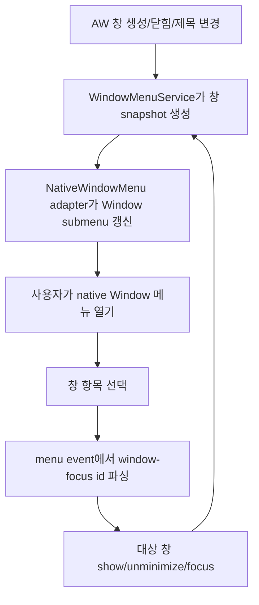

# Implementation Plan: AW Window Menu List

**Branch**: `worktree-18c04f9e7fe8a6e8` | **Date**: 2026-07-08 | **Spec**: [spec.md](./spec.md)

**Input**: Feature specification from `/specs/018-aw-window-menu-list/spec.md`

## Summary

AW의 native `Window` 메뉴에 현재 열린 AW 창 목록을 표시하고, 메뉴 항목 선택으로 대상 창을 전면 이동/포커스한다. 구현은 `apps/agentic-workbench`의 Tauri backend 안에서 창 목록을 수집하고 메뉴를 갱신하는 전용 application/infrastructure 경로를 추가하며, 기존 창 생성/닫힘/제목 변경 흐름에서 동기화를 호출하는 방식으로 진행한다. 화면 UI나 cross-app shared package는 만들지 않는다.

## Technical Context

**Language/Version**: Rust 2024 edition for Tauri backend, TypeScript 5.6/React 19 only if the existing title event path needs a narrow adjustment

**Primary Dependencies**: Tauri 2 native menu/window APIs, existing `tauri-plugin-dialog`, existing `objc2-app-kit` macOS dependency only if native focus behavior needs platform-specific coverage

**Storage**: N/A. 창 목록은 현재 앱 인스턴스의 runtime window state에서 파생하며 영구 저장하지 않는다.

**Testing**: Rust unit tests for pure menu item/state helpers, `cargo test --manifest-path apps/agentic-workbench/src-tauri/Cargo.toml`, `pnpm --dir apps/agentic-workbench check-types`, `pnpm --dir apps/agentic-workbench test`; native menu behavior는 Tauri dev app에서 수동 검증

**Target Platform**: Desktop app, primary validation on macOS native menu; non-macOS platforms must not regress existing menu behavior

**Project Type**: Tauri desktop app

**Performance Goals**: 창 생성/닫힘/제목 변경 후 다음 native `Window` 메뉴 열기 전까지 목록이 갱신되고, 10개 이하 창 목록 갱신이 사용자에게 지연으로 느껴지지 않아야 한다.

**Constraints**: 메뉴 항목 ID는 안정적이고 충돌 없어야 한다. 닫힌 창 선택, 같은 제목 창, 최소화된 창, macOS 표준 `Window` 메뉴 항목과 충돌하지 않아야 한다.

**Scale/Scope**: `apps/agentic-workbench`의 열린 main/settings/session 창 목록. 새 창 생성 명령, 창 정렬, cross-app window switcher는 범위 밖이다.

## Constitution Check

*GATE: Must pass before Phase 0 research. Re-check after Phase 1 design.*

- **Monorepo Boundary First**: PASS. 변경 범위는 `apps/agentic-workbench` 내부 Tauri backend와 필요 시 기존 AW frontend title path에 한정한다. app-to-app import나 새 shared package가 없다.
- **Feature-Sliced Frontend Architecture**: PASS. 화면 UI 변경은 계획하지 않는다. frontend 변경이 필요해도 기존 `apps/agentic-workbench/src/app/App.tsx`의 window title synchronization effect 또는 `entities/project` title helper에 한정한다.
- **Hexagonal Tauri Backend Architecture**: PASS. 순수 창 메뉴 모델/정책은 `domain`, 메뉴 갱신 orchestration은 `application`, Tauri menu/window adapter는 `infrastructure`, 앱 lifecycle hook 연결은 inbound/bootstrap 경계에서 처리한다.
- **Shared Core Before Shared UI**: N/A. AW 전용 native menu 동작이며 공유 UI나 공유 core 추출 요구가 없다.
- **Atomic Cross-App Verification**: N/A. `packages/*`나 `crates/*` 변경이 없다.
- **Documentation and Storybook**: PASS. 화면 컴포넌트가 없으므로 Storybook은 필요하지 않다. native menu 검증 절차는 `quickstart.md`에 문서화한다.
- **Testing and Safety**: PASS. 순수 menu state helper는 Rust unit test로 검증하고, 닫힌/유효하지 않은 window label 선택은 오류 없이 메뉴 상태를 재동기화하도록 계획한다. 파일/세션 persistence 변경은 없다.

## Project Structure

### Documentation (this feature)

```text
specs/018-aw-window-menu-list/
├── plan.md
├── research.md
├── data-model.md
├── quickstart.md
├── contracts/
│   └── native-window-menu.md
└── tasks.md
```

### Source Code (repository root)

```text
apps/agentic-workbench/src/
├── app/
│   └── App.tsx                         # 필요 시 기존 title event/effect와 backend menu sync 기대를 맞춤
└── entities/project/lib/
    └── worktree-window-title.ts         # 필요 시 기존 title normalization 정책 재사용 또는 정렬

apps/agentic-workbench/src-tauri/src/
├── domain/
│   └── window_menu.rs                   # 순수 WindowMenuEntry, title fallback, menu id 정책
├── application/
│   └── window_menu_service.rs           # 열린 창 snapshot을 메뉴 상태로 변환하고 선택 명령을 검증
├── infrastructure/
│   ├── window_manager.rs                # 창 생성/포커스 helper 확장
│   └── native_window_menu.rs            # Tauri native menu 갱신 adapter
└── lib.rs                               # menu event와 window lifecycle hook 연결
```

**Structure Decision**: 기능은 AW native shell에만 속하므로 `apps/agentic-workbench` 안에서 구현한다. Tauri 객체를 직접 다루는 코드는 `infrastructure`에 두고, 테스트 가능한 menu entry 생성/ID parsing/title fallback은 `domain` 또는 `application`의 순수 함수로 분리한다. `lib.rs`는 bootstrap wiring만 담당하도록 유지한다.

## Phase 0: Research

Research output: [research.md](./research.md)

Resolved decisions:

- 기존 `build_native_menu`의 static `Window` submenu를 동적으로 갱신 가능한 adapter로 분리한다.
- 메뉴 항목 ID는 `window-focus:<window-label>` 형태의 namespace를 사용하고, parsing/validation은 순수 함수로 테스트한다.
- 창 제목은 runtime window title을 우선 사용하되 비어 있으면 기존 session title fallback과 generic fallback을 사용한다.
- 창 생성, 닫힘, MCP/title event, frontend title update 경로에서 메뉴 재동기화 지점을 둔다.

## Phase 1: Design & Contracts

Design outputs:

- [data-model.md](./data-model.md)
- [contracts/native-window-menu.md](./contracts/native-window-menu.md)
- [quickstart.md](./quickstart.md)



## Post-Design Constitution Check

- **Monorepo Boundary First**: PASS. 설계 산출물은 `apps/agentic-workbench` 내부 파일만 대상으로 한다.
- **Feature-Sliced Frontend Architecture**: PASS. 새 화면 UI가 없으며 frontend 변경은 기존 app composition title synchronization에 한정된다.
- **Hexagonal Tauri Backend Architecture**: PASS. `domain/window_menu.rs`, `application/window_menu_service.rs`, `infrastructure/native_window_menu.rs`로 역할을 분리한다.
- **Shared Core Before Shared UI**: N/A. 공유 대상 없음.
- **Atomic Cross-App Verification**: N/A. shared package/crate 변경 없음.
- **Documentation and Storybook**: PASS. contract와 quickstart에 native menu 검증을 기록했다. Storybook은 새 reusable UI가 없어 제외한다.
- **Testing and Safety**: PASS. unit test, cargo test, app type/test, manual native menu validation을 quickstart에 포함했다.

## Complexity Tracking

| Violation | Why Needed | Simpler Alternative Rejected Because |
|-----------|------------|-------------------------------------|
| None | N/A | N/A |
