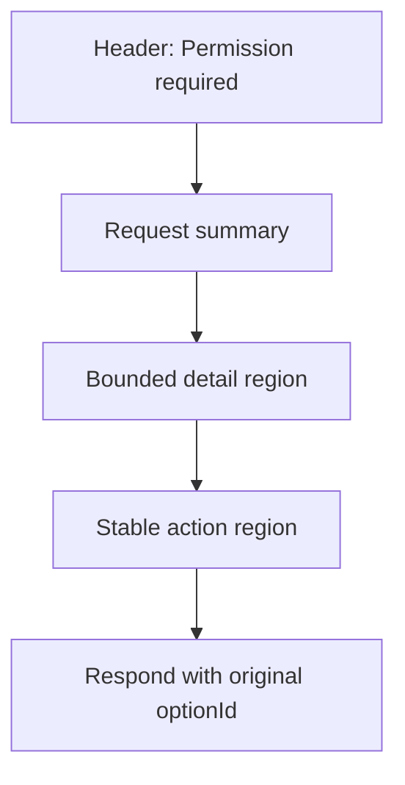

# Contract: Permission Dialog UI

## Purpose

AW permission dialog가 긴 command, JSON payload, 긴 approval option label을 표시할 때 사용자에게 보장해야 하는 UI contract를 정의한다.

## Input Contract

Permission dialog는 다음 형태의 permission event를 표시 대상으로 삼는다.

```text
PermissionRequest
├── permissionId: non-empty string
├── title: string
├── input: unknown detail data
├── options: ApprovalOption[]
└── requiresResponse: boolean

ApprovalOption
├── optionId: non-empty string
├── kind: string
└── name: string
```

Rules:

- `permissionId`가 없으면 submit action을 만들지 않는다.
- `optionId`는 사용자에게 표시되는 요약과 무관하게 원본 값을 유지한다.
- `input`은 command, cwd, payload를 포함할 수 있으며 전체 확인 가능해야 한다.

## Layout Contract



Requirements:

- Dialog는 app viewport 안에 머물러야 한다.
- Detail region은 긴 텍스트를 자체 영역 안에서 줄바꿈 또는 스크롤로 처리해야 한다.
- Action region은 detail content와 겹치지 않아야 한다.
- 좁은 창에서 action controls는 겹치지 않고 선택 가능해야 한다.

## Button Label Contract

Rules:

- Button은 긴 command나 payload 원문을 label로 사용하지 않는다.
- Button은 approval/rejection 의미를 짧게 보여준다.
- Full option name이 요약되어도 detail 또는 accessible description에서 원문 확인이 가능해야 한다.
- Pending label은 button row를 크게 흔들지 않는 짧은 문구를 사용한다.

## Acceptance Contract

- 5,000자 이상의 input이 있어도 header, detail, action controls가 모두 보인다.
- 공백 없는 긴 단일 문자열이 dialog 너비를 확장하지 않는다.
- 여러 줄 markdown/JSON-like input은 line break와 구조를 읽을 수 있다.
- 긴 approval prefix가 있어도 button row가 읽기 어렵게 깨지지 않는다.
- 사용자는 command/input detail과 approval scope를 확인한 뒤 원래 `optionId`로 승인 또는 거절할 수 있다.
