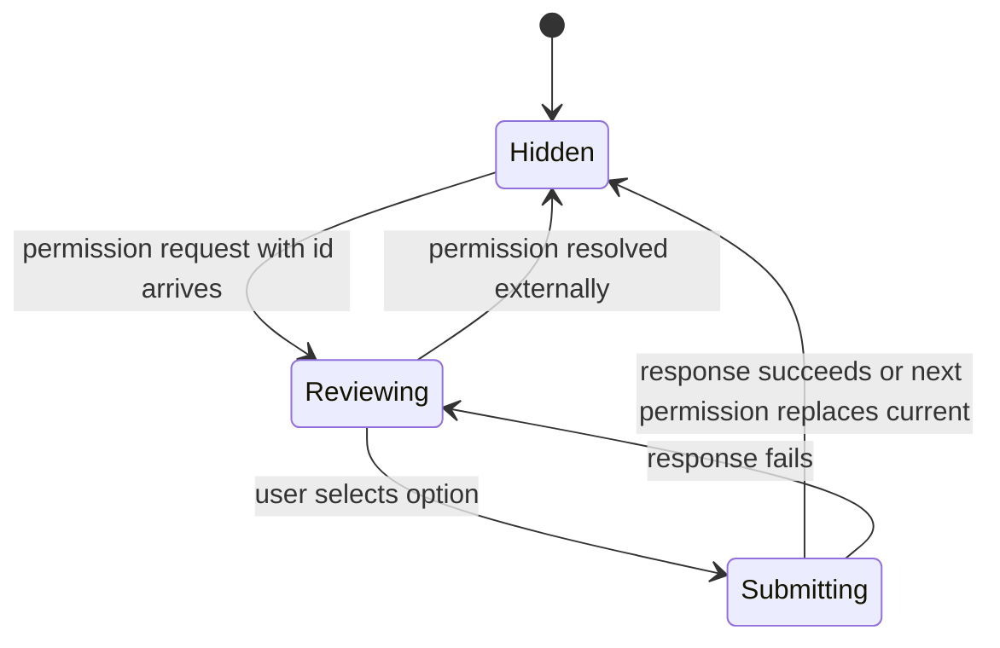

# Data Model: 긴 Permission 다이얼로그 레이아웃 개선

## Entity: Permission Request

**Description**: agent run 중 사용자의 승인 또는 거절이 필요한 요청이다. 기존 `RunEvent`의 `type: "permission"` 이벤트를 표시 대상으로 삼는다.

**Fields**:

- `permission_id`: 승인 응답에 필요한 식별자. 없으면 dialog는 열리지 않거나 action을 제출하지 않는다.
- `title`: 요청의 짧은 제목. 비어 있으면 fallback title을 표시한다.
- `input`: command, cwd, payload, JSON-like data 등 승인 판단에 필요한 원문 상세.
- `options`: 사용자가 선택할 수 있는 승인/거절 option 목록.
- `requires_response`: 사용자가 아직 결정을 내려야 하는지 나타낸다.
- `selected`: 이미 선택된 option이 있을 때의 결과 표시 정보.

**Validation Rules**:

- `permission_id`가 없는 요청은 submit 대상이 될 수 없다.
- `title`은 표시 전 trim하고 비어 있으면 `Tool request`에 준하는 fallback을 사용한다.
- `input`은 표시 가능한 문자열 detail로 변환되어야 하며, 변환 실패가 dialog rendering 실패로 이어지면 안 된다.

## Entity: Command Detail

**Description**: 사용자가 승인 전 확인해야 하는 원문 command/payload/cwd 정보의 표시 단위다.

**Fields**:

- `label`: 상세 영역의 의미를 나타내는 짧은 이름.
- `text`: 사용자가 확인할 수 있는 원문 또는 직렬화된 상세 문자열.
- `is_multiline`: line break 유지가 필요한지 나타낸다.
- `is_long`: bounded scroll region 적용이 필요한 긴 콘텐츠 여부.

**Validation Rules**:

- `text`는 비어 있지 않은 경우 전체 내용에 접근 가능해야 한다.
- 공백 없는 긴 단일 문자열도 dialog 너비를 확장시키면 안 된다.
- JSON-like object는 사용자가 구조를 읽을 수 있는 안정적인 문자열로 표시되어야 한다.

## Entity: Approval Option Summary

**Description**: permission option을 button에 표시하기 위한 짧은 요약과 상세 확인용 원문 metadata다.

**Fields**:

- `option_id`: 실제 승인 응답에 전달되는 식별자.
- `kind`: approve/reject 계열을 구분하는 option 종류.
- `full_label`: provider가 준 원래 option name, kind, option id 기반의 전체 표시 후보.
- `button_label`: 버튼에 표시할 짧은 action label.
- `is_destructive_or_reject`: outline/secondary 등 시각적 우선순위 판단에 쓰는 reject 계열 여부.

**Validation Rules**:

- `button_label`은 긴 command나 payload 전체를 포함하지 않아야 한다.
- `button_label`이 비어 있으면 `kind` 또는 `option_id` 기반 fallback을 사용한다.
- `full_label`은 상세 확인 또는 접근성 정보에서 확인 가능해야 한다.
- `option_id`는 submit 시 원본 값을 그대로 사용해야 한다.

## Entity: Permission Dialog Layout Region

**Description**: dialog 안에서 content가 차지하는 논리적 영역이다.

**Fields**:

- `header_region`: dialog title과 설명.
- `summary_region`: permission title과 핵심 요약.
- `detail_region`: command/input/cwd/approval option full detail을 보여주는 bounded scroll area.
- `action_region`: 승인/거절 button 목록과 pending 상태.

**Validation Rules**:

- `action_region`은 긴 `detail_region` 콘텐츠 때문에 화면 밖으로 밀려나면 안 된다.
- `detail_region`은 자체 scroll을 허용하되 핵심 상세 내용을 숨기지 않는다.
- 좁은 창에서 action controls는 wrap 또는 stack되어 겹치지 않아야 한다.

## State Transitions

## Derived Rules

- Button label은 `name`을 우선하되, 너무 길거나 command-like이면 kind 기반 action summary를 사용한다.
- Reject 계열 option은 승인 계열보다 보수적인 시각 스타일을 유지한다.
- Full command/input text는 button label에서 생략되어도 detail 영역에서는 접근 가능해야 한다.
- Pending 상태는 선택된 option에만 표시하되 다른 button의 크기와 layout을 불안정하게 만들지 않는다.
