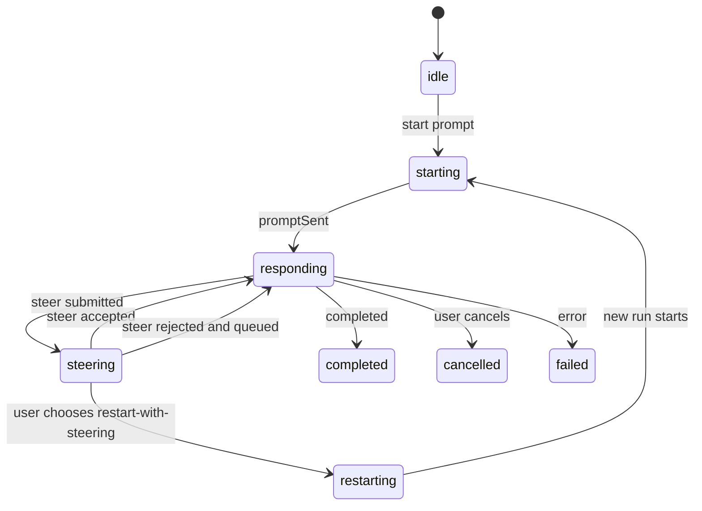

# Data Model: AW Active-Turn Steer

## Agent Work Item

사용자가 AW panel에서 보는 하나의 에이전트 실행 흐름이다.

### Fields

- `runId`: 현재 작업 식별자
- `sessionId`: provider session 식별자, 사용 가능한 경우에만 표시 또는 추적
- `ownerWindowLabel`: 작업을 소유한 window/panel 범위
- `phase`: `idle`, `starting`, `awaitingPrompt`, `responding`, `steering`, `cancelling`, `restarting`, `completed`, `cancelled`, `failed`
- `activePrompt`: 현재 작업의 기준 prompt
- `timelineItems`: 사용자/에이전트/lifecycle/tool event 목록
- `pendingSteers`: 현재 작업에 제출했지만 아직 처리 완료되지 않은 steer 입력 목록
- `rejectedSteers`: 현재 작업에 수락되지 않아 사용자 선택을 기다리는 steer 입력 목록
- `queuedPrompts`: 현재 작업 이후 실행될 prompt 목록
- `transitionToken`: 비동기 lifecycle event가 현재 상태 전이에 속하는지 확인하는 값

### Validation Rules

- `runId`가 없는 상태에서는 active-turn steer를 제출할 수 없다.
- terminal phase의 work item은 pending steer를 새로 받을 수 없다.
- lifecycle event는 target `runId`와 transition context가 일치할 때만 queue 또는 pending steer를 변경할 수 있다.

### State Transitions

## Steer Input

현재 실행 중인 작업에 추가로 반영하려는 사용자 입력이다.

### Fields

- `id`: 입력 식별자
- `targetRunId`: steer가 적용되어야 하는 run
- `text`: trim된 사용자 입력
- `status`: `draft`, `pending`, `accepted`, `rejected`, `queuedFallback`, `restartFallback`, `failed`
- `source`: `manualInput` 또는 `queuedPrompt`
- `createdAtSequence`: 제출 순서
- `errorMessage`: 실패 또는 거절 사유

### Validation Rules

- `text`는 비어 있을 수 없다.
- `targetRunId`는 현재 active work item과 일치해야 한다.
- 같은 `id`의 steer input은 pending list에 중복 추가될 수 없다.
- `accepted` 이후에는 같은 입력을 restart fallback으로 다시 전환할 수 없다.

## Queued Prompt

현재 작업 완료 후 다음 작업으로 실행될 사용자 입력이다.

### Fields

- `id`: 입력 식별자
- `text`: trim된 prompt
- `source`: `firstRun`, `manualQueue`, `savedPrompt`, `externalRequest`, `steerFallback`
- `dispatchAfterRunStart`: run 시작 직후 timeline에 사용자 메시지로 활성화되어야 하는지 여부
- `createdAtSequence`: queue 내 안정적 순서

### Validation Rules

- `text`는 비어 있을 수 없다.
- 자동 dispatch는 첫 항목이 `dispatchAfterRunStart`가 아닐 때만 가능하다.
- queue reorder는 같은 work item 안에서만 가능하다.

## Restart-with-Steering Request

사용자가 명시적으로 기존 작업을 종료하고 steer 내용을 포함한 새 작업을 시작하기로 선택한 요청이다.

### Fields

- `sourceRunId`: 종료할 기존 run
- `steerInputId`: restart에 사용할 steer input
- `composedPrompt`: 원래 prompt와 steering instruction을 결합한 사용자-visible prompt
- `remainingQueue`: restart 이후 유지할 queued prompt 목록
- `status`: `requested`, `cancellingSource`, `startingReplacement`, `completed`, `failed`

### Validation Rules

- 사용자의 명시적 선택 없이 생성될 수 없다.
- `sourceRunId`가 이미 종료된 경우에도 steer 입력은 손실되지 않아야 한다.
- 실패 시 `steerInput`과 `remainingQueue`를 복구할 수 있어야 한다.

## Provider Capability

현재 agent/provider/session이 active-turn steer를 지원하는지에 대한 판단이다.

### Fields

- `agentId`: provider agent 식별자
- `runId`: capability 판단 대상 run
- `supportsActiveTurnSteer`: cancel-free steer 지원 여부
- `unsupportedReason`: 지원하지 않을 때 사용자에게 보여줄 수 있는 짧은 사유

### Validation Rules

- capability를 알 수 없는 경우 기본값은 unsupported로 취급한다.
- unsupported 상태에서 steer 제출은 입력 보존 후 fallback 선택으로 이어져야 한다.
