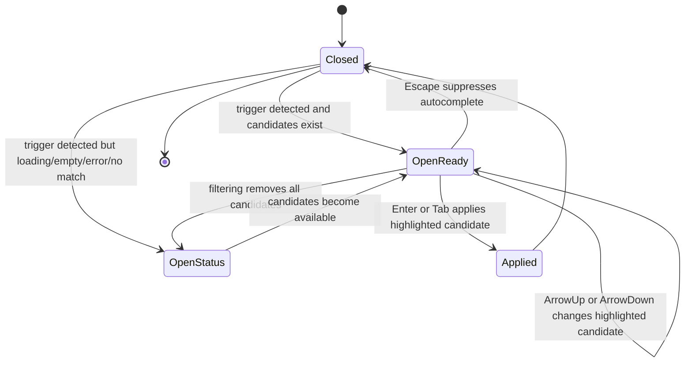

# Data Model: Slash Command Keyboard Navigation

## Autocomplete Candidate

Represents one command suggestion that can be shown and selected in the prompt autocomplete list.

### Fields

- `id`: Stable unique candidate identifier.
- `name`: User-facing command name.
- `description`: Optional short explanation shown below the name.
- `insertText`: Text inserted into the prompt when selected.
- `source`: Origin category shown as compact metadata.
- `scope`: Existing contextual scope for agent, run, or worktree when relevant.

### Validation Rules

- `id`, `name`, `insertText`, and `source` must be present for selectable candidates.
- Long `name` or `description` values must not force the list wider than its container.
- Candidate order follows existing filtering and sorting behavior.

## Highlighted Candidate

Represents the currently active suggestion during keyboard or pointer navigation.

### Fields

- `highlightedIndex`: Numeric index into the currently visible candidate list.
- `candidateId`: Derived from the currently highlighted candidate when the index is valid.
- `source`: Interaction source, either keyboard or pointer, when needed for reasoning about UI state.

### Validation Rules

- When candidate count is greater than zero, `highlightedIndex` must be clamped to a valid candidate index.
- When candidate count is zero, there must be no selectable highlighted candidate.
- Keyboard and pointer interactions must not show two separate highlighted candidates.

### State Transitions

## Autocomplete List View

Represents the visible suggestion container shown near the prompt.

### Fields

- `open`: Whether the suggestion surface is visible.
- `status`: One of ready, loading, empty, no match, or error.
- `visibleCandidateCount`: Number of candidates currently rendered.
- `scrollPosition`: Transient visual state of the list container.

### Validation Rules

- When `status` is ready and candidates exist, each candidate is represented as one selectable option.
- The visible highlighted candidate must remain within the list viewport after keyboard movement.
- Empty/loading/error/no-match messages are not selectable options.
- The list must not create persistent selected chips or multiple selected command values.

## Prompt Command Insertion

Represents the result of applying a single candidate to the current prompt draft.

### Fields

- `text`: Prompt text after command insertion.
- `cursorStart`: Cursor start after insertion.
- `cursorEnd`: Cursor end after insertion.
- `suppressionState`: Current prompt text and cursor range used to avoid immediately reopening the same autocomplete.

### Validation Rules

- Applying a candidate replaces only the active command trigger range.
- Applying a candidate preserves focus on the prompt editor.
- Escape closes/suppresses autocomplete without changing prompt text.
