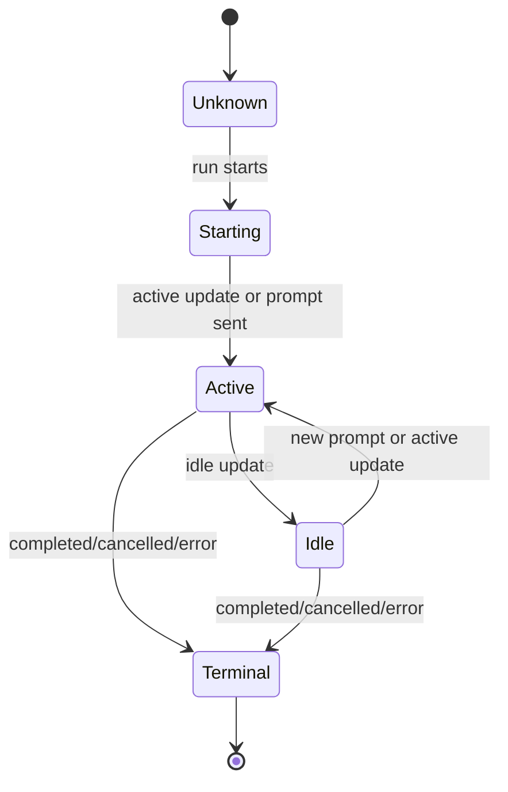

# Data Model: Session Lifecycle Status

## Session Lifecycle Status

Represents a user-meaningful status derived from agent run lifecycle events or session status updates.

### Fields

- `type`: One of session starting, active, idle, unknown, or terminal.
- `source`: Whether the status came from explicit run lifecycle or session status metadata.
- `runId`: The run this status belongs to.
- `observedAt`: When the frontend observed the status.

### Validation Rules

- Unknown or malformed statuses must not become raw JSON messages.
- Statuses must be scoped to the active run.
- Current-state status and historical transition messages must remain conceptually separate.

## Lifecycle Status Message

Represents the short user-facing message displayed in the timeline/status surface.

### Fields

- `id`: Stable message identifier or timeline item id.
- `runId`: Run that owns the message.
- `statusType`: Start, active, idle, or terminal category.
- `label`: Short display label.
- `description`: Optional short explanatory text.
- `tone`: Low-emphasis visual tone.
- `dedupeKey`: Key used to prevent repeated identical messages.

### Validation Rules

- Message text must be concise and not duplicate command summary content.
- The same `dedupeKey` must not be appended repeatedly for the same run without a real transition.
- Message tone must be less visually dominant than prompt/agent messages.

## Status Transition

Represents a change from one session status to another.

### Fields

- `previousStatus`: Last known status for this run.
- `nextStatus`: Incoming status for this run.
- `isMeaningfulTransition`: Whether the transition should produce a user-facing message.
- `dedupeKey`: The user-facing message identity for transition dedupe.

### Validation Rules

- Repeated `idle -> idle` or `active -> active` updates are not meaningful transitions.
- `active -> idle` is meaningful and should produce an idle message.
- New run start is meaningful even if a previous run ended in the same status.

### State Transitions

## Run Status Scope

Represents the boundary that prevents status messages from different runs from mixing.

### Fields

- `activeRunId`: Current run id.
- `lastLifecycleStatusKey`: Last status/dedupe key displayed for the run.
- `displayedStatusKeys`: Set of status keys already displayed for the run.

### Validation Rules

- When active run changes, run status scope resets.
- Events whose run id does not match the active run are ignored for current UI state.
- Displayed status keys from an old run must not suppress messages for a new run.
