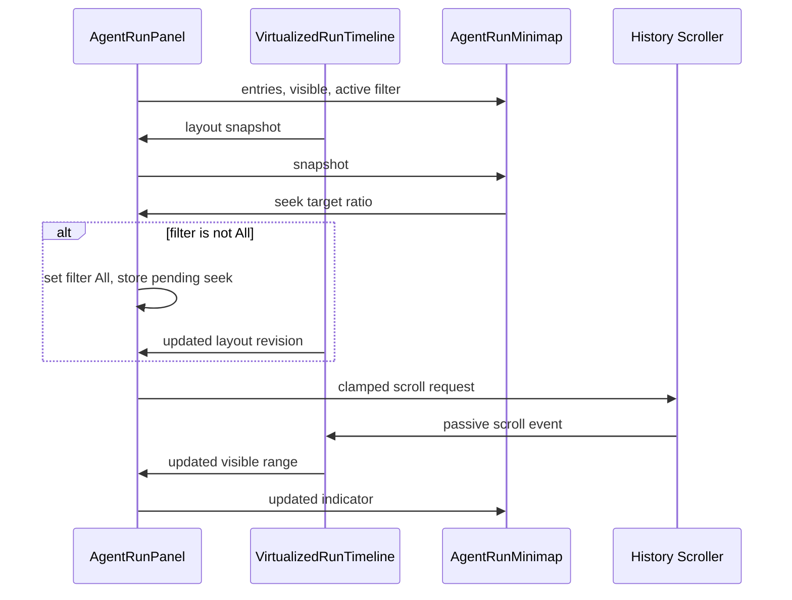

# UI Contract: Agent Run Minimap

## 목적

`AgentRunPanel`과 재사용 가능한 `AgentRunMinimap` 사이의 내부 UI 계약을 정의한다. 외부 API, Tauri command 또는 영속 스키마는 추가하지 않는다.

## 책임 경계

## 입력 계약

| 입력 | 필수 | 설명 |
|------|------|------|
| `entries` | 예 | 활성 panel의 전체 TimelineItem에서 파생된 user/assistant entry |
| `layoutSnapshot` | 예 | 타임라인과 현재 보이는 범위의 공유 좌표 상태 |
| `visible` | 예 | 현재 panel에서 미니맵 표시 여부 |
| `disabled` | 예 | 빈 목록 또는 전체가 한 화면에 들어와 탐색이 불필요한 상태 |
| `activeFilter` | 예 | 탐색 전 All 전환 필요 여부 판단 |
| `onSeek` | 예 | normalized target과 입력 방식을 panel controller에 전달 |
| `onVisibilityChange` | 예 | panel-local 표시 상태 갱신 |

## 출력 및 이벤트 계약

### Seek Request

- target은 0..1 범위를 벗어나지 않는다.
- pointer move 중 연속적으로 발생할 수 있으므로 호출은 현재 animation frame보다 빠르게 누적하지 않는다.
- pointer가 rail 밖으로 나가도 capture된 상태에서 시작/끝으로 clamp한다.
- `All`이 아닌 필터에서는 panel이 target을 보류하고 필터와 layout이 갱신된 후 한 번 적용한다.
- 적용된 scroll 이벤트가 다시 snapshot과 indicator를 갱신하며 미니맵은 별도 scroll 상태를 진실 원천으로 유지하지 않는다.

### Visibility Change

- 기본값은 visible이다.
- 숨김/표시가 기존 history scroller DOM node를 교체하거나 `scrollTop`을 초기화하지 않는다.
- 표시 복원 후 최신 snapshot으로 indicator를 재계산한다.
- panel별 상태이며 다른 panel의 visibility에 영향을 주지 않는다.

## 포인터 계약

1. viewport indicator에서 primary pointer down 시 capture를 얻고 grab offset을 기록한다.
2. move마다 rail-local y를 계산해 indicator가 rail 경계를 벗어나지 않도록 clamp한다.
3. 목표 위치를 timeline-local normalized ratio로 변환해 seek를 요청한다.
4. pointer up/cancel에서 capture와 interaction state를 정리한다.
5. 탐색 불가 상태에서는 pointer capture와 seek를 시작하지 않는다.

## 키보드 계약

viewport indicator는 focus 가능한 세로 slider로 동작한다.

| 키 | 동작 |
|----|------|
| ArrowUp | 작은 단위로 과거 위치 이동 |
| ArrowDown | 작은 단위로 최근 위치 이동 |
| PageUp | 현재 viewport 크기만큼 과거 이동 |
| PageDown | 현재 viewport 크기만큼 최근 이동 |
| Home | 히스토리 시작으로 이동 |
| End | 히스토리 끝으로 이동 |

- `aria-orientation="vertical"`, `aria-valuemin`, `aria-valuemax`, `aria-valuenow`, 목적을 나타내는 label을 제공한다.
- 실제 값은 전체 히스토리 대비 현재 시작 위치를 일관된 정수 범위로 표현한다.
- decorative entry는 slider와 중복된 tab stop을 만들지 않는다.

## 콘텐츠 계약

- user와 assistant를 색상 외 형태/label 차이로도 식별할 수 있어야 한다.
- summary는 한정된 공간에서 줄임 처리하고 rail 폭을 변경하지 않는다.
- 원본 Markdown, Mermaid, code block, tool, permission, lifecycle, terminal UI를 렌더링하지 않는다.
- 500개 항목에서도 모든 원문을 접근성 트리에 반복 노출하지 않는다. 현재 위치 조작은 slider 하나가 담당한다.

## 레이아웃 계약

- history와 minimap은 `minmax(0, 1fr)` 및 제한된 우측 rail로 나란히 배치한다.
- 별도 resize handle이나 중첩 card를 추가하지 않는다.
- 최소 360px agent panel에서도 history, 토글, minimap이 겹치지 않는다.
- 숨김 시 history가 rail 공간을 회수한다.

## 자동 추적 계약

- 기존 scroller가 하단 48px 이내일 때만 새 출력 후 하단을 따라간다.
- 사용자가 미니맵으로 과거를 탐색하면 기존 scroll listener가 하단 추적을 해제하며 새 출력은 위치를 빼앗지 않는다.
- 미니맵으로 끝에 도달하면 기존 정책에 따라 다음 스트리밍 출력을 다시 추적한다.

## 오류 및 경계 상태

- 빈 히스토리: entry와 seek 없이 빈/비활성 상태를 표시한다.
- 한 화면 이하: indicator는 전체 rail이며 seek는 비활성이다.
- 측정 전: 추정 layout으로 표시하고 실제 측정 후 같은 논리 위치로 보정한다.
- filter 전환: pending seek를 최신 layout revision에 한 번만 적용한다.
- panel 전환: 현재 활성 panel의 entries와 snapshot만 표시한다.
