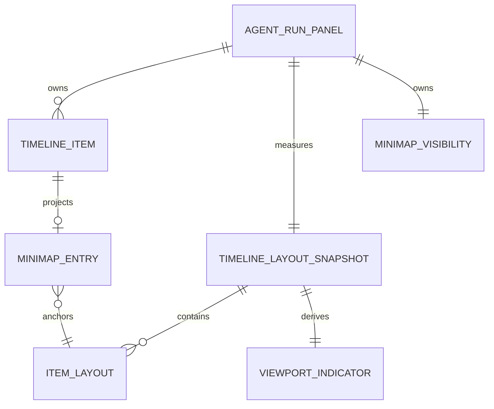
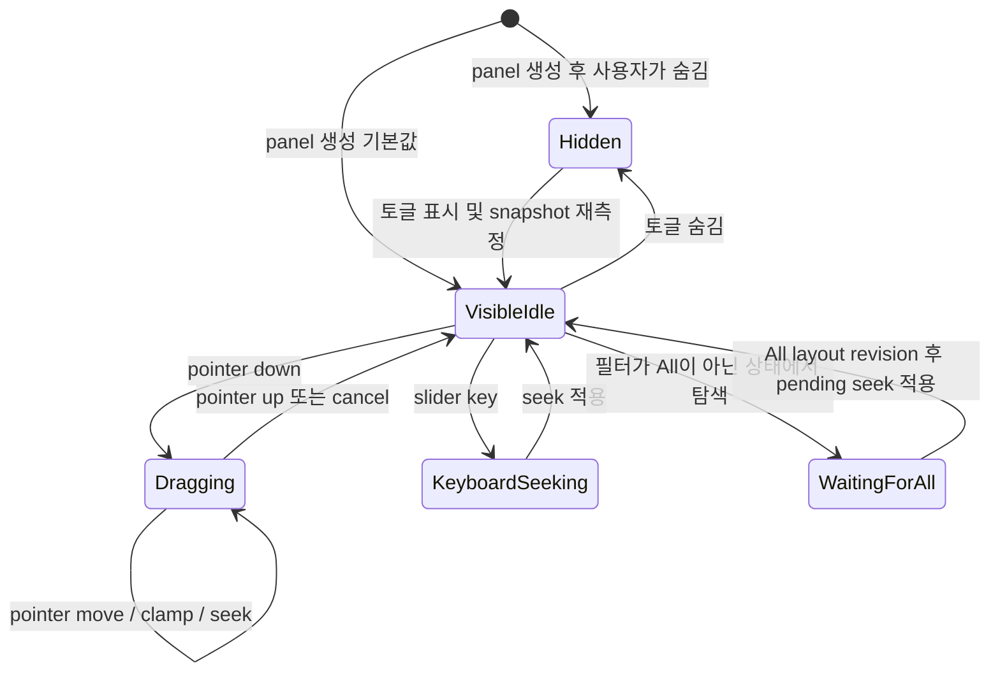

# Data Model: Agent Run 히스토리 미니맵

## 개요

미니맵 데이터는 기존 `TimelineItem`과 현재 가상 타임라인 레이아웃에서 파생된다. 새로운 영속 개체나 backend 전송 모델은 없다.

## 기존 개체

### TimelineItem

agent run의 정규화된 이벤트 한 건이다.

| 필드 | 의미 | 미니맵 사용 |
|------|------|-------------|
| `id` | 패널 내 안정적인 항목 식별자 | entry와 layout 연결 |
| `runId` | 소속 agent run | panel/run 격리 검증 |
| `group` | user, assistant, tool 등 이벤트 그룹 | user/assistant 투영 필터 |
| `body` | 정규화된 표시 내용 | 짧은 요약과 상대 크기 계산 |
| `createdAt` | 시간순 정보 | 기존 배열 순서의 일관성 확인 |

**Validation Rules**:

- `user/message`와 `assistant/message`만 `MinimapEntry`로 투영한다.
- 입력 배열 순서를 보존하며 다른 panel/run의 항목을 결합하지 않는다.
- 빈 `body`도 안정적인 최소 크기 entry로 표현할 수 있다.

## 파생 개체

### MinimapEntry

사용자 또는 agent 발화를 미니맵에서 간결하게 나타내는 불변 projection이다.

| 필드 | 형식 | 규칙 |
|------|------|------|
| `id` | string | source `TimelineItem.id`와 동일하며 중복되지 않음 |
| `runId` | string | source run 범위를 유지 |
| `role` | `user` 또는 `assistant` | source group에서 결정 |
| `summary` | string | 연속 공백을 정규화하고 정해진 최대 길이로 생략 |
| `contentWeight` | 제한된 양수 | 본문 길이 기반이며 최소/최대 범위로 clamp |
| `sourceOrder` | 0 이상의 정수 | 전체 TimelineItem 배열에서의 시간순 위치 |

**Validation Rules**:

- Markdown, Mermaid, 도구 UI를 해석하거나 렌더링하지 않는다.
- 매우 긴 단어와 여러 줄 입력도 rail 너비를 늘리지 않는다.
- `contentWeight`는 시각적 밀도 힌트이며 실제 scroll 위치 계산에는 사용하지 않는다.

### ItemLayout

가상 타임라인에서 한 render item의 timeline-local 위치다.

| 필드 | 형식 | 규칙 |
|------|------|------|
| `id` | string | source item 또는 grouped render item 식별자 |
| `start` | number | 0 이상 timeline-local offset |
| `end` | number | `start` 이상 |
| `height` | number | 측정값 또는 초기 추정값, 0보다 큼 |
| `measured` | boolean | 실제 DOM 측정 여부 |

### TimelineLayoutSnapshot

타임라인, history scroller 및 미니맵이 공유하는 특정 시점의 좌표 상태다.

| 필드 | 형식 | 규칙 |
|------|------|------|
| `timelineOffsetInScroller` | number | scroller 시작부터 timeline 시작까지 거리 |
| `totalHeight` | number | 마지막 item end 또는 0 |
| `visibleStart` | number | timeline-local 범위로 clamp |
| `visibleEnd` | number | `visibleStart` 이상, `totalHeight` 이하 |
| `viewportHeight` | number | 현재 실제 보이는 timeline 높이 |
| `itemLayouts` | ItemLayout[] | 시간순, 겹치지 않는 범위 |
| `revision` | 증가 식별값 | 측정/필터/항목 변경 후 pending seek 적용 판단 |

**Derived Values**:

- indicator 시작 비율 = `visibleStart / totalHeight`
- indicator 범위 비율 = `(visibleEnd - visibleStart) / totalHeight`
- seek scroll offset = timeline 시작 offset + 목표 timeline-local offset. 실제 scroller 범위로 clamp한다.
- `totalHeight`가 viewport 이하이면 indicator는 전체 rail을 차지하고 탐색은 비활성이다.

### ViewportIndicator

미니맵에서 현재 보이는 구간과 조작 상태를 표현한다.

| 필드 | 형식 | 규칙 |
|------|------|------|
| `startRatio` | 0..1 | 전체 타임라인 대비 현재 시작 |
| `sizeRatio` | 0..1 | 최소 조작 크기를 적용하되 접근성 값은 실제 범위를 유지 |
| `targetRatio` | 0..1 또는 null | drag/keyboard 중 요청한 위치 |
| `interaction` | idle, pointer, keyboard | 현재 입력 방식 |

### MinimapVisibility

| 필드 | 형식 | 규칙 |
|------|------|------|
| `visible` | boolean | panel 생성 시 true |
| `panelId` | string | 다른 panel 상태와 결합하지 않음 |

영속 저장하지 않으며 panel이 마운트된 동안만 유지한다.

### PendingSeek

대화 항목을 숨기는 이벤트 필터에서 미니맵 탐색을 시작했을 때 사용한다.

| 필드 | 형식 | 규칙 |
|------|------|------|
| `targetRatio` | 0..1 | 사용자 입력 시 clamp된 목표 |
| `requestedRevision` | number | 필터 전환 전 snapshot revision |
| `status` | waitingForAll, ready, applied | 한 번만 적용되는 상태 전이 |

## 관계 및 상태 전이

## 데이터 수명과 격리

- `TimelineItem[]`, layout snapshot, visibility, pending seek는 동일한 `AgentRunPanel` 인스턴스 안에 머문다.
- inactive panel은 마운트 상태를 유지하므로 다시 선택해도 visibility와 scroll 위치가 보존된다.
- 새 run이 기존 `items`를 초기화하면 projection과 layout도 빈 상태로 재계산된다.
- 파일, 데이터베이스, backend command에 저장하지 않는다.
