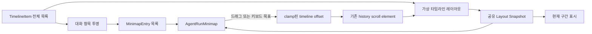

# Implementation Plan: Agent Run 히스토리 미니맵

**Branch**: `027-agent-run-minimap` | **Date**: 2026-07-10 | **Spec**: [spec.md](./spec.md)

**Input**: Feature specification from `/specs/027-agent-run-minimap/spec.md`

## Summary

WorktreeSessionPage의 각 agent-run 패널 상단 히스토리를 기존 스크롤 영역과 우측 미니맵으로 나란히 구성한다. 미니맵은 전체 `TimelineItem`에서 사용자 메시지와 agent 메시지만 의미 기반으로 축약하고, 기존 가상 타임라인이 계산하는 항목 레이아웃과 뷰포트 측정값을 공유해 현재 구간 표시와 드래그/키보드 탐색을 동기화한다. 표시 여부는 패널별 로컬 상태로 유지하며 백엔드, 영속 설정, cross-app 공유 패키지는 변경하지 않는다.

## Technical Context

**Language/Version**: TypeScript 5.6, React 19, ES2020

**Primary Dependencies**: Vite 7, Tailwind CSS 4, lucide-react, 기존 shadcn/ui `Button`/`Tooltip`, react-resizable-panels(기존 상하 패널 유지에만 사용)

**Storage**: N/A. 미니맵 콘텐츠와 표시 상태는 각 `AgentRunPanel`의 메모리 상태에서 파생되며 영속 저장하지 않는다.

**Testing**: Vitest 4 순수 모델/계약 테스트, Storybook 10 및 addon-a11y 상태 검증, 실제 브라우저에서 포인터·스크롤·반응형 상호작용 검증

**Target Platform**: Tauri 데스크톱 앱의 WebView 기반 agentic-workbench 화면

**Project Type**: pnpm/Turbo 모노레포의 데스크톱 앱 프론트엔드 기능

**Performance Goals**: 사용자/agent 항목 500개, 1440×900 Chromium/WebView 환경에서 1회 예열 후 5회 반복한 pointer 입력→slider/history 반영 시간의 중앙값이 100ms 이내이고, 실제 히스토리와 현재 구간 표시의 상대 위치 차이가 5% 이내여야 한다.

**Constraints**: 기존 가상화와 48px 이내 하단 자동 추적 정책을 유지한다. 새 스크롤 관찰 루프를 중복 생성하지 않는다. 최소 360px agent 패널에서도 콘텐츠와 토글이 겹치지 않아야 한다. 미니맵은 Markdown, Mermaid, 도구 UI를 재렌더링하지 않는다.

**Scale/Scope**: `apps/agentic-workbench` 한 앱, agent-run 패널별 독립 상태, 한 run당 최소 500개 대화 항목 검증. Tauri backend, 파일 접근, 데이터 영속화, 다른 앱 UI는 범위 밖이다.

## Constitution Check

*GATE: Phase 0 조사 전 및 Phase 1 설계 후 재검증 완료.*

- **Monorepo Boundary First — PASS**: 모든 변경은 `apps/agentic-workbench/src/entities/agent-run`, `features/agent-run`, `stories`에 한정한다. `packages/*`, `crates/*`, app 간 직접 import를 추가하지 않는다.
- **Feature-Sliced Frontend Architecture — PASS**: 타임라인의 도메인 투영은 `entities/agent-run/model`, 스크롤/키보드 계산과 사용자 상호작용은 `features/agent-run/model` 및 `features/agent-run/ui`에 둔다. 페이지는 기존 화면 조합을 유지한다.
- **Hexagonal Tauri Backend Architecture — N/A**: 기존 프론트엔드 메모리의 타임라인만 소비하며 Tauri command와 Rust 코드를 변경하지 않는다.
- **Shared Core Before Shared UI — PASS**: 현재 소비자는 AW 하나뿐이므로 공유 UI/package 추출을 하지 않는다. UI와 분리 가능한 투영·좌표 계산만 app-local 순수 모델로 만든다.
- **Atomic Cross-App Verification — N/A**: `packages/*`와 `crates/*` 변경이 없어 다른 앱 소비자 검증이 필요하지 않다.
- **Documentation and Storybook — PASS**: 본 설계 문서와 organism Storybook 상태(빈/짧은/긴/스트리밍/숨김/좁은 화면)를 계획했다. 신규 `docs/*.md` 프로젝트 문서는 요구하지 않는다.
- **Testing and Safety — PASS**: 투영·레이아웃·clamp·키보드 이동은 단위 테스트로 검증하고 UI 계약 및 접근성은 Storybook과 브라우저에서 검증한다. 새 파일/세션/권한/영속 경계가 없어 owner/path 검증 변경은 없다.

### Post-Design Re-check

`research.md`, `data-model.md`, `contracts/agent-run-minimap-ui.md`, `quickstart.md`가 위 경계를 유지함을 재검토했다. 외부 API와 backend 변경은 없고, 모든 상태와 데이터 흐름은 활성 `AgentRunPanel` 내부에 머문다. 헌법 위반이나 예외 승인은 없다.

**Agent context update**: 이 저장소의 `.specify/scripts`에는 `update-agent-context.sh` 또는 동등한 실행 스크립트가 없고 생성형 agent context 파일도 없으므로 이 단계는 변경 없이 건너뛰었다.

## Project Structure

### Documentation (this feature)

```text
specs/027-agent-run-minimap/
├── plan.md
├── research.md
├── data-model.md
├── quickstart.md
├── contracts/
│   └── agent-run-minimap-ui.md
└── tasks.md                         # /speckit-tasks에서 생성
```

### Source Code (repository root)

```text
apps/agentic-workbench/src/
├── entities/agent-run/model/
│   ├── minimap.ts                   # TimelineItem -> 의미 기반 MinimapEntry 투영
│   ├── minimap.test.ts
│   └── index.ts                     # 모델 public export
├── features/agent-run/
│   ├── model/
│   │   ├── agent-run-minimap.ts     # 뷰포트/좌표/clamp/키보드 순수 계산
│   │   └── agent-run-minimap.test.ts
│   └── ui/
│       ├── agent-run-minimap.tsx    # 미니맵 rail, indicator, pointer/keyboard UI
│       ├── agent-run-minimap.test.tsx
│       └── agent-run-panel.tsx      # 기존 가상 타임라인 측정 공유 및 토글 조합
├── shared/storybook/
│   └── sample-data.ts               # 긴 대화 등 대표 fixture
└── stories/
    └── organisms.stories.tsx        # 미니맵 상태와 상호작용 등록
```

**Structure Decision**: 미니맵은 `ProjectWorktreeSessionPage` 또는 `WorktreeAgentRunArea`가 아니라 각 `AgentRunPanel`의 상단 히스토리 패널에 결합한다. 정규화된 agent-run 메시지의 축약은 entity 모델, 탐색 계산과 UI는 feature에 두고, 기존 스크롤 DOM 노드를 유지해 패널별 스크롤과 표시 상태를 자연스럽게 격리한다.

## Design Flow



## Implementation Phases

1. **순수 모델**: 사용자/agent 메시지 투영, 공백 정규화와 제한된 요약, 상대 크기 계산, 타임라인 로컬 좌표와 indicator 좌표 변환, clamp 및 키보드 이동을 구현하고 단위 테스트한다.
2. **측정 공유**: `VirtualizedRunTimeline`이 이미 계산하는 측정/추정 레이아웃, 타임라인 시작 offset, 현재 표시 범위, 총 높이를 하나의 snapshot으로 노출한다. 기존 `ResizeObserver`, passive scroll listener, 하단 자동 추적 정책은 단일 소유자로 유지한다.
3. **미니맵 UI**: 고정 폭의 우측 rail, 의미 기반 항목, 현재 구간 slider, pointer capture drag, Home/End/Arrow/Page 키, 빈/짧은 히스토리 상태를 구현한다. 기술 이벤트 필터가 대화 항목을 숨긴 상태에서 탐색을 시작하면 `All` 필터 전환 후 보류한 목표 offset을 적용한다.
4. **패널 조합**: 패널별 기본 표시 상태와 아이콘 토글을 추가하고, 숨김 시 기존 history scroll node를 재마운트하지 않은 채 가용 폭을 반환한다. 추가 agent 패널 간 상태 격리와 스트리밍 중 위치 보존을 확인한다.
5. **상태/회귀 검증**: Storybook에 빈/짧은/긴 500항목/스트리밍/숨김/좁은 레이아웃을 등록하고 타입, 단위 테스트, 빌드, Storybook 접근성 및 실제 브라우저 상호작용을 검증한다.

## Completion Criteria

- 명세 FR-001~FR-016과 UI 계약의 모든 필수 동작이 구현된다.
- 실제 측정값이 안정화된 뒤 미니맵과 히스토리 위치 차이가 5% 이내이며, 500항목 환경에서 1회 예열 후 5회 pointer 입력→반영 시간의 중앙값이 100ms 이내다.
- 과거 위치와 최신 위치 양쪽에서 스트리밍 자동 추적 규칙이 기존과 동일하게 동작한다.
- 미니맵 토글 전후 논리 viewport 시작 비율이 5% 이내로 유지되고 패널 전환 시 상태가 섞이지 않는다.
- 포인터와 키보드로 시작/중간/끝에 접근 가능하며 addon-a11y에서 새 위반이 없다.

## Verification

```bash
pnpm --filter @yoophi/agentic-workbench check-types
pnpm --filter @yoophi/agentic-workbench test
pnpm --filter @yoophi/agentic-workbench build
pnpm --filter @yoophi/agentic-workbench build-storybook
pnpm --filter @yoophi/agentic-workbench storybook
```

실제 브라우저에서는 데스크톱과 최소 360px agent 패널 폭에서 포인터 드래그, 키보드 slider, 필터 전환, 표시 토글, 패널 전환, 스트리밍 성장 및 겹침 여부를 확인한다.

## Complexity Tracking

헌법 위반이 없으므로 기록할 예외가 없다.
