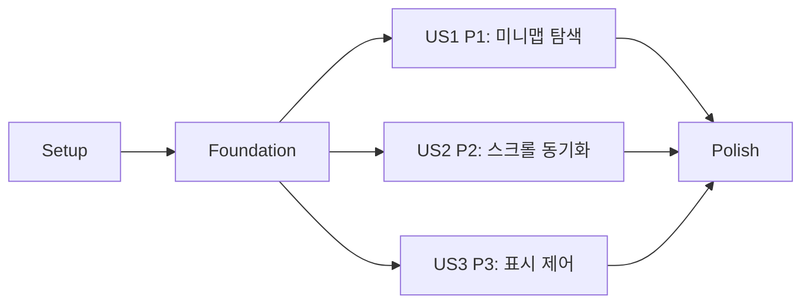

# Tasks: Agent Run 히스토리 미니맵

**Input**: Design documents from `/specs/027-agent-run-minimap/`

**Prerequisites**: plan.md, spec.md, research.md, data-model.md, contracts/agent-run-minimap-ui.md, quickstart.md

**Tests**: 헌법이 요구하는 순수 투영/좌표 계산 단위 테스트와 명세의 자동 검증 기준을 포함한다. 각 스토리의 테스트 작업을 구현보다 먼저 완료하고 실패를 확인한다.

**Organization**: 공통 기반을 먼저 구축한 뒤 사용자 스토리 P1, P2, P3별로 독립 구현 및 검증할 수 있도록 구성한다.

## Format: `[ID] [P?] [Story] Description`

- **[P]**: 선행 조건 완료 후 다른 파일에서 병렬 실행 가능
- **[Story]**: `spec.md`의 사용자 스토리와 연결
- 모든 작업은 수정 또는 검증 대상의 정확한 파일 경로를 포함한다.

## Phase 1: Setup (Shared Fixtures)

**Purpose**: 모델 테스트와 Storybook 상태에서 함께 사용할 대표 agent-run 데이터를 준비한다.

- [X] T001 Add deterministic empty, short, long, 500-entry, and streaming `TimelineItem` fixtures in `apps/agentic-workbench/src/shared/storybook/sample-data.ts`

---

## Phase 2: Foundational (Blocking Prerequisites)

**Purpose**: 세 사용자 스토리가 공통으로 사용하는 대화 projection, 좌표 계산, layout snapshot 및 기본 UI 계약을 구축한다.

**⚠️ CRITICAL**: 이 phase를 완료하기 전에는 사용자 스토리 구현을 시작하지 않는다.

- [X] T002 [P] Write failing tests for user/assistant-only projection, whitespace normalization, summary bounds, role/order preservation, and content-weight clamping in `apps/agentic-workbench/src/entities/agent-run/model/minimap.test.ts`
- [X] T003 [P] Write failing tests for timeline-local viewport ratios, scroller offset conversion, indicator sizing, pointer clamping, keyboard steps, and pending-seek transitions in `apps/agentic-workbench/src/features/agent-run/model/agent-run-minimap.test.ts`
- [X] T004 [P] Implement `MinimapEntry` projection and validation rules from `TimelineItem[]` in `apps/agentic-workbench/src/entities/agent-run/model/minimap.ts`
- [X] T005 [P] Implement `TimelineLayoutSnapshot`, viewport indicator, seek/clamp, keyboard navigation, and pending-seek pure calculations in `apps/agentic-workbench/src/features/agent-run/model/agent-run-minimap.ts`
- [X] T006 Export the new minimap entity types and projection helpers from `apps/agentic-workbench/src/entities/agent-run/model/index.ts`
- [X] T007 Create the presentational `AgentRunMinimap` rail contract with entries, layout snapshot, disabled state, seek callback, and semantic user/assistant markers in `apps/agentic-workbench/src/features/agent-run/ui/agent-run-minimap.tsx`
- [X] T008 Refactor `VirtualizedRunTimeline` to publish one shared measured/estimated layout snapshot while retaining its single `ResizeObserver`, passive scroll listener, virtualization, and 48px bottom-stick policy in `apps/agentic-workbench/src/features/agent-run/ui/agent-run-panel.tsx`

**Checkpoint**: 전체 대화 projection과 history-local 좌표가 하나의 snapshot으로 연결되고 각 스토리가 독립적으로 UI 동작을 추가할 수 있다.

---

## Phase 3: User Story 1 - 긴 대화의 위치를 미니맵으로 탐색 (Priority: P1) 🎯 MVP

**Goal**: 사용자가 prompt/agent 출력의 전체 흐름을 보고 viewport indicator를 포인터 또는 키보드로 이동해 원하는 과거 위치를 즉시 찾는다.

**Independent Test**: 20회 이상의 대화 fixture에서 indicator를 시작·중간·끝으로 드래그하고 키보드로 이동했을 때 대응 prompt와 주변 agent 출력이 history에 표시되는지 검증한다.

### Tests for User Story 1

- [X] T009 [P] [US1] Write failing UI contract tests for semantic entries, empty/short disabled states, vertical slider ARIA values, pointer capture lifecycle, and keyboard key mapping in `apps/agentic-workbench/src/features/agent-run/ui/agent-run-minimap.test.tsx`
- [X] T010 [P] [US1] Write failing panel integration tests for side-by-side history/minimap wiring, full-item projection, All-filter pending seek, and clamped scroll requests in `apps/agentic-workbench/src/features/agent-run/ui/agent-run-panel.test.tsx`

### Implementation for User Story 1

- [X] T011 [US1] Implement compact entry positioning, viewport slider, requestAnimationFrame-bounded pointer capture drag, boundary clamping, and Arrow/Page/Home/End handling in `apps/agentic-workbench/src/features/agent-run/ui/agent-run-minimap.tsx`
- [X] T012 [US1] Integrate the right-side minimap with full unfiltered conversation entries, shared layout snapshots, All-filter transition, pending normalized seek, and history scroll requests in `apps/agentic-workbench/src/features/agent-run/ui/agent-run-panel.tsx`
- [X] T013 [US1] Register empty, short, and long draggable minimap organism states using the shared fixtures in `apps/agentic-workbench/src/stories/organisms.stories.tsx`
- [X] T014 [US1] Validate pointer and keyboard navigation for start, middle, end, filtered history, and empty/short states against scenarios 1, 2, 4, and 6 in `specs/027-agent-run-minimap/quickstart.md`

**Checkpoint**: User Story 1만으로 긴 대화의 prompt/응답 위치를 미니맵에서 찾고 이동할 수 있는 MVP가 동작한다.

---

## Phase 4: User Story 2 - 히스토리 스크롤 위치를 미니맵에서 확인 (Priority: P2)

**Goal**: 기존 history 스크롤, 항목 재측정 및 스트리밍 성장 시 미니맵 indicator가 실제 보이는 구간을 반영하고 기존 자동 추적 정책을 유지한다.

**Independent Test**: history의 시작·중간·끝을 직접 스크롤하고 최신/과거 위치에서 출력을 추가해 indicator 동기화와 위치 보존을 검증한다.

### Tests for User Story 2

- [X] T015 [P] [US2] Extend viewport model tests for direct-scroll snapshots, measured-height revisions, short-history full indicators, streaming growth at past/end positions, and 5% alignment tolerance in `apps/agentic-workbench/src/features/agent-run/model/agent-run-minimap.test.ts`
- [X] T016 [P] [US2] Write failing panel contract tests for history-to-minimap updates, measurement reflow, past-position preservation, and near-bottom streaming follow behavior in `apps/agentic-workbench/src/features/agent-run/ui/agent-run-panel.test.tsx`

### Implementation for User Story 2

- [X] T017 [US2] Complete bidirectional scroll synchronization and measurement-revision updates without adding a second observer or auto-follow owner in `apps/agentic-workbench/src/features/agent-run/ui/agent-run-panel.tsx`
- [X] T018 [US2] Add interactive streaming-at-bottom, streaming-while-past, variable-height Markdown, and direct-scroll organism states in `apps/agentic-workbench/src/stories/organisms.stories.tsx`
- [X] T019 [US2] Validate direct scroll synchronization and streaming position behavior against scenarios 1 and 5 in `specs/027-agent-run-minimap/quickstart.md`

**Checkpoint**: User Story 2가 추가되면 기존 스크롤과 미니맵이 같은 위치를 표시하고 스트리밍 중에도 사용자의 최신/과거 위치 의도를 보존한다.

---

## Phase 5: User Story 3 - 미니맵 표시 공간 제어 (Priority: P3)

**Goal**: 사용자가 미니맵을 숨겨 history 공간을 회수하고 다시 표시해도 스크롤 위치와 panel별 상태가 유지된다.

**Independent Test**: 중간 위치에서 미니맵을 숨겼다가 다시 표시하고 Main/Extra panel을 전환해 각 panel의 visibility와 scroll 위치가 유지되는지 검증한다.

### Tests for User Story 3

- [X] T020 [P] [US3] Extend minimap UI tests for accessible visibility state, disabled behavior after hide/show, and narrow-rail content bounds in `apps/agentic-workbench/src/features/agent-run/ui/agent-run-minimap.test.tsx`
- [X] T021 [P] [US3] Write failing panel integration tests for default-visible local state, icon toggle semantics, stable history scroll node, logical viewport-ratio retention within 5%, reclaimed width, and Main/Extra panel isolation in `apps/agentic-workbench/src/features/agent-run/ui/agent-run-panel.test.tsx`

### Implementation for User Story 3

- [X] T022 [US3] Add the tooltip-labelled lucide icon toggle, panel-local visibility state, fixed bounded rail layout, stable history scroller, and hide/show remeasurement in `apps/agentic-workbench/src/features/agent-run/ui/agent-run-panel.tsx` and `apps/agentic-workbench/src/features/agent-run/ui/agent-run-minimap.tsx`
- [X] T023 [US3] Register visible, hidden, 360px narrow, and distinct Main/Extra panel organism states in `apps/agentic-workbench/src/stories/organisms.stories.tsx`
- [X] T024 [US3] Validate space reclamation, logical viewport-ratio retention within 5%, responsive non-overlap, and panel isolation against scenario 3 and the panel portion of scenario 5 in `specs/027-agent-run-minimap/quickstart.md`

**Checkpoint**: 모든 사용자 스토리가 완료되어 미니맵 탐색, 동기화, 표시 제어가 panel별로 독립 동작한다.

---

## Phase 6: Polish & Cross-Cutting Concerns

**Purpose**: 전체 스토리에 걸친 성능, 접근성, 회귀 및 헌법 준수를 검증한다.

- [X] T025 [P] Add 500-entry projection/layout performance assertions and regression coverage for excluded tool/lifecycle/Mermaid content in `apps/agentic-workbench/src/entities/agent-run/model/minimap.test.ts` and `apps/agentic-workbench/src/features/agent-run/model/agent-run-minimap.test.ts`
- [X] T026 [P] Complete Storybook addon-a11y metadata and interaction instructions for all minimap organism states in `apps/agentic-workbench/src/stories/organisms.stories.tsx`
- [X] T027 Run `check-types`, full Vitest, production build, and Storybook build for `apps/agentic-workbench/package.json`, fixing regressions only in files listed by `specs/027-agent-run-minimap/plan.md`
- [X] T028 Run all six desktop and 360px browser scenarios, measure 500-entry pointer latency with 1 warmup and 5 recorded runs using the median, record alignment and accessibility results, and update completion evidence in `specs/027-agent-run-minimap/quickstart.md`
- [X] T029 Verify final FSD boundaries, absence of backend/persistence/cross-app changes, Storybook registration, and FR-001–FR-016 traceability against `specs/027-agent-run-minimap/plan.md` and `specs/027-agent-run-minimap/spec.md`

---

## Dependencies & Execution Order

### Phase Dependencies

- **Setup (Phase 1)**: 즉시 시작 가능하다.
- **Foundational (Phase 2)**: Setup 완료 후 시작하며 모든 사용자 스토리를 차단한다.
- **User Stories (Phase 3–5)**: Foundation 완료 후 논리적으로 독립 구현 가능하다. 동일 UI 파일 충돌을 피하려면 P1 → P2 → P3 순서를 권장한다.
- **Polish (Phase 6)**: 목표로 하는 사용자 스토리가 완료된 뒤 실행한다.

### User Story Dependencies



- **User Story 1 (P1)**: Foundation 이후 다른 스토리 없이 완료 가능하며 권장 MVP다.
- **User Story 2 (P2)**: Foundation의 기본 rail과 snapshot만으로 직접 스크롤 동기화를 독립 검증할 수 있다. 최종 통합 시 US1의 seek 동작과 같은 snapshot을 소비한다.
- **User Story 3 (P3)**: Foundation 이후 표시 토글과 panel 격리를 독립 검증할 수 있다. 최종 통합 시 US1/US2 동작을 숨김 전후 보존한다.

### Within Each User Story

- 테스트 작업을 먼저 작성하고 대상 구현 전 실패를 확인한다.
- 순수 projection/geometry 모델을 UI보다 먼저 완료한다.
- UI 계약 구현 후 `AgentRunPanel` 통합과 Storybook 상태를 추가한다.
- 각 checkpoint에서 해당 story의 quickstart 시나리오를 통과한 뒤 다음 우선순위로 진행한다.

### Parallel Opportunities

- T002와 T003은 서로 다른 모델 테스트 파일에서 병렬 실행 가능하다.
- T004와 T005는 각 선행 테스트 완료 후 서로 다른 모델 파일에서 병렬 실행 가능하다.
- 각 story의 `[P]` 테스트 작업은 서로 다른 파일이므로 병렬 작성 가능하다.
- Foundation 이후 US1, US2, US3은 논리적으로 병렬화할 수 있지만 `agent-run-panel.tsx`와 Storybook 통합 시 변경 조율이 필요하다.
- T025와 T026은 모델 테스트와 Storybook 파일이 달라 병렬 실행 가능하다.

---

## Parallel Example: User Story 1

```text
Task T009: `agent-run-minimap.test.tsx`에 미니맵 UI 계약 테스트 작성
Task T010: `agent-run-panel.test.tsx`에 panel 통합 계약 테스트 작성
```

테스트가 실패하는 것을 확인한 뒤 T011 → T012 → T013 → T014 순으로 진행한다.

## Parallel Example: User Story 2

```text
Task T015: `agent-run-minimap.test.ts`에 direct-scroll/streaming 좌표 테스트 추가
Task T016: `agent-run-panel.test.tsx`에 history-minimap 동기화 계약 테스트 추가
```

테스트가 실패하는 것을 확인한 뒤 T017 → T018 → T019 순으로 진행한다.

## Parallel Example: User Story 3

```text
Task T020: `agent-run-minimap.test.tsx`에 visibility/좁은 rail 테스트 추가
Task T021: `agent-run-panel.test.tsx`에 scroller 보존/panel 격리 테스트 추가
```

테스트가 실패하는 것을 확인한 뒤 T022 → T023 → T024 순으로 진행한다.

---

## Implementation Strategy

### MVP First (User Story 1 Only)

1. T001로 공통 fixture를 준비한다.
2. T002–T008로 projection, geometry, snapshot 및 기본 rail을 완성한다.
3. T009–T014로 User Story 1을 구현한다.
4. **STOP AND VALIDATE**: quickstart 시나리오 1, 2, 4, 6으로 긴 대화 탐색 MVP를 독립 검증한다.

### Incremental Delivery

1. Setup + Foundation → 공통 좌표와 UI 계약 준비
2. User Story 1 → 미니맵 drag/keyboard 탐색 MVP
3. User Story 2 → 직접 스크롤 및 streaming 양방향 동기화
4. User Story 3 → visibility, 공간 회수 및 panel 격리
5. Polish → 500항목 성능, 접근성, 전체 앱 회귀 및 헌법 검증

### Parallel Team Strategy

1. Setup과 Foundation은 순서대로 공동 완료한다.
2. Foundation 이후 담당자는 model/UI test 파일 기준으로 story 테스트를 병렬 작성할 수 있다.
3. `agent-run-panel.tsx`와 `organisms.stories.tsx` 통합은 P1 → P2 → P3 순으로 병합해 충돌을 줄인다.

## Notes

- `[P]` 작업은 명시된 선행 조건이 끝난 뒤 다른 파일에서 실행할 수 있다.
- `[US1]`, `[US2]`, `[US3]`는 `spec.md`의 사용자 스토리와 직접 대응한다.
- backend, persistence, `packages/*`, `crates/*`, 다른 앱 변경은 작업 범위에 포함하지 않는다.
- 각 작업은 해당 파일에 필요한 변경과 검증을 모두 끝내야 완료 처리한다.
