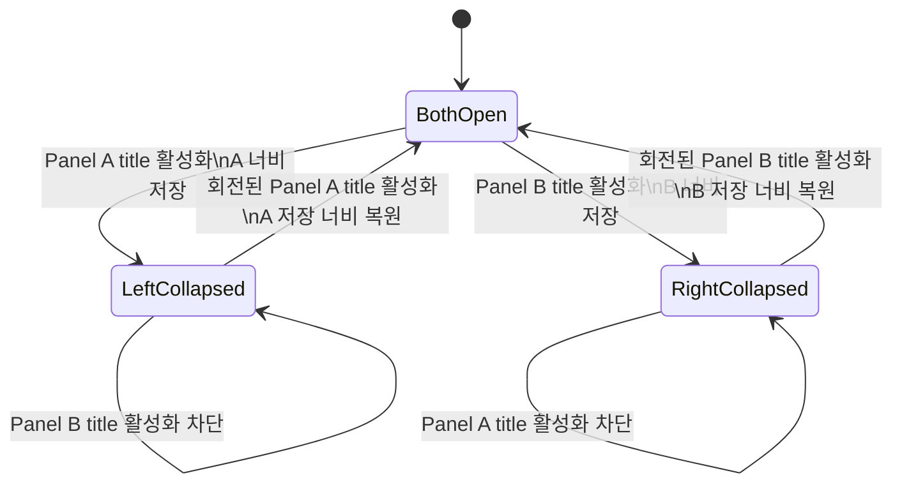

# Data Model: 접기 및 크기 조절이 가능한 패널

이 기능은 영구 데이터가 아닌 UI 세션 상태를 다룬다.

## PanelDescriptor

패널 하나의 고정 구성 정보다.

- `id`: 패널 쌍 안에서 유일한 비어 있지 않은 식별자
- `title`: 비어 있지 않은 React 표시 콘텐츠
- `content`: 펼침 상태에서 표시할 React 콘텐츠
- `defaultSize`: 최초 펼침 너비
- `minSize`: 펼침 상태의 최소 너비
- `maxSize`: 펼침 상태의 최대 너비(선택)
- `collapsedSize`: 최소 상태 title rail 너비

### Validation

- 좌·우 `id`는 서로 달라야 한다.
- `defaultSize`는 해당 패널의 최소·최대 범위에 있어야 한다.
- 두 패널의 최소 너비와 separator가 컨테이너에 들어갈 수 없는 경우에도 title rail과 복구 조작은 유지되어야 한다.

## PanelRuntimeState

패널별 런타임 상태다.

- `side`: `left` 또는 `right`
- `collapsed`: 현재 최소 상태 여부
- `lastExpandedSize`: 마지막으로 확정된 펼침 너비

### Invariants

- `lastExpandedSize`는 접기 직전 또는 resize 완료 시의 유효한 너비다.
- 접힌 동안 `lastExpandedSize`는 다른 패널의 확장으로 덮어쓰지 않는다.
- 다시 펼칠 때 저장 너비가 현재 경계를 벗어나면 가장 가까운 유효 너비를 사용한다.

## PanelPairState

두 패널과 separator의 통합 상태다.

- `left`: 왼쪽 `PanelRuntimeState`
- `right`: 오른쪽 `PanelRuntimeState`
- `resizeEnabled`: 두 패널이 모두 펼쳐진 경우에만 `true`

### Invariants

- `left.collapsed && right.collapsed`는 항상 `false`다.
- 한 패널이 접히면 다른 패널은 반드시 펼쳐져 있다.
- 한 패널이 접히면 `resizeEnabled`는 `false`다.
- 두 패널이 펼치면 `resizeEnabled`는 `true`다.
- 접힌 패널의 최소 rail 전체는 해당 패널을 펼치는 단일 활성화 영역이다.
- 접힌 패널의 회전 제목은 rail 우측 끝에 정렬되는 시각 라벨이며 별도 활성화 대상을 만들지 않는다.

## State Transitions

## Events

- `layoutChanged(leftSize, rightSize)`: 두 패널이 펼쳐진 resize 완료 후 저장 너비 갱신
- `collapse(side)`: 대상이 마지막 열린 패널이 아니면 대상 너비 저장 후 접기
- `expand(side)`: 대상의 저장 너비를 현재 경계에 맞춰 펼치기
- `containerResized(availableSize)`: 저장값은 유지하고 현재 표시 너비만 유효 범위로 보정

## Derived Values

- `canCollapseLeft = !right.collapsed`
- `canCollapseRight = !left.collapsed`
- `resizeEnabled = !left.collapsed && !right.collapsed`
- `activePanel = left.collapsed ? right : right.collapsed ? left : null`
- `collapsedActivationSurface = left.collapsed ? leftRail : right.collapsed ? rightRail : null`
