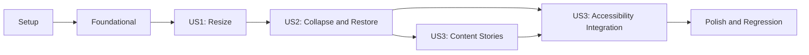

# Tasks: 접기 및 크기 조절이 가능한 패널

**Input**: Design documents from `/specs/028-collapsible-resizable-panel/`

**Prerequisites**: plan.md, spec.md, research.md, data-model.md, contracts/ui-component.md, quickstart.md

**Tests**: 공용 순수 상태 전이는 프로젝트 헌법에 따라 단위 테스트를 구현보다 먼저 작성하고 실패를 확인한다. UI는 Storybook 상호작용, 접근성 검사, 타입 검사와 정적 빌드로 검증한다.

**Organization**: 작업은 사용자 스토리별 독립 구현·검증이 가능하도록 구성하며, 같은 파일을 단계적으로 확장하는 작업은 의존 순서대로 실행한다.

## Format: `[ID] [P?] [Story] Description`

- **[P]**: 미완료 작업과 파일 충돌 없이 병렬 실행 가능
- **[Story]**: `spec.md`의 사용자 스토리 매핑
- 모든 작업 설명에 정확한 파일 경로 포함

## Phase 1: Setup (Shared Infrastructure)

**Purpose**: `packages/ui`에서 순수 상태 테스트를 실행할 수 있도록 기존 패키지 구성을 확장한다.

- [X] T001 Add the `test` script and Vitest 4.1.9 dev dependency for the shared UI package in `packages/ui/package.json`
- [X] T002 Update the workspace dependency lock after the UI package test configuration change in `pnpm-lock.yaml`

---

## Phase 2: Foundational (Blocking Prerequisites)

**Purpose**: 모든 사용자 스토리가 공유하는 공개 타입, 상태 불변식, 컴포넌트 구조를 확정한다.

**⚠️ CRITICAL**: 이 단계가 완료되기 전에는 사용자 스토리 구현을 시작하지 않는다.

- [X] T003 Define `PanelSide`, panel definitions, runtime pair state, events, derived guards, and size clamp signatures from the UI contract in `packages/ui/src/components/collapsible-resizable-panels-state.ts`
- [X] T004 Create the exported `CollapsibleResizablePanels` prop/state type shell and compose the existing shadcn resizable primitives without changing their API in `packages/ui/src/components/collapsible-resizable-panels.tsx`

**Checkpoint**: 공용 타입과 파일 경계가 준비되고 기존 `resizable.tsx`는 변경되지 않은 상태여야 한다.

---

## Phase 3: User Story 1 - 세로 구분선으로 패널 크기 조절 (Priority: P1) 🎯 MVP

**Goal**: 두 패널이 모두 펼쳐진 상태에서 세로 구분선을 좌우로 조절하고 최소·최대 경계 안의 마지막 확정 너비를 유지한다.

**Independent Test**: 두 패널 펼침 Storybook 상태에서 separator를 포인터와 키보드로 양방향 조절하고, 경계에서 멈추며 조절 완료 후 너비가 유지되는지 확인한다.

### Tests for User Story 1 ⚠️

- [X] T005 [US1] Write failing unit tests for initial pair state, completed layout updates, per-panel size capture, and min/max clamp behavior in `packages/ui/src/components/collapsible-resizable-panels-state.test.ts`

### Implementation for User Story 1

- [X] T006 [US1] Implement initial state creation, layout-complete updates, derived resize-enabled state, and size clamping to pass T005 in `packages/ui/src/components/collapsible-resizable-panels-state.ts`
- [X] T007 [US1] Implement the horizontal two-panel group, direct Panel/Separator composition, size constraints, and `onStateChange` resize-complete callback in `packages/ui/src/components/collapsible-resizable-panels.tsx`
- [X] T008 [US1] Register an interactive both-open story with unequal initial widths and min/max boundaries under Atomic Design/Molecules in `apps/git-explorer/src/stories/molecules.stories.tsx`
- [X] T009 [US1] Run the US1 state tests and shared-package type check against `packages/ui/src/components/collapsible-resizable-panels-state.test.ts` and `packages/ui/src/components/collapsible-resizable-panels.tsx`

**Checkpoint**: 크기 조절만으로 완전한 MVP를 시연하고 독립적으로 검증할 수 있어야 한다.

---

## Phase 4: User Story 2 - 제목을 눌러 패널 접기와 펼치기 (Priority: P1)

**Goal**: 각 제목으로 해당 패널을 접고 저장 너비로 펼치며, 최소 한 패널 펼침과 접힌 상태 resize 금지를 보장한다.

**Independent Test**: Panel A와 Panel B를 각각 접고 펼쳐 회전 제목, 상대 패널 확장, 마지막 열린 제목 비활성, separator 비활성, 패널별 이전 너비 복원을 확인한다.

### Tests for User Story 2 ⚠️

- [X] T010 [US2] Extend failing unit tests for left/right collapse, both-collapsed rejection, last-open title guards, per-panel saved width isolation, expand restore, and reduced-container clamp in `packages/ui/src/components/collapsible-resizable-panels-state.test.ts`

### Implementation for User Story 2

- [X] T011 [US2] Implement collapse/expand transitions, last-open guards, per-panel width preservation, and separator-disabled derivation to pass T010 in `packages/ui/src/components/collapsible-resizable-panels-state.ts`
- [X] T012 [US2] Wire panel imperative refs and group disabled state so title activation collapses or restores the selected panel and disables resizing while collapsed in `packages/ui/src/components/collapsible-resizable-panels.tsx`
- [X] T013 [US2] Render clickable header buttons, left/right collapsed title rails with minus-90-degree rotation, hidden content regions, disabled last-open titles, and semantic focus/disabled styles in `packages/ui/src/components/collapsible-resizable-panels.tsx`
- [X] T014 [US2] Add Panel A collapsed and Panel B collapsed Storybook states that demonstrate restored unequal widths and inactive separators in `apps/git-explorer/src/stories/molecules.stories.tsx`
- [X] T015 [US2] Add failing Storybook interaction assertions that the collapsed rail button fills the panel, the rotated label sits at the rail right edge, and top/center/bottom rail activation restores the panel in `apps/git-explorer/src/stories/molecules.stories.tsx`
- [X] T016 [US2] Refactor the collapsed `PanelContents` title button to fill the entire rail while aligning only its rotated text label to the right edge in `packages/ui/src/components/collapsible-resizable-panels.tsx`
- [X] T017 [US2] Run the collapse-state unit tests and execute both collapsed-panel rail journeys from `specs/028-collapsible-resizable-panel/quickstart.md`

**Checkpoint**: 좌·우 접힘 흐름이 각각 독립적으로 작동하고 어떤 입력 순서에서도 최소 한 패널이 펼쳐져 있어야 한다.

---

## Phase 5: User Story 3 - 다양한 콘텐츠와 조작 방식에서 사용 (Priority: P2)

**Goal**: 긴 제목, 빈 콘텐츠, 긴 콘텐츠에서도 패널을 식별하고 포인터·키보드·보조 기술로 핵심 조작을 완료한다.

**Independent Test**: 대표 콘텐츠 변형을 Storybook에서 열고 키보드만으로 resize와 접기·펼치기를 완료하며 title button과 separator의 접근성 상태를 확인한다.

### Implementation for User Story 3

- [X] T018 [P] [US3] Add long-title, empty-content, and overflowing-content Storybook variants under Atomic Design/Molecules in `apps/git-explorer/src/stories/molecules.stories.tsx`
- [X] T019 [US3] Add truncation/overflow handling, stable content IDs, `aria-expanded`, `aria-controls`, native disabled semantics, and accessible separator state in `packages/ui/src/components/collapsible-resizable-panels.tsx`
- [X] T020 [US3] Verify keyboard-only title toggles, full-rail focus indication, single tab stop, separator resize, rotated-title accessible names, and disabled last-open titles using `specs/028-collapsible-resizable-panel/quickstart.md`

**Checkpoint**: 모든 대표 콘텐츠 상태에서 UI가 사용 가능하고 Storybook a11y 검사에 critical/serious 위반이 없어야 한다.

---

## Phase 6: Polish & Cross-Cutting Concerns

**Purpose**: 공용 패키지와 현재 소비 앱의 회귀를 검증하고 최종 계약을 점검한다.

- [X] T021 [P] Run the full UI package test and type-check commands and resolve failures in `packages/ui/package.json`
- [X] T022 [P] Run Git Explorer type checking and Storybook static build and resolve consumer failures in `apps/git-explorer/package.json`
- [X] T023 Verify the existing resizable primitive story and repository/changes layouts remain unchanged using `apps/git-explorer/src/stories/molecules.stories.tsx`, `apps/git-explorer/src/pages/repository/ui/RepositoryPage.tsx`, and `apps/git-explorer/src/widgets/changes-panel/ui/ChangesPanel.tsx`
- [X] T024 Audit the original public API, non-scope boundaries, and manual scenarios against `specs/028-collapsible-resizable-panel/contracts/ui-component.md` and `specs/028-collapsible-resizable-panel/quickstart.md`
- [X] T025 [P] Re-run the UI package tests and type check after the full-rail interaction change using the scripts in `packages/ui/package.json`
- [X] T026 [P] Re-run Git Explorer type checking and Storybook static build after the full-rail interaction change using the scripts in `apps/git-explorer/package.json`
- [X] T027 Validate the updated full-rail activation and right-edge title alignment scenarios against `specs/028-collapsible-resizable-panel/contracts/ui-component.md` and `specs/028-collapsible-resizable-panel/quickstart.md`

---

## Dependencies & Execution Order

### Phase Dependencies

- **Setup (Phase 1)**: 즉시 시작 가능하며 T001 완료 후 T002를 실행한다.
- **Foundational (Phase 2)**: Setup 완료 후 시작하며 모든 사용자 스토리를 차단한다.
- **User Story 1 (Phase 3)**: Foundational 완료 후 시작하는 MVP다.
- **User Story 2 (Phase 4)**: 같은 공용 상태와 컴포넌트를 확장하므로 US1 완료 후 시작한다.
- **User Story 3 (Phase 5)**: 회전 제목과 disabled 상태를 함께 검증해야 하므로 US2 완료 후 시작한다.
- **Polish (Phase 6)**: 목표로 하는 모든 사용자 스토리 완료 후 시작한다.

### User Story Dependency Graph



### Within Each User Story

- 헌법 필수 순수 상태 테스트를 먼저 작성하고 구현 전 실패를 확인한다.
- 상태 전이를 UI ref 및 이벤트 배선보다 먼저 구현한다.
- 공용 컴포넌트 구현 후 Storybook 사례와 독립 검증을 완료한다.
- 같은 파일을 수정하는 작업은 Task ID 순서대로 수행한다.

### Parallel Opportunities

- US2의 T015 테스트 작성 후 T016 구현을 순서대로 실행하며 같은 두 파일의 다른 작업과는 병렬화하지 않는다.
- US3에서 T018은 `molecules.stories.tsx`, T019는 공용 컴포넌트 파일을 수정하므로 최초 구현 시 서로 병렬 실행 가능했다.
- Polish의 T025와 T026은 서로 다른 패키지를 검증하므로 병렬 실행 가능하다.

---

## Parallel Example: User Story 3

```text
Task T018: 긴 제목·빈 콘텐츠·넘치는 콘텐츠 Storybook variants를 apps/git-explorer/src/stories/molecules.stories.tsx에 추가
Task T019: 접근성 및 overflow 계약을 packages/ui/src/components/collapsible-resizable-panels.tsx에 구현
```

---

## Implementation Strategy

### MVP First (User Story 1 Only)

1. Phase 1 Setup을 완료한다.
2. Phase 2 Foundational을 완료한다.
3. Phase 3 User Story 1을 테스트 우선으로 구현한다.
4. 두 패널 펼침 Storybook에서 포인터·키보드 resize와 경계를 독립 검증한다.
5. 접기 기능을 시작하기 전에 resizable MVP를 시연할 수 있다.

### Incremental Delivery

1. Setup + Foundational로 공개 타입과 파일 경계를 준비한다.
2. US1로 기본 두 패널 resize를 제공하고 검증한다.
3. US2로 좌·우 접기, 너비 복원, 최소 한 패널 보장을 추가한다.
4. US3로 콘텐츠 경계와 접근성을 완성한다.
5. 공용 패키지 및 Git Explorer 소비 회귀를 최종 검증한다.

### Suggested Commit Boundaries

1. `test(ui): configure shared UI state tests`
2. `feat(ui): add resizable two-panel layout`
3. `feat(ui): add collapsible panel state and titles`
4. `story(ui): register collapsible resizable panel states`
5. `test(ui): verify shared package and consumer regressions`

## Notes

- `[P]`는 미완료 작업과 파일 충돌 없이 병렬 실행 가능한 작업만 표시한다.
- `packages/ui/src/components/resizable.tsx`의 기존 공개 API는 변경하지 않는다.
- 상태는 컴포넌트 수명 동안만 보존하며 영구 저장은 구현하지 않는다.
- 각 사용자 스토리 checkpoint에서 독립 검증 후 다음 우선순위로 진행한다.
