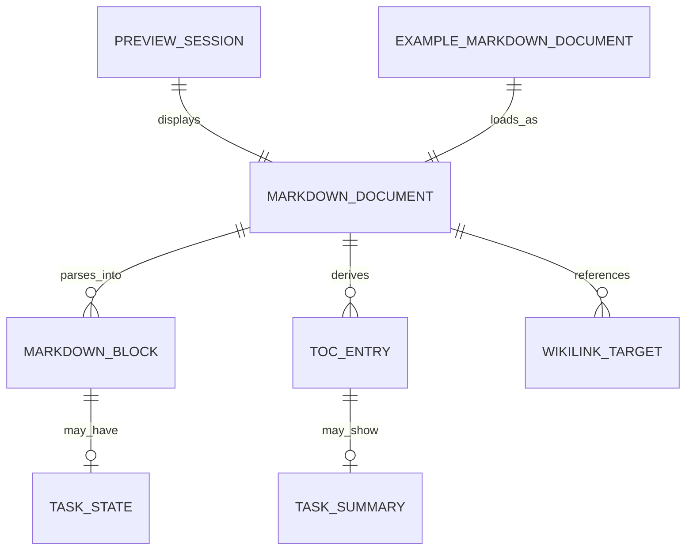
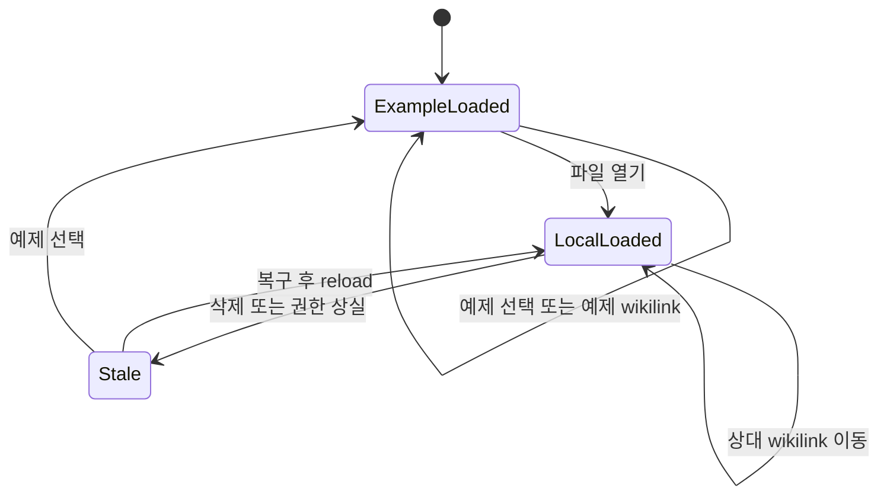
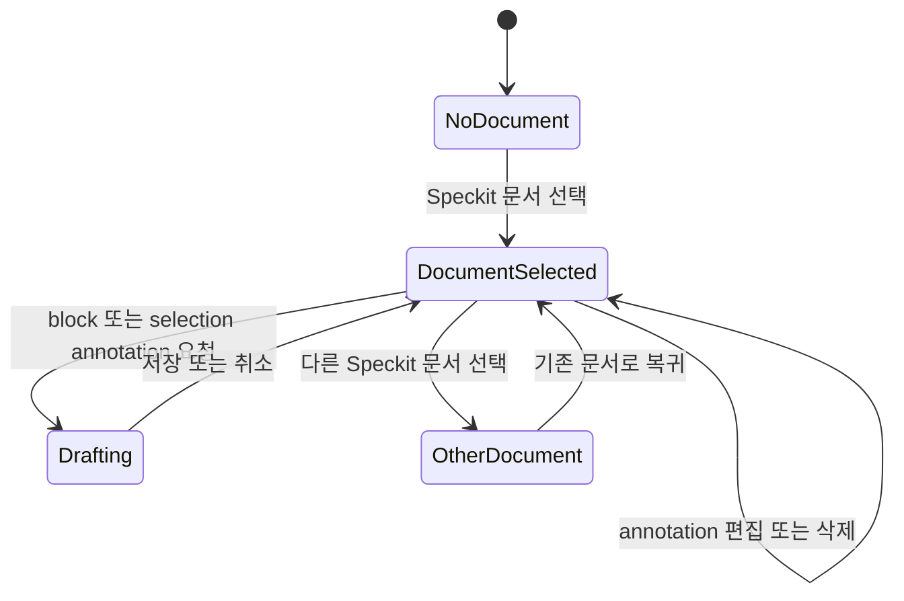

# Data Model: MA Spec Markdown Preview

## Entity Relationship

## MarkdownDocument

현재 Preview 입력 문서다.

| Field | Type | Rules |
|---|---|---|
| `fileName` | `string` | 표시 가능한 `.md` 파일 이름 |
| `absolutePath` | `string` | 로컬 문서는 정규화한 절대 경로, 예제는 `examples/markdown-annotator/*` 가상 경로 |
| `markdownText` | `string` | UTF-8, 최대 1MB 기준 |

## MarkdownBlock

annotation과 rendering의 안정적인 최소 단위다.

| Field | Type | Rules |
|---|---|---|
| `id` | `string` | 한 parse 결과 안에서 고유 |
| `type` | `MarkdownBlockType` | heading, paragraph, list-item, code, table 등 |
| `content` | `string` | 원문 의미와 순서 보존 |
| `startLine`, `endLine` | `number` | 1부터 시작, `endLine >= startLine` |
| `level` | `number?` | heading/list 깊이에만 사용 |
| `checked` | `boolean?` | GFM task에만 존재 |

## TaskState

`MarkdownBlock.checked`에서 파생하는 읽기 전용 상태다.

- `open`: `checked === false`, open icon과 남은 작업 강조
- `completed`: `checked === true`, completed icon과 낮은 강조/취소선
- `not-task`: `checked === undefined`, 일반 목록 렌더링

Preview에서는 상태 전이가 없다. 원본 파일이 외부에서 변경되어 다시 parse될 때만 상태가 교체된다.

## TaskSummary

| Field | Type | Rules |
|---|---|---|
| `completed` | `number` | 0 이상의 정수 |
| `open` | `number` | 0 이상의 정수 |

H1 chapter의 범위는 해당 H1 이후부터 다음 H1 직전까지다. H2/H3 및 nested task는 가장 가까운 선행 H1에 정확히 한 번 포함된다. H1 이전 task는 preamble summary로 집계된다. 합계가 0이면 summary를 생성하지 않는다.

## TocEntry

| Field | Type | Rules |
|---|---|---|
| `blockId` | `string` | heading block id와 동일 |
| `level` | `1 \| 2 \| 3` | H4 이하 제외 |
| `text` | `string` | inline formatting을 제거한 표시 제목 |
| `startLine` | `number` | source heading 위치 |
| `taskSummary` | `TaskSummary?` | task가 있는 H1 항목에만 존재 |

중복 제목도 `blockId`로 서로 다른 navigation target을 유지한다.

## WikilinkTarget

| Field | Type | Rules |
|---|---|---|
| `raw` | `string` | 원본 `[[...]]` 표현 |
| `target` | `string` | trim 후 비어 있지 않은 상대 이름 |
| `label` | `string` | alias가 없으면 target |
| `href` | `string` | `./target.md`; 이미 `.md`면 중복 추가하지 않음 |
| `resolvedPath` | `string?` | activation 시 현재 문서 디렉터리 기준 계산 |
| `status` | enum | `displayable`, `invalid`, `blocked`, `missing`, `readable` |

## ExampleMarkdownDocument

| Field | Type | Rules |
|---|---|---|
| `id` | `string` | 예제 목록에서 고유 |
| `fileName` | `string` | 영어 kebab-case `.md` |
| `title` | `string` | 산출물 유형을 구분하는 선택 문구 |
| `description` | `string` | 확인 가능한 Preview 요소 설명 |
| `markdownText` | `string` | build-time raw Markdown 내용 |

필수 예제 유형은 specification, plan, data model, tasks, requirements checklist 다섯 가지다. 예제는 읽기 전용이며 reload watcher를 시작하지 않는다.

## PreviewSession

| Field | Type | Rules |
|---|---|---|
| `document` | `MarkdownDocument` | 항상 현재 한 문서 |
| `tocEntries` | `TocEntry[]` | document 교체 시 함께 재계산 |
| `selectedExampleId` | `string` | 로컬 문서면 빈 값 |
| `status` | `string` | load/navigation/reload 결과 |
| `reloadError` | `string?` | 로컬 파일 갱신 실패에만 사용 |
| `isTocOpen` | `boolean` | 사용자 UI 상태 |

### State Transitions

## AwMarkdownAnnotationWorkspace

AW 일반 Markdown 및 Speckit Preview panel이 재사용하는 app-local interaction 상태다.

| Field | Type | Rules |
|---|---|---|
| `selectedDocumentPath` | `string \| null` | 현재 panel에서 선택한 worktree 상대 경로 |
| `annotationsByFile` | `Record<string, AnnotationDraft[]>` | 문서 경로별로 분리하며 다른 문서와 공유하지 않음 |
| `draftTarget` | `selection \| block \| null` | 현재 문서에 속한 annotation 입력 대상 |
| `selectionAnchors` | `AnnotationAnchor[]` | 현재 parse 결과의 block id/offset만 참조 |
| `selectionHighlightRects` | `SelectionRect[]` | 문서 전환 시 초기화되는 일시 UI 상태 |
| `editingAnnotationId` | `string \| null` | 현재 문서 annotation만 편집 가능 |

`tocEntries`는 현재 blocks에서, `annotationPrompt`는 현재 문서 경로·annotations·blocks에서 파생한다. 선택 문서가 바뀌면 draft/selection/editing 상태는 초기화하지만 `annotationsByFile`의 다른 경로 항목은 보존한다.

### AW Speckit Preview State Transitions

