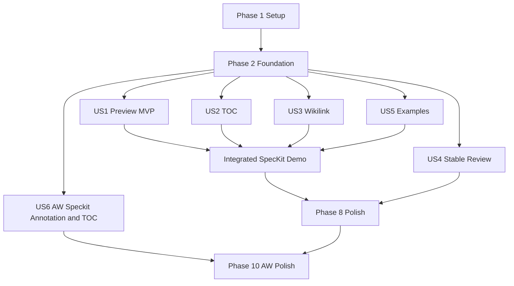

# Tasks: MA Spec Markdown Preview

**Input**: Design documents from `specs/029-ma-spec-markdown-preview/`

**Prerequisites**: [plan.md](./plan.md), [spec.md](./spec.md), [research.md](./research.md), [data-model.md](./data-model.md), [contracts/markdown-preview-contract.md](./contracts/markdown-preview-contract.md)

**Tests**: Parser, shared logic, shared React UI와 filesystem 경계 테스트는 constitution에 따라 필수이며 각 구현 전에 작성한다.

**Organization**: 작업은 사용자 스토리별로 구성하며 각 phase는 독립적으로 검증 가능한 increment를 만든다.

## Format: `[ID] [P?] [Story] Description`

- **[P]**: 미완료 작업과 파일 충돌 없이 병렬 실행 가능
- **[Story]**: spec의 사용자 스토리 추적 표식
- 모든 작업 설명은 구체적인 파일 경로를 포함한다.

## Phase 1: Setup (Shared Infrastructure)

**Purpose**: 기존 MA와 공유 Markdown package에서 feature fixture와 검증 surface를 준비한다.

- [X] T001 Verify the MA, core, React package, example, and Storybook paths from the implementation plan in `specs/029-ma-spec-markdown-preview/plan.md`
- [X] T002 [P] Add representative spec Markdown parser fixtures in `packages/markdown-annotation-core/src/parse/fixtures/spec-preview.md`
- [X] T003 [P] Add shared Preview fixture helpers for React tests in `packages/markdown-annotation-react/src/test-fixtures.ts`
- [X] T004 [P] Confirm MA raw Markdown example alias and type declarations in `apps/markdown-annotator/vite.config.ts`, `apps/markdown-annotator/tsconfig.json`, and `apps/markdown-annotator/src/vite-env.d.ts`

---

## Phase 2: Foundational (Blocking Prerequisites)

**Purpose**: 모든 사용자 스토리가 공유하는 Markdown block, inline 변환과 문서 상태 계약을 고정한다.

**⚠️ CRITICAL**: 이 phase가 완료되기 전에는 사용자 스토리 구현을 시작하지 않는다.

- [X] T005 [P] Add fixture tests for block ids, line ranges, GFM task state, code boundaries, and HTML5 comments in `packages/markdown-annotation-core/src/parse/parse-markdown-to-blocks.test.ts`
- [X] T006 [P] Add inline transformation tests for wikilinks and code-protected HTML5 comment text in `packages/markdown-annotation-core/src/parse/parse-inline-markdown.test.ts`
- [X] T007 Define task summary and Preview navigation types in `packages/markdown-annotation-core/src/types/markdown-block.ts`, `packages/markdown-annotation-core/src/types/toc.ts`, and `packages/markdown-annotation-core/src/types/index.ts`
- [X] T008 Implement shared Markdown block parsing boundaries for GFM tasks, fenced code, inline code, and HTML5 comments in `packages/markdown-annotation-core/src/parse/parse-markdown-to-blocks.ts`
- [X] T009 Implement `[[target]]` and `[[target | label]]` inline conversion without altering code spans in `packages/markdown-annotation-core/src/parse/parse-inline-markdown.ts`
- [X] T010 Export the foundational parser and types contracts from `packages/markdown-annotation-core/src/index.ts`
- [X] T011 Align the MA document/example lifecycle model with `MarkdownDocument` and `ExampleMarkdownDocument` in `apps/markdown-annotator/src/entities/document/index.ts` and `apps/markdown-annotator/src/entities/document/model/examples.ts`

**Checkpoint**: parser, types와 document lifecycle 기반이 준비되어 각 사용자 스토리를 구현할 수 있다.

---

## Phase 3: User Story 1 - Spec 문서를 읽기 좋은 Preview로 표시 (Priority: P1) 🎯 MVP

**Goal**: spec의 구조, GFM task, H1 chapter summary와 HTML5 주석 비표시를 포함한 읽기 중심 Preview를 제공한다.

**Independent Test**: 제목, 문단, 표, 일반 목록, task, 인용문, code와 한 줄·여러 줄 HTML5 주석이 있는 문서를 열어 실제 주석만 숨고 나머지 요소와 task 집계가 정확히 표시되는지 확인한다.

### Tests for User Story 1

- [X] T012 [P] [US1] Add failing renderer tests for open/completed tasks, nested and long content, links, inline code, ordinary bullets, and fenced code in `packages/markdown-annotation-react/src/MarkdownViewer.test.tsx`
- [X] T013 [US1] Add failing parser/renderer tests for single-line, multiline, adjacent, unclosed, fenced-code, and inline-code HTML5 comment cases in `packages/markdown-annotation-core/src/parse/parse-markdown-to-blocks.test.ts` and `packages/markdown-annotation-react/src/MarkdownViewer.test.tsx`
- [X] T014 [US1] Add failing tests for H1, preamble, taskless chapter, H2/H3, and nested task summaries in `packages/markdown-annotation-react/src/MarkdownViewer.test.tsx`

### Implementation for User Story 1

- [X] T015 [US1] Render GFM blocks with stable annotation shells and hide parsed HTML5 comment blocks in `packages/markdown-annotation-react/src/MarkdownViewer.tsx`
- [X] T016 [US1] Render read-only open/completed task icons, accessible state text, semantic colors, and completed text treatment in `packages/markdown-annotation-react/src/MarkdownViewer.tsx`
- [X] T017 [US1] Compute and render preamble and H1 chapter task summaries exactly once per task in `packages/markdown-annotation-react/src/MarkdownViewer.tsx`
- [X] T018 [US1] Preserve wide tables, long strings, nested lists, code blocks, and independent document scrolling in `packages/markdown-annotation-react/src/styles.css` and `apps/markdown-annotator/src/pages/annotator/AnnotatorPage.tsx`
- [X] T019 [US1] Register basic, task-state, chapter-summary, HTML5-comment, long-content, and code-boundary Preview states in `apps/markdown-annotator/src/stories/molecules/MarkdownViewer.stories.tsx`

**Checkpoint**: US1은 로컬/예제 spec 하나만으로 읽기 중심 Preview와 task/comment 동작을 독립 검증할 수 있다.

---

## Phase 4: User Story 2 - 문서 구조를 이용해 빠르게 이동 (Priority: P2)

**Goal**: H1~H3 문서 구조, 고유 heading target과 H1 task 정보를 가진 TOC navigation을 제공한다.

**Independent Test**: 중복 제목과 H1~H6, 긴 제목, task가 있는 여러 H1을 포함한 문서에서 TOC 순서·들여쓰기·task count와 선택 위치가 정확하고 제목 없는 문서가 본문을 방해하지 않는지 확인한다.

### Tests for User Story 2

- [X] T020 [P] [US2] Add failing fixture tests for H1~H3 extraction, H4~H6 exclusion, duplicate ids, inline formatting, and chapter task counts in `packages/markdown-annotation-core/src/toc/extract-toc-entries.test.ts`
- [X] T021 [P] [US2] Add failing markup tests for TOC order, indentation, accessible task summaries, taskless headings, and empty entries in `packages/markdown-annotation-react/src/MarkdownToc.test.tsx`
- [X] T022 [P] [US2] Add TOC selection and duplicate-heading scroll integration tests in `apps/markdown-annotator/src/pages/annotator/annotator-toc-navigation.test.tsx`

### Implementation for User Story 2

- [X] T023 [US2] Extract H1~H3 TOC entries and attach scoped H1 task summaries in `packages/markdown-annotation-core/src/toc/extract-toc-entries.ts`
- [X] T024 [US2] Render hierarchical TOC buttons with compact completed/open icons and accessible labels in `packages/markdown-annotation-react/src/MarkdownToc.tsx`
- [X] T025 [US2] Connect `TocEntry.blockId` selection to stable Preview scrolling and focus indication in `apps/markdown-annotator/src/pages/annotator/AnnotatorPage.tsx`
- [X] T026 [US2] Register basic, task-progress, long-list, duplicate-heading, H3-first, and empty TOC states in `apps/markdown-annotator/src/stories/molecules/MarkdownToc.stories.tsx`

**Checkpoint**: US2는 TOC만 사용해 모든 표시 heading으로 이동하고 chapter task 진행률을 확인할 수 있다.

---

## Phase 5: User Story 3 - Wikilink로 연결된 문서 이동 (Priority: P2)

**Goal**: wikilink를 올바른 label과 상대 `.md` 대상으로 표시하고 안전하게 연결 문서로 이동한다.

**Independent Test**: `[[link]]`, `[[link | 링크]]`, 연속 link, 한글/공백 target, 누락·자기참조·순환·범위 밖 target을 실행하여 성공 시 문서 상태가 교체되고 실패 시 현재 문서가 유지되는지 확인한다.

### Tests for User Story 3

- [X] T027 [P] [US3] Add failing wikilink output and malformed syntax tests in `packages/markdown-annotation-react/src/MarkdownViewer.test.tsx`
- [X] T028 [P] [US3] Add failing relative path, extension, root traversal, missing file, and example target resolution tests in `apps/markdown-annotator/src/features/open-document/resolveWikilinkTarget.test.ts`
- [X] T029 [P] [US3] Add document-state replacement and failure-preservation integration tests in `apps/markdown-annotator/src/pages/annotator/annotator-wikilink-navigation.test.tsx`

### Implementation for User Story 3

- [X] T030 [US3] Expose rendered wikilinks through an explicit click and keyboard activation contract in `packages/markdown-annotation-react/src/MarkdownViewer.tsx`
- [X] T031 [US3] Implement normalized `.md` target resolution and allowed-root validation in `apps/markdown-annotator/src/features/open-document/resolveWikilinkTarget.ts`
- [X] T032 [US3] Load matching bundled examples or delegate readable local targets through the document API in `apps/markdown-annotator/src/features/open-document/openWikilinkDocument.ts`
- [X] T033 [US3] Integrate wikilink navigation with document, TOC, annotation, selection, watcher, and error state replacement in `apps/markdown-annotator/src/pages/annotator/AnnotatorPage.tsx`

**Checkpoint**: US3는 연결된 Markdown 사이를 명시적 activation으로 이동하며 모든 실패/차단 사례에서 현재 문서를 보존한다.

---

## Phase 6: User Story 4 - 변경되는 Spec을 안정적으로 검토 (Priority: P3)

**Goal**: 외부 변경, 읽기 실패와 Mermaid 오류를 문서 전체 중단 없이 처리한다.

**Independent Test**: 로컬 spec을 수정·삭제하거나 권한을 제거하고 유효/잘못된 Mermaid와 긴 행을 표시하여 최신 상태, 복구 안내와 block 단위 오류 격리를 확인한다.

### Tests for User Story 4

- [X] T034 [P] [US4] Add document swap, unchanged reload, stale file, and recovery state tests in `apps/markdown-annotator/src/pages/annotator/annotator-auto-reload.test.tsx` and `apps/markdown-annotator/src/pages/annotator/model/document-reload.test.ts`
- [X] T035 [P] [US4] Add valid, invalid, expanded, and sibling-content Mermaid tests in `packages/markdown-annotation-react/src/MermaidBlock.test.tsx` and `apps/markdown-annotator/src/pages/annotator/mermaid-expanded-view.test.tsx`

### Implementation for User Story 4

- [X] T036 [US4] Preserve the Tauri document reader/watcher application boundary and reload only changed local content in `apps/markdown-annotator/src/entities/document/api/documentApi.ts` and `apps/markdown-annotator/src/pages/annotator/model/document-reload.ts`
- [X] T037 [US4] Integrate changed, stale, unreadable, and recovery status without watching bundled examples in `apps/markdown-annotator/src/pages/annotator/AnnotatorPage.tsx`
- [X] T038 [US4] Isolate Mermaid parse/render failures per block and retain accessible source fallback in `packages/markdown-annotation-react/src/MermaidBlock.tsx`
- [X] T039 [US4] Preserve keyboard-accessible Mermaid expansion and long diagram scrolling through MA adapters in `apps/markdown-annotator/src/shared/ui/markdown-viewer-components.tsx`

**Checkpoint**: US4는 변경·오류가 발생해도 최신 또는 마지막 식별 가능한 문서와 복구 경로를 유지한다.

---

## Phase 7: User Story 5 - 다양한 SpecKit 산출물 예제로 Preview 확인 (Priority: P3)

**Goal**: SpecKit 산출물 5종을 읽기 전용 예제로 선택하고 wikilink로 서로 이동하며 Preview 기능을 확인한다.

**Independent Test**: 예제 목록에서 specification, plan, data model, tasks, checklist를 각각 열고 제목/설명/TOC, task count, table/code/Mermaid와 예제 간 wikilink 이동을 확인한다.

### Tests for User Story 5

- [X] T040 [P] [US5] Add catalog uniqueness, required metadata, non-empty content, and required artifact coverage tests in `apps/markdown-annotator/src/entities/document/model/examples.test.ts`
- [X] T041 [P] [US5] Add example selection, read-only lifecycle, TOC replacement, and example-to-example wikilink tests in `apps/markdown-annotator/src/pages/annotator/annotator-examples.test.tsx`

### Implementation for User Story 5

- [X] T042 [P] [US5] Create the feature specification sample in `examples/markdown-annotator/speckit-spec.md`
- [X] T043 [P] [US5] Create the implementation plan sample in `examples/markdown-annotator/speckit-plan.md`
- [X] T044 [P] [US5] Create the data model sample with table, code, and Mermaid in `examples/markdown-annotator/speckit-data-model.md`
- [X] T045 [P] [US5] Create the tasks sample with completed/open chapter states in `examples/markdown-annotator/speckit-tasks.md`
- [X] T046 [P] [US5] Create the requirements checklist sample with completed/open states in `examples/markdown-annotator/speckit-checklist.md`
- [X] T047 [US5] Register all five raw Markdown fixtures with distinct metadata in `apps/markdown-annotator/src/entities/document/model/examples.ts`
- [X] T048 [US5] Display and load the expanded example catalog without starting local file reload behavior in `apps/markdown-annotator/src/pages/annotator/AnnotatorPage.tsx`

**Checkpoint**: US5는 로컬 파일 없이 다섯 SpecKit 문서와 문서 간 연결을 독립 시연한다.

---

## Phase 8: Polish & Cross-Cutting Concerns

**Purpose**: 모든 사용자 스토리의 접근성, 문서, 성능과 공유 소비 앱 회귀를 완료한다.

- [X] T049 [P] Add Korean usage and validation notes for Preview, wikilinks, tasks, HTML5 comments, and examples in `docs/markdown-annotator-preview.md`
- [X] T050 [P] Add a 2,000-block/1MB performance fixture and assertion in `packages/markdown-annotation-core/src/parse/parse-markdown-to-blocks.test.ts`
- [X] T051 Audit keyboard names, focus, light/dark contrast, and read-only task semantics in `packages/markdown-annotation-react/src/MarkdownViewer.tsx`, `packages/markdown-annotation-react/src/MarkdownToc.tsx`, and `apps/markdown-annotator/src/shared/ui/markdown-viewer-components.tsx`
- [X] T052 Run core and React package `check-types` and `test` commands documented in `specs/029-ma-spec-markdown-preview/quickstart.md`
- [X] T053 Run MA and AW consumer `check-types` and `test` commands documented in `specs/029-ma-spec-markdown-preview/quickstart.md`
- [X] T054 Run MA Vite and Storybook builds and complete the browser/Tauri scenarios in `specs/029-ma-spec-markdown-preview/quickstart.md`
- [X] T055 Re-check constitution boundaries, remove unresolved placeholders, and record completion evidence in `specs/029-ma-spec-markdown-preview/plan.md` and `specs/029-ma-spec-markdown-preview/quickstart.md`

---

## Phase 9: User Story 6 - AW에서도 동일한 Markdown Preview 사용 (Priority: P2)

**Goal**: AW Speckit Preview panel에서 일반 Markdown workspace와 동일한 annotation 생성·편집·삭제·agent prompt 및 H1~H3 TOC 탐색을 제공한다.

**Independent Test**: Speckit 문서 두 개를 번갈아 선택하며 block/selection annotation을 생성·편집·삭제하고 prompt를 전송한 뒤, 문서별 상태 격리와 TOC heading 이동 및 H1 task count가 정확한지 확인한다.

### Tests for User Story 6

- [X] T056 [P] [US6] Add failing reducer/hook tests for per-document annotations, selection reset, editing reset, and return-to-document preservation in `apps/agentic-workbench/src/features/worktree-workspace/model/use-markdown-annotation-workspace.test.ts`
- [X] T057 [P] [US6] Add failing UI contract tests for annotation list, selection toolbar, dialog, prompt Send state, and callback wiring in `apps/agentic-workbench/src/features/worktree-workspace/ui/markdown-annotation-workspace.test.tsx`
- [X] T058 [P] [US6] Add failing Speckit integration tests for `extractTocEntries`, duplicate heading scroll, H1 task counts, document switching, and annotation isolation in `apps/agentic-workbench/src/features/worktree-workspace/ui/speckit-preview-annotation.test.tsx`

### Implementation for User Story 6

- [X] T059 [US6] Extract document-keyed annotation, draft, selection, editing, viewer-map, and prompt state from the general Markdown tab into `apps/agentic-workbench/src/features/worktree-workspace/model/use-markdown-annotation-workspace.ts`
- [X] T060 [US6] Build a reusable annotation-enabled Preview surface with block actions, selection toolbar, annotation list, agent prompt, dialog, and TOC slots in `apps/agentic-workbench/src/features/worktree-workspace/ui/markdown-annotation-workspace.tsx`
- [X] T061 [US6] Refactor the general Markdown workspace to consume the extracted model and reusable Preview surface without behavior changes in `apps/agentic-workbench/src/features/worktree-workspace/ui/worktree-workspace-panel.tsx`
- [X] T062 [US6] Connect Speckit document path, parsed blocks, annotation maps, block callbacks, selection capture, and per-file lifecycle to the reusable workspace in `apps/agentic-workbench/src/features/worktree-workspace/ui/worktree-workspace-panel.tsx`
- [X] T063 [US6] Connect Speckit annotation editing, deletion, agent prompt generation, and `onSendAnnotationPrompt` propagation from the session workspace in `apps/agentic-workbench/src/features/worktree-workspace/ui/worktree-workspace-panel.tsx`
- [X] T064 [US6] Render `MarkdownPreviewToc` beside the Speckit Preview and scroll selected entries within the Speckit preview container in `apps/agentic-workbench/src/features/worktree-workspace/ui/worktree-workspace-panel.tsx`
- [X] T065 [US6] Reset transient selection, highlights, dialog, and editing state on Speckit document changes while preserving path-keyed annotations in `apps/agentic-workbench/src/features/worktree-workspace/model/use-markdown-annotation-workspace.ts`
- [X] T066 [US6] Register Speckit annotation empty, annotated, multi-document, task-TOC, and long-content states in `apps/agentic-workbench/src/stories/organisms.stories.tsx`

**Checkpoint**: US6는 Speckit panel 안에서 annotation과 TOC를 독립적으로 완료하고 일반 Markdown workspace의 기존 동작을 유지한다.

---

## Phase 10: AW Speckit Preview Polish & Verification

**Purpose**: 새 AW 통합의 문서, 접근성, 회귀와 실행 검증을 완료한다.

- [X] T067 [P] Document AW Speckit annotation and TOC usage with a Mermaid interaction flow in `docs/markdown-annotator-preview.md`
- [X] T068 Run AW `check-types`, tests, and production build plus shared core/React and MA consumer regression commands in `specs/029-ma-spec-markdown-preview/quickstart.md`
- [X] T069 Run the AW Tauri Speckit annotation/TOC scenarios and record validation evidence in `specs/029-ma-spec-markdown-preview/quickstart.md`

---

## Dependencies & Execution Order

### Phase Dependencies

- **Setup (Phase 1)**: 의존성 없이 시작할 수 있다.
- **Foundational (Phase 2)**: Setup 완료 후 진행하며 모든 사용자 스토리를 차단한다.
- **US1 (Phase 3)**: Foundational 완료 후 시작하는 MVP다.
- **US2 (Phase 4)**: Foundational의 block/type 계약에만 의존하며 US1 renderer와 통합 가능하다.
- **US3 (Phase 5)**: Foundational inline/link 계약에 의존하며 US2와 병렬 진행 가능하다.
- **US4 (Phase 6)**: Foundational document lifecycle에 의존하며 다른 story와 병렬 진행 가능하다.
- **US5 (Phase 7)**: Foundational example model에 의존한다. 완전한 시연은 US1~US3 완료 후 가능하지만 catalog 자체는 독립 구현 가능하다.
- **Polish (Phase 8)**: 기존 US1~US5 구현 완료 후 진행한다.
- **US6 (Phase 9)**: 완료된 공용 Preview와 AW 일반 Markdown annotation workspace에 의존하며 T056~T058 테스트 후 T059~T066 순서로 진행한다.
- **AW Polish (Phase 10)**: US6 완료 후 문서와 전체 소비 앱 회귀를 검증한다.

### User Story Dependency Graph



### Within Each User Story

- 필수 테스트를 먼저 작성하고 실패를 확인한다.
- pure core/type 구현 후 shared React UI를 구현한다.
- domain/feature 동작 후 page integration을 연결한다.
- story checkpoint를 통과한 뒤 다음 우선순위로 이동한다.

### Parallel Opportunities

- T002~T004 setup fixture/configuration은 서로 다른 파일에서 병렬 가능하다.
- T005와 T006 foundational parser tests는 서로 다른 parser 관심사로 병렬 가능하다.
- Foundation 후 US2, US3, US4, US5 catalog 작업은 병렬 시작할 수 있다.
- 각 story의 `[P]` test는 구현 전에 병렬 작성할 수 있다.
- T042~T046 SpecKit fixture 5종은 완전히 병렬 생성 가능하다.
- T052와 T053은 machine resource가 허용하면 package와 consumer 검증을 병렬 실행할 수 있다.
- T056~T058은 서로 다른 model/UI/integration test 파일에서 병렬 작성할 수 있다.
- T067 문서 갱신은 US6 구현 파일과 독립적으로 진행할 수 있다.

## Parallel Examples

### User Story 1

```text
T012: packages/markdown-annotation-react/src/MarkdownViewer.test.tsx task rendering cases
T013: core/react HTML5 comment boundary cases
T014: packages/markdown-annotation-react/src/MarkdownViewer.test.tsx chapter summary cases
```

T012와 T014는 동일 파일 충돌을 피하도록 한 작업자가 연속 수행하고, T013의 core test 부분은 병렬 수행할 수 있다.

### User Story 2

```text
T020: core TOC fixture tests
T021: React TOC markup tests
T022: MA TOC integration tests
```

### User Story 3

```text
T027: shared renderer wikilink tests
T028: MA target resolver safety tests
T029: MA page navigation integration tests
```

### User Story 4

```text
T034: document reload lifecycle tests
T035: Mermaid renderer and expanded view tests
```

### User Story 5

```text
T042: specification fixture
T043: plan fixture
T044: data model fixture
T045: tasks fixture
T046: checklist fixture
```

### User Story 6

```text
T056: document-keyed annotation model tests
T057: reusable annotation workspace UI tests
T058: Speckit Preview integration and TOC tests
```

## Implementation Strategy

### MVP First (User Story 1 Only)

1. Phase 1 Setup을 완료한다.
2. Phase 2 Foundational을 완료한다.
3. Phase 3 US1 Preview를 구현한다.
4. HTML5 주석, GFM task, chapter summary와 일반/code 경계를 독립 검증한다.
5. Preview MVP를 시연한 뒤 다음 story로 확장한다.

### Incremental Delivery

1. Setup + Foundation → 안정적인 block/parser 계약
2. US1 → 읽기 중심 Preview MVP
3. US2 → TOC와 chapter task 진행률
4. US3 → 연결 문서 이동
5. US4 → 변경 감지와 오류 복구
6. US5 → SpecKit 예제 catalog와 통합 시연
7. US6 → AW Speckit annotation과 TOC
8. Polish → 접근성, 성능, 문서와 교차 앱 회귀 완료

### Parallel Team Strategy

Foundation 완료 후 서로 다른 담당자가 US2 TOC, US3 navigation, US4 reload/Mermaid, US5 fixtures를 병렬 진행할 수 있다. 기존 phase 완료 후 US6의 model, reusable UI와 Speckit integration test를 병렬 준비하고 구현은 model → UI → panel integration 순서로 진행한다. 공유 package 파일을 수정하는 담당자는 merge 순서를 core → React → 소비 앱으로 조정한다.

## Notes

- `[P]`는 파일과 선행 의존성이 겹치지 않는 작업만 표시한다.
- `[USn]`은 spec 사용자 스토리와 직접 연결한다.
- 공유 package 변경은 MA와 AW consumer 검증 없이는 완료되지 않는다.
- HTML5 주석은 실제 Markdown 문맥에서만 숨기고 code 내부 문자열을 보존한다.
- task checkbox는 Preview에서 변경할 수 없는 읽기 전용 상태다.
- 각 checkpoint에서 독립 검증하고 논리적 작업 단위로 commit한다.
