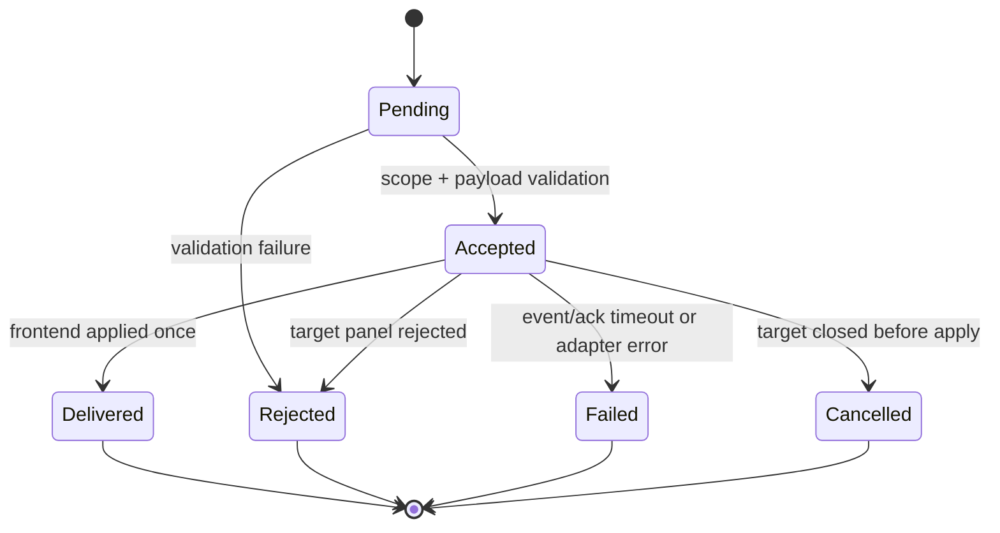

# Data Model: Agent Run 탭·타일 워크스페이스

## Frontend workspace

### `AgentRunWorkspaceState`

| Field | Type | Rule |
|------|------|------|
| `viewMode` | `"tabs" \| "tiles"` | 기본값 `tabs` |
| `slots` | `AgentRunPanelSlot[]` | panel ID 고유, Main 정확히 하나 |
| `focusedPanelId` | `string` | 항상 열린 leaf/slot 중 하나 |
| `layout` | `TileLayoutNode` | 모든 slot ID가 정확히 한 leaf로 존재 |
| `nextExtraSequence` | `number` | 감소하지 않음 |
| `exchanges` | `AgentExchangeSummary[]` | 최근 상태 표시용, request ID 고유 |

`activePanelId`는 `focusedPanelId`로 의미를 확장한다. 탭 모드에서는 표시할 탭이고, 타일 모드에서는 command와 외부 prompt의 기본 대상이다.

### `AgentRunPanelSlot`

기존 필드 `id`, `kind`, `title`, `externalPromptRequest`, `isRunning`, `activeRunId`, `closeState`를 유지한다. 다음 ephemeral metadata를 추가한다.

| Field | Type | Rule |
|------|------|------|
| `lastFocusedAt` | monotonic number | spatial fallback tie-break |
| `pendingExchangeCount` | non-negative number | 수신 대기/실패 badge |

### `TileLayoutNode`

```text
TileLeaf
  type: "leaf"
  panelId: string

TileSplit
  type: "split"
  id: string
  orientation: "horizontal" | "vertical"
  ratio: number
  first: TileLayoutNode
  second: TileLayoutNode
```

Validation:

- `0.15 <= ratio <= 0.85`.
- 동일 panel ID가 두 leaf에 존재할 수 없다.
- split은 자식 두 개를 반드시 가진다.
- depth는 v1에서 4 이하이다.
- slot 집합과 leaf 집합은 동일하다.

Operations:

- `splitLeaf(panelId, newPanelId, placement)`: `right`는 horizontal, `below`는 vertical split을 만들며 현재 leaf를 `first`, 새 leaf를 `second`로 둔다.
- `removeLeaf(panelId)`: target 부모를 sibling subtree로 치환한다.
- `resizeSplit(splitId, ratio)`: clamp 후 새 tree를 반환한다.
- `flattenLeaves()`: 탭 순서와 키보드 순회를 위한 depth-first 순서.
- `findSpatialNeighbor(panelId)`: 닫기 후 동일 parent sibling의 첫 leaf를 우선한다.

## Backend workspace registry

### `AgentWorkspaceSnapshot`

| Field | Type | Rule |
|------|------|------|
| `windowLabel` | string | inbound window에서 주입, client 입력 무시 |
| `worktreePath` | canonical absolute path | root/worktree validation 통과 |
| `revision` | unsigned integer | 이전 revision보다 커야 적용 |
| `focusedPanelId` | string | endpoint 중 하나 |
| `panels` | `AgentPanelEndpoint[]` | 최대 8, ID 고유 |

### `AgentPanelEndpoint`

| Field | Type | Rule |
|------|------|------|
| `panelId` | string | 창 안에서 안정적이고 고유 |
| `title` | string | 표시용, 주소로 사용 금지 |
| `runId` | string? | active run이 있을 때 registry owner가 같은 창인지 검증 |
| `status` | `"idle" \| "running" \| "closing"` | closing은 peer 대상에서 제외 |

Snapshot 동기화 시 client가 보낸 `runId`는 기존 session registry의 active owner가 `windowLabel`과 일치할 때만 endpoint에 결합한다.

## Agent exchange

### `AgentExchange`

| Field | Type | Rule |
|------|------|------|
| `requestId` | UUID string | window 범위 idempotency key |
| `actor` | `User \| Agent` | Agent이면 source run 필수 |
| `source` | `ExchangeEndpointRef` | window/worktree scope 검증 |
| `target` | `ExchangeEndpointRef` | 현재 snapshot과 exact match |
| `message` | string | trim 후 1..16,384 UTF-8 bytes |
| `delivery` | `send \| queue \| draft` | 기존 frontend contract와 동일 |
| `status` | exchange state | 단방향 전이 |
| `failureCode` | enum? | rejected/failed에서 제공 |
| `createdAt` | timestamp | server 생성 |
| `updatedAt` | timestamp | 상태 전이마다 갱신 |

### `ExchangeEndpointRef`

| Field | Type | Rule |
|------|------|------|
| `windowLabel` | string | source actor 또는 target snapshot에서 결정 |
| `worktreePath` | canonical path | source/target 동일해야 함 |
| `panelId` | string | 안정적인 panel 주소 |
| `runId` | string? | agent source와 active target에는 exact current ID |

### States



Terminal states cannot transition. Repeated request ID returns the existing exchange without re-emitting delivery.

### Failure codes

- `invalid_message`
- `message_too_large`
- `unknown_source`
- `unknown_target`
- `stale_source_run`
- `stale_target_run`
- `scope_mismatch`
- `target_closing`
- `duplicate_conflict`
- `delivery_failed`
- `ack_timeout`

## Synchronization lifecycle

1. Frontend creates workspace state and sends revision 1 snapshot.
2. Slot add/close/run state changes increment revision and sync a full small snapshot.
3. Backend discards stale revisions and revalidates run ownership.
4. Window destroy removes snapshot and pending exchanges.
5. Run completion leaves panel endpoint idle on the next frontend sync; stale run-targeted exchange is rejected.
