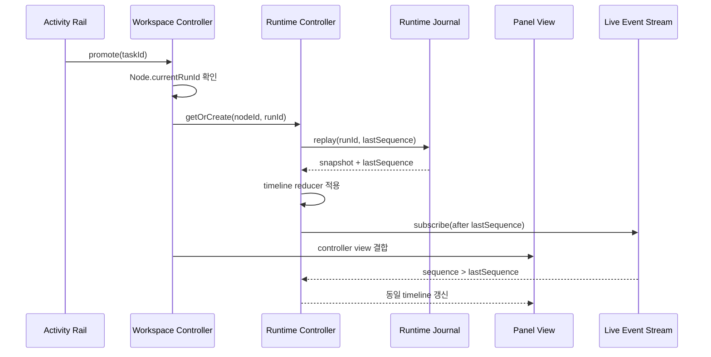

# UI Contract: Orchestration Workspace

## 화면 구조

Worktree agent 영역은 위에서 아래 순서로 구성한다.

1. 기존 탭/타일 toolbar
2. 탭 또는 타일 panel projection
3. Task Activity Rail
4. 공용 Workspace Prompt Composer

좁은 agent 영역에서는 Activity Rail을 접을 수 있지만 attention count와 실행 수는 항상
확인할 수 있어야 한다. Composer는 workspace에 하나만 표시한다.

## Main과 Child 표시

- Main Node는 `main-agent-run`이며 삭제/분리 command가 없다.
- 모든 추가 Node는 Main의 직접 Child다.
- 역할명과 task status는 panel header와 Activity Rail에서 일치해야 한다.
- manually created extra도 Main Child이며 task가 없으면 `unassigned`로 표시한다.
- Child가 Child를 만들거나 sibling을 직접 제어하는 UI는 제공하지 않는다.

## 공용 Composer

### Target modes

- `focused`: 현재 focused panel 하나
- `selected`: 사용자가 명시적으로 선택한 panel 집합
- `all`: submit 시 open panel 전체, Main 포함
- `coordinator`: Main에 목표 위임

Focus와 selection은 독립적이다. tile click은 focus만 바꾸고 selection을 임의로 변경하지
않는다.

### Intent

- `focused`, `selected`, `all`은 **직접 명령**
- `coordinator`는 **목표 위임**

라벨과 submit action에서 두 intent를 명시적으로 구분한다. Coordinator 모드는 active
Main run이 없으면 disabled 상태와 시작 조건을 표시한다.

### Draft와 panel runtime

- 화면에는 textarea 하나만 렌더한다.
- panel/runtime별 draft slot은 controller가 유지할 수 있다.
- focus/target 변경 시 해당 slot의 draft를 같은 textarea에 표시한다.
- incoming `draft`가 비초점 panel을 대상으로 하면 focus를 바꾸지 않고 draft badge를
  표시한다.
- queue, prompt history, steer와 run settings는 panel runtime controller가 소유한다.
- multi-target mode에서는 각 target의 현재 profile을 그대로 사용하고, 서로 다른 profile
  요약을 표시한다.

### Dispatch status

Composer 인접 영역에 대상별 상태를 표시한다.

```text
Reviewer   delivered
Tester     rejected · stale run       [다시 시도]
Research  accepted
```

일부 실패가 발생해도 입력 text와 성공 대상 기록을 잃지 않는다. 실패 대상만 새
request ID로 재시도할 수 있다.
orchestration Child 대상의 `delivered`는 runtime worker의 accepted receipt 이후에만
표시한다. panel slot에 prompt가 기록됐거나 run ID가 존재한다는 이유만으로 delivered로
표시하지 않는다.

## Task Activity Rail

각 row는 다음 정보를 제공한다.

- task title과 role
- 부모 Main 및 assigned Child
- task, execution, presentation 세 상태
- 경과 시간과 최근 활동 시각
- provider/profile/model
- progress와 최신 report 요약
- input request, failure와 partial result
- artifact count

가능한 action:

- 패널로 열기
- 입력 응답
- 다시 시도
- 재배정
- 취소
- 결과 보기
- 종료 task archive

Action은 현재 상태와 사용자 권한에 따라 노출한다. disabled action은 이유를 accessible
description으로 제공한다.

### Child command delivery

- 입력 응답, 후속 메시지, interrupt와 cancel은 panel-local queue가 아니라 backend
  application command service로 보낸다.
- 각 action은 pending/dispatching/accepted/failed 상태를 task row에 표시한다.
- 입력 응답은 worker가 accepted한 뒤에만 입력 form을 닫고 task를 실행 중으로 표시한다.
- 실패한 입력 응답 text는 유지하며 동일 request retry와 새 request retry를 구분한다.
- retry/reassign은 새 attempt/run이 실제 starting/active가 될 때까지 진행 상태를 표시한다.
- panel이 열려 있지 않아도 같은 command delivery 계약을 사용한다.

## Attention

- `inputRequired`, `blocked`, `failed`는 Activity Rail badge와 live region에 표시한다.
- attention event는 현재 tab/tile focus를 자동으로 바꾸지 않는다.
- 사용자가 `패널로 열기`를 실행하면 명시적 focus 이동을 허용한다.
- 여러 attention이 동시에 발생하면 최근 활동 순으로 나열하고 개수 badge를 표시한다.

## 승격

`promoteTask(taskId, placement, anchorPanelId)`:

1. durable presentation을 `promoting`으로 변경한다.
2. `Node.currentRunId`와 execution status를 authoritative runtime binding으로 읽는다.
3. 기존 Node/runtime controller를 찾거나 같은 run ID로 생성한다.
4. controller가 hydrate되지 않았다면 journal snapshot을 적용하고 last sequence 이후
   live event subscription을 연결한다.
5. 기존 tile reducer로 `right` 또는 `below` leaf를 삽입한다.
6. panel view를 controller에 결합하여 같은 `panelId`, `runId`, timeline, queue와
   settings를 사용한다.
7. 성공하면 `panel`, 실패하면 이전 presentation으로 복귀한다.

새 run을 시작하거나 기존 prompt를 재전송하지 않는다.

### Runtime rehydration 계약

- `AgentRunPanel` 또는 이를 대체하는 view는 기존 Child의 `runId`, execution status와
  controller를 명시적 입력으로 받아야 한다.
- panel view 자체는 `activeRunId=null`인 새 runtime state를 만들지 않는다.
- mount 직후 발생하는 빈 state callback은 workspace의 기존 run binding을 변경할 수 없다.
- background observer와 visible panel은 별도의 cursor/reducer를 갖지 않고 동일한
  controller를 구독한다.
- journal snapshot event와 live event는 같은 timeline reducer에 입력한다.
- snapshot 적용이 끝난 sequence를 기록한 뒤 그보다 큰 live event만 적용한다.
- promotion 중 도착한 event도 sequence 기준으로 정확히 한 번 표시한다.



### Empty, gap와 runtime lost 표현

- journal과 live stream에 event가 아직 없지만 runtime binding이 유효하면
  `ACP 이벤트 대기 중`과 run 연결 상태를 표시한다.
- `ACP 응답이 아직 없습니다` 같은 빈 timeline 문구만으로 agent 무응답이나 task 정지를
  단정하지 않는다.
- journal gap이면 `일부 이전 이벤트를 복원할 수 없음`을 표시하고 durable task report와
  결과를 함께 제공한다.
- runtime owner가 없으면 `runtimeLost`를 표시하고 retry/recover action을 제공한다.
- task status와 runtime timeline 신뢰 상태를 별도 label로 표시한다.

## 분리와 취소

- orchestration task panel의 close action은 `패널 닫고 백그라운드에서 계속`이다.
- close는 tile leaf와 presentation만 변경한다.
- `작업 취소`는 Activity Rail/명시적 menu의 별도 destructive action이다.
- task에 연결되지 않은 legacy manual extra는 기존 running close confirmation을 유지한다.
  사용자는 먼저 task로 전환하거나 기존대로 run을 취소하고 닫을 수 있다.

## 탭·타일 회귀 계약

- view 전환은 Node/runtime controller를 remount하지 않는다.
- 타일 진입은 현재 open panel을 탭 순서 기준 동일 가로 비율로 정규화한다.
- 세 open panel은 `1:1:1`이다.
- background Node는 equal ratio 계산에 포함하지 않는다.
- 오른쪽/아래 열기, resize, focus, panel limit 8과 depth limit 4를 유지한다.
- panel 승격/분리는 Main과 다른 panel의 layout/run state를 변경하지 않는다.

## Coordinator handoff

새 Main run이 생기고 이전 generation에 비종료 task가 있으면 handoff dialog/rail banner를
표시한다.

- 이전 generation 요약
- task별 상태, 부분 결과, 입력 요청
- `인계`, `남은 작업 취소`, `미할당으로 유지`

기본 선택은 없으며 사용자 확인 전 submit하지 않는다.

## Loading, empty, error states

- Bootstrap loading: panel은 유지하고 Composer delegation만 비활성
- Main inactive: direct panel 명령은 가능, Coordinator delegation은 비활성
- Empty tasks: Activity Rail에 "Main에 목표를 위임해 시작" 안내
- Worker capacity: ready/queued 이유와 예상 next action 표시
- Persistence error: durable mutation 실패를 표시하고 성공으로 낙관 반영하지 않음
- Runtime lost: partial reports/results와 retry/recover action 표시
- Long role/task names: 한 줄 truncation + 전체 accessible label

## Accessibility

- target mode는 single-select group
- selected panels는 multi-select list/checkbox
- task/execution/presentation status는 색상 외 text/icon을 함께 사용
- live status는 중복 announce를 방지하는 stable key 사용
- keyboard로 target 변경, task row 이동, open/respond/retry/cancel 가능
- focus는 사용자 action 외 event로 이동하지 않음

## Storybook

- atoms: status badge, role badge, attention indicator
- molecules: target selector, dispatch target status, task activity item
- organisms: Composer, Activity Rail, handoff dialog, panel promotion workspace
- pages: Main + Researcher/Reviewer/Tester parallel scenario

각 범주에 loading, empty, input required, partial failure, long content, narrow width와
read-only violation 상태를 포함한다.
