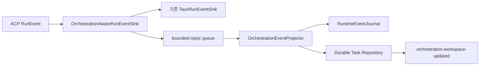

# Interface Contract: Orchestration Worker Runtime

## 목적

AW의 작업 모델과 실제 agent provider 실행을 분리한다. 첫 adapter는 기존 ACP 실행
primitive를 사용하고, provider-native subagent adapter는 같은 port 뒤에 후속 추가한다.

## `AgentWorkerPort`

개념 계약:

```text
start_worker(WorkerAssignment) -> StartWorkerOutcome
send_prompt(WorkerBinding, message, delivery) -> DeliveryOutcome
interrupt_worker(WorkerBinding) -> InterruptOutcome
cancel_worker(WorkerBinding) -> CancelOutcome
is_active(WorkerBinding) -> bool
```

모든 inbound adapter는 이 port를 application command service를 통해 호출한다. Tauri UI와
MCP handler가 worker를 직접 조립하거나 상태 전이만 별도로 수행하지 않는다.

### `WorkerAssignment`

| Field | Rule |
| --- | --- |
| `workspaceId` | current bound workspace |
| `windowLabel` | server-injected owner |
| `worktreePath` | immutable canonical path |
| `nodeId` | Main direct Child |
| `taskId` | current task |
| `attempt` | task attempt |
| `plannedRunId` | repository에 먼저 저장된 고유 ID |
| `role` | 역할/책임/기대 결과 |
| `objective` | task objective |
| `constraints` | read-only, same-worktree 포함 |
| `runtimeProfile` | read-only 지원 profile |
| `mcpCapability` | run-scoped opaque token |

### Start outcome

- `started { runId }`
- `queued { position }` — FIFO 대기 순번. 상한 초과 자체를 오류로 반환할 때의 code는
  `capacityExceeded`다.
- `failed { code, message, retryable }`

## 시작 transaction과 lease

1. repository expected revision을 검증한다.
2. task를 `ready`, Node execution을 `starting`으로 바꾸고 planned run ID와 launch lease를
   atomic 저장한다.
3. repository lock을 놓는다.
4. adapter가 기존 ACP launch primitive를 호출한다.
5. 성공 시 run binding과 execution `active`를 저장한다.
6. global capacity 부족이면 lease를 해제하고 task를 `ready` queue로 되돌린다.
7. launch 오류이면 execution `stopped`, task `failed(workerLaunchFailed)`를 저장한다.

process start 중 repository lock을 유지하지 않는다. stale lease는 reconciliation에서
`workerUnavailable`로 정리한다.

## ACP adapter

`AcpAgentWorkerAdapter`는 다음 기존 요소를 재사용한다.

- `StartAgentRunUseCase`
- `SendPromptUseCase`
- `SteerPromptUseCase`
- `CancelAgentRunUseCase`
- `AppState`/`SessionRegistry`
- `AcpAgentRunner`
- `TauriRunEventSink`

AW panel/task 개념은 `acp-agent-core`에 추가하지 않는다.
현재 `start_agent_run` inbound command에 있는 agent catalog, command override, MCP launch
환경과 session store 조립은 app-local launch factory로 추출하여 Main command와 Worker
adapter가 함께 사용한다. adapter가 inbound command를 다시 호출하거나 해석 로직을
복제하지 않는다.

자동 Worker request:

- `runId = plannedRunId`
- `cwd = canonical worktreePath`
- `permissionMode = readOnly`
- `autoAllow = false`
- profile이 read-only capability를 지원해야 함
- goal에는 역할, 목적, 제약, 기대 결과와 `aw_report_result` 의무를 포함
- MCP server config에는 해당 run의 capability만 포함
- Ralph loop는 기본 비활성

## Read-only enforcement

1. 지원 가능한 provider profile만 scheduler 후보로 사용한다.
2. provider의 read-only/plan configuration을 강제한다.
3. mutation permission request는 자동 deny한다.
4. worker start 기준 worktree change fingerprint를 기록한다.
5. worker가 만든 것으로 귀속 가능한 file change가 관측되면 즉시 interrupt/cancel하고
   `readOnlyViolation`을 기록한다.
6. 자동 revert는 하지 않는다. 다른 사용자/run 변경을 파괴할 수 있기 때문이다.

generic provider에서 읽기 전용을 기술적으로 보장할 수 없으면 launch하지 않고
`unsupportedReadOnlyProfile`을 반환한다.

## Runtime event projection

`OrchestrationAwareRunEventSink`는 기존 UI event sink를 감싸고 bounded channel로
normalized runtime signal을 보낸다. sink의 동기 emit 안에서 JSON I/O를 실행하지 않는다.



각 run event에 monotonic sequence를 붙인다.

| Runtime signal | Execution mapping | Task mapping |
| --- | --- | --- |
| Started/Initialized/SessionCreated/PromptSent | active | running 유지 |
| PromptCompleted | idle | 완료 아님 |
| explicit task result | idle/active | completed |
| Cancelled | stopped | cancelled가 이미 확정된 경우 유지 |
| process Completed + result 있음 | stopped | completed 유지 |
| process Completed + result 없음 | stopped | failed(workerExitedWithoutResult) |
| launch 전 Error | stopped | failed(workerLaunchFailed) |
| active 중 diagnostic Error | active/idle | attention, 즉시 완료 아님 |

terminal task는 늦은 runtime signal로 역행하지 않는다.

## Runtime event journal

- active/recent run별 sequence와 `RunEventEnvelope`를 bounded memory에 유지한다.
- workspace-owned runtime controller는
  `replay_orchestration_runtime_events(runId, afterSequence)`로
  snapshot을 읽은 뒤 live event를 구독한다.
- snapshot/live 중복은 `(runId, sequence)`로 제거한다.
- background observer와 visible panel은 동일한 controller, cursor와 timeline reducer를
  사용한다. observer는 snapshot cursor만 갱신하고 event payload를 버릴 수 없다.
- panel 승격은 `AgentNode.currentRunId`와 execution status를 controller에 주입하며,
  panel-local 빈 초기 상태가 이 binding을 덮어쓰지 못한다.
- snapshot 결과는 `runId`, events, `lastSequence`, terminal과 `gapDetected`를 포함한다.
- `gapDetected=true`이면 durable report를 함께 표시하고 전체 timeline이 복원됐다고
  간주하지 않는다.
- journal은 panel 승격과 frontend remount 복구를 위한 것이며 durable task 결과가 아니다.
- window close/app crash 뒤 journal이 없으면 task reports/results만 표시하고 runtime은
  `runtimeLost`로 조정한다.

## Scheduler

- workspace별 configurable limit과 기존 app 전체 ACP limit을 모두 적용한다.
- dependency가 완료되고 handoff가 필요 없으며 Node/profile이 준비된 task만 ready다.
- ready queue는 `(createdSequence, taskId)`의 안정적인 FIFO다.
- 대표 시나리오는 Main + 3 Child의 active run 4개다.
- 한 worker의 launch/result 실패는 다른 worker를 취소하지 않는다.

## Window lifecycle

- Worktree Session 창 종료 시 live run은 기존 정책대로 취소한다.
- durable task/report는 삭제하지 않는다.
- nonterminal task는 `blocked(workspaceClosed)` 또는 `failed(runtimeLost)`로 남긴다.
- 같은 worktree의 새 창에 자동 attach하지 않는다.
- 사용자가 recoverable workspace를 선택하면 새 window binding과 generation handoff를
  명시적으로 수행한다.

## Provider-native adapters

후속 adapter는 같은 `AgentWorkerPort` 결과와 signal을 제공해야 한다.

- Codex App Server adapter: thread lifecycle, persistence, bidirectional event 활용
- Claude native adapter: subagent/background/role permission 활용
- isolated worktree adapter: write-capable Worker를 별도 worktree에서 실행

provider-native 상태는 AW의 Task/Execution/Presentation status로 normalize하며 provider가
AW의 durable source of truth를 대체하지 않는다.

## Outbox command dispatcher

1. application service가 full payload fingerprint와 current attempt/run binding을 검증한다.
2. `TaskCommand(pending)`을 durable 저장한다.
3. dispatcher가 command lease를 얻고 `dispatching`으로 전이한다.
4. repository lock 밖에서 `AgentWorkerPort`를 호출한다.
5. worker가 수락하면 `accepted` receipt를 저장하고 command별 task 전이를 적용한다.
6. 실패하면 `failed`와 retryability를 저장한다. input response는 `inputRequired`를
   유지한다.
7. crash 뒤 `pending/dispatching` command를 reconciliation하고, 이미 accepted된 request는
   재전송하지 않는다.

`inputResponse`는 latest unresolved `inputReportId`와 exact attempt/run에 묶인다.
`cancel`과 result가 경쟁하면 먼저 durable terminal 상태를 확정한 쪽이 이기고 늦은
result는 partial evidence로 보존한다.

## Coordinator notification dispatcher

- report 저장 transaction이 report ID당 notification 하나를 생성한다.
- active Coordinator generation과 Main run을 server-side에서 해석한다.
- Main이 idle이면 queue prompt, active turn이면 provider가 지원하는 safe queue/steer
  정책을 사용한다.
- notification은 전체 report 대신 식별자와 종류만 전달한다.
- Main은 MCP collect/get 도구로 report를 조회한다.
- Main unavailable이면 pending, generation 종료 시 superseded/awaiting handoff로 남긴다.
- handoff 이후 old Main capability와 run에는 notification을 전달하지 않는다.
