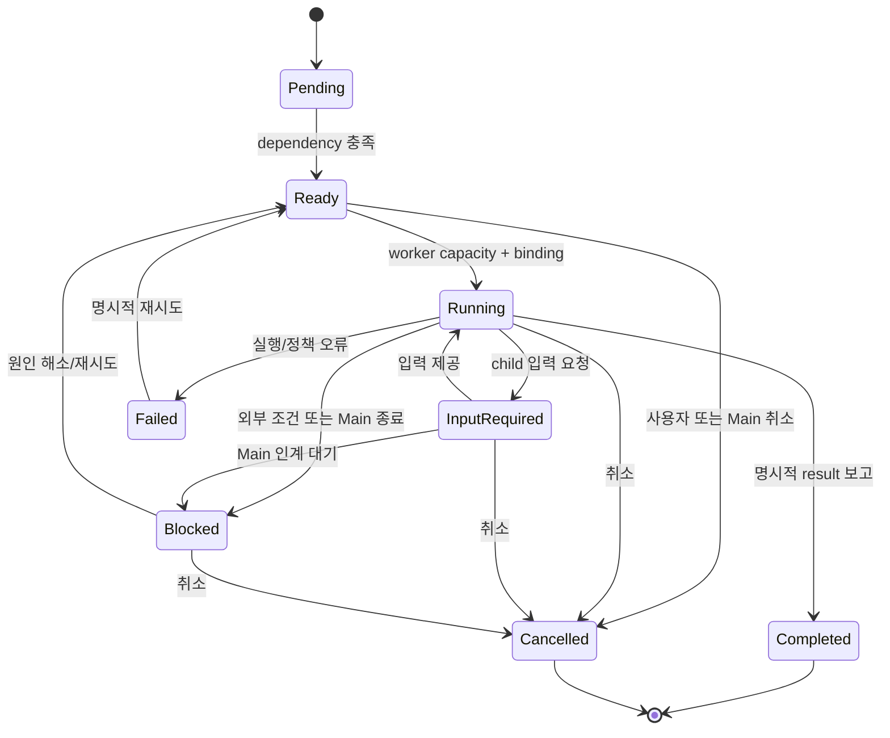
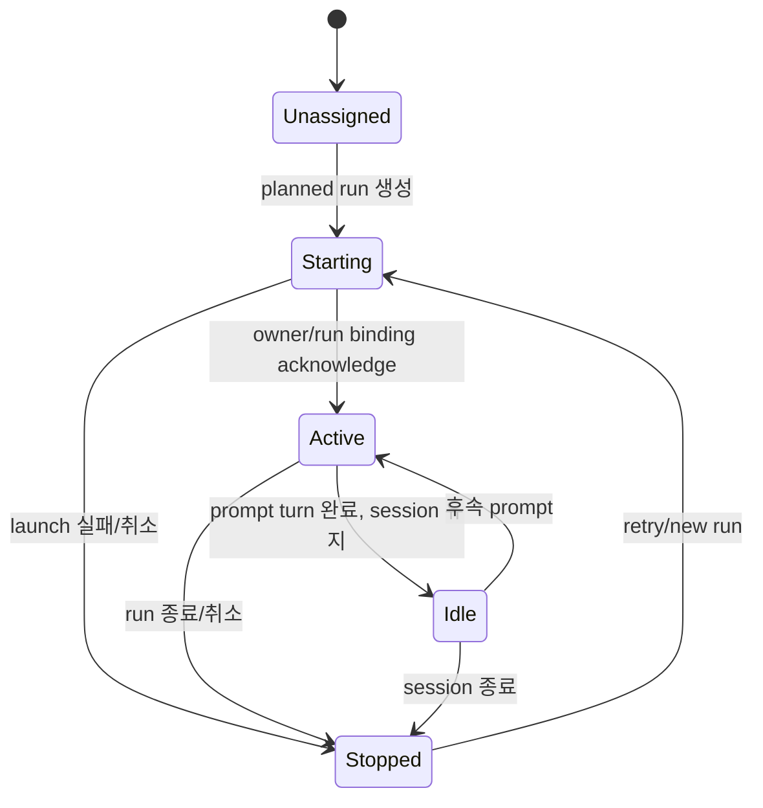
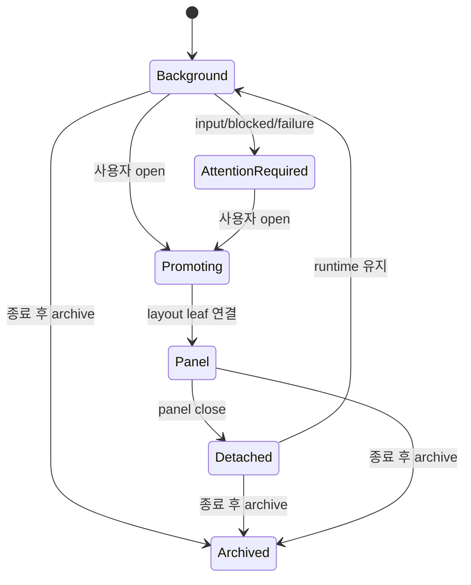
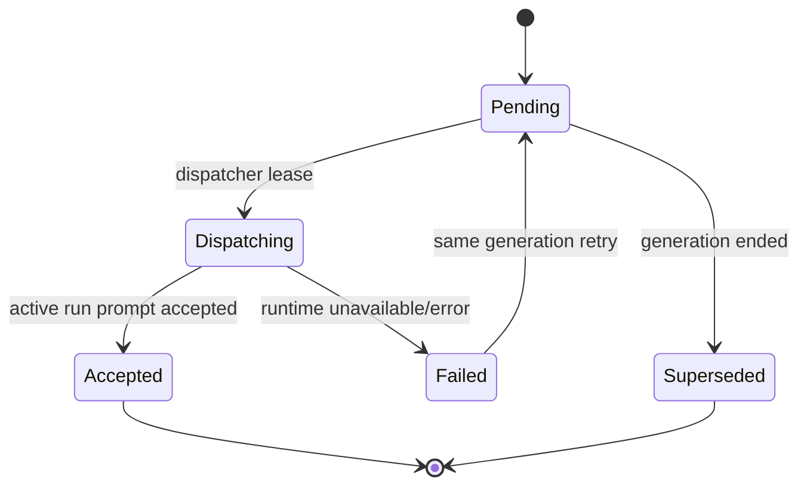
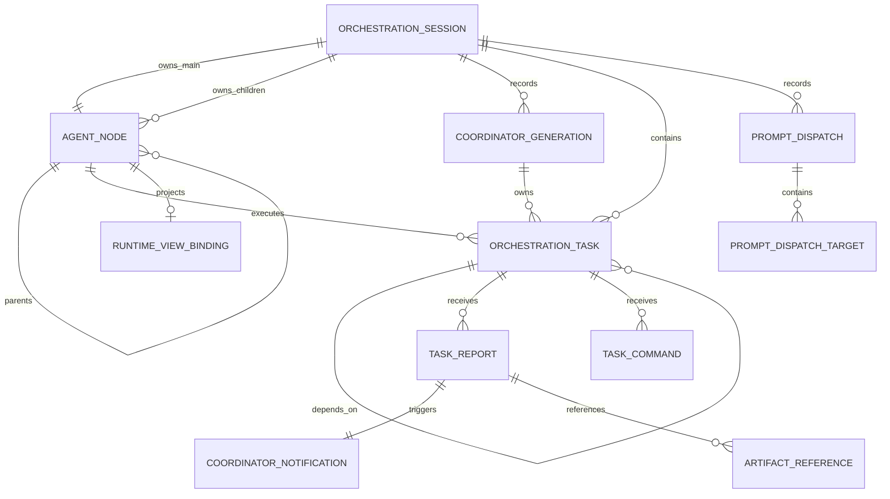

# Data Model: Main Coordinator 기반 에이전트 오케스트레이션

## 모델 경계

오케스트레이션의 durable aggregate와 현재 패널 projection을 분리한다.

- `OrchestrationSession`: 작업, 관계, 보고, 결과와 Coordinator 세대의 source of truth
- `AgentWorkspaceSnapshot`: 현재 창에 mount된 panel/run endpoint의 live routing 정보
- `AgentRunWorkspaceState`: 탭·타일 레이아웃, 초점과 선택 같은 frontend presentation

stable ID와 ephemeral ID를 혼용하지 않는다.

| 의미 | ID |
| --- | --- |
| Worktree Session의 협업 범위 | `orchestrationSessionId` |
| Main 또는 Child의 안정적 신원 | `nodeId`/`panelId` |
| Main 실행 세대 | `coordinatorGenerationId` |
| 사용자 목표 또는 하위 작업 | `taskId` |
| 실제 ACP 실행 | `runId` |
| 명령 묶음 | `dispatchId` |
| 대상별 명령 | `requestId` |

## `OrchestrationSession`

한 Worktree Session 창의 durable 협업 aggregate다.

| Field | Type | Rule |
| --- | --- | --- |
| `schemaVersion` | positive integer | migration 기준 |
| `id` | UUID | 영구 고유 |
| `worktreePath` | canonical absolute path | 생성 시 검증, 변경 불가 |
| `boundWindowLabel` | string? | live binding, 같은 시점에 하나 |
| `mainNodeId` | string | 항상 `main-agent-run` |
| `activeCoordinatorGenerationId` | UUID? | 활성 Main run이 있을 때만 |
| `nodes` | `AgentNode[]` | Main 정확히 하나, 총 8개 이하 |
| `generations` | `CoordinatorGeneration[]` | run ID 고유 |
| `tasks` | `OrchestrationTask[]` | task ID 고유 |
| `reports` | `TaskReport[]` | report ID/request ID 고유 |
| `commands` | `TaskCommand[]` | Child runtime 대상 내구성 있는 명령 |
| `coordinatorNotifications` | `CoordinatorNotification[]` | Child report 도착 알림 |
| `dispatches` | `PromptDispatch[]` | dispatch ID 고유 |
| `idempotencyRecords` | `IdempotencyRecord[]` | mutation request 결과 |
| `revision` | unsigned integer | mutation마다 1 증가 |
| `createdAt` | timestamp | server 생성 |
| `updatedAt` | timestamp | mutation마다 갱신 |

Validation:

- 같은 canonical worktree라도 session ID가 다르면 다른 aggregate다.
- live window binding이 다른 요청은 `scopeMismatch`다.
- session의 모든 Node, Task, Report, Dispatch 참조는 aggregate 내부 ID만 가리킨다.
- client가 보낸 revision이 현재 revision과 다르면 mutation을 적용하지 않는다.

## `AgentNode`

Main 또는 직접 Child의 안정적인 협업 신원이다. Node는 run과 panel 표시보다 오래 산다.

| Field | Type | Rule |
| --- | --- | --- |
| `id` | stable panel ID | session 안에서 고유 |
| `kind` | `main \| child` | Main은 정확히 하나 |
| `parentNodeId` | string? | Main은 null, Child는 Main ID |
| `role` | `AgentRoleProfile` | 표시명, 책임, 기대 결과 |
| `currentRunId` | string? | active/starting 실행 하나 |
| `assignedTaskId` | UUID? | 한 시점의 primary task 하나 |
| `executionStatus` | `ExecutionStatus` | runtime binding 상태 |
| `presentationStatus` | `PresentationStatus` | UI projection 상태 |
| `promotionPolicy` | `PromotionPolicy` | 기본 `onAttention` |
| `runtimeProfile` | `WorkerRuntimeProfile` | provider/model/access metadata |
| `lastActivityAt` | timestamp? | report/event마다 갱신 |
| `createdBy` | `user \| coordinator` | audit용 |
| `createdAt` | timestamp | server 생성 |

Validation:

- `kind=main`이면 `id=main-agent-run`, `parentNodeId=null`이다.
- `kind=child`이면 `parentNodeId=main-agent-run`이다.
- Child를 parent로 가리키는 Node는 생성할 수 없다.
- `currentRunId`는 live workspace의 같은 window owner와 일치해야 한다.
- Main Node는 삭제할 수 없다.

### `AgentRoleProfile`

| Field | Type | Rule |
| --- | --- | --- |
| `id` | string | session 또는 preset 범위 고유 |
| `name` | string | 1..80자 |
| `responsibility` | string | 비어 있지 않음 |
| `expectedOutput` | string | 구조화 결과 지침 |
| `systemInstructions` | string? | 크기 제한 적용 |

초기 preset은 `Researcher`, `Reviewer`, `Tester`다. preset은 역할 의미만 정의하며
특정 provider에 종속되지 않는다.

### `WorkerRuntimeProfile`

| Field | Type | Rule |
| --- | --- | --- |
| `agentProfileId` | string | 기존 AW agent profile 참조 |
| `providerId` | string | 표시/audit용 |
| `modelId` | string? | provider default 가능 |
| `accessPolicy` | `readOnly` | v1은 이 값만 허용 |
| `supportsReadOnly` | boolean | false이면 자동 launch 거부 |

## `CoordinatorGeneration`

Main Node의 한 run이 Coordinator 권한을 가진 기간이다.

| Field | Type | Rule |
| --- | --- | --- |
| `id` | UUID | session 안에서 고유 |
| `ordinal` | positive integer | session 안에서 단조 증가 |
| `mainNodeId` | string | `main-agent-run` 고정 |
| `runId` | string | generation마다 고유 |
| `previousGenerationId` | UUID? | 직전 generation |
| `status` | `active \| ended \| superseded` | 한 session에 active 최대 하나 |
| `startedAt` | timestamp | server 생성 |
| `endedAt` | timestamp? | 종료 시 필수 |
| `handoffSummary` | string? | 비종료 task와 부분 결과 요약 |
| `successorGenerationId` | UUID? | explicit handoff 후 설정 |

Generation 종료 시 해당 generation이 소유한 비종료 task는 자동으로 새 generation에
귀속되지 않고 `awaitingHandoff=true`가 된다.

## `OrchestrationTask`

사용자 목표 또는 Main이 만든 직접 하위 작업이다.

| Field | Type | Rule |
| --- | --- | --- |
| `id` | UUID | session 안에서 고유 |
| `parentTaskId` | UUID? | root goal은 null |
| `coordinatorGenerationId` | UUID | 생성·소유 generation |
| `assignedNodeId` | string? | Child 또는 root의 Main |
| `title` | string | 1..120자 |
| `objective` | string | 비어 있지 않음 |
| `constraints` | string[] | access/scope 포함 |
| `expectedResult` | string | 결과 형식 |
| `dependencyTaskIds` | UUID[] | 같은 session, 순환 금지 |
| `status` | `TaskStatus` | 아래 state machine |
| `awaitingHandoff` | boolean | generation 종료 시 true |
| `accessPolicy` | `readOnly` | v1 고정 |
| `attempt` | positive integer | retry 때 1 증가 |
| `latestResultReportId` | UUID? | 완료 결과 참조 |
| `failure` | `TaskFailure?` | 실패/차단 사유 |
| `revision` | unsigned integer | task mutation마다 증가 |
| `createdAt` | timestamp | server 생성 |
| `startedAt` | timestamp? | 처음 running 진입 |
| `completedAt` | timestamp? | terminal 진입 |
| `updatedAt` | timestamp | report/state 변경 |

### `TaskStatus`

Rules:

- `Completed`, `Cancelled`는 terminal이다.
- `Failed`는 명시적 retry로 새 attempt를 시작할 수 있으나 기존 reports를 보존한다.
- dependency가 모두 `Completed`가 아니면 `Ready`가 될 수 없다.
- 결과 보고 없이 run이 끝나면 `Completed`가 될 수 없다.
- Main generation 종료 시 비종료 task는 `Blocked` 또는 현재 상태 +
  `awaitingHandoff=true`로 표시한다. 구현은 사용자에게 일관된 "인계 대기" 의미를
  제공해야 한다.

### `TaskFailure`

| Field | Type | Rule |
| --- | --- | --- |
| `code` | enum | typed error code |
| `message` | string | 사용자 표시 가능 |
| `retryable` | boolean | retry action 제어 |
| `partialResultReportIds` | UUID[] | 남은 결과 보존 |

## `ExecutionStatus`

Node와 run binding의 상태다.

`ExecutionStatus`가 `Stopped`라고 해서 Task가 자동 `Completed`가 되지 않는다.

### `RuntimeEventJournal`

active window에서 background run의 timeline을 panel 승격 시 재수화하는 bounded
projection이다. durable task 결과와는 별도이며 앱 crash 뒤 실행 복구를 보장하지 않는다.

| Field | Type | Rule |
| --- | --- | --- |
| `runId` | string | active/recent run |
| `events` | `SequencedRunEvent[]` | sequence 오름차순, bounded |
| `lastSequence` | unsigned integer | run마다 단조 증가 |
| `terminal` | boolean | terminal event 수신 시 true |

frontend controller는 journal snapshot의 `lastSequence` 이후 live event만 적용해
중복을 제거한다. journal이 사라진 crash 복구에서는 task report와 결과만 표시하고
runtime은 `runtimeLost`로 처리한다.

### `RuntimeViewBinding`

한 Child run의 background 관찰과 panel 표시가 공유하는 frontend runtime projection이다.
durable aggregate는 아니며 Worktree Session UI 수명 동안 Node/run별 하나만 존재한다.

| Field | Type | Rule |
| --- | --- | --- |
| `nodeId` | string | direct Child Node |
| `runId` | string | `AgentNode.currentRunId`와 일치 |
| `executionStatus` | `ExecutionStatus` | workspace snapshot으로 초기화 |
| `hydrationStatus` | `idle \| loading \| ready \| gap \| runtimeLost` | timeline 신뢰 범위 |
| `lastSequence` | integer | 적용 완료한 journal sequence |
| `timeline` | `TimelineItem[]` | snapshot과 live event에 같은 reducer 적용 |
| `terminal` | boolean | journal/runtime terminal signal |
| `subscribed` | boolean | live event subscription 상태 |

불변식:

- 동일 `runId`에 둘 이상의 controller를 만들지 않는다.
- panel mount/unmount는 binding을 생성·삭제하거나 `runId`를 변경하지 않는다.
- `loading` 이전의 빈 panel-local state는 workspace snapshot에 반영하지 않는다.
- snapshot은 `lastSequence`보다 큰 event만 적용하고, live subscription도 같은 sequence
  경계를 사용한다.
- `gap`이면 durable task/report는 표시하되 전체 timeline 복원을 주장하지 않는다.
- `runtimeLost`이면 task를 completed로 추론하지 않는다.

## `PresentationStatus`

Node를 UI에서 어떻게 보여 주는지 나타낸다.

Rules:

- `Panel ↔ Background/Detached` 전이는 `runId`, task와 timeline을 바꾸지 않는다.
- `AttentionRequired`는 자동 focus를 발생시키지 않는다.
- 기존 수동 extra가 task에 연결되지 않은 경우 legacy close/cancel 계약을 유지한다.
  오케스트레이션 task로 전환된 Node에만 detach semantics를 적용한다.

### `PromotionPolicy`

`manual | onAttention | always | onFailure | onCompletion`

v1 기본값은 `onAttention`이며, 실제 panel open은 사용자 확인 후 실행한다. `always` 등
후속 정책도 focus stealing은 허용하지 않는다.

## `TaskReport`

Child가 Main에게 보내는 구조화된 보고다.

| Field | Type | Rule |
| --- | --- | --- |
| `id` | UUID | 고유 |
| `requestId` | UUID | mutating request idempotency |
| `taskId` | UUID | caller에게 assigned된 task |
| `reporterNodeId` | string | caller Node |
| `reporterRunId` | string | capability의 active run |
| `type` | `progress \| result \| inputRequest \| blocked \| message` | 역할별 validation |
| `progressPercent` | integer? | 0..100 |
| `summary` | string | 비어 있지 않음 |
| `findings` | `TaskFinding[]` | result에서 사용 |
| `artifactRefs` | `ArtifactReference[]` | session scope |
| `unresolved` | string[] | result/blocked에서 사용 |
| `confidence` | number? | 0..1 |
| `createdAt` | timestamp | server 생성 |

동일 `requestId`와 동일 payload는 기존 report를 반환한다. 다른 payload는
`duplicateConflict`다.

## `TaskCommand`

사용자, Main 또는 복구 로직이 current Child attempt에 전달하는 내구성 있는 명령이다.

| Field | Type | Rule |
| --- | --- | --- |
| `id` | UUID | session 안에서 고유 |
| `requestId` | UUID | actor+operation idempotency |
| `taskId` | UUID | 대상 task |
| `nodeId` | string | assigned direct Child |
| `runId` | string | 생성 시 current run snapshot |
| `attempt` | positive integer | task attempt와 일치 |
| `kind` | `message \| inputResponse \| interrupt \| cancel` | runtime 동작 |
| `message` | string? | message/inputResponse에서 필수 |
| `source` | `user \| coordinator \| recovery` | audit |
| `status` | `pending \| dispatching \| accepted \| failed \| cancelled` | 전달 상태 |
| `failure` | `CommandFailure?` | typed retry 정보 |
| `createdAt` | timestamp | server 생성 |
| `updatedAt` | timestamp | 상태 변경 |

규칙:

- command를 durable 저장한 뒤 repository lock 밖에서 worker port로 전달한다.
- 동일 request/payload는 기존 command와 결과를 반환하며 재전송하지 않는다.
- `inputResponse`는 `accepted` 뒤에만 task를 `Running`으로 전이한다.
- 전달 실패한 `inputResponse`는 task를 `InputRequired`로 유지하고 message를 보존한다.
- stale run/attempt command는 새 worker에 자동 전달하지 않는다.
- cancel/result race는 먼저 durable terminal로 확정된 상태를 따른다.

### `CoordinatorNotification`

Child report가 도착했음을 active Main run에 알리는 내구성 있는 notification이다.

| Field | Type | Rule |
| --- | --- | --- |
| `id` | UUID | session 안에서 고유 |
| `reportId` | UUID | notification당 하나 |
| `taskId` | UUID | report task |
| `reportType` | `TaskReportType` | routing/priority |
| `generationId` | UUID | 생성 시 active generation |
| `mainRunId` | string? | dispatch 대상 snapshot |
| `status` | `pending \| dispatching \| accepted \| failed \| superseded` | 전달 상태 |
| `attemptCount` | unsigned integer | bounded retry |
| `failure` | `CommandFailure?` | unavailable/stale 정보 |
| `createdAt` | timestamp | report transaction과 함께 생성 |
| `updatedAt` | timestamp | 상태 변경 |

notification payload는 report 전체가 아니라 workspace/task/report ID와 report type만
포함한다. Main은 `aw_collect_child_results` 또는 report 조회 도구로 권한 검증된 원문을
가져온다. active Main이 없으면 `pending`으로 남고 explicit handoff 전에는 새 generation에
자동 귀속하지 않는다.

### `TaskFinding`

| Field | Type | Rule |
| --- | --- | --- |
| `title` | string | 비어 있지 않음 |
| `detail` | string | 비어 있지 않음 |
| `evidence` | string[] | 경로, URL 또는 설명 |
| `severity` | `info \| warning \| critical` | optional default `info` |

### `ArtifactReference`

| Field | Type | Rule |
| --- | --- | --- |
| `kind` | `file \| url \| text` | 허용 형식 |
| `uri` | string | file이면 canonical worktree 내부 |
| `label` | string | 사용자 표시 |
| `description` | string? | 결과와의 관계 |

file reference는 경로 존재만으로 task 성공을 의미하지 않는다.

## `PromptDispatch`

공용 Composer의 한 submit과 대상별 결과를 보존한다.

| Field | Type | Rule |
| --- | --- | --- |
| `id` | UUID | `dispatchId`, session 범위 idempotency |
| `intent` | `direct \| delegate` | coordinator는 delegate |
| `targetMode` | `focused \| selected \| all \| coordinator` | explicit |
| `message` | string | trim 후 1..16,384 UTF-8 bytes |
| `delivery` | `send \| queue \| draft` | delegate는 `send` |
| `targets` | `PromptDispatchTarget[]` | submit 시 snapshot으로 고정 |
| `createdBy` | `user \| nodeId` | UI 또는 agent |
| `createdAt` | timestamp | server 생성 |
| `updatedAt` | timestamp | target 결과 변경 |

### `PromptDispatchTarget`

| Field | Type | Rule |
| --- | --- | --- |
| `panelId` | string | dispatch 당시 target |
| `runId` | string? | 지정 시 current run exact match |
| `requestId` | UUID | 대상별 고유 |
| `status` | `pending \| accepted \| delivered \| rejected \| failed \| cancelled` | 단방향 |
| `failureCode` | string? | 실패 시 typed code |
| `failureReason` | string? | 사용자 표시 가능 |

공통 payload가 유효하면 대상별 실패를 독립 처리한다. 성공 target을 rollback하지 않는다.

## `IdempotencyRecord`

task/report/dispatch 외의 mutation도 restart 뒤 정확히 한 번 의미를 유지하기 위한
aggregate 내부 기록이다.

| Field | Type | Rule |
| --- | --- | --- |
| `actorKey` | string | user window 또는 run principal |
| `operation` | string | command/tool 이름 |
| `requestId` | UUID | actor+operation 범위 고유 |
| `payloadFingerprint` | string | normalized payload hash |
| `resultRef` | string | task/report/dispatch 또는 serialized result 참조 |
| `createdAt` | timestamp | server 생성 |

같은 actor/operation/request ID에서 fingerprint가 다르면 `duplicateConflict`다.

## 관계

## Persistence and recovery

1. Mutation은 현재 aggregate revision과 idempotency key를 검증한다.
2. 유효한 새 aggregate를 메모리에서 만든다.
3. JSON repository가 temp → fsync → backup → rename 순서로 저장한다.
4. 저장 성공 후에만 event를 emit하고 waiter를 깨운다.
5. event emit 실패는 durable state를 되돌리지 않고 다음 snapshot 조회로 복구한다.
6. 앱 시작 시 active/starting runtime binding을 검증한다. live owner가 없으면 task를
   완료가 아닌 `Blocked(runtimeLost)` 또는 `Failed(workerUnavailable)`로 표시한다.
7. 같은 worktree의 새 창은 과거 session을 자동 attach하지 않는다. 명시적인 복구 또는
   새 session 선택이 필요하다.
8. frontend 승격 시 `AgentNode.currentRunId`를 authoritative binding으로 사용하고,
   `RuntimeViewBinding`을 journal snapshot으로 hydrate한 뒤 live event를 연결한다.
9. panel-local 초기 상태는 hydration 완료 전 orchestration aggregate의 run binding을
   변경할 수 없다.
