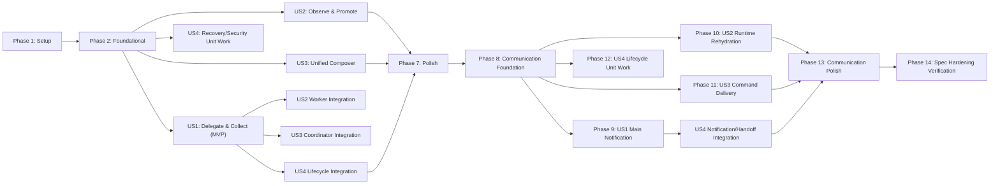

# Tasks: Main Coordinator 기반 에이전트 오케스트레이션

**Input**: `/specs/033-agent-orchestration/`의 `spec.md`, `plan.md`, `research.md`, `data-model.md`, `contracts/`, `quickstart.md`  
**Prerequisites**: `plan.md`, `spec.md` (필수), `research.md`, `data-model.md`, `contracts/`, `quickstart.md`

**Tests**: 프로젝트 헌법과 구현 계획에 따라 순수 상태 전이, 권한 경계, 영속성, worker lifecycle, UI 상호작용 테스트를 구현보다 먼저 작성합니다.

**Organization**: 각 사용자 스토리는 독립적으로 구현하고 검증할 수 있도록 테스트와 구현 작업을 같은 단계에 배치합니다.

## Format: `[ID] [P?] [Story?] Description`

- **[P]**: 선행 작업이 끝난 뒤 다른 파일에서 병렬로 수행 가능
- **[US1]–[US4]**: 작업이 속한 사용자 스토리
- 모든 작업 설명에는 변경할 정확한 파일 경로가 포함됩니다.

## Phase 1: Setup (공통 작업 준비)

**Purpose**: 기존 AW 구조를 보존하면서 오케스트레이션 구현 위치와 검증 기준을 준비합니다.

- [X] T001 오케스트레이션 backend 모듈 골격과 공개 모듈 선언을 `apps/agentic-workbench/src-tauri/src/domain/mod.rs`, `apps/agentic-workbench/src-tauri/src/application/mod.rs`, `apps/agentic-workbench/src-tauri/src/ports/mod.rs`, `apps/agentic-workbench/src-tauri/src/infrastructure/mod.rs`에 추가한다
- [X] T002 [P] frontend 오케스트레이션 entity의 공개 진입점과 query key 골격을 `apps/agentic-workbench/src/entities/agent-orchestration/index.ts`, `apps/agentic-workbench/src/entities/agent-orchestration/api/query-keys.ts`에 추가한다
- [X] T003 [P] 오케스트레이션 UI와 Storybook 테스트가 공유할 결정적 fixture를 `apps/agentic-workbench/src/shared/storybook/agent-orchestration-sample-data.ts`에 추가한다
- [X] T004 [P] 현재 tab/tile 및 agent exchange 회귀 기준을 실행하고 관찰 결과를 `specs/033-agent-orchestration/quickstart.md`의 사전 검증 섹션에 기록한다

---

## Phase 2: Foundational (모든 스토리의 차단 선행 작업)

**Purpose**: window scope, Main/child 관계, 상태 전이, 영속성, capability identity를 공통 기반으로 확립합니다.

**⚠️ CRITICAL**: 이 단계가 끝나기 전에는 사용자 스토리 구현을 시작하지 않습니다.

- [X] T005 Main 고정·직계 자식만 허용·task/run/presentation 상태 분리·불법 전이 거부를 검증하는 실패 테스트를 `apps/agentic-workbench/src-tauri/src/domain/agent_orchestration.rs`에 추가한다
- [X] T006 [P] frontend의 task 상태 전이와 Main/child 관계 불변식을 검증하는 실패 테스트를 `apps/agentic-workbench/src/entities/agent-orchestration/model/task-state.test.ts`, `apps/agentic-workbench/src/entities/agent-orchestration/model/relationships.test.ts`에 추가한다
- [X] T007 T005를 통과하도록 workspace session, agent node, agent run, task, execution state, presentation state, generation 모델과 전이 규칙을 `apps/agentic-workbench/src-tauri/src/domain/agent_orchestration.rs`에 구현한다
- [X] T008 T006을 통과하도록 backend 계약을 반영한 TypeScript 타입, 상태 전이, 관계 helper를 `apps/agentic-workbench/src/entities/agent-orchestration/model/types.ts`, `apps/agentic-workbench/src/entities/agent-orchestration/model/task-state.ts`, `apps/agentic-workbench/src/entities/agent-orchestration/model/relationships.ts`에 구현한다
- [X] T009 [P] 저장소, worker, event sink, runtime journal 포트를 `apps/agentic-workbench/src-tauri/src/ports/orchestration_repository.rs`, `apps/agentic-workbench/src-tauri/src/ports/agent_worker.rs`, `apps/agentic-workbench/src-tauri/src/ports/orchestration_event_sink.rs`, `apps/agentic-workbench/src-tauri/src/ports/runtime_event_journal.rs`에 정의한다
- [X] T010 JSON 저장소의 원자 저장, revision 충돌, idempotency key 재사용, 손상 파일 복구를 검증하는 실패 테스트를 `apps/agentic-workbench/src-tauri/src/infrastructure/json_orchestration_repository.rs`에 추가한다
- [X] T011 T010에 필요한 범용 object read/write와 atomic replace 동작을 `apps/agentic-workbench/src-tauri/src/infrastructure/json_store.rs` 및 해당 단위 테스트에 추가한다
- [X] T012 T010을 통과하도록 app-local `orchestration-sessions.json` 저장소 adapter를 `apps/agentic-workbench/src-tauri/src/infrastructure/json_orchestration_repository.rs`에 구현한다
- [X] T013 [P] per-run opaque capability 발급·폐기·caller identity 파생·다른 run 사칭 거부를 검증하는 실패 테스트를 `apps/agentic-workbench/src-tauri/src/infrastructure/mcp/capability_registry.rs`에 추가한다
- [X] T014 T013을 통과하도록 run capability registry와 principal derivation을 `apps/agentic-workbench/src-tauri/src/infrastructure/mcp/capability_registry.rs`에 구현한다
- [X] T015 기존 app-global MCP token 경로를 per-run capability 검증과 exact peer ACL로 보강하고 회귀 테스트를 `apps/agentic-workbench/src-tauri/src/infrastructure/mcp/mod.rs`, `apps/agentic-workbench/src-tauri/src/infrastructure/mcp/agent_exchange_tool.rs`에 추가한다
- [X] T016 [P] workspace bootstrap, owner window 격리, Main 불변 binding, revision/idempotency를 검증하는 실패 테스트를 `apps/agentic-workbench/src-tauri/src/application/orchestration_service.rs`에 추가한다
- [X] T017 T016을 통과하도록 bootstrap/get session과 immutable Main binding use case를 `apps/agentic-workbench/src-tauri/src/application/orchestration_service.rs`에 구현한다
- [X] T018 [P] revision을 포함한 typed orchestration event 발행 adapter를 `apps/agentic-workbench/src-tauri/src/infrastructure/tauri_orchestration_event_sink.rs`에 구현한다
- [X] T019 bootstrap/get/bind Main Tauri command와 상태 wiring을 `apps/agentic-workbench/src-tauri/src/inbound/tauri_commands.rs`, `apps/agentic-workbench/src-tauri/src/lib.rs`에 등록한다
- [X] T020 [P] frontend repository의 command payload, revision mismatch, event rehydrate 동작을 검증하는 실패 테스트를 `apps/agentic-workbench/src/entities/agent-orchestration/api/orchestration-repository.test.ts`에 추가한다
- [X] T021 T020을 통과하도록 bootstrap/get/bind command wrapper와 typed event subscription을 `apps/agentic-workbench/src/entities/agent-orchestration/api/orchestration-repository.ts`에 구현한다
- [X] T022 worktree window 진입 시 session을 bootstrap하고 Main run을 한 번만 결합하는 controller 및 회귀 테스트를 `apps/agentic-workbench/src/features/agent-run/model/orchestration-workspace.ts`, `apps/agentic-workbench/src/features/agent-run/model/orchestration-workspace.test.ts`에 구현한다

**Checkpoint**: window별 Main이 고정되고, 모든 후속 agent가 직계 자식이 될 수 있는 영속·권한 기반이 준비됩니다.

---

## Phase 3: User Story 1 - Main이 하위 에이전트에 작업을 위임하고 결과를 취합 (Priority: P1) 🎯 MVP

**Goal**: Main Coordinator가 Researcher, Reviewer, Tester 같은 직계 자식 task를 만들고 background run에 할당하여 구조화된 진행 상황과 결과를 취합합니다.

**Independent Test**: Main에 하나의 목표를 주고 세 직계 자식을 생성·할당한 뒤, 각 결과의 출처와 충돌을 구분하여 Main이 종합 응답을 만들며 수동 추가 panel도 동일한 직계 자식으로 할당되는지 확인합니다.

### Tests for User Story 1

- [X] T023 [US1] star topology, create/assign, manual child 채택, idempotent delegation, 구조화 결과 수집을 검증하는 실패 테스트를 `apps/agentic-workbench/src-tauri/src/application/orchestration_service.rs`에 추가한다
- [X] T024 [P] [US1] ACP 동시 실행 상한을 넘지 않는 FIFO lease와 release-after-terminal을 검증하는 실패 테스트를 `apps/agentic-workbench/src-tauri/src/application/orchestration_scheduler.rs`에 추가한다
- [X] T025 [P] [US1] launch/send/wait/interrupt lifecycle과 agent profile 전달을 검증하는 실패 테스트를 `apps/agentic-workbench/src-tauri/src/infrastructure/acp_agent_worker_adapter.rs`에 추가한다
- [X] T026 [P] [US1] coordinator-only 및 child-only MCP schema, authorization, structured result를 검증하는 실패 테스트를 `apps/agentic-workbench/src-tauri/src/infrastructure/mcp/orchestration_tool.rs`에 추가한다
- [X] T027 [P] [US1] Main 한 개와 직계 자식만 생성되고 task/run/node identity가 분리되는 frontend 실패 테스트를 `apps/agentic-workbench/src/features/agent-run/model/orchestration-workspace.test.ts`에 추가한다

### Implementation for User Story 1

- [X] T028 [P] [US1] 기존 ACP launch option 조립을 재사용 가능한 factory로 추출하고 기존 launch 경로를 유지하는 회귀 테스트를 `apps/agentic-workbench/src-tauri/src/infrastructure/acp_agent_launch_factory.rs`, `apps/agentic-workbench/src-tauri/src/inbound/tauri_commands.rs`에 구현한다
- [X] T029 [US1] T025를 통과하도록 기존 `acp-agent-core` primitive를 감싸는 `AgentWorkerPort` adapter를 `apps/agentic-workbench/src-tauri/src/infrastructure/acp_agent_worker_adapter.rs`에 구현한다
- [X] T030 [P] [US1] T024를 통과하도록 ACP 전역 상한을 공유하는 FIFO orchestration scheduler를 `apps/agentic-workbench/src-tauri/src/application/orchestration_scheduler.rs`에 구현한다
- [X] T031 [US1] T023을 통과하도록 create/assign/list/send/wait/collect/progress/result/blocked use case와 명시적 structured report 완료 규칙을 `apps/agentic-workbench/src-tauri/src/application/orchestration_service.rs`에 구현한다
- [X] T032 [P] [US1] worker event를 task execution/progress/result event로 투영하되 PromptCompleted·process exit·file 생성만으로 완료하지 않는 projector를 `apps/agentic-workbench/src-tauri/src/application/orchestration_event_projector.rs`에 구현한다
- [X] T033 [US1] create child task, assign, list, send, wait, collect coordinator MCP handler를 `apps/agentic-workbench/src-tauri/src/infrastructure/mcp/orchestration_tool.rs`에 구현한다
- [X] T034 [US1] get own task, report progress/result/blocked, send parent child MCP handler를 `apps/agentic-workbench/src-tauri/src/infrastructure/mcp/orchestration_tool.rs`에 구현한다
- [X] T035 [US1] orchestration MCP tools와 Main/child별 tool instruction을 MCP server에 등록하는 작업을 `apps/agentic-workbench/src-tauri/src/infrastructure/mcp/mod.rs`에 구현한다
- [X] T036 [US1] Main generation에 root goal을 연결하고 모든 신규 agent node의 parent를 Main으로 강제하는 delegation 흐름을 `apps/agentic-workbench/src-tauri/src/application/orchestration_service.rs`에 구현한다
- [X] T037 [US1] bind generation, delegate, list, collect Tauri command와 event registration을 `apps/agentic-workbench/src-tauri/src/inbound/tauri_commands.rs`, `apps/agentic-workbench/src-tauri/src/lib.rs`에 구현한다
- [X] T038 [P] [US1] delegation command와 task/progress/result event API를 `apps/agentic-workbench/src/entities/agent-orchestration/api/orchestration-repository.ts`, `apps/agentic-workbench/src/entities/agent-orchestration/api/orchestration-repository.test.ts`에 구현한다
- [X] T039 [P] [US1] Main 및 직계 자식 node/task/run을 정규화하고 결과 출처·충돌을 유지하는 frontend controller를 `apps/agentic-workbench/src/features/agent-run/model/orchestration-workspace.ts`, `apps/agentic-workbench/src/features/agent-run/model/orchestration-workspace.test.ts`에 구현한다
- [X] T040 [US1] 현재 Main panel을 immutable Main node에 결합하고 수동으로 추가된 agent-run을 Main의 직계 자식 task에 할당하는 흐름을 `apps/agentic-workbench/src/features/agent-run/ui/worktree-agent-run-area.tsx`, `apps/agentic-workbench/src/entities/agent-run/model/agent-run-workspace.ts`에 구현한다
- [X] T041 [P] [US1] Researcher/Reviewer/Tester의 진행·결과·충돌을 재현하는 deterministic smoke agent와 registry를 `apps/agentic-workbench/scripts/acp-orchestration-smoke-agent.mjs`, `apps/agentic-workbench/scripts/acp-orchestration-smoke-agents.json`에 구현한다
- [X] T042 [US1] backend service부터 mock ACP worker까지 위임·결과 취합을 검증하는 통합 테스트를 `apps/agentic-workbench/src-tauri/tests/orchestration_delegation.rs`에 추가한다
- [X] T043 [US1] Main 고정, 직계 자식 관계, 결과 출처와 충돌 표시를 `specs/033-agent-orchestration/quickstart.md`의 시나리오 1–2로 검증한다

**Checkpoint**: Main은 background child task를 생성·관리하고 구조화된 결과를 받아 종합할 수 있습니다.

---

## Phase 4: User Story 2 - Background task를 관찰하고 필요할 때 panel로 승격 (Priority: P1)

**Goal**: 모든 child run은 UI panel 유무와 독립적으로 실행되며 Activity Rail에서 관찰할 수 있고, promote/detach가 실행을 재시작하거나 취소하지 않습니다.

**Independent Test**: 세 background task를 실행해 진행 상태와 입력 요청을 확인하고 하나를 tile로 승격한 뒤 detach하여도 같은 task/run/timeline이 유지되는지 확인합니다.

### Tests for User Story 2

- [X] T044 [US2] bounded journal append/replay, sequence gap, overflow rehydrate를 검증하는 실패 테스트를 `apps/agentic-workbench/src-tauri/src/infrastructure/in_memory_runtime_event_journal.rs`에 추가한다
- [X] T045 [P] [US2] background↔panel presentation 전이와 tab/tile 1:1:1 layout 불변식을 검증하는 실패 테스트를 `apps/agentic-workbench/src/entities/agent-orchestration/model/task-state.test.ts`, `apps/agentic-workbench/src/entities/agent-run/model/agent-run-workspace.test.ts`에 추가한다
- [X] T046 [P] [US2] 상태·역할·elapsed time·attention·promote/detach 상호작용을 검증하는 실패 테스트를 `apps/agentic-workbench/src/features/agent-run/ui/task-activity-rail.test.tsx`에 추가한다
- [X] T047 [P] [US2] promote/detach가 task/run을 유지하고 worker cancel을 호출하지 않는지 검증하는 실패 테스트를 `apps/agentic-workbench/src-tauri/src/application/orchestration_service.rs`에 추가한다

### Implementation for User Story 2

- [X] T048 [US2] T044를 통과하도록 run별 sequence와 bounded replay를 제공하는 journal adapter를 `apps/agentic-workbench/src-tauri/src/infrastructure/in_memory_runtime_event_journal.rs`에 구현한다
- [X] T049 [P] [US2] 기존 AgentRunEventSink를 보존하면서 journal 기록과 orchestration projection을 합성하는 sink를 `apps/agentic-workbench/src-tauri/src/infrastructure/tauri_orchestration_event_sink.rs`, `apps/agentic-workbench/src-tauri/src/application/orchestration_event_projector.rs`에 구현한다
- [X] T050 [US2] journal replay command와 gap 발생 시 durable snapshot 재조회 event를 `apps/agentic-workbench/src-tauri/src/inbound/tauri_commands.rs`, `apps/agentic-workbench/src-tauri/src/lib.rs`에 구현한다
- [X] T051 [P] [US2] panel 내부의 ACP runtime lifecycle과 event handling을 재사용 가능한 controller로 추출하고 회귀 테스트를 `apps/agentic-workbench/src/features/agent-run/model/agent-run-controller.ts`, `apps/agentic-workbench/src/features/agent-run/model/agent-run-controller.test.ts`에 구현한다
- [X] T052 [US2] visible panel 없이도 동일 controller를 유지하는 runtime host를 `apps/agentic-workbench/src/features/agent-run/ui/agent-run-runtime-host.tsx`, `apps/agentic-workbench/src/features/agent-run/ui/agent-run-panel.tsx`에 구현한다
- [X] T053 [P] [US2] visible layout membership과 background execution membership을 분리하고 tile 진입 시 1:1:1 비율을 유지하도록 `apps/agentic-workbench/src/entities/agent-run/model/agent-run-workspace.ts`, `apps/agentic-workbench/src/entities/agent-run/model/agent-run-workspace.test.ts`를 변경한다
- [X] T054 [US2] T047을 통과하도록 promote/detach와 attention projection use case를 `apps/agentic-workbench/src-tauri/src/application/orchestration_service.rs`에 구현한다
- [X] T055 [P] [US2] promote/detach 및 journal replay command/event wrapper를 `apps/agentic-workbench/src-tauri/src/inbound/tauri_commands.rs`, `apps/agentic-workbench/src/entities/agent-orchestration/api/orchestration-repository.ts`에 구현한다
- [X] T056 [P] [US2] 상태·역할·elapsed time·attention 및 promote/detach action을 표시하는 `TaskActivityItem`과 `TaskActivityRail`을 `apps/agentic-workbench/src/features/agent-run/ui/task-activity-item.tsx`, `apps/agentic-workbench/src/features/agent-run/ui/task-activity-rail.tsx`에 구현한다
- [X] T057 [US2] Activity Rail과 background runtime host를 worktree 영역에 결합하고 panel close를 detach로 변경하는 작업을 `apps/agentic-workbench/src/features/agent-run/ui/worktree-agent-run-area.tsx`에 구현한다
- [X] T058 [US2] Activity Rail의 atoms/molecules/organism Storybook 예제와 시나리오 5 회귀 검증을 `apps/agentic-workbench/src/features/agent-run/ui/task-activity-rail.stories.tsx`, `specs/033-agent-orchestration/quickstart.md`에 추가한다

**Checkpoint**: background child 실행은 UI와 독립적으로 지속되고 동일 run을 tab/tile panel로 승격하거나 다시 detach할 수 있습니다.

---

## Phase 5: User Story 3 - 하나의 Composer에서 대상과 전달 방식을 선택 (Priority: P1)

**Goal**: worktree workspace에 Composer를 하나만 두고 focused/selected/all/coordinator 모드로 정확한 대상에 exact-once dispatch하며 부분 실패를 개별 표시합니다.

**Independent Test**: 네 target mode를 차례로 실행하여 direct mode는 선택된 기존 run에만, coordinator mode는 Main의 durable delegation 경로로 전달되고 중복 또는 전체 batch rollback이 없는지 확인합니다.

### Tests for User Story 3

- [X] T059 [US3] focused/selected/all/coordinator 대상 계산과 빈 선택 거부를 검증하는 실패 테스트를 `apps/agentic-workbench/src/features/agent-run/model/prompt-target-selection.test.ts`에 추가한다
- [X] T060 [P] [US3] exact-once idempotency, direct/delegate 분기, per-target partial failure를 검증하는 실패 테스트를 `apps/agentic-workbench/src-tauri/src/application/orchestration_service.rs`에 추가한다
- [X] T061 [P] [US3] 단일 Composer, target picker, submit, pending/result 상태와 keyboard 접근성을 검증하는 실패 테스트를 `apps/agentic-workbench/src/features/agent-run/ui/workspace-prompt-composer.test.tsx`에 추가한다

### Implementation for User Story 3

- [X] T062 [P] [US3] T059를 통과하도록 target mode와 visible/runnable/selected 대상 계산을 `apps/agentic-workbench/src/features/agent-run/model/prompt-target-selection.ts`에 구현한다
- [X] T063 [P] [US3] target별 queued/sending/succeeded/failed 상태와 batch summary reducer를 `apps/agentic-workbench/src/entities/agent-orchestration/model/prompt-dispatch.ts`, `apps/agentic-workbench/src/entities/agent-orchestration/model/prompt-dispatch.test.ts`에 구현한다
- [X] T064 [US3] T060을 통과하도록 visible run direct send, background worker send, Main delegate를 하나의 idempotent batch use case로 구현하는 작업을 `apps/agentic-workbench/src-tauri/src/application/orchestration_service.rs`에 수행한다
- [X] T065 [US3] dispatch command와 target별 accepted/failed event를 `apps/agentic-workbench/src-tauri/src/inbound/tauri_commands.rs`, `apps/agentic-workbench/src-tauri/src/lib.rs`에 등록한다
- [X] T066 [P] [US3] dispatch request와 target별 event listener를 `apps/agentic-workbench/src/entities/agent-orchestration/api/orchestration-repository.ts`, `apps/agentic-workbench/src/entities/agent-orchestration/api/orchestration-repository.test.ts`에 구현한다
- [X] T067 [US3] T061을 통과하도록 target mode, panel multi-select, prompt 입력, submit을 제공하는 단일 Composer를 `apps/agentic-workbench/src/features/agent-run/ui/workspace-prompt-composer.tsx`에 구현한다
- [X] T068 [P] [US3] target별 성공·실패·재시도 가능한 부분 결과를 표시하는 UI를 `apps/agentic-workbench/src/features/agent-run/ui/prompt-dispatch-status.tsx`에 구현한다
- [X] T069 [US3] panel별 draft/submit ownership을 workspace controller로 이동하고 panel 내부 prompt composer를 제거하는 작업을 `apps/agentic-workbench/src/features/agent-run/model/agent-run-controller.ts`, `apps/agentic-workbench/src/features/agent-run/ui/agent-run-panel.tsx`에 수행한다
- [X] T070 [US3] workspace Composer와 dispatch status를 tab/tile 공통 하단 영역에 한 번만 배치하는 작업을 `apps/agentic-workbench/src/features/agent-run/ui/worktree-agent-run-area.tsx`에 수행한다
- [X] T071 [US3] page annotation과 SDD route에서도 단일 Composer 상태를 전달하도록 `apps/agentic-workbench/src/pages/project-worktree-session/ui/project-worktree-session-page.tsx`, `apps/agentic-workbench/src/pages/project-worktree-session/ui/project-worktree-session-page.test.tsx`를 변경한다
- [X] T072 [US3] Composer molecule/organism Storybook 예제와 네 target mode 독립 검증을 `apps/agentic-workbench/src/features/agent-run/ui/workspace-prompt-composer.stories.tsx`, `specs/033-agent-orchestration/quickstart.md`에 추가한다

**Checkpoint**: 사용자는 panel마다 입력 영역을 찾지 않고 하나의 Composer에서 direct 명령 또는 Main delegation을 선택할 수 있습니다.

---

## Phase 6: User Story 4 - 차단·실패·Main 재시작 후 안전하게 복구 (Priority: P2)

**Goal**: input request, cancel/retry/reassign, explicit Main handoff, app/window 재시작 복구와 cross-window/read-only 보안 경계를 제공합니다.

**Independent Test**: child가 입력을 요청하고 다른 child가 실패한 상태에서 Main을 재시작한 뒤 동일 session을 복구하여 응답·재시도·명시적 handoff를 수행하며 다른 window 접근과 mutation 시도가 거부되는지 확인합니다.

### Tests for User Story 4

- [X] T073 [US4] input response, cancel-vs-result race, retry attempt, reassign, generation handoff 불변식을 검증하는 실패 테스트를 `apps/agentic-workbench/src-tauri/src/application/orchestration_service.rs`에 추가한다
- [X] T074 [P] [US4] callerRunId spoofing, sibling access, stale generation capability, cross-window access 거부를 검증하는 실패 테스트를 `apps/agentic-workbench/src-tauri/src/infrastructure/mcp/orchestration_tool.rs`, `apps/agentic-workbench/src-tauri/src/infrastructure/mcp/agent_exchange_tool.rs`에 추가한다
- [X] T075 [P] [US4] app 재시작, orphaned running run, journal 유실, revision 충돌 복구를 검증하는 실패 테스트를 `apps/agentic-workbench/src-tauri/src/infrastructure/json_orchestration_repository.rs`, `apps/agentic-workbench/src-tauri/src/application/orchestration_service.rs`에 추가한다
- [X] T076 [P] [US4] attention 응답, retry/reassign/cancel, handoff confirmation UI를 검증하는 실패 테스트를 `apps/agentic-workbench/src/features/agent-run/ui/task-activity-rail.test.tsx`, `apps/agentic-workbench/src/features/agent-run/ui/coordinator-handoff-dialog.test.tsx`에 추가한다
- [X] T077 [P] [US4] readOnly profile, autoAllow=false, mutation tool 거부, worktree 변경 감지를 검증하는 실패 테스트를 `apps/agentic-workbench/src-tauri/src/infrastructure/acp_agent_worker_adapter.rs`에 추가한다

### Implementation for User Story 4

- [X] T078 [US4] T073을 통과하도록 respond input, cancel, retry, reassign use case와 terminal race resolution을 `apps/agentic-workbench/src-tauri/src/application/orchestration_service.rs`에 구현한다
- [X] T079 [US4] 명시적 확인 후에만 새 Main generation을 만들고 기존 task ownership과 timeline을 이전하는 handoff를 `apps/agentic-workbench/src-tauri/src/application/orchestration_service.rs`에 구현한다
- [X] T080 [US4] startup/window close/crash 시 durable session과 live worker를 대조하고 orphaned run을 recoverable 상태로 만드는 reconciliation을 `apps/agentic-workbench/src-tauri/src/application/orchestration_service.rs`, `apps/agentic-workbench/src-tauri/src/lib.rs`에 구현한다
- [X] T081 [P] [US4] artifact reference를 workspace 상대 경로로 정규화하고 외부 경로·symlink escape를 거부하는 검증을 `apps/agentic-workbench/src-tauri/src/domain/agent_orchestration.rs`에 구현한다
- [X] T082 [US4] T077을 통과하도록 readOnly permission mode와 mutation tool deny policy를 worker launch에 강제하는 작업을 `apps/agentic-workbench/src-tauri/src/infrastructure/acp_agent_worker_adapter.rs`, `apps/agentic-workbench/src-tauri/src/infrastructure/acp_agent_launch_factory.rs`에 수행한다
- [X] T083 [US4] child 실행 전후 worktree fingerprint를 비교해 변경을 감지하고 task를 failed/attention으로 전이하되 자동 revert하지 않는 작업을 `apps/agentic-workbench/src-tauri/src/infrastructure/acp_agent_worker_adapter.rs`, `apps/agentic-workbench/src-tauri/src/application/orchestration_event_projector.rs`에 구현한다
- [X] T084 [US4] T074를 통과하도록 capability generation 폐기, server-derived caller, owner window ACL, explicit peer ACL을 `apps/agentic-workbench/src-tauri/src/infrastructure/mcp/capability_registry.rs`, `apps/agentic-workbench/src-tauri/src/infrastructure/mcp/agent_exchange_tool.rs`에 구현한다
- [X] T085 [US4] interrupt/cancel/retry/reassign coordinator MCP handler와 input request/response child flow를 `apps/agentic-workbench/src-tauri/src/infrastructure/mcp/orchestration_tool.rs`에 구현한다
- [X] T086 [US4] respond/cancel/retry/reassign/handoff/recover Tauri command와 lifecycle hook을 `apps/agentic-workbench/src-tauri/src/inbound/tauri_commands.rs`, `apps/agentic-workbench/src-tauri/src/lib.rs`에 등록한다
- [X] T087 [US4] Activity Rail의 attention form과 cancel/retry/reassign action 및 명시적 Main handoff dialog를 `apps/agentic-workbench/src/features/agent-run/ui/task-activity-rail.tsx`, `apps/agentic-workbench/src/features/agent-run/ui/coordinator-handoff-dialog.tsx`, `apps/agentic-workbench/src/features/agent-run/ui/worktree-agent-run-area.tsx`에 구현한다
- [X] T088 [US4] 복구, handoff, isolation, read-only, capacity 동작을 `specs/033-agent-orchestration/quickstart.md`의 Scenario 6, 7, 8, 9, 10으로 검증한다 (Scenario 6A·6B는 T131·T142가 담당)

**Checkpoint**: 실패와 재시작 뒤에도 durable task 관계가 유지되고, 명시적 handoff와 최소 권한 경계 안에서 복구할 수 있습니다.

---

## Phase 7: Polish & Cross-Cutting Concerns

**Purpose**: 전체 스토리를 함께 사용할 때의 품질, 문서, 접근성, 성능, 회귀를 마무리합니다.

- [X] T089 [P] 상태 badge, target picker, attention indicator atom/molecule Storybook 예제를 `apps/agentic-workbench/src/shared/storybook/agent-orchestration-atoms.stories.tsx`, `apps/agentic-workbench/src/shared/storybook/agent-orchestration-molecules.stories.tsx`에 추가한다
- [X] T090 [P] Activity Rail+Composer organism과 tab/tile workspace page Storybook 예제를 `apps/agentic-workbench/src/features/agent-run/ui/orchestration-workspace.stories.tsx`, `apps/agentic-workbench/src/pages/project-worktree-session/ui/project-worktree-session-page.stories.tsx`에 추가한다
- [X] T091 [P] 구현 결과, 상태 모델, Main/child 보안 경계, 운영·복구 절차를 `docs/agent-orchestration-workspace.md`에 반영한다
- [X] T092 task 수, event journal, prompt batch에 명시된 상한과 대량 상태 전이 성능을 검증하는 테스트를 `apps/agentic-workbench/src-tauri/src/application/orchestration_service.rs`, `apps/agentic-workbench/src/features/agent-run/model/orchestration-workspace.test.ts`에 추가한다
- [X] T093 frontend typecheck와 단위 테스트를 `apps/agentic-workbench/package.json`의 `check-types`, `test` script로 실행하고 실패를 수정한다
- [X] T094 backend 단위·통합 테스트와 정적 검사를 루트 `Cargo.toml` 기준 `cargo test -p agentic-workbench`, `cargo check -p agentic-workbench`로 실행하고 실패를 수정한다
- [X] T095 production build와 Storybook build를 `apps/agentic-workbench/package.json`의 `build`, `build-storybook` script로 실행하고 실패를 수정한다
- [X] T096 keyboard navigation, screen reader label, focus restoration, color-independent status를 `apps/agentic-workbench/src/features/agent-run/ui/workspace-prompt-composer.test.tsx`, `apps/agentic-workbench/src/features/agent-run/ui/task-activity-rail.test.tsx`에서 검증하고 수정한다
- [X] T097 FSD·hexagonal dependency boundary와 `packages/*`, `crates/*` 무변경 원칙을 `specs/033-agent-orchestration/plan.md`의 Constitution Check에 대조하여 위반을 수정한다
- [X] T098 Phase 7 시점의 Scenario 1–11을 수행하고 tab/tile 1:1:1, panel 생성, agent exchange 회귀 결과를 `specs/033-agent-orchestration/quickstart.md`에 기록한다 (이후 추가된 Scenario 5A·6A·6B는 T123·T131·T142·T149가 담당)

---

## Phase 8: Communication Remediation Foundation (공통 차단 작업)

**Purpose**: 기존 vertical slice의 상태-only 경로를 실제 ACP runtime delivery와 연결할
수 있도록 durable command/notification 모델, port와 application service를 확립합니다.

**⚠️ CRITICAL**: T099–T107 완료 전에는 후속 양방향 통신 user story 작업을 시작하지
않습니다.

- [X] T099 [P] `TaskCommand`, `CoordinatorNotification`, full-payload fingerprint, attempt/run fencing과 상태 전이를 검증하는 실패 테스트를 `apps/agentic-workbench/src-tauri/src/domain/agent_orchestration.rs`에 추가한다
- [X] T100 [P] frontend command/notification 상태와 exact-once delivery reducer를 검증하는 실패 테스트를 `apps/agentic-workbench/src/entities/agent-orchestration/model/task-communication.test.ts`에 추가한다
- [X] T101 T099를 통과하도록 `TaskCommand`, `CoordinatorNotification`, command failure와 attempt/run validation 모델을 `apps/agentic-workbench/src-tauri/src/domain/agent_orchestration.rs`에 구현한다
- [X] T102 [P] T100을 통과하도록 backend 계약과 일치하는 통신 타입·상태 reducer를 `apps/agentic-workbench/src/entities/agent-orchestration/model/types.ts`, `apps/agentic-workbench/src/entities/agent-orchestration/model/task-communication.ts`에 구현한다
- [X] T103 [P] fake worker를 사용해 persist-before-send, accepted-after-runtime, failed input 보존, duplicate exact replay와 duplicate conflict를 검증하는 실패 테스트를 `apps/agentic-workbench/src-tauri/src/application/orchestration_command_service.rs`에 추가한다
- [X] T104 [P] report ID별 Main notification, busy queue, unavailable pending, generation handoff와 exactly-once 재전송을 검증하는 실패 테스트를 `apps/agentic-workbench/src-tauri/src/application/coordinator_notification_dispatcher.rs`에 추가한다
- [X] T105 [P] Child command와 Main notification 전달 경계를 `apps/agentic-workbench/src-tauri/src/ports/agent_worker.rs`, `apps/agentic-workbench/src-tauri/src/ports/coordinator_notification.rs`, `apps/agentic-workbench/src-tauri/src/ports/mod.rs`에 정의한다
- [X] T106 T103을 통과하도록 current task/attempt/run을 해석하고 durable outbox와 worker receipt를 조정하는 application service를 `apps/agentic-workbench/src-tauri/src/application/orchestration_command_service.rs`, `apps/agentic-workbench/src-tauri/src/application/mod.rs`에 구현한다
- [X] T107 T101과 T104를 통과하도록 새 aggregate 필드의 하위 호환 migration, atomic 저장과 pending outbox 복구를 `apps/agentic-workbench/src-tauri/src/infrastructure/json_orchestration_repository.rs`, `apps/agentic-workbench/src-tauri/src/application/coordinator_notification_dispatcher.rs`에 구현한다

**Checkpoint**: UI와 MCP가 공유할 실제 runtime command 경로와 Child report→Main
notification 기반이 준비됩니다.

---

## Phase 9: User Story 1 Remediation - Child 보고를 Main이 수신하고 결과 취합 (Priority: P1) 🎯 MVP

**Goal**: Child의 progress/result/input/blocked report가 durable하게 저장되고 active
Main에 정확히 한 번 통지되어 Main이 구조화된 원문을 수집합니다.

**Independent Test**: Child가 네 종류의 report를 제출하고 Main을 idle/busy/unavailable로
바꿔도 report가 유실되지 않으며, active generation의 Main만 notification을 받고 report
ID로 동일한 원문을 조회하는지 확인합니다.

### Tests for User Story 1 Remediation

- [X] T108 [P] [US1] 전체 report payload idempotency, report+notification atomicity, old generation 격리와 Main unavailable pending을 검증하는 실패 테스트를 `apps/agentic-workbench/src-tauri/src/application/orchestration_service.rs`, `apps/agentic-workbench/src-tauri/src/application/coordinator_notification_dispatcher.rs`에 추가한다
- [X] T109 [P] [US1] Child MCP report가 notification을 만들고 Main collect가 동일 report를 반환하는 계약 테스트를 `apps/agentic-workbench/src-tauri/src/infrastructure/mcp/orchestration_tool.rs`에 추가한다
- [X] T110 [P] [US1] progress/result/input/blocked notification과 앱 재시작 재전송을 재현하는 smoke fixture를 `apps/agentic-workbench/scripts/acp-orchestration-smoke-agent.mjs`, `apps/agentic-workbench/src-tauri/tests/orchestration_delegation.rs`에 추가한다

### Implementation for User Story 1 Remediation

- [X] T111 [US1] report 저장 transaction에서 `CoordinatorNotification`을 생성하고 full normalized payload로 idempotency를 판정하도록 `apps/agentic-workbench/src-tauri/src/application/orchestration_service.rs`를 수정한다
- [X] T112 [US1] active Main run에 concise report notification을 queue하고 collect 도구로 원문을 조회하도록 `apps/agentic-workbench/src-tauri/src/application/coordinator_notification_dispatcher.rs`, `apps/agentic-workbench/src-tauri/src/infrastructure/acp_agent_worker_adapter.rs`를 연결한다
- [X] T113 [US1] Child report MCP handler와 Main wait/collect handler가 notification dispatcher 및 generation fence를 사용하도록 `apps/agentic-workbench/src-tauri/src/infrastructure/mcp/orchestration_tool.rs`를 수정한다
- [X] T114 [US1] notification 상태 event와 frontend snapshot wrapper를 `apps/agentic-workbench/src-tauri/src/infrastructure/tauri_orchestration_event_sink.rs`, `apps/agentic-workbench/src/entities/agent-orchestration/api/orchestration-repository.ts`에 구현한다
- [X] T115 [US1] T108–T114를 통과시키고 `specs/033-agent-orchestration/quickstart.md`의 Scenario 2와 6A에서 Main notification→collect 흐름을 검증한다

**Checkpoint**: Main은 polling에만 의존하지 않고 Child의 중요 report를 수신하고 구조화된
결과를 취합할 수 있습니다.

---

## Phase 10: User Story 2 Remediation - Background Child panel 재수화 (Priority: P1)

**Goal**: background와 visible panel이 동일 run controller를 공유하고 journal replay와
live event를 중복·누락 없이 표시합니다.

**Independent Test**: background Child가 event를 만든 뒤 panel로 승격·분리·재승격해도
같은 run ID와 timeline을 유지하며 event 없음, journal gap, runtime lost를 구분하는지
확인합니다.

### Tests for User Story 2 Remediation

- [X] T116 [P] [US2] snapshot/live sequence dedupe, hydration 상태와 authoritative run binding을 검증하는 실패 테스트를 `apps/agentic-workbench/src/features/agent-run/model/agent-run-controller.test.ts`에 추가한다
- [X] T117 [P] [US2] background observer가 replay payload를 보존하고 visible panel과 controller를 공유하는 실패 테스트를 `apps/agentic-workbench/src/features/agent-run/ui/agent-run-runtime-host.test.tsx`에 추가한다
- [X] T118 [P] [US2] 승격 panel이 기존 run ID를 사용하고 빈 mount state로 binding을 덮어쓰지 않는 실패 테스트를 `apps/agentic-workbench/src/features/agent-run/ui/worktree-agent-run-area.test.tsx`, `apps/agentic-workbench/src/features/agent-run/ui/agent-run-panel.test.tsx`에 추가한다

### Implementation for User Story 2 Remediation

- [X] T119 [US2] Node/run별 singleton controller registry와 replay/live event reducer 연결을 `apps/agentic-workbench/src/features/agent-run/model/agent-run-controller.ts`, `apps/agentic-workbench/src/features/agent-run/model/orchestration-workspace.ts`에 구현한다
- [X] T120 [US2] cursor만 소비하지 않고 동일 controller에 snapshot payload를 적용하도록 `apps/agentic-workbench/src/features/agent-run/ui/agent-run-runtime-host.tsx`를 수정한다
- [X] T121 [US2] existing run/controller를 입력받는 view mode를 추가하고 hydration 전 callback을 차단하도록 `apps/agentic-workbench/src/features/agent-run/ui/agent-run-panel.tsx`, `apps/agentic-workbench/src/features/agent-run/ui/worktree-agent-run-area.tsx`를 수정한다
- [X] T122 [P] [US2] event waiting, journal gap, runtime lost와 rehydrated timeline UI 상태를 `apps/agentic-workbench/src/features/agent-run/ui/task-activity-item.tsx`, `apps/agentic-workbench/src/features/agent-run/ui/task-activity-rail.stories.tsx`에 구현한다
- [X] T123 [US2] T116–T122를 통과시키고 `specs/033-agent-orchestration/quickstart.md`의 Scenario 5와 5A를 검증한다

**Checkpoint**: panel의 `ACP 응답이 아직 없습니다` 빈 상태가 실제 Child 통신 상태를
가리지 않고, 승격 전후 timeline이 이어집니다.

---

## Phase 11: User Story 3 Remediation - Composer와 Main→Child 실제 전달 (Priority: P1)

**Goal**: focused/selected/all direct command와 Main MCP 후속 메시지가 panel 상태가 아닌
동일 backend command service를 통해 exact Child run에 전달됩니다.

**Independent Test**: visible/background/detached Child를 섞어 direct command를 보내고,
각 runtime이 정확히 한 번 수신하며 target별 accepted/failed 상태가 실제 worker receipt와
일치하는지 확인합니다.

### Tests for User Story 3 Remediation

- [X] T124 [P] [US3] visible/background/detached target delivery, partial failure, stale run과 duplicate request를 검증하는 실패 테스트를 `apps/agentic-workbench/src-tauri/src/application/orchestration_command_service.rs`, `apps/agentic-workbench/src-tauri/src/application/orchestration_service.rs`에 추가한다
- [X] T125 [P] [US3] UI command와 `aw_send_child_message`가 동일 payload/result 계약을 사용하는 실패 테스트를 `apps/agentic-workbench/src-tauri/src/infrastructure/mcp/orchestration_tool.rs`, `apps/agentic-workbench/src/entities/agent-orchestration/api/orchestration-repository.test.ts`에 추가한다
- [X] T126 [P] [US3] Composer가 panel-local prompt routing 없이 backend target 결과를 표시하는 실패 테스트를 `apps/agentic-workbench/src/features/agent-run/ui/workspace-prompt-composer.test.tsx`, `apps/agentic-workbench/src/entities/agent-orchestration/model/prompt-dispatch.test.ts`에 추가한다

### Implementation for User Story 3 Remediation

- [X] T127 [US3] direct dispatch target별 `TaskCommand` 생성과 worker receipt 반영을 `apps/agentic-workbench/src-tauri/src/application/orchestration_command_service.rs`, `apps/agentic-workbench/src-tauri/src/application/orchestration_service.rs`에 구현한다
- [X] T128 [US3] UI와 Coordinator MCP send가 T127의 동일 use case를 호출하도록 `apps/agentic-workbench/src-tauri/src/inbound/tauri_commands.rs`, `apps/agentic-workbench/src-tauri/src/infrastructure/mcp/orchestration_tool.rs`, `apps/agentic-workbench/src-tauri/src/lib.rs`를 수정한다
- [X] T129 [US3] panel-local `routePromptToPanel` 성공을 delivery 성공으로 간주하지 않고 backend receipt를 소비하도록 `apps/agentic-workbench/src/features/agent-run/ui/worktree-agent-run-area.tsx`, `apps/agentic-workbench/src/entities/agent-orchestration/model/prompt-dispatch.ts`를 수정한다
- [X] T130 [P] [US3] pending/dispatching/accepted/failed target 상태와 재시도 UI를 `apps/agentic-workbench/src/features/agent-run/ui/prompt-dispatch-status.tsx`, `apps/agentic-workbench/src/features/agent-run/ui/orchestration-workspace.stories.tsx`에 구현한다
- [X] T131 [US3] T124–T130을 통과시키고 `specs/033-agent-orchestration/quickstart.md`의 Scenario 3, 4와 6B direct command parity를 검증한다

**Checkpoint**: Composer와 Main MCP의 전달 성공 의미가 실제 ACP worker 수락으로
통일됩니다.

---

## Phase 12: User Story 4 Remediation - 입력 응답과 lifecycle command 복구 (Priority: P2)

**Goal**: 사용자 입력 응답, cancel, retry와 reassign이 실제 Child runtime을 제어하고
crash/race/old attempt에서도 일관된 durable 상태를 유지합니다.

**Independent Test**: Child input request에 답변하고 cancel/result, retry/late report,
reassign/old worker와 Main handoff/report 경쟁을 발생시켜 runtime 호출과 상태가 정확히
한 번 적용되는지 확인합니다.

### Tests for User Story 4 Remediation

- [X] T132 [P] [US4] latest inputReportId, response delivery failure 보존, accepted-after-runtime와 response/cancel race를 검증하는 실패 테스트를 `apps/agentic-workbench/src-tauri/src/application/orchestration_command_service.rs`에 추가한다
- [X] T133 [P] [US4] cancel/result ordering, retry actual launch, reassign old worker fence와 late attempt report 격리를 검증하는 실패 테스트를 `apps/agentic-workbench/src-tauri/src/application/orchestration_service.rs`, `apps/agentic-workbench/src-tauri/src/application/orchestration_scheduler.rs`에 추가한다
- [X] T134 [P] [US4] pending/dispatching crash recovery와 send-after-ack 중복 방지를 검증하는 저장소 fixture 테스트를 `apps/agentic-workbench/src-tauri/src/infrastructure/json_orchestration_repository.rs`에 추가한다
- [X] T135 [P] [US4] Activity Rail 입력 응답 text 보존과 command/retry/reassign 상태 표시를 검증하는 실패 테스트를 `apps/agentic-workbench/src/features/agent-run/ui/task-activity-rail.test.tsx`에 추가한다

### Implementation for User Story 4 Remediation

- [X] T136 [US4] `respond_orchestration_input`을 latest report/current attempt/run을 검증하는 async command delivery로 교체하고 UI/MCP가 공유하도록 `apps/agentic-workbench/src-tauri/src/application/orchestration_command_service.rs`, `apps/agentic-workbench/src-tauri/src/inbound/tauri_commands.rs`, `apps/agentic-workbench/src-tauri/src/infrastructure/mcp/orchestration_tool.rs`를 수정한다
- [X] T137 [US4] cancel은 worker receipt와 terminal race를 조정하고 retry/reassign은 scheduler·capability·새 worker launch까지 수행하도록 `apps/agentic-workbench/src-tauri/src/application/orchestration_command_service.rs`, `apps/agentic-workbench/src-tauri/src/application/orchestration_service.rs`를 수정한다
- [X] T138 [US4] old attempt/run report와 command를 이력으로 보존하되 현재 상태 전이를 차단하고 handoff notification을 정확히 한 generation에 귀속하도록 `apps/agentic-workbench/src-tauri/src/application/orchestration_service.rs`, `apps/agentic-workbench/src-tauri/src/application/coordinator_notification_dispatcher.rs`를 수정한다
- [X] T139 [US4] pending command/notification과 transfer lease를 재조정하는 startup/window recovery를 `apps/agentic-workbench/src-tauri/src/lib.rs`, `apps/agentic-workbench/src-tauri/src/infrastructure/json_orchestration_repository.rs`에 구현한다
- [X] T140 [US4] inputReportId와 command delivery 상태를 frontend API 및 Activity Rail에 연결하고 실패 응답 text를 보존하도록 `apps/agentic-workbench/src/entities/agent-orchestration/api/orchestration-repository.ts`, `apps/agentic-workbench/src/features/agent-run/ui/task-activity-item.tsx`, `apps/agentic-workbench/src/features/agent-run/ui/task-activity-rail.tsx`를 수정한다
- [X] T141 [US4] real ACP smoke worker로 input→response→result, cancel/retry/reassign과 handoff notification race를 검증하는 통합 테스트를 `apps/agentic-workbench/src-tauri/tests/orchestration_delegation.rs`, `apps/agentic-workbench/scripts/acp-orchestration-smoke-agent.mjs`에 추가한다
- [X] T142 [US4] T132–T141을 통과시키고 `specs/033-agent-orchestration/quickstart.md`의 Scenario 6A, 6B, 7과 10을 검증한다

**Checkpoint**: 사용자와 Main이 Child process를 실제로 제어하고 응답받으며 실패·재시작
뒤에도 중복이나 false 상태 없이 복구할 수 있습니다.

---

## Phase 13: Communication Remediation Polish

**Purpose**: 양방향 통신 remediation의 문서, 접근성, build와 전체 회귀를 마무리합니다.

- [X] T143 [P] command/notification 상태, runtime 재수화와 운영·복구 절차를 `docs/agent-orchestration-workspace.md`에 한국어로 반영한다
- [X] T144 [P] pending/failed command, Main unavailable notification, event gap과 input response 오류 Storybook 상태를 `apps/agentic-workbench/src/features/agent-run/ui/orchestration-workspace.stories.tsx`, `apps/agentic-workbench/src/features/agent-run/ui/task-activity-rail.stories.tsx`에 추가한다
- [X] T145 [P] frontend `check-types`와 전체 Vitest를 `apps/agentic-workbench/package.json`의 `check-types`, `test` script로 실행하고 실패를 수정한다
- [X] T146 [P] backend `cargo test -p agentic-workbench`, `cargo check -p agentic-workbench`를 루트 `Cargo.toml` 기준으로 실행하고 실패와 신규 warning을 수정한다
- [X] T147 production build와 Storybook build를 `apps/agentic-workbench/package.json`의 `build`, `build-storybook` script로 실행하고 실패를 수정한다
- [X] T148 keyboard focus 유지, live status 중복 announce와 실패 응답 text 보존을 `apps/agentic-workbench/src/features/agent-run/ui/workspace-prompt-composer.test.tsx`, `apps/agentic-workbench/src/features/agent-run/ui/task-activity-rail.test.tsx`에서 검증하고 수정한다
- [X] T149 `specs/033-agent-orchestration/quickstart.md`의 Scenario 2–7과 10–11을 실제 AW 개발 앱에서 수행하고 결과를 같은 파일의 구현 검증 기록에 추가한다

---

## Phase 14: Specification Hardening Verification (명세 보강 검증)

**Purpose**: 2026-07-29 spec 보강으로 추가·정밀화된 FR-022, FR-043–FR-048, SC-016, SC-017의
사용자 가시 동작을 검증하고 부족분을 보완합니다. 새 기능 추가가 아니라 기존 구현의 확인과
누락된 사용자 안내 보완이 목적입니다.

**사전 확인 결과**: FR-043(event 512), FR-044(프롬프트 16KiB), FR-045(Node 8·깊이 4),
FR-046(역할별 정책 배정), FR-047(산출물 경로 검증)은 구현에 이미 존재하나 경계값 검증 또는
사용자 안내가 비어 있습니다. FR-022는 백엔드가 `Unauthorized` 하나로 뭉쳐 반환해 `Main 실행
없음`과 `Main 사용 중`을 구분할 수 없습니다.

- [X] T150 [P] Main 활성 generation이 없을 때 delegate가 task를 만들지 않고 `Main 실행 없음`과 `Main 사용 중`을 구분 가능한 실패 사유로 반환하는지 검증하는 테스트를 추가하고 현재 단일 `Unauthorized` 사유를 구분 가능하게 보완한다 (FR-022): `apps/agentic-workbench/src-tauri/src/domain/agent_orchestration.rs`, `apps/agentic-workbench/src-tauri/src/application/orchestration_service.rs`
- [X] T151 T150의 실패 사유를 Coordinator 대상 모드에서 사유와 다음 동작(Main 실행 시작 또는 대기)으로 표시하도록 검증·보완한다 (FR-022): `apps/agentic-workbench/src/features/agent-run/ui/workspace-prompt-composer.test.tsx`, `apps/agentic-workbench/src/features/agent-run/ui/workspace-prompt-composer.tsx`, `apps/agentic-workbench/src/features/agent-run/ui/prompt-dispatch-status.tsx`
- [X] T152 [P] run별 event 보존 하한 512개와 초과 시 gap 노출을 경계값 511·512·513으로 검증하는 테스트를 추가한다 (FR-043): `apps/agentic-workbench/src-tauri/src/infrastructure/in_memory_runtime_event_journal.rs`
- [X] T153 [P] 16KiB 초과 프롬프트가 전송 전에 거부되고 초과 사실과 허용 범위가 사용자에게 표시되는지 검증하고 누락된 프런트엔드 사전 차단과 안내 문구를 보완한다 (FR-044): `apps/agentic-workbench/src-tauri/src/application/orchestration_service.rs`, `apps/agentic-workbench/src/features/agent-run/ui/workspace-prompt-composer.test.tsx`, `apps/agentic-workbench/src/features/agent-run/ui/workspace-prompt-composer.tsx`
- [X] T154 [P] Node 8개·타일 깊이 4단계 상한에서 승격과 패널 추가가 기존 배치·실행을 바꾸지 않고 거부 사유와 대안을 제시하는지 검증한다 (FR-045): `apps/agentic-workbench/src/entities/agent-run/model/agent-run-workspace.test.ts`, `apps/agentic-workbench/src/features/agent-run/ui/task-activity-rail.test.tsx`
- [X] T155 [P] Main은 `always`, 자동 생성 Child는 `onAttention`으로 정책이 배정되고 사용자 편집 수단이 없으며 어떤 정책 값도 현재 초점을 옮기지 않는지 검증한다 (FR-046, FR-014): `apps/agentic-workbench/src/entities/agent-orchestration/model/relationships.test.ts`, `apps/agentic-workbench/src/features/agent-run/ui/task-activity-rail.test.tsx`
- [X] T156 [P] 워크스페이스 밖 경로와 symlink 이탈 산출물 참조가 거부되면서 보고 본문은 보존되는지 검증한다 (FR-047): `apps/agentic-workbench/src-tauri/src/domain/agent_orchestration.rs`, `apps/agentic-workbench/src-tauri/src/application/orchestration_service.rs`
- [X] T157 모든 거부 경로가 구분 가능한 사유와 `retryable`을 반환하고 작업 상태를 바꾸지 않는지 검증하고 Activity Rail이 재시도 가능 여부를 표시하도록 보완한다 (FR-048): `apps/agentic-workbench/src-tauri/src/application/orchestration_service.rs`, `apps/agentic-workbench/src/features/agent-run/ui/task-activity-item.tsx`
- [X] T158 Node 8개·동시 실행 4개 fixture에서 Composer 입력과 Activity Rail 조작의 상태 반영이 200ms 예산 안에 들어오는지 측정하는 테스트를 추가한다 (SC-016): `apps/agentic-workbench/src/features/agent-run/model/orchestration-workspace.test.ts`
- [X] T159 [P] SC-001·SC-004·SC-014의 측정 구간(제출→배정 완료, 상태 기록→목록 반영, 보고 저장→Main 통지)을 자동 단정으로 고정하는 테스트를 추가한다 (SC-001, SC-004, SC-014): `apps/agentic-workbench/src-tauri/tests/orchestration_delegation.rs`, `apps/agentic-workbench/src/features/agent-run/model/orchestration-workspace.test.ts`
- [X] T160 프롬프트 초과, Node·깊이 초과, 산출물 경로 위반, Main 비활성 위임의 네 거부 시나리오에서 기존 작업·실행 상태가 불변인지 확인하는 Scenario 12를 추가하고 수행 결과를 기록한다 (SC-017): `specs/033-agent-orchestration/quickstart.md`
- [X] T161 [P] 계약 본문에 남은 폐기 error code 이름 9건(`workspaceAlreadyBound`, `inactiveCoordinator`, `staleTargetRun`, `alreadyCompleted`, `forbiddenActor`, `staleCoordinatorGeneration`, `concurrencyLimit`)을 실제 `OrchestrationErrorCode` 12개 variant와 `message`/`retryable` 표현으로 교체하고, 폐기 이름이 남지 않았음을 확인한다 (`orchestration-service.md` 4건, `orchestration-mcp.md` 3건, `worker-runtime.md` 1건, `quickstart.md` 1건): `specs/033-agent-orchestration/contracts/orchestration-service.md`, `specs/033-agent-orchestration/contracts/orchestration-mcp.md`, `specs/033-agent-orchestration/contracts/worker-runtime.md`, `specs/033-agent-orchestration/quickstart.md`
- [X] T162 [P] `CommandFailure`가 별도 code 집합이 아니라 `OrchestrationErrorCode`를 재사용한다는 사실을 per-target dispatch 실패와 command 실패 설명에 반영한다: `specs/033-agent-orchestration/data-model.md`, `specs/033-agent-orchestration/contracts/orchestration-service.md`
- [X] T163 T150–T162 완료 후 `check-types`, `test`, `cargo test -p agentic-workbench`, `build-storybook`을 실행해 회귀를 확인하고 결과를 기록한다: `apps/agentic-workbench/package.json`, `specs/033-agent-orchestration/quickstart.md`

**Checkpoint**: spec 보강으로 추가된 사용자 가시 한도와 거부 동작이 자동 검증으로 고정되고,
계약 문서의 error code가 구현과 일치합니다.

**진행 기록**: `contracts/orchestration-service.md`의 error code 요약 절과 승격/분리 command
계약은 2026-07-29 plan 재평가에서 이미 실제 구현과 일치시켰다(`set_orchestration_presentation`
단일 command, `{ code, message, retryable }` 12개 분류). T161·T162는 그때 다루지 않은 계약
본문의 인라인 참조를 마무리하는 작업이다.

---

## Phase 15: Activity Rail Row Completeness (화면 확인 후속)

**Purpose**: 2026-07-30 Scenario 12 화면 확인 중 발견한 Activity Rail row 정보 누락을
보완합니다. `orchestration-workspace-ui.md`는 row마다 진행률, provider/profile/model,
artifact 개수와 `unresolved`를 요구하지만 `task-activity-item.tsx`는 최근 보고 요약만
렌더하고 있었습니다. `unresolved`가 없으면 FR-047의 "제외 사실이 Activity Rail에서
확인된다"는 기대를 화면에서 충족할 수 없습니다.

- [X] T164 Activity Rail row에 진행률, runtime profile(provider·model·agent profile), artifact 개수와 미해결 항목을 표시하고 값이 없을 때 라벨을 생략하는지 검증하는 test를 추가한 뒤 구현을 보완한다 (FR-047, `orchestration-workspace-ui.md`): `apps/agentic-workbench/src/features/agent-run/ui/task-activity-rail.test.tsx`, `apps/agentic-workbench/src/features/agent-run/ui/task-activity-item.tsx`
- [X] T165 [P] 거부된 artifact 참조가 남은 결과 보고 상태를 Storybook story로 등록하고 Scenario 12 화면 확인 결과와 자동 검증 경계를 기록한다: `apps/agentic-workbench/src/features/agent-run/ui/task-activity-rail.stories.tsx`, `specs/033-agent-orchestration/quickstart.md`

**Checkpoint**: Activity Rail row가 UI 계약이 요구하는 정보를 모두 제공하고, Scenario 12의
화면 확인 범위와 자동 검증 범위가 quickstart에 기록됩니다.

**범위 밖으로 판단한 항목**: smoke Worker fixture(`acp-orchestration-smoke-agent.mjs`)에
Coordinator 도구 호출 분기를 추가하는 일은 이번 단계에서 하지 않았다. FR-047과 FR-048은
백엔드 단위 test와 component test로 이미 고정되어 있어 fixture 확장은 검증 범위를 넓히지
않고, Scenario 2 이후의 수동 시나리오를 개발 앱에서 재현하려는 별도 목적에 해당한다.

---

## Dependencies & Execution Order

### Phase Dependencies

- **Setup (Phase 1)**: 즉시 시작 가능
- **Foundational (Phase 2)**: Setup 이후 시작하며 모든 사용자 스토리를 차단
- **US1 (Phase 3)**: Foundational 이후 시작; 권장 MVP
- **US2 (Phase 4)**: Foundational 이후 seeded task/run fixture로 독립 개발 가능; US1 완료 시 실제 worker와 통합
- **US3 (Phase 5)**: Foundational 이후 fake coordinator/direct target으로 독립 개발 가능; US1 완료 시 coordinator delegation과 통합
- **US4 (Phase 6)**: Foundational 이후 상태·보안 단위 테스트는 독립 개발 가능; 전체 복구 통합은 US1 lifecycle 완료 후 수행
- **Polish (Phase 7)**: 목표로 하는 모든 사용자 스토리 완료 후 수행
- **Communication Foundation (Phase 8)**: 기존 Phase 1–7 이후 시작하며 T099–T107이
  remediation story 전체를 차단
- **US1 Remediation (Phase 9)**: Phase 8 이후 시작하며 Main notification과 result
  collection을 먼저 완성
- **US2 Remediation (Phase 10)**: Phase 8 이후 독립 시작 가능
- **US3 Remediation (Phase 11)**: Phase 8 이후 시작하며 backend command delivery는
  Phase 9의 notification과 병렬 구현 가능
- **US4 Remediation (Phase 12)**: Phase 8 이후 시작할 수 있으나 실제 Main notification
  race 통합은 Phase 9 완료 후 수행
- **Communication Polish (Phase 13)**: 선택한 remediation story와 전체 회귀 완료 후 수행
- **Specification Hardening Verification (Phase 14)**: Phase 13 이후 수행하며 기존 구현을
  전제로 한다. T150→T151, T157은 순차 의존이고 나머지 `[P]` 작업은 파일 경계가 달라 병렬
  가능하며, T163은 Phase 14의 마지막에 수행한다. T161·T162는 같은 계약 파일을 함께 편집하므로
  서로 병렬 실행하지 않는다

### User Story Dependency Graph



### Within Each User Story

1. 실패하는 계약·도메인·UI 테스트를 먼저 작성하고 실제 실패를 확인합니다.
2. domain/port를 먼저 구현합니다.
3. infrastructure adapter와 application service를 구현합니다.
4. inbound command/MCP와 frontend repository를 연결합니다.
5. controller와 UI를 연결합니다.
6. 독립 시나리오와 회귀 검증을 수행합니다.

### Parallel Opportunities

- Setup의 T002–T004는 서로 다른 파일에서 병렬 수행할 수 있습니다.
- Foundation의 Rust domain, TypeScript model, port, capability, event sink 테스트/구현은 표시된 `[P]` 범위에서 병렬 수행할 수 있습니다.
- 각 스토리의 backend, frontend model, UI 실패 테스트는 동시에 작성할 수 있습니다.
- US1 이후 US2·US3의 UI 작업과 US4의 보안/복구 단위 작업은 서로 다른 파일 경계에서 병렬 수행할 수 있습니다.
- Storybook 문서화와 프로젝트 문서 갱신은 기능 검증이 안정된 뒤 병렬 수행할 수 있습니다.
- Communication Foundation에서 T099/T100/T103/T104/T105는 서로 다른 domain/frontend/
  application/port 파일에서 병렬 수행할 수 있습니다.
- Phase 8 완료 후 US1 notification, US2 runtime controller와 US3 Composer delivery는
  파일 경계를 지키며 병렬 진행할 수 있습니다.
- US4의 input/cancel 테스트와 repository crash fixture는 T132–T135 범위에서 병렬
  작성할 수 있습니다.

---

## Parallel Example: User Story 1

```text
T024: scheduler 실패 테스트
T025: ACP worker adapter 실패 테스트
T026: MCP authorization/contract 실패 테스트
T027: frontend 관계 모델 실패 테스트

테스트가 실패하는 것을 확인한 뒤:
T028: ACP launch factory 추출
T030: FIFO scheduler 구현
T032: event projector 구현
T038: frontend repository 구현
T039: frontend orchestration controller 구현
T041: deterministic smoke agent 구현
```

## Parallel Example: User Story 2

```text
T044: runtime journal 실패 테스트
T045: presentation/layout 실패 테스트
T046: Activity Rail 실패 테스트
T047: promote/detach service 실패 테스트

기반 계약이 고정된 뒤:
T051: agent-run controller 추출
T053: visible/background workspace 모델 분리
T055: promote/detach frontend API
T056: Activity Rail UI
```

## Parallel Example: User Story 3

```text
T059: target selection 실패 테스트
T060: backend dispatch 실패 테스트
T061: Composer UI 실패 테스트

계약이 고정된 뒤:
T062: target selection 구현
T063: dispatch 상태 reducer 구현
T066: frontend dispatch API 구현
T068: target별 dispatch status UI
```

## Parallel Example: User Story 4

```text
T073: lifecycle/handoff 실패 테스트
T074: MCP 보안 실패 테스트
T075: 재시작 복구 실패 테스트
T076: handoff/action UI 실패 테스트
T077: read-only worker 실패 테스트
```

## Parallel Example: Communication Foundation

```text
T099: Rust TaskCommand/CoordinatorNotification domain 실패 테스트
T100: frontend communication reducer 실패 테스트
T103: command service fake-worker 실패 테스트
T104: Main notification dispatcher 실패 테스트
T105: worker/notification port 정의

기반 계약이 고정된 뒤:
T106: orchestration command service 구현
T107: persistence migration과 outbox recovery 구현
```

## Parallel Example: Communication Remediation Stories

```text
Phase 8 완료 후 병렬:
T108-T115: US1 Child report → Main notification
T116-T123: US2 runtime controller → panel rehydration
T124-T131: US3 Composer/Main → actual Child delivery

US4 내부 테스트 병렬:
T132: input response/race
T133: cancel/retry/reassign lifecycle
T134: outbox crash recovery
T135: Activity Rail delivery state
```

---

## Implementation Strategy

### MVP First (User Story 1)

1. Phase 1 Setup 완료
2. Phase 2 Foundational 완료
3. Phase 3 US1 완료
4. `quickstart.md` 시나리오 1–2와 자동 테스트로 독립 검증
5. Main→직계 child delegation과 구조화 결과 취합을 첫 번째 배포 후보로 평가

### Communication Remediation MVP

1. Phase 8 T099–T107로 durable command/notification foundation 완료
2. Phase 9 T108–T115로 Child report→Main notification과 collect 연결
3. **STOP and VALIDATE**: Scenario 2와 6A의 report notification 구간 독립 검증
4. Phase 10/11/12는 runtime UI, direct command와 복구 기능으로 점진 확장

### Incremental Delivery

1. Foundation → window별 Main과 durable star topology
2. US1 → 위임·진행·구조화 결과 취합
3. US2 → background 관찰 및 panel 승격/detach
4. US3 → 단일 Composer와 다중 대상 dispatch
5. US4 → 실패·재시작·handoff·권한 경계
6. Polish → 접근성, 성능, Storybook, 전체 회귀
7. Communication Foundation → durable command/notification과 공통 runtime path
8. US1 Remediation → Child report를 Main이 자동 수신
9. US2 Remediation → background/panel 동일 run과 timeline
10. US3 Remediation → Composer/Main command를 실제 Child에 전달
11. US4 Remediation → 입력 응답·cancel·retry·reassign 복구
12. Communication Polish → 접근성, build와 실제 AW E2E
13. Specification Hardening Verification → 사용자 가시 한도·거부 동작의 자동 검증과 계약
    문서 정합

### Suggested Team Strategy

1. 공통 기반은 domain/port 계약을 먼저 합의합니다.
2. 이후 backend runtime/MCP, frontend state/API, UI/Storybook을 파일 경계에 따라 병렬 진행합니다.
3. 각 사용자 스토리는 해당 checkpoint를 통과한 뒤 다음 통합 단계로 이동합니다.

---

## Notes

- `[P]` 작업은 파일 충돌과 미완료 선행 의존성이 없는 경우에만 병렬 실행합니다.
- child agent는 항상 해당 worktree window의 Main Coordinator 직계 자식이며 grandchildren은 생성하지 않습니다.
- panel은 presentation일 뿐이며 task나 run lifecycle의 소유자가 아닙니다.
- task 완료의 기본 신호는 명시적 structured result이며 process exit, prompt completion, 파일 생성만으로 완료 처리하지 않습니다.
- capability에서 caller identity를 server가 파생하고 client 제공 `callerRunId`를 신뢰하지 않습니다.
- child worker의 read-only 위반 감지 시 자동 revert하지 않고 실패/attention으로 전이합니다.
