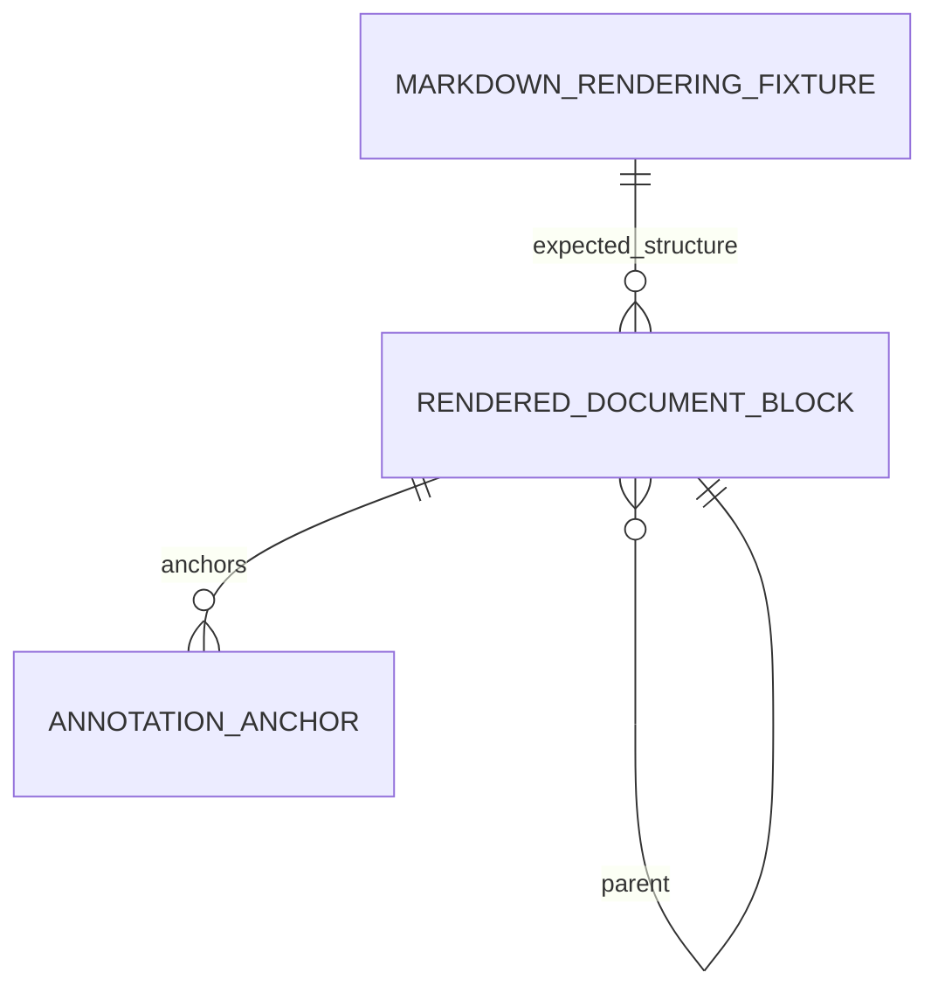
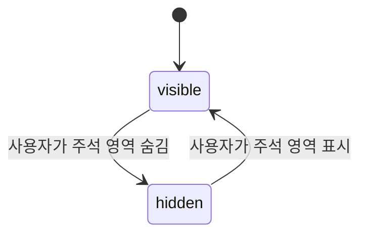

# 데이터 모델 — Markdown 렌더링 품질

## MarkdownRenderingFixture

| 필드 | 설명 | 검증 규칙 |
|---|---|---|
| `id` | 사람이 읽을 수 있는 고유 fixture 식별자 | 코퍼스에서 중복 불가, 실패 출력에 포함 |
| `category` | `commonmark-list`, `block`, `inline`, `gfm`, `recovery`, `safety`, `annotation` | 최소 요구 수량 집계에 사용 |
| `markdown` | 독자적으로 관리하는 최소 재현 입력 | UTF-8, 줄바꿈 변형 사례 허용 |
| `expectedStructure` | 노드 종류·부모/자식·속성 관계 | 목록은 `ul/ol > li`, 순서 목록은 `start` 검증 |
| `expectedText` | 표시되어야 하는 텍스트 또는 금지 텍스트 | 불완전 입력도 읽을 수 있는 텍스트를 명시 |
| `annotationExpectation` | 선택적 블록/부분 선택/취소 기대 | 앵커가 다른 블록으로 이동하지 않음 |

## RenderedDocumentBlock

기존 `MarkdownBlock`을 대체 또는 호환 확장하는 공유 모델이다. 화면 layout용으로
행을 추측하지 않고 AST 의미 노드에 연결한다.

| 필드 | 설명 |
|---|---|
| `id` | 렌더링마다 결정적으로 생성되는 블록 식별자 |
| `kind` | heading, paragraph, list-item, blockquote, code, table 등 의미 노드 종류 |
| `sourceRange` | 원문 offset 및 start/end line·column; annotation stale 검증 근거 |
| `text` | 선택/부분 주석의 기준이 되는 렌더 텍스트 |
| `parentId` | 목록·인용문·중첩 블록 같은 구조적 부모 식별자(없으면 root) |
| `metadata` | heading level, ordered start, task checked, language, Mermaid 감지 등 종류별 정보 |

### 관계와 불변식

- `sourceRange`는 문서 범위 안에 있어야 하며, 부모 범위를 벗어난 자식은 허용하지 않는다.
- 목록 항목은 문단·중첩 목록·인용문·코드 같은 복수 자식을 가질 수 있다.
- `orderedStart`는 첫 순서 목록의 원문 시작값이며, 후속 `li`의 표시 번호를 개별
  행 parser로 계산하지 않는다.
- `text`와 annotation offset은 UTF-16 JavaScript 문자열 기준으로 일관되게 계산한다.

## AnnotationAnchor 호환 확장

기존 `AnnotationAnchor`의 `blockId`, `startOffset`, `endOffset`, `selectedText`,
line 범위는 유지한다. 품질 개선 중에는 다음 검증 정보를 추가할 수 있다.

| 필드 | 설명 |
|---|---|
| `sourceStartOffset` / `sourceEndOffset` | 저장 당시 AST source 범위 검증값 |
| `blockTextFingerprint` | 같은 블록인지 재검증하는 비가역 요약값 |
| `status` | `active` 또는 `stale`; 불일치 시 stale이며 재부착하지 않음 |

상태 전이: `active → stale`은 문서 갱신 후 block id/source/text 검증 실패 시 발생한다.
`stale → active`는 사용자가 명시적으로 새 범위를 선택해 주석을 수정할 때만 가능하다.

## AnnotationPanelVisibility

AW Markdown workspace 전용 화면 상태다. Markdown 문서나 `AnnotationDraft`에 저장하지
않으며, 문서/주석/선택 상태와 독립적으로 전환된다.

| 값 | 의미 | 화면 결과 |
|---|---|---|
| `visible` | 기본 상태 | 주석 목록, agent prompt, TOC 보조 열을 표시 |
| `hidden` | 읽기 공간 우선 상태 | 보조 열을 숨기고 Markdown 본문 열을 사용 가능한 폭으로 확장 |

- 상태 전환은 열린 문서, `AnnotationDraft[]`, 선택 anchor/rect, annotation draft와
  editing id를 변경하지 않는다.
- 표시 전환 제어는 현재 상태와 반대 동작을 접근 가능한 이름으로 제공한다.
