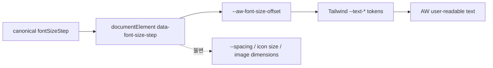

# 외형 환경설정 인터페이스 계약

AW의 Slider, 단축키, Tauri application service, 모든 WebView가 공유하는 계약이다.

## Tauri Commands

### `get_appearance_preferences`

입력 payload 없음.

성공 응답:

```json
{
  "fontSizeStep": 0
}
```

- 새 창 hydrate와 설정 화면 초기값에 사용한다.
- 저장 문서가 없거나 유효하지 않아도 정상화된 기본 응답을 반환해야 한다.

### `set_font_size_step`

요청:

```json
{
  "fontSizeStep": 2
}
```

성공 응답:

```json
{
  "fontSizeStep": 2
}
```

- Slider의 절대값 변경 전용이다.
- 저장 성공 후에만 성공 응답과 change event를 만든다.
- 허용값 밖 입력은 domain 규칙에 따라 `0`으로 정규화한 canonical 응답을 반환한다.

### `adjust_font_size_step`

요청:

```json
{
  "delta": 1
}
```

성공 응답:

```json
{
  "fontSizeStep": 1
}
```

- `delta`는 `-1` 또는 `1`만 허용한다.
- 현재 canonical 값에 원자적으로 적용하며 `-2..2`에서 clamp한다.
- 경계에서 같은 방향으로 반복 호출해도 경계값을 성공 응답한다.

### 오류 계약

- 저장 실패: 이전 canonical 값 유지, change event 없음, 사용자에게 표시 가능한 안전한
  오류 문자열 반환
- invalid delta: 값 변경/event 없이 validation 오류
- 오류 문자열에 파일 내용, 환경변수 값, 세션 정보는 포함하지 않음

## App-wide Event

**이름**: `app://appearance-preferences-changed`

payload:

```json
{
  "fontSizeStep": -1
}
```

### 순서 계약

1. repository 저장 성공
2. service in-memory 값 교체
3. command caller에 canonical 값 반환 및 모든 WebView에 event emit

각 WebView는 중복된 같은 값 event를 멱등하게 처리한다. hydrate 중 event를 받으면 event
값이 늦게 도착한 초기 조회 응답보다 우선한다.

## Keyboard Contract

| 입력 | 동작 | 기본 동작 차단 |
|---|---|---|
| `Meta` + logical `+` | `adjust_font_size_step({ delta: 1 })` | 예 |
| `Meta` + logical `=` | `adjust_font_size_step({ delta: 1 })` | 예 |
| `Meta` + logical `-` | `adjust_font_size_step({ delta: -1 })` | 예 |
| `Meta` + `,` | 기존 Preferences 열기 | font handler는 아니오 |
| ctrl-only, alt 포함, 일반 key | font 동작 없음 | 아니오 |

단축키는 입력/textarea/contenteditable에 focus가 있어도 동작하며 해당 요소의 내용은 바꾸지
않는다.

## Slider UI Contract

- `min=-2`, `max=2`, `step=1`, 단일 thumb
- visible label: `글꼴 크기`
- 현재 signed 값 표시: `-2`, `-1`, `0`, `+1`, `+2`
- 다섯 tick label 제공
- 보조 기술에 현재 단계와 범위를 전달
- 방향키로 정확히 한 단계 이동
- 값 변경은 별도 Save 없이 즉시 `set_font_size_step` 호출
- pending 중 중복 저장을 제어하고 실패하면 마지막 canonical 값으로 복귀하며 오류 표시

## CSS Contract



- 단계당 offset은 1px이며 전체 범위는 `-2px..2px`
- root font-size, WebView zoom, Tailwind spacing token은 변경 금지
- image와 icon의 computed width/height는 단계 변경 전후 동일
- 명시적 typography utility와 기본 상속 텍스트 모두 현재 단계를 반영
