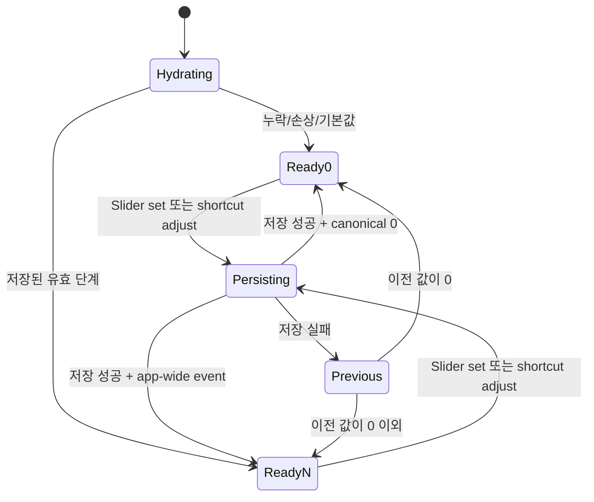

# Phase 1 Data Model: 창 글꼴 크기 조정

## 1. AppearancePreferences

앱 전체에 적용되는 외형 환경설정 문서다. Tauri app-data에 하나만 존재하며 모든 AW 창이
같은 canonical 값을 본다.

| 필드 | 타입 | 기본값 | 규칙 |
|---|---|---:|---|
| `fontSizeStep` | 정수 | `0` | 허용값은 `-2`, `-1`, `0`, `1`, `2` |

### JSON 표현

```json
{
  "fontSizeStep": 0
}
```

### 검증과 복구

- 문서 없음: 기본 문서 `{ "fontSizeStep": 0 }`
- 허용 범위 밖 정수: `0`으로 정규화하고 canonical 문서를 다시 저장
- 필드 누락: Serde 기본값 `0`
- 깨진 JSON: `.bak` 복구를 먼저 시도하고 실패하면 손상본을 보존한 뒤 기본 문서 생성
- 일반 I/O 저장 실패: 현재 in-memory 값을 변경하지 않고 오류 반환

## 2. FontSizeStep

`AppearancePreferences.fontSizeStep`의 순수 값 객체다.

| 값 | CSS offset | 의미 |
|---:|---:|---|
| `-2` | `-2px` | 가장 작은 글꼴 |
| `-1` | `-1px` | 작은 글꼴 |
| `0` | `0px` | 기본 글꼴 |
| `1` | `1px` | 큰 글꼴 |
| `2` | `2px` | 가장 큰 글꼴 |

### 연산

- `normalize(explicitValue)`: 허용 집합이면 그대로, 아니면 `0`
- `adjust(+1)`: `min(current + 1, 2)`
- `adjust(-1)`: `max(current - 1, -2)`
- 상대 증감 delta는 `-1` 또는 `1`만 허용

## 3. FontSizeAdjustment

단축키가 만드는 일회성 command 값이며 영속화하지 않는다.

| 필드 | 타입 | 규칙 |
|---|---|---|
| `delta` | 정수 | `-1` 또는 `1` |

Slider는 상대 조정이 아니라 `FontSizeStep` 절대값을 전송한다.

## 4. AppearancePreferencesChanged

저장 성공 후 모든 WebView에 전달하는 event payload다.

| 필드 | 타입 | 의미 |
|---|---|---|
| `fontSizeStep` | `FontSizeStep` | 저장·정규화가 완료된 canonical 단계 |

event는 영속 상태를 복제하는 알림이며 별도 식별자나 창 label을 갖지 않는다.

## 관계와 상태 전이



### 핵심 불변식

1. service가 노출하는 값은 항상 `-2..2`다.
2. repository 저장 성공 전에는 in-memory canonical 값이 바뀌지 않는다.
3. event payload와 command 응답은 같은 canonical 저장값이다.
4. 경계에서의 같은 방향 증감은 같은 값을 반환하며 오류가 아니다.
5. 각 WebView의 dataset 값은 마지막 canonical 응답 또는 event와 같다.
6. 글꼴 단계 변경은 React route/session tree의 identity를 바꾸지 않는다.
