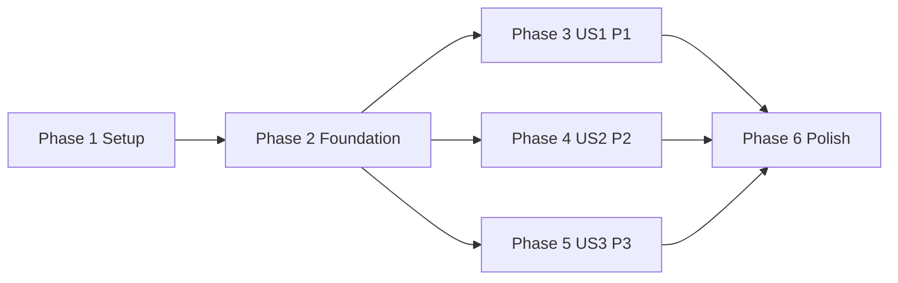

# Tasks: 창 글꼴 크기 조정

**Input**: Design documents from `/specs/035-adjust-font-size/`

**Prerequisites**: plan.md, spec.md, research.md, data-model.md,
contracts/appearance-preferences-contract.md, quickstart.md

**Tests**: 순수 단계 계산, 키 조합 판별, 영속성 정규화·복구, application service의
원자성은 Constitution에 따라 구현 전에 테스트한다. OS/WebView 다중 창과 시각 배치는
Storybook 및 quickstart 실행 검증으로 보완한다.

**Organization**: 각 사용자 스토리는 공통 기반 완료 후 독립적으로 구현·검증할 수 있도록
구성한다.

## Format: `[ID] [P?] [Story] Description`

- **[P]**: 다른 파일을 대상으로 하며 미완료 선행 작업에 의존하지 않아 병렬 실행 가능
- **[Story]**: `spec.md`의 User Story 매핑
- 모든 작업은 실제 수정 또는 검증 대상의 정확한 파일 경로를 포함

## Phase 1: Setup (Shared Infrastructure)

**Purpose**: 기존 AW design system과 Storybook 환경에 필요한 기반 구성요소 준비

- [X] T001 [P] `pnpm dlx shadcn@latest add slider`를 `apps/agentic-workbench`에서 실행하고 생성 결과를 검토해 `apps/agentic-workbench/src/components/ui/slider.tsx`에 현재 `radix-nova` Slider primitive를 추가
- [X] T002 [P] appearance command 응답과 app-wide event를 Storybook에서 재현할 수 있도록 `apps/agentic-workbench/.storybook/mocks/tauri-core.ts`와 `apps/agentic-workbench/.storybook/mocks/tauri-event.ts`에 초기 mock 상태와 event helper를 추가

---

## Phase 2: Foundational (Blocking Prerequisites)

**Purpose**: 세 사용자 스토리가 공유하는 canonical 값, 영속성 경계, frontend context 구축

**⚠️ CRITICAL**: 이 단계가 완료되기 전에는 사용자 스토리 구현을 시작하지 않는다.

### Tests and models

- [X] T003 [P] Rust의 허용값 `-2..2`, invalid-to-zero, `±1` clamp와 invalid delta 실패 테스트를 먼저 `apps/agentic-workbench/src-tauri/src/domain/appearance_preferences.rs`에 작성하고 실패 확인
- [X] T004 [P] TypeScript의 `FontSizeStep` 정규화, signed label, 단계별 `-2px..2px` offset 매핑 테스트를 먼저 `apps/agentic-workbench/src/entities/appearance-preferences/model/font-size-step.test.ts`에 작성하고 실패 확인
- [X] T005 [P] `AppearancePreferences`, `FontSizeStep`, `FontSizeAdjustment` 순수 모델과 serde 기본값을 `apps/agentic-workbench/src-tauri/src/domain/appearance_preferences.rs`에 구현해 T003을 통과
- [X] T006 [P] `FontSizeStep` union, `AppearancePreferences`/event 타입과 정규화·표시·offset helper를 `apps/agentic-workbench/src/entities/appearance-preferences/model/types.ts`와 `apps/agentic-workbench/src/entities/appearance-preferences/model/font-size-step.ts`에 구현해 T004를 통과
- [X] T007 저장 기술과 Tauri에 의존하지 않는 `AppearancePreferencesRepository` port를 `apps/agentic-workbench/src-tauri/src/ports/appearance_preferences_repository.rs`에 정의

### Tests for shared services and interfaces

- [X] T008 [P] get/set/adjust, 경계 멱등성, 저장-before-state, 저장 실패 rollback을 검증하는 fake-repository 테스트를 먼저 `apps/agentic-workbench/src-tauri/src/application/appearance_preferences_service.rs`에 작성하고 실패 확인
- [X] T009 [P] app-data 고정 파일의 누락/default, roundtrip, atomic backup 사용을 검증하는 tempfile 테스트를 먼저 `apps/agentic-workbench/src-tauri/src/infrastructure/json_appearance_preferences_repository.rs`에 작성하고 실패 확인
- [X] T010 [P] `get_appearance_preferences`, `set_font_size_step`, `adjust_font_size_step`의 정확한 invoke payload와 event 구독 정리를 검증하는 테스트를 먼저 `apps/agentic-workbench/src/entities/appearance-preferences/api/appearance-preferences-repository.test.ts`에 작성하고 실패 확인

### Shared implementation

- [X] T011 [P] repository와 `Mutex`로 canonical 값을 직렬화하고 저장 성공 후에만 상태를 교체하는 `AppearancePreferencesService`를 `apps/agentic-workbench/src-tauri/src/application/appearance_preferences_service.rs`에 구현해 T008을 통과
- [X] T012 [P] 기존 `json_store.rs`의 원자적 JSON 문서 저장을 사용하는 `JsonAppearancePreferencesRepository`를 `apps/agentic-workbench/src-tauri/src/infrastructure/json_appearance_preferences_repository.rs`에 구현해 T009의 기본 저장 계약을 통과
- [X] T013 [P] 세 command wrapper와 `app://appearance-preferences-changed` listener를 `apps/agentic-workbench/src/entities/appearance-preferences/api/appearance-preferences-repository.ts`에 구현해 T010을 통과
- [X] T014 domain/application/port/infrastructure module export, service 초기화·manage, 세 Tauri command 등록과 저장 후 global emit을 `apps/agentic-workbench/src-tauri/src/domain/mod.rs`, `apps/agentic-workbench/src-tauri/src/application/mod.rs`, `apps/agentic-workbench/src-tauri/src/ports/mod.rs`, `apps/agentic-workbench/src-tauri/src/infrastructure/mod.rs`, `apps/agentic-workbench/src-tauri/src/inbound/tauri_commands.rs`, `apps/agentic-workbench/src-tauri/src/lib.rs`에 연결
- [X] T015 listener-first hydration, canonical context 값/동작, 같은 값 event 멱등 처리와 unlisten cleanup 테스트를 먼저 `apps/agentic-workbench/src/app/providers/appearance-preferences-provider.test.ts`에 작성하고 실패 확인
- [X] T016 route tree 위에서 canonical appearance context를 제공하고 document dataset을 갱신하는 기본 `AppearancePreferencesProvider`를 `apps/agentic-workbench/src/app/providers/appearance-preferences-provider.tsx`에 구현한 뒤 `apps/agentic-workbench/src/main.tsx`에 한 번 mount해 T015를 통과

**Checkpoint**: 모든 창이 같은 backend canonical 값을 읽고 변경할 수 있는 기반이 준비됨

---

## Phase 3: User Story 1 - 단축키로 글꼴 크기 조정 (Priority: P1) 🎯 MVP

**Goal**: 활성 AW 창에서 `Cmd++`/`Cmd+-`로 한 단계씩 조정하고 모든 열린 AW 창에 1초
이내 반영하며 작업 상태를 유지한다.

**Independent Test**: 기본 `0`에서 `Cmd++` 한 번으로 `1`, `Cmd+-` 한 번으로 다시 `0`이
되고 main/settings/session 창의 텍스트가 함께 바뀌며 입력·session 상태가 유지되는지
확인한다.

### Tests for User Story 1

- [X] T017 [P] [US1] `Meta +`, `Meta =`, `Meta -`를 `±1`로 해석하고 `Cmd+,`, ctrl-only, alt 포함, 일반 key를 거부하는 테스트를 먼저 `apps/agentic-workbench/src/features/font-size-adjustment/model/keyboard-shortcut.test.ts`에 작성하고 실패 확인
- [X] T018 [P] [US1] capture listener가 인식한 조합에서만 `preventDefault`와 adjust를 호출하고 입력 target에서도 동작하며 cleanup되는 테스트를 먼저 `apps/agentic-workbench/src/app/providers/appearance-preferences-provider.test.ts`에 추가하고 실패 확인

### Implementation for User Story 1

- [X] T019 [US1] 키보드 배열 차이를 고려한 logical key 판별과 modifier guard를 `apps/agentic-workbench/src/features/font-size-adjustment/model/keyboard-shortcut.ts`에 구현해 T017을 통과
- [X] T020 [US1] capture 단계 `keydown` listener를 `apps/agentic-workbench/src/app/providers/appearance-preferences-provider.tsx`에 연결하고 인식된 입력을 `adjust_font_size_step`으로 전달해 T018을 통과
- [X] T021 [P] [US1] `data-font-size-step`별 `--aw-font-size-offset`과 Tailwind `--text-*` runtime token을 `apps/agentic-workbench/src/index.css`에 정의하되 root font-size, `--spacing`, WebView zoom을 변경하지 않도록 구현

**Checkpoint**: 단축키 기반 MVP를 독립 실행하고 Quickstart 시나리오 A로 검증 가능

---

## Phase 4: User Story 2 - 설정에서 원하는 단계 선택 (Priority: P2)

**Goal**: Settings 창의 접근 가능한 Slider로 `-2..2` 중 원하는 값을 직접 선택하고 현재
canonical 값을 확인한다.

**Independent Test**: Slider의 다섯 값을 차례로 선택해 visible/accessible 현재 값과 모든
열린 창의 표시 단계가 일치하고, 방향키가 정확히 한 단계씩 이동하는지 확인한다.

### Tests for User Story 2

- [X] T022 [P] [US2] 단일 thumb, `min=-2`, `max=2`, `step=1`, 다섯 tick, signed value, label/description/error와 `aria-valuetext` 계약 테스트를 먼저 `apps/agentic-workbench/src/features/font-size-adjustment/ui/font-size-slider.test.tsx`에 작성하고 실패 확인
- [X] T023 [P] [US2] Settings page가 Appearance 섹션을 agent profile 설정과 독립적으로 조합하고 loading/error 상태에서도 페이지 구조를 유지하는 테스트를 먼저 `apps/agentic-workbench/src/pages/settings/ui/settings-page.test.tsx`에 추가하고 실패 확인

### Implementation for User Story 2

- [X] T024 [US2] shadcn `Slider`와 `Field`를 조합한 controlled `FontSizeSlider` 및 pending rollback/error UI를 `apps/agentic-workbench/src/features/font-size-adjustment/ui/font-size-slider.tsx`에 구현해 T022를 통과
- [X] T025 [US2] appearance context의 canonical 값과 `set_font_size_step` 동작을 Settings 상단 Appearance 섹션에 연결하고 기존 agent 설정 저장 흐름과 분리하도록 `apps/agentic-workbench/src/pages/settings/ui/settings-page.tsx`를 수정해 T023을 통과
- [X] T026 [US2] `-2`, `0`, `2`, pending, error 상태를 Atomic Design molecule로 등록하도록 `apps/agentic-workbench/src/features/font-size-adjustment/ui/font-size-slider.stories.tsx`를 작성

**Checkpoint**: Slider 경로가 단축키 없이도 독립적으로 다섯 단계 설정과 접근성 검증을 제공

---

## Phase 5: User Story 3 - 선택한 크기를 다음 실행에도 유지 (Priority: P3)

**Goal**: 마지막 단계가 새 창과 앱 재실행의 첫 콘텐츠 프레임부터 적용되고, 손상값과 빠른
교차 입력에서도 모든 창이 같은 canonical 값으로 수렴한다.

**Independent Test**: `1`을 저장한 뒤 새 session 창과 재실행 첫 창에서 `1`이 flash 없이
적용되고 Settings Slider도 `1`을 표시하며, 손상 저장값은 `0`으로 안전 복구되는지
확인한다.

### Tests for User Story 3

- [X] T027 [P] [US3] 범위 밖 값 canonical rewrite, 깨진 현재 JSON의 `.bak` 복구, backup도 실패할 때 손상본 보존과 `0` 복구 테스트를 먼저 `apps/agentic-workbench/src-tauri/src/infrastructure/json_appearance_preferences_repository.rs`에 추가하고 실패 확인
- [X] T028 [P] [US3] service bootstrap이 저장값을 복원하고 동시 adjust를 직렬화하며 실제 변경이 없는 경계 입력은 canonical 값을 유지하는 테스트를 먼저 `apps/agentic-workbench/src-tauri/src/application/appearance_preferences_service.rs`에 추가하고 실패 확인
- [X] T029 [P] [US3] child render 전 dataset 적용, hydrate 중 event 우선, 조회 실패 시 `0` fallback, 중복 event 무재마운트 테스트를 먼저 `apps/agentic-workbench/src/app/providers/appearance-preferences-provider.test.ts`에 추가하고 실패 확인

### Implementation for User Story 3

- [X] T030 [P] [US3] canonical startup rewrite와 current/backup 모두 손상된 경우의 보존·기본 복구를 `apps/agentic-workbench/src-tauri/src/infrastructure/json_appearance_preferences_repository.rs`와 `apps/agentic-workbench/src-tauri/src/application/appearance_preferences_service.rs`에 구현해 T027·T028을 통과
- [X] T031 [P] [US3] listener-first hydration race guard와 route child 초기 render gate를 `apps/agentic-workbench/src/app/providers/appearance-preferences-provider.tsx`와 `apps/agentic-workbench/src/main.tsx`에 구현해 T029를 통과

**Checkpoint**: 새 창·재실행·손상 복구까지 포함한 전체 사용자 가치가 독립 검증 가능

---

## Phase 6: Polish & Cross-Cutting Concerns

**Purpose**: 다섯 단계 전체의 시각 품질, 문서, Storybook, 최종 회귀 검증

- [X] T032 [P] AW 로컬의 고정 arbitrary 글꼴 크기를 동적 typography token으로 전환하고 `-2/2` clipping을 보정하도록 `apps/agentic-workbench/src/components/ui/button.tsx`, `apps/agentic-workbench/src/components/ui/code-block.tsx`, `apps/agentic-workbench/src/features/agent-run/ui/agent-run-minimap.tsx`, `apps/agentic-workbench/src/features/agent-run/ui/agent-run-panel.tsx`, `apps/agentic-workbench/src/features/agent-run/ui/agent-run-tile.tsx`, `apps/agentic-workbench/src/features/agent-run/ui/permission-request-dialog.tsx`, `apps/agentic-workbench/src/features/agent-run/ui/prompt-command-autocomplete.tsx`를 수정
- [X] T033 [P] AW가 소비하는 shared Git/Markdown 화면의 고정 micro text도 앱 범위에서 단계 적용을 받도록 scoped compatibility typography 규칙을 `apps/agentic-workbench/src/index.css`에 추가하고 shared package 소스는 변경하지 않음
- [X] T034 [P] 기능 범위·비범위, 백엔드→event→Provider 흐름 Mermaid, 단축키, 설정 Slider, 복구와 검증 방법을 한국어로 `docs/appearance-font-size.md`에 문서화
- [X] T035 Settings page의 `-2`, `0`, `2`, loading, error, 긴 콘텐츠 시각 회귀 상태를 `apps/agentic-workbench/src/stories/pages.stories.tsx`에 추가
- [X] T036 [P] `specs/035-adjust-font-size/quickstart.md`의 frontend 자동화 명령 `pnpm --filter @yoophi/agentic-workbench check-types`, `test`, `build-storybook`을 실행하고 모든 실패를 수정
- [X] T037 [P] `specs/035-adjust-font-size/quickstart.md`의 backend 자동화 명령 `cargo test -p agentic-workbench`와 `cargo check -p agentic-workbench`를 실행하고 모든 실패를 수정
- [ ] T038 `specs/035-adjust-font-size/quickstart.md`의 시나리오 A~D를 macOS 실행 앱에서 수행해 1초 동기화, 입력/session 무손상, 재실행 첫 프레임, 다섯 단계 layout, icon/image 크기 불변을 최종 확인
  - 확인 완료: 실제 개발 앱에서 `Cmd++`/`Cmd+-` 경계 clamp, `Cmd+,` Settings 열기, Slider 방향키 한 단계 변경, Settings 값 동기화, `+2` 저장 후 재실행 복원을 검증했다.
  - 남은 확인: 실제 session 창을 연 상태의 입력·선택·실행 상태 보존, 여러 session 창의 1초 동기화, 시나리오 D 전체 화면의 clipping과 icon/image computed 치수 비교.

---

## Dependencies & Execution Order

### Phase Dependencies



- **Setup (Phase 1)**: 즉시 시작 가능
- **Foundational (Phase 2)**: Setup 완료 후 시작하며 모든 사용자 스토리를 차단
- **US1/US2/US3**: Foundation 완료 후 기술적으로 병렬 시작 가능
- **Polish (Phase 6)**: 제공하려는 모든 사용자 스토리 완료 후 시작

### User Story Dependencies

- **US1 (P1)**: Foundation 이후 독립 시작. backend adjust와 Provider context만 사용
- **US2 (P2)**: Foundation 이후 독립 시작. backend absolute set과 Provider context만 사용
- **US3 (P3)**: Foundation 이후 독립 시작. 저장 fixture와 Provider hydrate로 직접 검증
- 권장 delivery 순서는 우선순위대로 **US1 → US2 → US3**지만 구현 인력이 나뉘면 병렬 가능

### Within Each User Story

1. `Tests` 작업을 먼저 작성하고 예상한 이유로 실패하는지 확인
2. 순수 모델/판별 구현
3. application service 또는 UI feature 구현
4. app/inbound composition 연결
5. 독립 테스트와 해당 Checkpoint 검증

## Parallel Opportunities

- Setup: T001과 T002
- Foundation red tests: T003, T004
- Foundation 모델: T005와 T006
- Foundation service/interface red tests: T008, T009, T010
- Foundation 구현: T011, T012, T013
- Foundation 완료 후: US1, US2, US3를 서로 병렬 수행 가능
- US1: T017과 T018, 별도 CSS 작업 T021
- US2: T022와 T023
- US3: T027, T028, T029 후 T030과 T031
- Polish: T032, T033, T034와 T035; 자동 검증 T036과 T037

## Parallel Example: User Story 1

```text
Task T017: keyboard-shortcut.test.ts에서 logical key/modifier 계약을 red로 고정
Task T018: appearance-preferences-provider.test.ts에서 capture listener 계약을 red로 고정
Task T021: index.css에 text token offset을 구현
```

## Parallel Example: User Story 2

```text
Task T022: font-size-slider.test.tsx에 Slider 접근성/단계 계약 작성
Task T023: settings-page.test.tsx에 Appearance 섹션 조합 계약 작성
```

## Parallel Example: User Story 3

```text
Task T027: JSON repository 손상/backup 복구 테스트 작성
Task T028: application service bootstrap/동시성 테스트 작성
Task T029: Provider hydration race/initial gate 테스트 작성
```

## Implementation Strategy

### MVP First (User Story 1)

1. Phase 1 Setup 완료
2. Phase 2 Foundation 완료
3. Phase 3 US1 완료
4. Quickstart 시나리오 A와 main/settings/session 동시 반영을 검증
5. 단축키 기반 MVP를 demo한 뒤 US2/US3로 확장

### Incremental Delivery

1. Foundation → canonical backend와 WebView context 준비
2. US1 → 단축키 조정 MVP
3. US2 → 발견 가능하고 접근 가능한 Settings Slider
4. US3 → 재실행/새 창/손상 복구 신뢰성
5. Polish → 전체 화면 5단계 시각 회귀와 문서·Storybook·자동 검증

### Parallel Team Strategy

1. 팀이 Setup + Foundation을 함께 완료
2. 이후 담당을 분리:
   - Developer A: US1 keyboard/CSS
   - Developer B: US2 Slider/Settings
   - Developer C: US3 persistence/hydration
3. 세 story checkpoint 통과 후 Phase 6에서 통합 시각·회귀 검증

## Requirement Traceability

| Requirement | Primary Tasks |
|---|---|
| FR-001, FR-002, FR-005 | T003–T006, T011 |
| FR-003, FR-004, FR-014 | T017–T020 |
| FR-006, FR-013 | T022–T026 |
| FR-007, FR-009 | T013–T016, T020, T025 |
| FR-008, FR-011 | T027–T031 |
| FR-010 | T018, T020, T029, T031, T038 |
| FR-012 | T021, T032, T033, T038 |
| SC-001–SC-006 | T026, T035–T038 |

## Notes

- `[P]`는 파일 충돌과 미완료 dependency가 없는 병렬 기회를 뜻한다.
- Story label은 spec.md의 US1/US2/US3과 직접 대응한다.
- red test 작업은 구현 전에 실행해 예상 실패를 확인한다.
- 앱 전용 요구이므로 `packages/*`와 `crates/*`는 수정하지 않는다.
- 각 checkpoint에서 멈춰 해당 story를 독립 검증할 수 있다.
