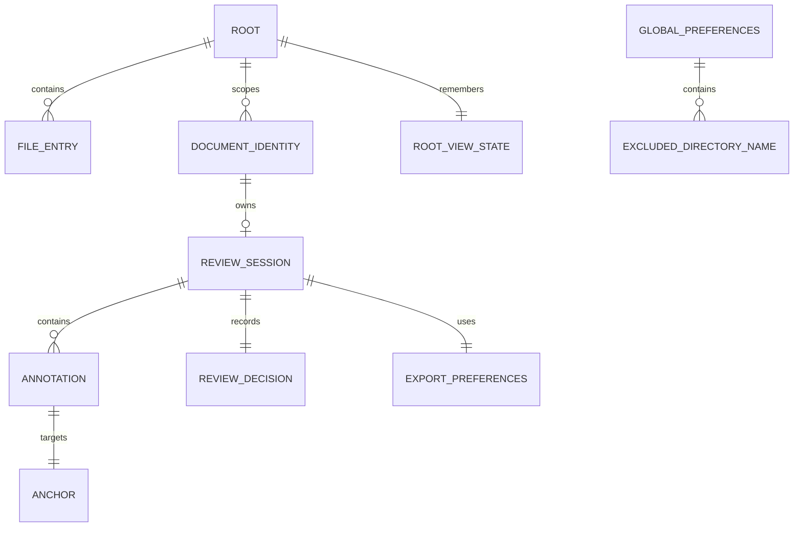
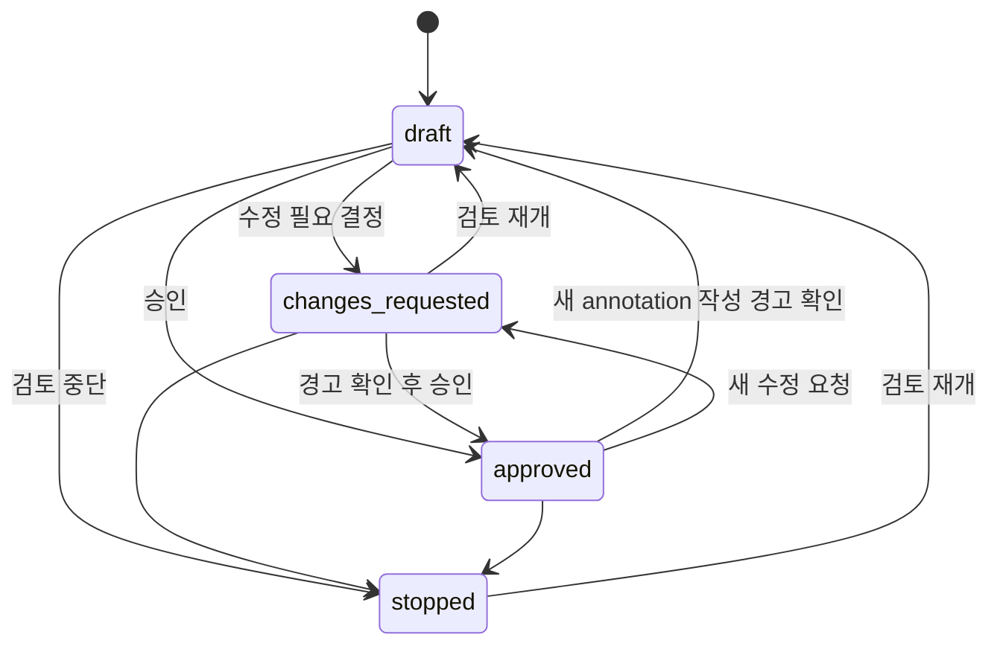
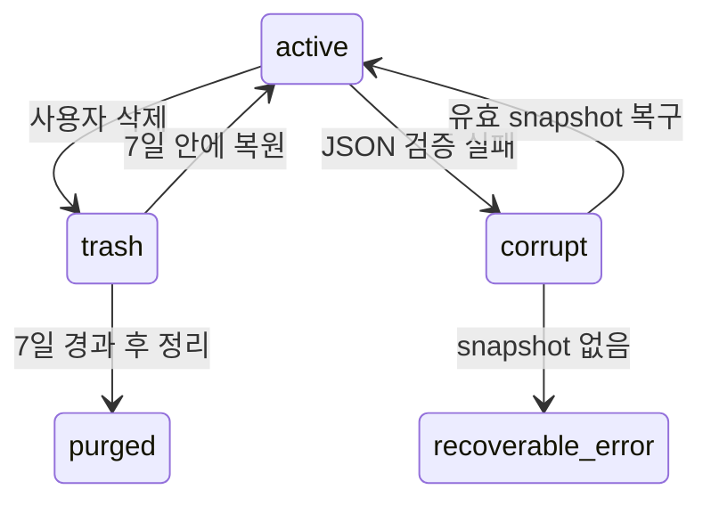

# Data Model: Markdown Annotator 독립 제품화

## 모델 원칙

- filesystem 경로는 사용자 표시용 상대 경로와 검증된 canonical 경로를 구분한다.
- `ReviewSession`은 annotation, 문서 결정, 내보내기 설정과 읽기 상태를 함께 저장하는 aggregate다.
- 저장되는 모든 envelope에는 `schemaVersion`과 optimistic concurrency용 `revision`이 있다.
- 삭제·손상·재결합 실패는 데이터를 조용히 없애지 않고 명시적 상태로 남긴다.
- shared file browser 모델에는 Markdown, worktree, Tauri, watcher 또는 persistence 개념을 넣지 않는다.

## 관계 개요



## Shared file browser 모델

### FileBrowserEntry

범용 package 입력 모델이다.

| 필드 | 형식 | 규칙 |
|---|---|---|
| `path` | POSIX-style relative path | 비어 있지 않음, 절대 경로와 `.`/`..` segment 금지 |
| `kind` | `file \| directory` | symlink는 앱 adapter가 정책 적용 후 file/directory로 정규화 |
| `modifiedAt` | ISO-8601 또는 없음 | 정렬용 optional metadata |
| `size` | non-negative integer 또는 없음 | UI 표시 등 선택 기능용 |
| `childState` | `unknown \| loading \| loaded` 또는 없음 | AW lazy directory에만 의미 있음 |

동일 path가 여러 batch에서 들어오면 최초 유효 entry를 유지하되 explicit directory metadata는 합칠 수 있다. file-only 입력에서 필요한 조상 directory는 core가 합성한다.

### FileBrowserOptions

- `expandedPaths: Set<string>`
- `searchQuery: string`
- `sort: name | path | modifiedAt`
- `sortDirection: asc | desc`
- `compressSingleDirectoryChains: boolean`
- optional metadata selector와 locale-aware natural comparator

### FileBrowserRow

| 필드 | 설명 |
|---|---|
| `id` | canonical relative path 기반 stable id |
| `path` | row action이 사용하는 canonical relative path |
| `label` | 단일 이름 또는 `b/b1` 같은 압축 표시 |
| `kind` | file 또는 directory |
| `depth` | 압축 이후 visible tree depth |
| `expanded` | directory의 현재 펼침 상태 |
| `hasChildren` | 알려진 또는 미확정 child 존재 여부 |
| `childState` | lazy/progressive 상태 |
| `matchRanges` | label/path 검색 highlight 구간 |
| `chainPaths` | 압축된 directory 경로 전체; 마지막 값이 `path` |

검색 결과는 일치 파일/디렉터리와 그 조상을 유지한다. Markdown 범위 필터링과 제외 directory 적용은 MA scan adapter가 먼저 수행한다.

## Root와 scan 모델

### RootIdentity

| 필드 | 설명 |
|---|---|
| `rootId` | canonical path를 versioned 방식으로 hash한 불투명 ID |
| `canonicalPath` | backend에서만 신뢰하는 절대 경로 |
| `displayPath` | 사용자에게 표시할 경로 |

canonical root 하나당 window 하나, recursive watcher 하나, active scan 하나를 가진다. 앱 직접 실행 시 Root가 생성되지 않는다.

### ScanSession

| 필드 | 설명 |
|---|---|
| `scanId` | root/settings revision마다 새 UUID |
| `rootId` | 대상 root |
| `exclusionRevision` | scan에 적용된 전역 설정 revision |
| `sequence` | 0부터 증가하는 batch 순서 |
| `status` | `scanning \| completed \| cancelled \| failed` |
| `visitedEntries` / `matchedDocuments` | 진행률 |
| `warnings` | 읽을 수 없는 branch 등 비치명 오류 |

UI는 현재 `scanId`가 아니거나 이미 소비한 sequence 이하인 batch를 무시한다. partial failure는 접근 가능한 결과를 폐기하지 않는다.

### RootViewState

root별 app-data에 저장한다: sort, expanded paths, 좌우 panel visibility/width, 집중 모드, 마지막 active document와 history. 앱 시작 시 root 자체는 자동 복원하지 않으며 사용자가 recent root를 열었을 때만 적용한다.

## Document identity와 내용

### DocumentIdentity

| 필드 | 설명 |
|---|---|
| `rootId` | 문서를 소유한 root |
| `relativePath` | 정규화된 표시/탐색 경로 |
| `fingerprint` | content bytes의 SHA-256 |
| `byteLength` | 원본 byte 길이 |
| `modifiedAt` | 관찰한 filesystem 시간 |

identity key는 `rootId + relativePath`다. fingerprint는 외부 변경 판별과 rename 후보 탐색에 사용하되 사용자 확인 없이 identity를 바꾸지 않는다.

### DocumentReadResult

- 성공: identity, BOM이 제거된 UTF-8 text, headings/blocks, warnings
- 실패 code: `outside_root`, `invalid_relative_path`, `unsupported_extension`, `not_found`, `not_regular_file`, `directory_symlink`, `outside_root_symlink`, `invalid_utf8`, `too_large`, `permission_denied`, `io_error`

raw HTML은 실행하지 않고 root 밖 local asset과 자동 remote image fetch를 허용하지 않는다.

## ReviewSession aggregate

| 필드 | 형식/설명 |
|---|---|
| `sessionId` | UUID, 한 logical review의 안정 ID |
| `schemaVersion` | 저장 schema version |
| `revision` | 저장 성공마다 1 증가 |
| `document` | 마지막 확인된 DocumentIdentity |
| `status` | `active \| missing \| trashed` |
| `decision` | 아래 ReviewDecision |
| `annotations` | Annotation 배열 |
| `exportPreferences` | resolved 포함 여부와 최근 선택 |
| `readingState` | scroll anchor/offset, TOC 상태 |
| `createdAt`, `updatedAt` | ISO-8601 |

저장은 expected revision이 현재 revision과 일치할 때만 성공한다. 불일치는 `revision_conflict`로 반환하고 frontend가 최신 aggregate를 다시 읽어 병합 또는 재시도한다.

### ReviewDecision

`draft`, `changes-requested`, `approved`, `stopped` 중 하나다.



open 상태의 change-request/delete annotation이 있으면 승인 전에 경고 확인이 필요하다. approved 상태에서 annotation을 새로 만들면 사용자가 확인한 뒤 decision을 draft 또는 changes-requested로 전환한다.

### Annotation

| 필드 | 설명 |
|---|---|
| `annotationId` | UUID |
| `groupId` | 여러 block을 하나로 다룰 때 공유하는 UUID |
| `type` | `change-request \| question \| note \| delete` |
| `status` | `open \| resolved` |
| `comment` | 사용자 입력; delete도 선택적으로 comment 허용 |
| `anchor` | 원문 위치와 재결합 증거 |
| `attachmentState` | `attached \| conflict \| orphan \| missing` |
| `createdAt`, `updatedAt` | ISO-8601 |

### Anchor

- `blockId`: parser가 안정적으로 식별할 수 있을 때 저장
- `selectedText`: 선택 원문
- `prefix` / `suffix`: 제한된 길이의 주변 문맥
- `headingPath`: 표시와 수동 재연결 보조
- `startOffset` / `endOffset`: 동일 fingerprint에서만 직접 신뢰

재결합은 동일 block id의 확정 일치, selected text+context의 유일 exact match 순으로만 자동 적용한다. 복수 후보는 conflict, 후보 없음은 orphan, 문서 없음은 missing이다.

## Persistence layout

```text
app-data/
├── settings.json
├── roots/index.json
├── reviews/index.json
├── reviews/sessions/<session-id>.json
├── reviews/snapshots/<session-id>/<revision>.json
├── reviews/trash/<deleted-at>-<session-id>.json
└── reviews/corrupt/<detected-at>-<original-name>.json
```

각 JSON은 `{ schemaVersion, revision, payload, checksum? }` envelope다. 저장은 unique temp 작성, file sync, snapshot rotate, atomic rename, parent directory sync 순서다. unknown future version은 읽기 전용 복구 오류로 남기며 초기화하지 않는다.

정리는 expired trash, snapshot 5개 초과분, 오래된 비활성 cache 순서로 수행한다. 100MB는 maintenance 목표이며 active review 저장을 막는 hard quota가 아니다.

## GlobalPreferences

| 필드 | 규칙 |
|---|---|
| `schemaVersion`, `revision` | migration/concurrency |
| `excludedDirectoryNames` | exact 단일 directory 이름; separator, `.`/`..`, NUL 금지 |
| `documentFontSize` | UI가 정의한 안전 범위의 정수 |

기본 제외 목록은 `.git`, `node_modules`, `target`, `dist`, `build`, `.next`다. 설정 변경 event는 revision과 함께 모든 root window에 전달된다.

## RecentItem

root와 document recent를 app-data에 별도 저장한다. canonical path, display path, lastOpenedAt와 존재 여부만 저장하며 문서 내용이나 annotation은 포함하지 않는다. 시작 화면은 최대 하나의 목록 그룹으로 최근 폴더·문서를 표시하고 선택 시 존재 여부를 다시 검증한다.

## FeedbackExport

현재 문서 하나를 대상으로 `schemaVersion`, 생성 시각, document identity/fingerprint, decision, 선택한 annotation을 가진다. 기본 선택은 open annotation 전체이며 resolved는 명시적으로 포함한다. annotation이 없어도 decision만 내보낼 수 있다. JSON은 안정된 key/order로 생성하며 Markdown은 같은 의미를 사람이 읽는 형태로 표현한다.

## 삭제와 복구 상태 전이



모든 app-data 삭제는 별도 명시 확인을 요구한다. 원본 Markdown 파일은 어떤 데이터 관리 action으로도 변경하거나 삭제하지 않는다.
