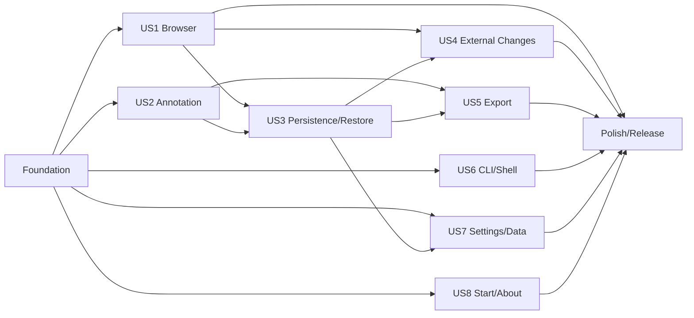

# Tasks: Markdown Annotator 독립 제품화

**Input**: `/specs/036-ma-standalone-product/`의 spec.md, plan.md, research.md, data-model.md, contracts/, quickstart.md

**Tests**: 사용자 여정 전체의 자동화는 선택 사항이지만, 헌법상 순수 로직·공통 package·formatter·filesystem 안전 경계·persistence에는 선행 unit/fixture test가 필수다.

**Organization**: 공통 file browser와 앱 기반을 먼저 만들고, 이후 작업은 8개 사용자 스토리별로 독립 구현·검증할 수 있게 구성한다.

## Format: `[ID] [P?] [Story] Description`

- **[P]**: 미완료 작업과 충돌하지 않는 파일에서 병렬 진행 가능
- **[Story]**: spec.md의 사용자 스토리 번호
- 모든 작업은 구현 또는 검증 대상의 정확한 파일 경로를 포함

## Phase 1: Setup (Shared Infrastructure)

**Purpose**: 공통 package와 MA의 FSD/hexagonal 구조를 만들고 검증 명령을 확정한다.

- [X] T001 `packages/file-browser-core/package.json`, `packages/file-browser-core/tsconfig.json`, `packages/file-browser-core/src/index.ts`에 순수 TypeScript package skeleton과 workspace exports를 생성한다
- [X] T002 [P] `packages/file-browser-react/package.json`, `packages/file-browser-react/tsconfig.json`, `packages/file-browser-react/src/index.ts`에 React package skeleton과 core peer dependency를 생성한다
- [X] T003 [P] `apps/markdown-annotator/src-tauri/src/{domain,ports,application,inbound,infrastructure}/mod.rs`에 top-level ports를 일관되게 사용하는 hexagonal module skeleton을 생성한다
- [X] T004 [P] `apps/markdown-annotator/src/{app,pages,features,entities,shared}/index.ts`에 FSD public boundary skeleton을 생성하고 app-to-app import 금지 lint 규칙을 적용한다
- [X] T005 [P] `apps/markdown-annotator/.storybook/main.ts`에 접근성 addon과 shared package transpilation을 설정한다
- [X] T006 `specs/036-ma-standalone-product/quickstart.md`의 placeholder 명령을 실제 root/package/app script 이름으로 갱신하고 `package.json` 및 `apps/markdown-annotator/package.json`에 누락된 check-types/test script를 추가한다

---

## Phase 2: Foundational (Blocking Prerequisites)

**Purpose**: 두 앱이 소비할 범용 tree 계약과 MA의 안전한 root/window 기반을 먼저 완성한다.

**⚠️ CRITICAL**: 이 phase가 완료되기 전에는 사용자 스토리 구현을 시작하지 않는다.

- [X] T007 [P] `packages/file-browser-core/src/fixtures.ts`와 `packages/file-browser-core/src/create-file-browser-rows.test.ts`에 ancestor 합성, batch 중복, Unicode natural sort, 검색, `b/b1` 압축, lazy child state fixture의 실패 테스트를 작성한다
- [X] T008 `packages/file-browser-core/src/types.ts`와 `packages/file-browser-core/src/create-file-browser-rows.ts`에 `FileBrowserEntry`→`FileBrowserRow` deep interface, path validation, merge, sort, search, flatten, chain compression을 구현한다
- [X] T009 [P] `apps/agentic-workbench/src/entities/worktree-file/lib/file-browser-adapter.test.ts`에 기존 AW lazy tree와 Markdown tree observable behavior를 공통 fixture로 고정한다
- [X] T010 `apps/agentic-workbench/src/entities/worktree-file/lib/file-browser-adapter.ts`와 `apps/agentic-workbench/src/features/worktree-workspace/model/file-tree.ts`를 공통 core adapter로 전환하고 query/load orchestration만 AW에 유지한다
- [X] T011 `apps/agentic-workbench/src/features/worktree-workspace/ui/file-browser-components.tsx`와 `apps/agentic-workbench/src/features/worktree-workspace/ui/worktree-workspace-panel.tsx`의 일반/Markdown tree 소비 지점을 새 adapter에 연결한다
- [X] T012 [P] `packages/file-browser-react/src/FileBrowserTree.test.tsx`에 WAI-ARIA tree, roving focus, Arrow/Home/End, expand/select와 virtualized off-screen focus 실패 테스트를 작성한다
- [X] T013 `packages/file-browser-react/src/types.ts`, `packages/file-browser-react/src/use-tree-keyboard-navigation.ts`, `packages/file-browser-react/src/FileBrowserTree.tsx`에 UI-kit 독립 tree interaction과 virtualization을 구현한다
- [X] T014 `apps/agentic-workbench/src/shared/ui/file-browser-components.tsx`에 Radix 기반 row renderer를 만들고 AW tree를 shared React component로 전환한다
- [X] T015 [P] `apps/markdown-annotator/src-tauri/src/domain/file_browser.rs`와 `apps/markdown-annotator/src-tauri/src/domain/document_identity.rs`에 RootIdentity, LaunchTarget, ScanSession, DocumentIdentity와 구조화된 오류 모델의 unit test를 먼저 작성한다
- [X] T016 `apps/markdown-annotator/src-tauri/src/domain/file_browser.rs`, `apps/markdown-annotator/src-tauri/src/domain/document_identity.rs`, `apps/markdown-annotator/src-tauri/src/ports/file_browser.rs`에 root/scan/document 순수 모델과 port 계약을 구현한다
- [X] T017 [P] `apps/markdown-annotator/src-tauri/src/application/launch_target_service_test.rs`에 directory/file/cwd, invalid extension, 중복 canonical root resolver 테스트를 작성한다
- [X] T018 `apps/markdown-annotator/src-tauri/src/application/launch_target_service.rs`, `apps/markdown-annotator/src-tauri/src/infrastructure/fs_file_browser.rs`, `apps/markdown-annotator/src-tauri/src/inbound/file_browser_commands.rs`에 canonical root resolver와 root-scoped command boundary를 구현한다
- [X] T019 `apps/markdown-annotator/src-tauri/src/lib.rs`와 `apps/markdown-annotator/src/app/providers/application-events-provider.tsx`에서 document-hash/native-tab lifecycle을 root당 단일 window와 공통 event provider로 교체한다
- [X] T020 `packages/file-browser-core`, `packages/file-browser-react`, AW, MA의 check-types/test와 MA Cargo test를 실행하고 결과를 `specs/036-ma-standalone-product/verification.md`의 Foundation 섹션에 기록한다

**Checkpoint**: 공통 core/React tree가 AW에서 회귀 없이 동작하고 MA가 canonical root window를 안전하게 열 수 있다.

---

## Phase 3: User Story 1 - 폴더에서 Markdown 문서 탐색 (Priority: P1) 🎯 MVP

**Goal**: 사용자가 폴더를 열어 Markdown 후손만 있는 압축 tree를 점진적으로 탐색·검색·정렬하고 문서를 읽는다.

**Independent Test**: 10,000 entry/1,000 Markdown fixture root를 열어 첫 batch, 전체 scan, `b/b1` 압축, 빈 branch 숨김, 검색·정렬, 문서 선택과 strict UTF-8 오류를 검증한다.

### Tests for User Story 1

- [X] T021 [P] [US1] `apps/markdown-annotator/src-tauri/src/infrastructure/fs_file_browser_test.rs`에 extension, exclusion, traversal, unreadable branch, directory/file symlink, UTF-8/BOM와 progressive batch fixture의 실패 테스트를 작성한다
- [X] T022 [P] [US1] `apps/markdown-annotator/src/features/file-browser/model/use-file-browser.test.tsx`에 stale scan/sequence 무시, partial warning, search/sort/expanded state 테스트를 작성한다
- [X] T023 [P] [US1] `apps/markdown-annotator/src/features/file-browser/ui/FileBrowserPanel.test.tsx`에 keyboard selection, compressed row와 empty/loading/error UI 테스트를 작성한다

### Implementation for User Story 1

- [X] T024 [US1] `apps/markdown-annotator/src-tauri/src/infrastructure/fs_file_browser.rs`에 `.md`/`.markdown`, exact exclusion, hidden directory 허용, directory symlink 차단, 내부 file symlink dedupe와 unreadable branch warning scan을 구현한다
- [X] T025 [US1] `apps/markdown-annotator/src-tauri/src/application/file_browser_service.rs`와 `apps/markdown-annotator/src-tauri/src/inbound/file_browser_commands.rs`에 취소 가능한 scan ID, 100-entry/50ms batch, sequence/progress/completion event를 구현한다
- [X] T026 [US1] `apps/markdown-annotator/src-tauri/src/infrastructure/sha256_fingerprint.rs`와 `apps/markdown-annotator/src-tauri/src/application/file_browser_service.rs`에 root containment 재검증, strict UTF-8/BOM read와 SHA-256 metadata를 구현한다
- [X] T027 [P] [US1] `apps/markdown-annotator/src/entities/file-browser/model/types.ts`와 `apps/markdown-annotator/src/entities/file-browser/api/file-browser-api.ts`에 scan/read DTO와 Tauri adapter를 구현한다
- [X] T028 [US1] `apps/markdown-annotator/src/features/file-browser/model/use-file-browser.ts`에 progressive entry merge, scan cancellation, stale event 차단, 검색·정렬·expanded state를 구현한다
- [X] T029 [US1] `apps/markdown-annotator/src/shared/ui/file-browser-components.tsx`와 `apps/markdown-annotator/src/features/file-browser/ui/FileBrowserPanel.tsx`에 base-ui renderer, progress/warning UI와 shared virtualized tree를 연결한다
- [X] T030 [P] [US1] `apps/markdown-annotator/src/entities/document/api/document-api.ts`와 `apps/markdown-annotator/src/features/document-navigation/model/document-navigation-store.ts`에 단일 active 문서, 뒤로/앞으로 history와 request token을 구현한다
- [X] T031 [US1] `apps/markdown-annotator/src/pages/annotator/AnnotatorPage.tsx`와 `apps/markdown-annotator/src/shared/ui/markdown-viewer-components.tsx`에 tree/reader/review 3영역, collapsible TOC와 안전한 Markdown rendering을 구현한다
- [X] T032 [P] [US1] `apps/markdown-annotator/src/stories/organisms/FileBrowserTree.stories.tsx`에 loading, progressive, compressed, Unicode, permission warning, empty와 1,000-document story를 등록한다
- [X] T033 [US1] `apps/markdown-annotator/src/features/document-navigation/model/internal-link-resolver.ts`에 same-root Markdown link/wikilink와 heading 이동, HTTP/HTTPS external intent, root 밖 local link 거부를 구현하고 fixture test를 추가한다
- [X] T034 [US1] US1 test와 SC-002~SC-004/SC-006 benchmark를 실행해 `specs/036-ma-standalone-product/verification.md`의 US1 섹션에 결과를 기록한다

**Checkpoint**: annotation 없이도 MA가 안전하고 빠른 독립 Markdown browser로 동작한다.

---

## Phase 4: User Story 2 - 문서에 구조화된 피드백 작성 (Priority: P1)

**Goal**: 선택 영역/블록에 네 종류 annotation을 작성하고 그룹·상태·문서 결정을 관리한다.

**Independent Test**: 한 문서에서 단일/다중 블록 annotation CRUD, open/resolved, 네 review decision과 승인 경고 전이를 수행한다.

### Tests for User Story 2

- [X] T035 [P] [US2] `apps/markdown-annotator/src-tauri/src/domain/review_session_test.rs`에 annotation/group validation과 draft/changes-requested/approved/stopped 전이의 실패 테스트를 작성한다
- [X] T036 [P] [US2] `apps/markdown-annotator/src/features/review-session/model/review-session-store.test.ts`에 annotation CRUD, group action, approved 상태의 새 annotation 경고 테스트를 작성한다

### Implementation for User Story 2

- [X] T037 [US2] `apps/markdown-annotator/src-tauri/src/domain/review_session.rs`에 ReviewSession, Annotation, Anchor, ReviewDecision과 전이 규칙을 구현한다
- [X] T038 [P] [US2] `apps/markdown-annotator/src/entities/review-session/model/types.ts`와 `apps/markdown-annotator/src/entities/review-session/api/review-session-api.ts`에 frontend entity와 command adapter를 구현한다
- [X] T039 [US2] `apps/markdown-annotator/src/features/review-session/model/review-session-store.ts`에 selection/group CRUD, status와 decision command 상태를 구현한다
- [X] T040 [US2] `apps/markdown-annotator/src/features/review-session/ui/AnnotationDialog.tsx`와 `apps/markdown-annotator/src/shared/ui/annotation-dialog-components.tsx`에 수정 요청·질문·메모·삭제 요청 작성/수정 dialog를 구현한다
- [X] T041 [P] [US2] `apps/markdown-annotator/src/features/review-session/ui/ReviewDecisionPanel.tsx`에 annotation filter/group action, open/resolved와 decision 경고 UI를 구현한다
- [X] T042 [US2] `apps/markdown-annotator/src/pages/annotator/AnnotatorPage.tsx`에 Markdown selection/block anchor와 review panel을 연결하고 keyboard focus를 복원한다
- [X] T043 [P] [US2] `apps/markdown-annotator/src/stories/organisms/ReviewPanel.stories.tsx`에 annotation types, grouped, resolved와 approval warning story를 등록한다
- [X] T044 [US2] US2 unit/UI test와 keyboard-only annotation 흐름을 실행해 `specs/036-ma-standalone-product/verification.md`의 US2 섹션에 기록한다

**Checkpoint**: 저장을 제외한 review 작성/결정 기능을 한 문서에서 독립 검증할 수 있다.

---

## Phase 5: User Story 3 - 문서를 오가며 작업 복원 (Priority: P1)

**Goal**: 문서별 review와 읽기 상태를 app-data에 원자 저장하고 문서 왕복·재실행 시 복원한다.

**Independent Test**: 두 문서에서 서로 다른 review를 저장해 왕복/재실행하고 revision conflict, interrupted save, corrupt current, migration과 snapshot 복구를 검증한다.

### Tests for User Story 3

- [X] T045 [P] [US3] `apps/markdown-annotator/src-tauri/src/infrastructure/json_review_session_repository_test.rs`에 atomic interruption, revision conflict, schema migration, future schema, corrupt recovery와 snapshot retention 실패 테스트를 작성한다
- [X] T046 [P] [US3] `apps/markdown-annotator/src/features/review-session/model/review-session-persistence.test.ts`에 hydrate/autosave/document-switch 경쟁과 reading state 복원 테스트를 작성한다

### Implementation for User Story 3

- [X] T047 [US3] `apps/markdown-annotator/src-tauri/src/ports/review_session_repository.rs`와 `apps/markdown-annotator/src-tauri/src/ports/clock.rs`에 revision-aware aggregate repository와 clock port를 정의한다
- [X] T048 [US3] `apps/markdown-annotator/src-tauri/src/infrastructure/json_review_session_repository.rs`에 세션별 envelope, unique temp→sync→snapshot→rename→parent sync와 sequential migration을 구현한다
- [X] T049 [US3] `apps/markdown-annotator/src-tauri/src/application/review_session_service.rs`와 `apps/markdown-annotator/src-tauri/src/inbound/review_commands.rs`에 load/save expected-revision과 recovery 결과 command를 구현한다
- [X] T050 [P] [US3] `apps/markdown-annotator/src/entities/review-session/api/review-session-api.ts`에 revision conflict/recovery DTO mapping을 추가한다
- [X] T051 [US3] `apps/markdown-annotator/src/features/review-session/model/review-session-persistence.ts`에 per-session autosave serialization, hydrate와 stale write 재조회 흐름을 구현한다
- [X] T052 [P] [US3] `apps/markdown-annotator/src/entities/file-browser/model/root-view-state.ts`에 root별 sort/expanded/panel 상태 repository adapter를 구현한다
- [X] T053 [US3] `apps/markdown-annotator/src/features/document-navigation/model/document-navigation-store.ts`와 `apps/markdown-annotator/src/pages/annotator/AnnotatorPage.tsx`에 문서별 reading position과 root view state 복원을 연결한다
- [X] T054 [US3] US3 repository/UI tests와 SC-005 재실행 fixture를 실행해 `specs/036-ma-standalone-product/verification.md`의 US3 섹션에 기록한다

**Checkpoint**: 저장 완료된 review가 문서 전환, 앱 재실행과 손상 복구에서 유실되지 않는다.

---

## Phase 6: User Story 4 - 외부 변경에도 피드백 안전성 유지 (Priority: P1)

**Goal**: 외부 수정·생성·삭제·rename을 감지하고 annotation을 오결합 없이 유지·충돌·고아·missing 처리한다.

**Independent Test**: editor save burst, repeated text 수정, 문서 삭제와 동일 fingerprint rename을 실행해 trailing debounce와 사용자 확인 relink를 검증한다.

### Tests for User Story 4

- [X] T055 [P] [US4] `apps/markdown-annotator/src-tauri/src/infrastructure/fs_root_watcher_test.rs`에 burst coalescing, 마지막 event 보존, root lifecycle과 stale watcher 테스트를 작성한다
- [X] T056 [P] [US4] `apps/markdown-annotator/src-tauri/src/application/review_reconciliation_test.rs`에 block exact, unique context, ambiguity, orphan, missing과 relink confirm fixture를 작성한다

### Implementation for User Story 4

- [X] T057 [US4] `apps/markdown-annotator/src-tauri/src/infrastructure/fs_root_watcher.rs`와 `apps/markdown-annotator/src-tauri/src/ports/file_browser.rs`에 root당 recursive watcher, trailing debounce와 rescan-hint event를 구현한다
- [X] T058 [US4] `apps/markdown-annotator/src-tauri/src/application/file_browser_service.rs`와 `apps/markdown-annotator/src-tauri/src/inbound/file_browser_commands.rs`에 watcher registry lifecycle, root revision과 non-destructive rescan을 구현한다
- [X] T059 [US4] `apps/markdown-annotator/src-tauri/src/application/review_session_service.rs`에 exact-only annotation reconciliation과 단일 fingerprint rename proposal/confirm을 구현한다
- [X] T060 [P] [US4] `apps/markdown-annotator/src/features/review-session/ui/AttachmentStatusPanel.tsx`에 conflict/orphan/missing 근거, 수동 폐기와 relink 확인 UI를 구현한다
- [X] T061 [US4] `apps/markdown-annotator/src/app/providers/application-events-provider.tsx`와 `apps/markdown-annotator/src/features/file-browser/model/use-file-browser.ts`에서 tree/current document가 하나의 root event를 소비하도록 연결한다
- [X] T062 [US4] US4 watcher/reconciliation test와 SC-007 외부 변경 matrix를 실행해 `specs/036-ma-standalone-product/verification.md`의 US4 섹션에 기록한다

**Checkpoint**: 외부 변경 시 모든 annotation이 명시적 attachment 상태를 가지며 자동 오결합되지 않는다.

---

## Phase 7: User Story 5 - 피드백 검토 및 내보내기 (Priority: P1)

**Goal**: 현재 문서의 선택 피드백과 결정을 사람이 읽는 Markdown 또는 schema-versioned JSON으로 복사·저장한다.

**Independent Test**: open 기본 선택, resolved opt-in, decision-only와 annotation subset을 두 형식으로 생성하고 JSON Schema/determinism을 검증한다.

### Tests for User Story 5

- [X] T063 [P] [US5] `apps/markdown-annotator/src-tauri/src/application/feedback_export_test.rs`에 open/resolved 선택, decision-only, deterministic Markdown/JSON fixture의 실패 테스트를 작성한다
- [X] T064 [P] [US5] `apps/markdown-annotator/src/features/feedback-export/ui/FeedbackExportPanel.test.tsx`에 선택, clipboard 실패 fallback과 file save 상태 테스트를 작성한다

### Implementation for User Story 5

- [X] T065 [US5] `apps/markdown-annotator/src-tauri/src/application/feedback_export_service.rs`에 `contracts/feedback-export-v1.schema.json`과 일치하는 deterministic JSON v1 및 Markdown formatter를 구현한다
- [X] T066 [US5] `apps/markdown-annotator/src-tauri/src/inbound/review_commands.rs`에 현재 session 범위 export command와 UTF-8 save dialog payload를 연결한다
- [X] T067 [P] [US5] `apps/markdown-annotator/src/entities/review-session/api/feedback-export-api.ts`에 clipboard/file export adapter와 구조화 오류 mapping을 구현한다
- [X] T068 [US5] `apps/markdown-annotator/src/features/feedback-export/ui/FeedbackExportPanel.tsx`에 open 기본 선택, resolved opt-in, 개별 선택, preview/copy/save UI를 구현한다
- [X] T069 [US5] JSON Schema validation, clipboard/file smoke와 SC-008 결과를 `specs/036-ma-standalone-product/verification.md`의 US5 섹션에 기록한다

**Checkpoint**: MA 외부 runtime 없이도 비개발자와 agent가 사용할 피드백 artifact를 생성할 수 있다.

---

## Phase 8: User Story 6 - CLI와 외부 앱으로 연결 (Priority: P2)

**Goal**: Finder/default app과 `ma [file-or-directory]`로 MA를 외부 도구와 안전하게 연결한다.

**Independent Test**: cold/running 앱에서 cwd/directory/file을 열고 동일 root focus, Finder/default app, CLI install/check/reinstall/remove와 invalid input을 검증한다.

### Tests for User Story 6

- [X] T070 [P] [US6] `apps/markdown-annotator/src-tauri/src/application/launch_target_service_test.rs`에 CLI cold/single-instance parity와 multiple/unsupported argument 테스트를 추가한다
- [X] T071 [P] [US6] `apps/markdown-annotator/src-tauri/src/infrastructure/macos_native_shell_test.rs`에 canonical path 검증, `open -R`/`open` argument와 launcher ownership 안전 테스트를 작성한다

### Implementation for User Story 6

- [X] T072 [US6] `apps/markdown-annotator/src-tauri/src/ports/native_shell.rs`와 `apps/markdown-annotator/src-tauri/src/infrastructure/macos_native_shell.rs`에 Finder reveal, default app open과 safe path copy port/adapter를 구현한다
- [X] T073 [US6] `apps/markdown-annotator/src-tauri/src/cli_launcher.rs`에 cwd/directory/file resolver를 호출하는 단일 `ma` launcher와 명확한 usage 오류를 구현한다
- [X] T074 [US6] `apps/markdown-annotator/src-tauri/src/infrastructure/cli_installer.rs`에 `~/.local/bin/ma` ownership 검증과 install/check/reinstall/remove를 구현한다
- [X] T075 [US6] `apps/markdown-annotator/src-tauri/src/lib.rs`에 cold start와 single-instance callback을 같은 LaunchTargetService로 연결하고 canonical root 중복 창을 focus한다
- [X] T076 [P] [US6] `apps/markdown-annotator/src/features/external-document-actions/ui/DocumentActionsMenu.tsx`에 Finder 표시, 기본 앱 열기와 경로 복사 action을 구현한다
- [X] T077 [US6] `apps/markdown-annotator/src/features/document-navigation/model/internal-link-resolver.ts`에 검증된 HTTP/HTTPS 외부 열기 command를 연결한다
- [ ] T078 [US6] clean account CLI/native shell acceptance를 실행해 `specs/036-ma-standalone-product/verification.md`의 US6 섹션에 기록한다

**Checkpoint**: MA가 관리자 권한이나 원문 편집 기능 없이 filesystem과 외부 앱 workflow에 연결된다.

---

## Phase 9: User Story 7 - 설정과 로컬 데이터 통제 (Priority: P2)

**Goal**: 전역 제외 directory와 글꼴 크기를 관리하고 recent/review/app-data를 선택적으로 삭제·복구한다.

**Independent Test**: 제외 이름 변경을 열린 모든 root에 반영하고 current review를 보존하며, snapshot/trash/quota와 범위별 삭제를 검증한다.

### Tests for User Story 7

- [X] T079 [P] [US7] `apps/markdown-annotator/src-tauri/src/application/preferences_service_test.rs`에 exact-name validation, 기본값 복원과 settings revision broadcast 테스트를 작성한다
- [X] T080 [P] [US7] `apps/markdown-annotator/src-tauri/src/application/data_management_service_test.rs`에 recent/root/document/all 삭제, 7일 trash와 100MB 정리 우선순위 테스트를 작성한다

### Implementation for User Story 7

- [X] T081 [US7] `apps/markdown-annotator/src-tauri/src/domain/global_preferences.rs`, `apps/markdown-annotator/src-tauri/src/ports/preferences_repository.rs`, `apps/markdown-annotator/src-tauri/src/infrastructure/json_preferences_repository.rs`에 versioned 전역 설정을 구현한다
- [X] T082 [US7] `apps/markdown-annotator/src-tauri/src/application/preferences_service.rs`와 `apps/markdown-annotator/src-tauri/src/inbound/settings_commands.rs`에 validation, 기본값 복원과 모든 root window broadcast를 구현한다
- [X] T083 [US7] `apps/markdown-annotator/src-tauri/src/application/data_management_service.rs`에 recent/root/document/all scope 삭제, trash 복원과 quota maintenance를 구현한다
- [X] T084 [P] [US7] `apps/markdown-annotator/src/entities/global-preferences/api/preferences-api.ts`와 `apps/markdown-annotator/src/features/data-management/model/data-management-api.ts`에 설정/데이터 command adapter를 구현한다
- [X] T085 [US7] `apps/markdown-annotator/src/pages/settings/SettingsPage.tsx`에 제외 이름, 글꼴 크기, CLI 상태와 확인이 필요한 데이터 관리 UI를 구현하고 theme control을 포함하지 않는다
- [X] T086 [US7] Settings/rescan/data recovery smoke를 실행해 `specs/036-ma-standalone-product/verification.md`의 US7 섹션에 기록한다

**Checkpoint**: 사용자가 원본 문서를 건드리지 않고 MA의 범위와 로컬 데이터를 통제할 수 있다.

---

## Phase 10: User Story 8 - 제품 및 개인정보 확인 (Priority: P3)

**Goal**: 시작 화면과 About에서 제품 사용법, build 정보, 지원 범위와 local-first 개인정보 원칙을 확인한다.

**Independent Test**: 직접 실행 시 root를 복원하지 않는 시작 화면과 singleton About/Settings, 정확한 CALVER/commit/tag/license/notices, no-telemetry를 검증한다.

### Tests for User Story 8

- [X] T087 [P] [US8] `apps/markdown-annotator/src/pages/start/StartPage.test.tsx`에 recent 하나의 목록, folder/file open, 3단계 안내와 built-in example 부재 테스트를 작성한다
- [X] T088 [P] [US8] `apps/markdown-annotator/src/pages/about/AboutPage.test.tsx`에 build/local-first/license/notices와 singleton navigation 테스트를 작성한다

### Implementation for User Story 8

- [X] T089 [US8] `apps/markdown-annotator/src/pages/start/StartPage.tsx`와 `apps/markdown-annotator/src/app/App.tsx`에 root 미복원 시작 화면, recent 폴더·문서와 open actions를 구현하고 example browser를 제거한다
- [X] T090 [US8] `apps/markdown-annotator/src-tauri/src/domain/build_info.rs`와 `apps/markdown-annotator/src/entities/build-info/api/build-info-api.ts`에 compile-time CALVER/commit/tag/license/notices 정보를 구현한다
- [X] T091 [US8] `apps/markdown-annotator/src/pages/about/AboutPage.tsx`에 제품/지원 형식/local-first/no-telemetry/license/notices와 검증된 HTTPS link를 구현한다
- [X] T092 [US8] `apps/markdown-annotator/src-tauri/src/inbound/native_menu.rs`와 `apps/markdown-annotator/src-tauri/src/lib.rs`에 AW 패턴을 따른 native menu와 singleton Settings/About window를 구현한다
- [X] T093 [US8] 시작/About/privacy smoke를 실행해 `specs/036-ma-standalone-product/verification.md`의 US8 섹션에 기록한다

**Checkpoint**: 처음 실행하는 사용자와 비개발 사용자도 제품 용도·데이터 처리·버전을 앱 안에서 이해할 수 있다.

---

## Phase 11: Polish & Cross-Cutting Concerns

**Purpose**: 성능, 접근성, 문서, cross-app 검증과 macOS 배포를 제품 완료 기준까지 닫는다.

- [X] T094 [P] `apps/markdown-annotator/src/pages/annotator/AnnotatorPage.tsx`와 `apps/markdown-annotator/src/app/App.tsx`에 좌우 panel 숨김, 집중 모드, narrow-window overlay와 전체 한국어 UI를 마무리한다
- [X] T095 [P] `apps/markdown-annotator/src/features/diagnostics/model/create-redacted-diagnostics.ts`에 경로·문서·annotation을 제외한 사용자 요청형 local 진단 export를 구현하고 redaction test를 추가한다
- [X] T096 `packages/file-browser-core/src/create-file-browser-rows.bench.ts`와 `apps/markdown-annotator/src-tauri/benches/file_browser.rs`에서 SC-002~SC-004 규모 benchmark를 최적화하고 측정 결과를 `specs/036-ma-standalone-product/verification.md`에 기록한다
- [X] T097 [P] `docs/markdown-annotator-data-and-recovery.md`에 app-data layout, migration, snapshot/trash, 삭제와 복구 절차를 한국어로 문서화하고 Mermaid 흐름을 추가한다
- [X] T098 [P] `docs/markdown-annotator-release.md`에 CALVER RC/stable, 수동 업데이트, signing/notarization/stapling/Gatekeeper와 rollback 절차를 한국어로 문서화한다
- [X] T099 [P] `docs/20260801-markdown-annotator-productization-plan.md`, `docs/20260802-markdown-browser-migration-preparation.md`, `docs/20260802-shared-folder-browser-module-strategy.md`를 최종 package 이름과 구현 경계에 맞게 갱신한다
- [X] T100 `apps/markdown-annotator/src-tauri/tauri.release.conf.json`과 `apps/markdown-annotator/scripts/build-release.sh`에 manifest 수정 없는 CALVER/build-info 주입과 app/DMG metadata 일치 검사를 구현한다
- [ ] T101 `apps/markdown-annotator/scripts/verify-macos-release.sh`에 codesign, notarization, staple와 `spctl` 검증을 구현하고 clean macOS acceptance 결과를 `specs/036-ma-standalone-product/verification.md`에 기록한다
- [X] T102 모든 shared package/AW/MA TypeScript test·check-types·build와 MA Rust test/check를 실행하고 app-to-app import가 없음을 `specs/036-ma-standalone-product/verification.md`에 기록한다
- [ ] T103 `specs/036-ma-standalone-product/quickstart.md`의 전체 smoke, keyboard-only/VoiceOver, no-telemetry와 SC-001~SC-012 traceability를 실행·검토하고 `specs/036-ma-standalone-product/verification.md`를 완료한다

---

## Dependencies & Execution Order

### Phase Dependencies

- **Setup (Phase 1)**: 즉시 시작 가능하다.
- **Foundational (Phase 2)**: Setup 이후 수행하며 모든 사용자 스토리를 차단한다. 순서는 core test/구현 → AW adapter → React test/구현 → AW UI → MA root 기반이다.
- **US1 (Phase 3)**: Foundation 이후 시작하며 Markdown browser MVP를 제공한다.
- **US2 (Phase 4)**: Foundation 이후 순수 review 작성은 가능하지만 실제 제품 통합은 US1 reader가 필요하다.
- **US3 (Phase 5)**: US2 aggregate가 필요하고, 문서별 복원 acceptance는 US1 navigation이 필요하다.
- **US4 (Phase 6)**: US1 root browser와 US3 persisted session 이후 진행한다.
- **US5 (Phase 7)**: US2 review aggregate 이후 진행하며 US3 저장소를 통해 session을 읽는다.
- **US6 (Phase 8)**: Foundation의 LaunchTargetService 이후 독립 진행 가능하다.
- **US7 (Phase 9)**: Foundation 이후 독립 진행 가능하나 review 삭제/복구 acceptance는 US3가 필요하다.
- **US8 (Phase 10)**: Foundation 이후 독립 진행 가능하며 release metadata는 Final Phase에서 검증한다.
- **Polish (Phase 11)**: 출시하려는 모든 story 완료 후 수행한다.

### User Story Dependency Graph



### Within Each User Story

- 헌법 필수 test를 먼저 작성해 실패를 확인한다.
- domain/entity → application service → inbound/API adapter → feature UI → page integration 순서로 진행한다.
- 공통 core를 UI보다 먼저 변경하고, shared 변경은 AW와 MA 검증을 같은 변경 단위에서 닫는다.
- 저장 성공과 외부 변경 처리는 UI 성공 표시 전에 backend invariant를 충족해야 한다.

## Parallel Opportunities

- Setup의 T002~T005는 T001과 파일 충돌 없이 병렬 수행 가능하다.
- Foundation에서 T007/T009/T012/T015/T017의 선행 test 작성은 병렬 수행 가능하다.
- Foundation 이후 US1·US2·US6·US7 설정 모델·US8은 서로 다른 layer/file에서 병렬 시작할 수 있다.
- 각 story의 `[P]` test/entity/story 작업은 같은 phase의 선행 미완료 task를 읽지 않는 범위에서 병렬 진행한다.
- 문서 T097~T099는 기능 검증과 병렬 수행 가능하다.

## Parallel Execution Examples

### User Story 1

```text
T021 Rust filesystem safety/scan fixture
T022 frontend progressive state fixture
T023 tree interaction fixture
```

### User Story 2

```text
T035 Rust review transition fixture
T036 frontend review store fixture
```

### User Story 3

```text
T045 JSON repository failure/recovery fixture
T046 frontend autosave/navigation race fixture
```

### User Story 4

```text
T055 watcher burst/lifecycle fixture
T056 reconciliation/relink fixture
```

### User Story 5

```text
T063 export formatter fixture
T064 export panel interaction fixture
```

### User Story 6

```text
T070 launch resolver contract fixture
T071 macOS shell/CLI ownership fixture
```

### User Story 7

```text
T079 preferences fixture
T080 data retention/deletion fixture
```

### User Story 8

```text
T087 start page fixture
T088 About page fixture
```

## Implementation Strategy

### MVP First

1. Phase 1 Setup을 완료한다.
2. Phase 2에서 shared core를 AW에 먼저 적용하고 MA root 기반을 닫는다.
3. Phase 3 US1만 완료한다.
4. annotation 없이 폴더 탐색·검색·문서 읽기와 성능/경로 안전성을 독립 검증한다.
5. 이 시점의 browser-only build를 내부 MVP로 사용한다.

### Incremental Delivery

1. US1 browser → 독립 문서 browsing 가치
2. US2 + US3 → annotation 작성과 신뢰 가능한 복원
3. US4 → 외부 editor와 함께 쓰는 안전성
4. US5 → Markdown/JSON feedback artifact
5. US6 + US7 → OS/CLI 연계와 로컬 데이터 통제
6. US8 + Polish → 비개발 사용자 onboarding, 제품 정보와 signed macOS release

### Scope Guardrails

- `file-browser-core`, `file-browser-react`는 범용 file entry만 다루고 Markdown filtering/watcher/persistence를 포함하지 않는다.
- Rust `file-access` 공통 crate, Git UI 소비자 전환, MA↔AW 직접 전송은 후속 작업이다.
- 원문 편집, 파일 생성/rename/move/delete, built-in example browser, theme, 자동 updater, 여러 경로/glob/stdin/headless CLI를 추가하지 않는다.
- 각 작업 또는 논리적 묶음 후 test를 실행하고 story checkpoint에서 독립 사용자 흐름을 검증한다.
