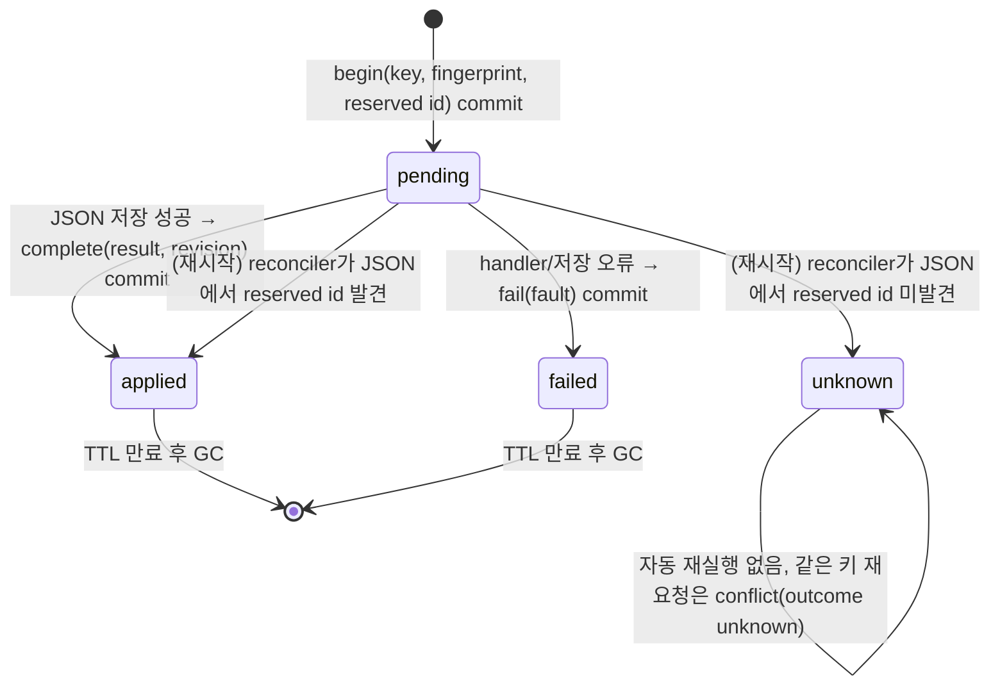
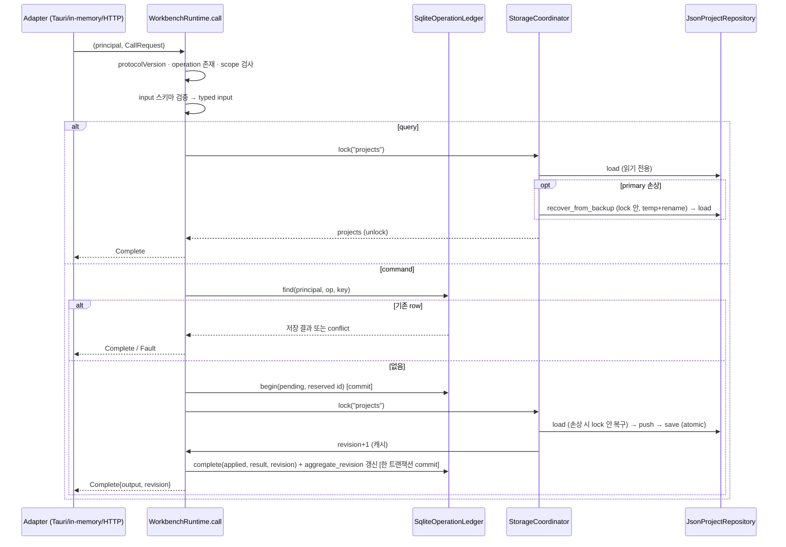

# Data Model: Workbench Seam (037)

**Spec**: [spec.md](spec.md) · **Research**: [research.md](research.md)

wire 타입은 `crates/workbench-protocol`, 저장·실행 타입은 `crates/workbench-core`에 둔다. 이름은 Rust 기준이고 JSON은 camelCase(`#[serde(rename_all = "camelCase")]`)다.

## 1. 계약(wire) 타입 — `workbench-protocol`

### OperationId

| 값 | 종류 | 효과 | 멱등성 키 | 필요 scope |
|---|---|---|---|---|
| `project.list` | query | read | 불필요 | `project:read` |
| `project.create` | command | modify | **필수** | `project:write` |
| `system.describe` | query | read | 불필요 | `system:describe` |

### CallRequest

| 필드 | 타입 | 규칙 |
|---|---|---|
| `protocolVersion` | u16 | 037은 `1`만 허용. 다른 값은 `unsupportedProtocol` |
| `operation` | OperationId | registry에 없으면 `notFound` |
| `requestId` | string(1..128) | 시도별 추적 ID. 재시도마다 새 값 |
| `input` | JSON | operation input 스키마 검증 후 typed handler로 |
| `idempotencyKey` | string(1..128)? | command면 필수, query면 있어도 무시 |
| `expectedRevision` | u64? | command에서만 의미. aggregate revision과 다르면 `preconditionFailed` |
| `timeoutMs` | u64? | 037은 검증만(1..600000), 적용은 3단계 |

### CallReply

```text
Complete { output: JSON, revision: u64? }
Accepted { executionId: string, revision: u64? }   -- 037에서는 발생하지 않음(모두 동기 완료)
```

### WorkbenchFault

| 필드 | 타입 | 설명 |
|---|---|---|
| `code` | FaultCode | 아래 표 |
| `message` | string | 사람이 읽는 한 문장. compat Adapter가 그대로 반환 |
| `retryable` | bool | |
| `outcome` | `notApplied` \| `applied` \| `unknown` | mutation 적용 여부 |
| `requestId` | string | 요청의 requestId |
| `details` | JSON? | 검증 오류 위치 등 |

`FaultCode`(037에서 발생 가능한 부분집합): `invalidArgument`, `unauthenticated`, `forbidden`, `notFound`, `conflict`, `preconditionFailed`, `unsupportedProtocol`, `unsupportedSchema`, `unavailable`, `internal`. HTTP 대응은 정본 코드 표를 따른다.

### AuthenticatedPrincipal

| 필드 | 타입 |
|---|---|
| `kind` | `Desktop` \| `Test` |
| `scopes` | set of `project:read`, `project:write`, `system:describe` |

wire에 실리지 않는다(입력으로 지정 불가). HTTP harness에서는 헤더 → principal 매핑이 테스트 코드 안에 있다.

### OperationDescriptor / DescribeOutput

```text
OperationDescriptor {
  id: OperationId, kind: query|command, effect: read|modify,
  idempotent: bool, requiredScopes: [Scope],
  inputSchema: JSON Schema, outputSchema: JSON Schema,
  cliExposure: string?, mcpExposure: bool   -- 037은 모두 null/false
}
DescribeOutput { protocolVersion: 1, operations: [OperationDescriptor] }   -- principal scope로 필터
```

### Operation input/output

| operation | input | output |
|---|---|---|
| `project.list` | `{}` | `Project[]` |
| `project.create` | `ProjectDraft { name, workingDirectory, description? }` | `Project` |
| `system.describe` | `{}` | `DescribeOutput` |

`Project { id, name, workingDirectory, description? }` — 기존 AW `Project` 직렬화 형태와 동일해야 한다(프론트 타입 `entities/project/model/types.ts`와 일치).

## 2. 도메인 타입 — `workbench-core/domain`

- **Project**, **ProjectDraft**: AW에서 그대로 이동. 필드 불변.
- **ProjectError** (`thiserror`): `NameRequired` → "Project name is required.", `WorkingDirectoryRequired` → "Working directory is required.", `NotFound` → "Project not found.", `Storage(String)`, `Clock(String)`. Display 문구는 기존 `String` 오류와 바이트 단위로 같다(R9).
- **Project id**: 기존 규칙 `project-{unix_nanos}` 유지. `project.create` handler가 `pending` 기록 **전에** 생성해 ledger에 예약한다.

### 검증 규칙(project_service 이동 시 유지)

- `name`, `workingDirectory`는 trim 후 비어 있으면 오류.
- `description`은 trim 후 빈 문자열이면 `None`.
- 정규화된 값이 지문 계산과 저장에 모두 쓰인다(같은 키로 `" foo "`와 `"foo"`를 보내면 같은 지문).

## 3. 저장 모델 — `workbench-core/infrastructure`

### projects.json (불변)

`Vec<Project>`의 JSON 배열. revision 필드 **없음**. 저장은 `json_store`의 temp+rename 원자 쓰기(`.bak` 보존)를 그대로 쓴다.

**읽기와 복구는 AW 원본과 다르게 나눈다** (Codex adversarial review 2026-09-26, research R14). AW의 `load_json`은 primary가 손상되면 읽기 경로에서 `fs::copy(backup → primary)`를 lock 없이 수행한다. 이를 그대로 복제하면, 손상을 감지한 query가 멈춰 있는 사이 create가 primary를 복구·저장·`applied` commit한 뒤 query의 늦은 copy가 그 결과를 덮어쓸 수 있다. 따라서 core의 `json_store`는:

- `load(path)`: **읽기 전용**. 파일 없음 → 빈 벡터, 파싱 실패 → `StoreError::PrimaryCorrupt`. 어떤 경우에도 쓰지 않는다.
- `recover_from_backup::<T>(path)`: **aggregate lock을 잡은 호출자만** 부른다. lock 안에서 primary를 `load`와 **같은 문서 타입**(`Vec<Project>`)으로 다시 파싱해 여전히 손상이면 `.bak`도 같은 타입으로 검증한 뒤 temp 파일에 쓰고 rename으로 교체(`fs::copy` 아님). `serde_json::Value`로 검증하면 "문법은 맞고 필드가 빠진" 파일을 정상으로 보아 복구를 건너뛴다(구현 리뷰 반영). 그 뒤 다시 `load`.
- 모든 프로젝트 읽기(`project.list` 포함)는 `StorageCoordinator`의 aggregate lock을 잡고 `load`하며, `PrimaryCorrupt`면 같은 lock 아래에서 `recover_from_backup` 후 재시도한다. lock은 in-process `Mutex`라 읽기 비용은 수 µs다.

`recovery_under_lock` 테스트가 "손상된 primary + 동시 read 1 + create N"에서 생성된 프로젝트가 모두 남고 `applied`인데 사라진 프로젝트가 0건임을 검증한다.

### ledger.sqlite

```sql
CREATE TABLE schema_version (
  version    INTEGER NOT NULL,
  applied_at TEXT    NOT NULL           -- RFC3339
);
-- 037: version = 1

CREATE TABLE operation_ledger (
  execution_id         TEXT PRIMARY KEY,          -- uuid v4
  principal_kind       TEXT NOT NULL,             -- 'desktop' | 'test'
  operation            TEXT NOT NULL,             -- 'project.create'
  contract_revision    INTEGER NOT NULL,          -- 1
  idempotency_key      TEXT NOT NULL,
  input_fingerprint    TEXT NOT NULL,             -- sha256 hex of canonical normalized input
  aggregate            TEXT NOT NULL,             -- 'projects'
  reserved_resource_id TEXT,                      -- 예약한 project id
  state                TEXT NOT NULL,             -- 'pending' | 'applied' | 'failed' | 'unknown'
  result_json          TEXT,                      -- applied: Project JSON / failed: Fault JSON
  revision             INTEGER,                   -- applied일 때 새 aggregate revision
  request_id           TEXT NOT NULL,             -- 최초 요청의 requestId(진단용)
  created_at           TEXT NOT NULL,
  updated_at           TEXT NOT NULL,
  expires_at           TEXT,                      -- applied/failed: created_at + 24h, pending/unknown: NULL
  UNIQUE (principal_kind, operation, contract_revision, idempotency_key)
);
CREATE UNIQUE INDEX operation_ledger_reserved
  ON operation_ledger (aggregate, reserved_resource_id)
  WHERE reserved_resource_id IS NOT NULL;
CREATE INDEX operation_ledger_expiry ON operation_ledger (expires_at) WHERE expires_at IS NOT NULL;
CREATE INDEX operation_ledger_pending ON operation_ledger (state) WHERE state IN ('pending','unknown');

-- 만료·GC 대상이 아닌 revision의 정본. ledger row의 revision 컬럼은 이 값의 복사(진단·재조회용)다.
CREATE TABLE aggregate_revision (
  aggregate  TEXT PRIMARY KEY,           -- 'projects'
  revision   INTEGER NOT NULL,           -- 단조 증가
  updated_at TEXT    NOT NULL
);
```

- **Aggregate revision의 정본은 `aggregate_revision` 테이블**이다. `applied` 전이와 **같은 SQLite 트랜잭션**에서 `revision + 1`로 갱신하고, 그 값을 ledger row의 `revision`에도 복사한다. 기동 시 이 테이블에서 읽어 캐시하며 row가 없으면 `(aggregate, 0)`을 insert한다. `MAX(operation_ledger.revision)`으로 유도하지 않는다 — TTL GC가 `applied` row를 지우면 revision이 0으로 되돌아가 stale `expectedRevision`이 통과하는 결함이 있었다(Codex adversarial review 2026-09-26, research R5).
- **TTL GC**: `expires_at < now`인 `applied`/`failed` row를 기동 시와 매 N번째 mutation마다 삭제. `pending`/`unknown`은 절대 GC하지 않는다. `aggregate_revision`은 GC와 무관하다.
- **reconciler가 `pending → applied`로 확정할 때**도 같은 트랜잭션에서 `aggregate_revision`을 +1 하고 row에 기록한다.
- **불변식**: `aggregate_revision.revision >= MAX(operation_ledger.revision WHERE aggregate)`이며, revision은 프로세스 재시작·GC를 거쳐도 감소하지 않는다. `revision_retention` 테스트가 이를 검증한다(생성 → 모든 row 만료 처리 → GC → 재시작 → 다음 `applied`의 revision이 이전 최댓값+1, 이전 값의 `expectedRevision`은 `preconditionFailed`).
- pragma: `journal_mode=WAL`, `synchronous=NORMAL`, `busy_timeout=5000`, `foreign_keys=ON`.

### 상태 전이



### 저장 뒤 확정 실패 (2026-09-26 구현 리뷰 반영)

JSON 저장이 끝난 뒤 ledger `complete` 트랜잭션이 실패하면(SQLite busy·디스크 부족) row를 **`pending`으로 남기고** `unavailable` + `outcome: unknown`(retryable)을 돌려준다. `failed`로 닫지 않는다 — 부작용은 이미 일어났으므로 `notApplied`는 거짓이고, reconciler는 `pending`만 판정하기 때문이다. 이후 같은 키 재요청은 위 표의 `pending` 행(진행 중 충돌)으로 응답되고, 다음 기동의 reconciler가 JSON에서 예약 id를 찾아 `applied`(revision +1)로 확정한다. 저장 **전** 실패(검증·`expectedRevision`·load/save 오류)만 `failed`로 닫는다.

### 같은 키 재요청의 응답 규칙

| 기존 row 상태 | 지문 동일 | 응답 |
|---|---|---|
| 없음 | — | 새 실행 |
| `applied` | 예 | 저장된 `Complete{output, revision}` (authorization 재확인 후) |
| `applied` | 아니오 | `conflict`, outcome `applied` |
| `failed` | 예 | 저장된 Fault |
| `failed` | 아니오 | `conflict`, outcome `notApplied` |
| `pending` | (무관) | `conflict`, outcome `unknown`, retryable `true`, message "같은 요청이 처리 중입니다." |
| `unknown` | (무관) | `conflict`, outcome `unknown`, retryable `false`, message "이전 요청의 적용 여부를 확인할 수 없습니다. 프로젝트 목록을 확인하세요." |

## 4. 실행 모델 — `workbench-core/application`



`expectedRevision`이 있으면 lock 획득 직후 캐시된 revision과 비교하고 다르면 `pending` row를 `failed(preconditionFailed)`로 닫고 Fault를 반환한다.

## 5. Tauri compat 매핑

| Tauri command | CallRequest | 반환 |
|---|---|---|
| `list_projects()` | `{protocolVersion:1, operation:"project.list", requestId: uuid, input:{}}` | `Complete.output` → `Vec<Project>` |
| `create_project(input)` | `{..., operation:"project.create", requestId: uuid, idempotencyKey: uuid, input: ProjectInput→ProjectDraft}` | `Complete.output` → `Project` |

Tauri 경로는 재시도 개념이 없으므로 `idempotencyKey`를 호출마다 새로 만든다(멱등성은 HTTP/CLI 경로에서 의미를 가진다). 오류는 `WorkbenchFault.message`를 `Err(String)`으로.

## 6. TypeScript 생성 타입 — `packages/workbench-client`

- `generated/workbench.ts`: `components["schemas"]`에 `CallRequest`(oneOf 3 variant), `CallReply`, `WorkbenchFault`, `Project`, `ProjectDraft`, `DescribeOutput`, `OperationDescriptor`.
- `operation-map.ts`:
  ```ts
  type Req = components["schemas"]["CallRequest"];          // union
  type Res = components["schemas"]["CallReplyByOperation"]; // union, operation 태그 포함
  export type OperationId = Req["operation"];
  export type OperationMap = { [K in OperationId]: {
    input: Extract<Req, { operation: K }>["input"];
    output: Extract<Res, { operation: K }>["output"];
  } };
  export type Call = <K extends OperationId>(op: K, input: OperationMap[K]["input"]) => Promise<OperationMap[K]["output"]>;
  ```
  `CallReplyByOperation`은 registry가 output 스키마를 operation 태그와 함께 내보내는 별도 `oneOf`다(정본 "typed result schema").
